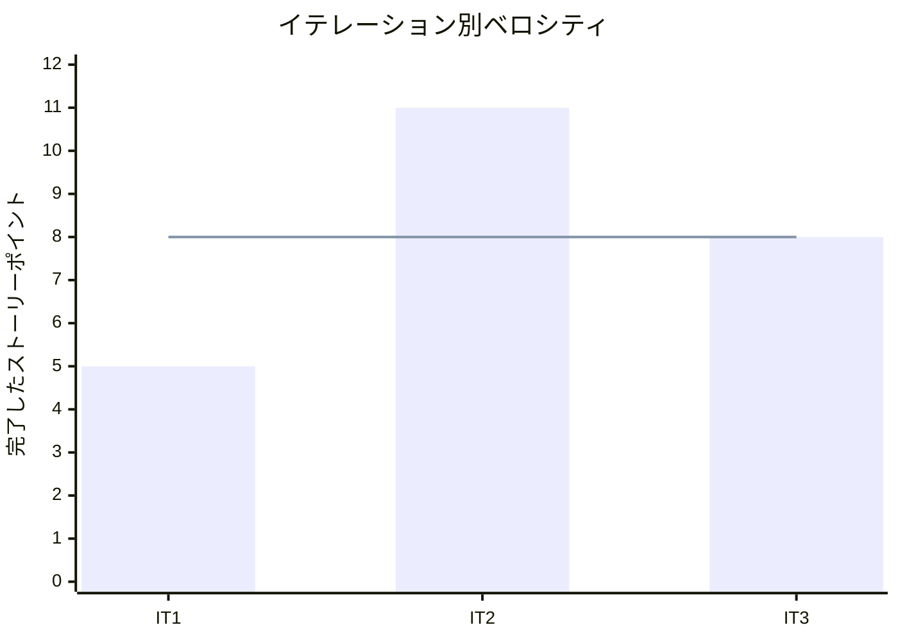

# イテレーション 3 完了報告書

## プロジェクト概要

| 項目 | 内容 |
|------|------|
| イテレーション | IT3 |
| 計画期間 | 2026-04-20 から 2026-05-01 まで |
| 実績記録日 | 2026-03-25 |
| ゴール | 花材前提データを整備し、在庫推移から発注確定までを運用可能にする |
| 要員 | 2 名想定 |

## 指標

### ベロシティ

| 項目 | 値 |
|------|-----|
| 計画 SP | 8 |
| 実績 SP | 8 |
| 達成率 | 100% |

### リリースバーンダウン

```mermaid
xychart-beta
    title "リリースバーンダウン（IT3 時点）"
    x-axis ["開始", "IT1", "IT2", "IT3"]
    y-axis "残 SP" 0 --> 49
    line "計画" [49, 44, 33, 25]
    line "実績" [49, 44, 33, 25]
```

### ベロシティ推移



## テスト結果

| メトリクス | Backend | Frontend |
|-----------|---------|----------|
| テストファイル | 6 / 6 通過 | 4 / 4 通過 |
| テスト数 | 16 / 16 通過 | 27 / 27 通過 |
| カバレッジ | 未取得 | 未取得 |
| E2E テスト | - | 1 / 1 シナリオ通過 |

`2026-03-25` 時点で `npm run test:backend`、 `npm run test:frontend`、 `npm run test:e2e:frontend` を実行し、 Backend 16 件、 Frontend 27 件、 E2E 1 件の通過を確認した。

### テスト増分

| メトリクス | IT2 | IT3 | 増分 |
|-----------|-----|-----|------|
| Backend テストファイル | 4 | 6 | +2 |
| Backend テスト数 | 9 | 16 | +7 |
| Frontend テストファイル | 4 | 4 | +0 |
| Frontend テスト数 | 21 | 27 | +6 |
| E2E シナリオ | 1 | 1 | +0 |

## 実施内容と評価

| ストーリー | 結果 | 予定ポイント | ベロシティ加算ポイント |
|-----------|------|-------------|------------------------|
| US-00B 花材と仕入条件を管理したい | 完了 | 3 | 3 |
| US-05 仕入先別に発注を確定したい | 完了 | 5 | 5 |
| 合計 |  | 8 | 8 |

### 受け入れ基準達成状況

- [x] `US-00B` の花材一覧、編集、保存と在庫推移 / 発注候補への反映を実装した。
- [x] `US-05` の発注候補表示、数量検証、発注確定、 `送信待ち / 送信済み` 表示を実装した。
- [x] 重複確定、数量異常、通信失敗、画面切替の回帰観点を Backend / Frontend テストへ追加した。
- [x] `npm run dev` で主要 API を疎通確認し、開発サーバー起動時の差分も確認した。

### 主な実装内容

- Backend に花材一覧 / 保存 API と発注候補 / 発注確定 API を追加した。
- 管理画面に `花材管理` と `発注管理` ワークベンチを追加し、在庫推移から発注候補へ進む CTA を実装した。
- 花材更新の反映先を `materialId` で接続し、名称変更時でも在庫推移と発注候補が崩れないようにした。
- 発注数量は不足量を購入単位で切り上げて算出し、過少発注にならないようにした。
- 通信失敗時に花材保存、発注確定、各ワークベンチの取得処理が Runtime Error で落ちないように保護した。

## 追加タスク（SP 外）

- 開発レビューと UI/UX レビューを実施し、結果を [development_it3_review_20260325.md](./../review/development_it3_review_20260325.md) と [admin_console_it3_uiux_review_20260325.md](./../review/admin_console_it3_uiux_review_20260325.md) に記録した。
- `dev:backend` 実行時の問題を解消するため、 Controller の依存注入と注文 API の CORS 設定を補強した。
- GitHub Project `花束問題 V1.2 - codex/take1` の `Done` / `Todo` と Issue の `OPEN` / `CLOSED` を、 `release_plan.md` に合わせて補正した。

## E2E テスト結果

| シナリオ | 結果 |
|---------|------|
| 顧客が商品一覧から注文入力画面へ進める | 通過 |

既存の顧客注文スモーク 1 件を回帰確認し、 IT2 までに成立した顧客導線が IT3 の管理画面拡張後も維持されていることを確認した。

## フェーズ・累計進捗

| フェーズ | 計画 SP | 完了 SP | 達成率 |
|---------|---------|---------|--------|
| Phase 1 | 16 | 16 | 100% |
| Phase 2 | 23 | 8 | 35% |
| Phase 3 | 10 | 0 | 0% |
| 合計 | 49 | 24 | 49% |

詳細は [イテレーション 3 ふりかえり](./retrospective-3.md) を参照。
