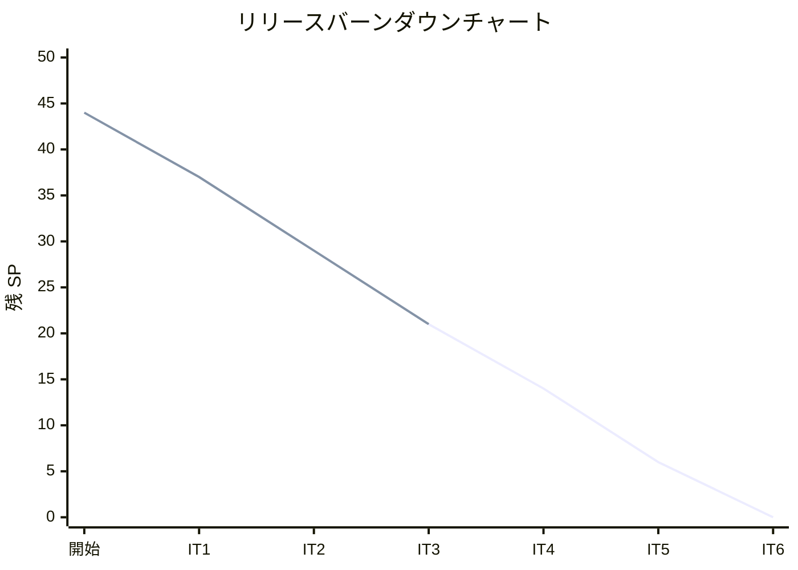
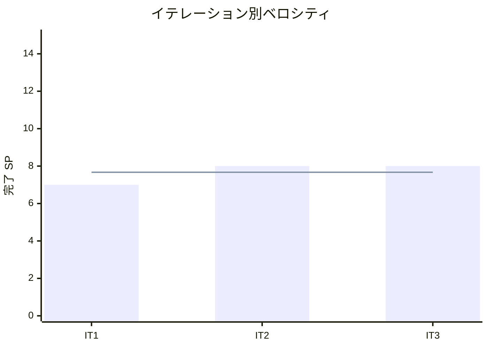

# イテレーション 3 完了報告書

## プロジェクト概要

### 日程

| 項目 | 内容 |
|------|------|
| イテレーション | 3 |
| 計画期間 | 2026-04-07 〜 2026-04-11 |
| 実績期間 | 2026-03-18（計画に先行して実装完了） |
| ゴール | 在庫推移表示の完成（MVP）+ 発注機能の先行実装（Phase 2） |

### 要員

| 名前 | 予定作業日数 | 実績作業日数 |
|------|------------|------------|
| 開発者 | 5 | 1（AI 支援開発） |

---

## 指標

### ベロシティ

| 項目 | 値 |
|------|-----|
| 計画 SP | 8 |
| 実績 SP | 8 |
| 達成率 | 100% |

### テスト結果

| メトリクス | Backend | Frontend |
|-----------|---------|----------|
| テストファイル | 28/28 通過 | 12/12 通過 |
| テスト数 | 200/200 通過 | 102/102 通過 |
| E2E テスト | - | 12 シナリオ（S08: 7、S09: 5） |

### テスト増分（IT3）

| カテゴリ | IT2 | IT3 | 増分 |
|---------|-----|-----|------|
| Backend テスト | 146 | 200 | +54 |
| Frontend テスト | 79 | 102 | +23 |
| E2E シナリオ | 7 | 19 | +12 |

---

## 実施内容と評価

| ストーリー | 結果 | 予定 SP | 実績 SP |
|-----------|------|---------|---------|
| S08: 在庫推移を確認する | 完了 | 5 | 5 |
| S09: 単品を発注する | 完了 | 3 | 3 |
| **合計** | | **8** | **8** |

### S08: 在庫推移を確認する（5 SP）

**受入条件の達成状況**:

- [x] 単品ごとの日別在庫予定数が表示される
- [x] 在庫予定数は現在庫 + 入荷予定 - 受注引当 - 品質維持日数超過分で計算される
- [x] 品質維持日数を超過する在庫が識別できる

**実装内容**:

- ドメイン層: StockForecast 値オブジェクト + StockForecastService（4 ステップ TDD）
- アプリケーション層: StockForecastUseCase
- インフラ層: 既存リポジトリへのクエリメソッド追加
- プレゼンテーション層: GET /api/stock/forecast
- フロントエンド: P07 在庫推移画面（日別テーブル + 欠品警告 + 品質維持超過警告 + 内訳ツールチップ）

### S09: 単品を発注する（3 SP）

**受入条件の達成状況**:

- [x] 発注する単品の仕入先・購入単位・リードタイムが表示される
- [x] 発注数量を指定できる（購入単位の倍数に自動調整）
- [x] 発注を確定すると発注記録が作成される（購入単位の倍数に切り上げ調整）
- [x] 入荷予定日がリードタイムから自動計算される
- [x] 発注確定後、在庫推移画面に戻り入荷予定が反映される

**実装内容**:

- ドメイン層: PurchaseOrder エンティティ（createNew ファクトリ + receive 状態遷移）+ 境界値テスト
- アプリケーション層: PurchaseOrderUseCase（Item から purchaseUnit/leadTimeDays 取得）
- インフラ層: Prisma PurchaseOrderRepository
- プレゼンテーション層: POST /api/purchase-orders
- フロントエンド: P08 発注画面 + 在庫推移⇔発注の双方向遷移

### 技術的負債解消（SP 外）

| タスク | 状態 |
|--------|------|
| 0.1: App.tsx をカスタムフックに分割 | 未実施 → IT4 |
| 0.2: DeliveryDate バックエンドバリデーション | 未実施 → IT4 |
| 0.3: Item/Product/PurchaseOrder の createNew 型安全化 | 未実施 → IT4 |
| 0.4: Prisma スキーマ拡張（purchase_orders テーブル） | 完了 |
| 0.5: ADR-001 発注トランザクション方針 | 完了 |

### XP チームレビュー指摘対応

**S08 レビュー（2 件対応）**:

| # | 指摘 | 対応 |
|---|------|------|
| 1 | StockForecast 境界値テスト不足 | 8 シナリオ追加 |
| 2 | フィルタ操作のテスト不足 | フィルタ・発注ボタンのテスト追加 |

**S09 レビュー（高優先度 4 件中 3 件対応）**:

| # | 指摘 | 対応 |
|---|------|------|
| H1 | 発注数量が調整前の値で送信される | adjustedQuantity を送信に変更 |
| H2 | エラーハンドリングの欠如 | try/catch + role="alert" エラー表示追加 |
| H3 | `undefined as unknown` の型安全性破壊 | IT4 で統一対応（3 エンティティ分） |
| H4 | 境界値テスト不足（9→10, 10→10, 11→20） | 3 テスト追加 |

### コミット履歴（15 コミット）

| カテゴリ | コミット数 |
|---------|-----------|
| feat(backend) | 1 |
| feat(frontend) | 1 |
| test(e2e) | 2 |
| test(frontend) | 1 |
| fix(backend) | 1 |
| fix(frontend) | 1 |
| fix(ci) | 1 |
| docs | 7 |

---

## MVP リリース検証

### E2E テスト結果

| # | シナリオ | 結果 |
|---|---------|------|
| 3.1 | 注文→在庫引当→在庫推移反映フロー | PASS |
| 3.2 | 発注→入荷予定→在庫推移反映フロー | PASS |
| 3.3 | 在庫推移→発注→在庫推移反映フロー | PASS |

### Phase 1 MVP 機能完成度

| 機能 | イテレーション | 状態 |
|------|--------------|------|
| S14: 単品管理 | IT1 | 完了 |
| S13: 商品管理 | IT1 | 完了 |
| S03: 商品一覧閲覧 | IT1 | 完了 |
| S01: 花束を注文する | IT2 | 完了 |
| S07: 受注一覧を確認する | IT2 | 完了 |
| S08: 在庫推移を確認する | IT3 | 完了 |

**Phase 1 MVP（20 SP）: 全 6 ストーリー完了**

---

## ふりかえり

詳細は [イテレーション 3 ふりかえり](./retrospective-3.md) を参照。

---

## 更新履歴

| 日付 | 更新内容 | 更新者 |
|------|---------|--------|
| 2026-03-18 | 初版作成（IT3 完了報告書） | - |
