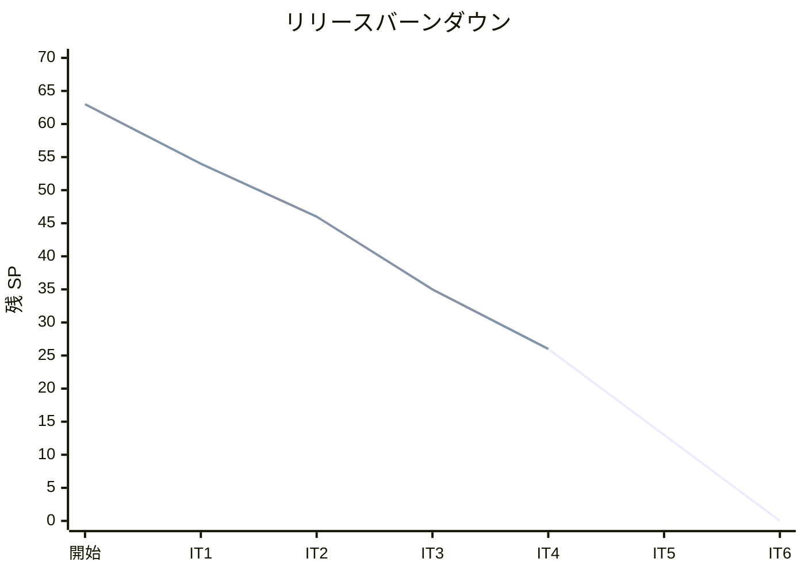
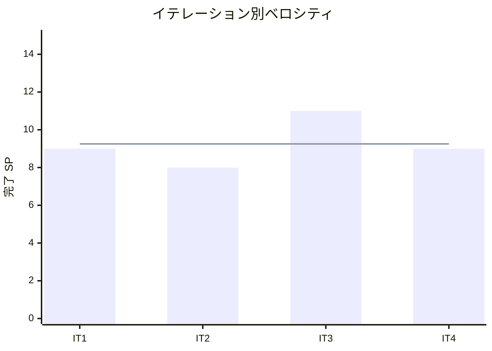

# イテレーション 4 完了報告書

## 概要

| 項目 | 内容 |
| :--- | :--- |
| **イテレーション** | 4 |
| **期間** | Week 7-8 |
| **ゴール** | 届け先コピー・受注管理・注文履歴を完成させ、Phase 1 MVP の機能を揃える |
| **達成状況** | 完了（9/9 SP、100%） |

---

## 成果

### 実装したユーザーストーリー

| ID | ストーリー | SP | 状態 |
| :--- | :--- | :--- | :--- |
| US-015 | 受注状況を確認する | 3 | 完了 |
| US-016 | 注文履歴・注文状況を確認する | 3 | 完了 |
| US-006 | 届け先をコピーして再注文する | 3 | 完了 |
| **合計** | | **9** | |

### 技術成果

| カテゴリ | 内容 |
| :--- | :--- |
| **受注管理（US-015）** | OrderRepository.find_all（ステータス・日付フィルタ）、OrderService.list_orders、StaffOrderListView/StaffOrderDetailView、受注一覧・受注詳細テンプレート |
| **注文履歴（US-016）** | OrderRepository.search_by_order_number、OrderService.search_orders_by_number、OrderHistoryView/OrderHistoryDetailView、注文検索・注文詳細テンプレート |
| **届け先コピー（US-006）** | OrderRepository.find_recent_addresses、OrderService.list_recent_addresses、AddressSelectView、届け先選択画面、セッション経由のフォームプリフィル |
| **レビュー対応** | View の ORM 直接アクセス排除（全 View を OrderService 経由に統一）、OrderStatus.label プロパティ追加（日本語ステータス表示）、FakeRepo ソート基準統一、キャンセル導線条件表示 |
| **ドキュメント** | IT4 コードレビュー統合レポート（5 エージェント並列レビュー） |

### 新規コンポーネント

| コンポーネント | ファイル |
| :--- | :--- |
| OrderStatus.label | `apps/orders/domain/value_objects.py` |
| OrderRepository.find_all | `apps/orders/domain/interfaces.py` |
| OrderRepository.search_by_order_number | `apps/orders/domain/interfaces.py` |
| OrderRepository.find_recent_addresses | `apps/orders/domain/interfaces.py` |
| StaffOrderListView | `apps/orders/views.py` |
| StaffOrderDetailView | `apps/orders/views.py` |
| OrderHistoryView | `apps/orders/views.py` |
| OrderHistoryDetailView | `apps/orders/views.py` |
| AddressSelectView | `apps/orders/views.py` |
| staff_urls.py | `apps/orders/staff_urls.py` |

### 新規画面

| 画面 ID | 画面名 | URL | 種別 |
| :--- | :--- | :--- | :--- |
| A-02 | 受注一覧 | `/staff/orders/` | スタッフ向け |
| A-03 | 受注詳細 | `/staff/orders/<id>/` | スタッフ向け |
| C-06 | 届け先選択 | `/shop/<pk>/order/addresses/` | 得意先向け |
| C-09 | 注文検索 | `/shop/order/history/` | 得意先向け |
| C-10 | 注文詳細 | `/shop/order/<order_number>/` | 得意先向け |

---

## 品質メトリクス

| 指標 | IT3 末 | IT4 末 | 変化 |
| :--- | :--- | :--- | :--- |
| テスト数 | 195 | 215 | +20 |
| テストファイル数 | 12 | 13 | +1 |
| カバレッジ | 99% | 98% | -1%（View 増加による） |
| Ruff エラー | 0 | 0 | 維持 |
| 新規テスト内訳 | | | |
| — サービステスト（orders） | | +8 | list_orders, search_orders_by_number, list_recent_addresses |
| — View 統合テスト（orders） | | +12 | StaffOrderList(4) + StaffOrderDetail(2) + OrderHistory(2) + OrderHistoryDetail(2) + AddressSelect(2) |

### テストピラミッド（IT4 末）

```
         /  4  \   View 統合テスト（在庫推移）
        / 5 + 4 \  View 統合テスト（キャンセル + 既存注文）
       /   12    \  View 統合テスト（受注管理 + 注文履歴 + 届け先選択）
      /   23      \  サービステスト（OrderService + InventoryService）
     /    17       \  Repository 統合テスト（Order + StockLot + Product）
    /    115        \  ドメインユニットテスト（商品 + 注文 + 在庫）
   /     2 + 33     \  スモーク + その他
   ──────────────────
        215 テスト
```

### テスト累計推移

| イテレーション | テスト数 | 増分 | カバレッジ |
| :--- | :--- | :--- | :--- |
| IT1 | 67 | +67 | 99% |
| IT2 | 130 | +63 | 99% |
| IT3 | 195 | +65 | 99% |
| IT4 | 215 | +20 | 98% |

---

## 受入条件の達成状況

### US-015: 受注状況を確認する

- [x] 受注一覧が表示される
- [x] ステータスで絞り込める
- [x] 日付範囲で絞り込める
- [x] 個別の受注詳細を確認できる

### US-016: 注文履歴・注文状況を確認する

- [x] 得意先の注文一覧が表示される（注文番号検索ベース）
- [x] 個別の注文詳細（届け先、メッセージ、ステータス）を確認できる
- [x] 注文詳細画面からキャンセルへの導線がある（confirmed のみ表示）

### US-006: 届け先をコピーして再注文する

- [x] 注文入力画面で「過去の届け先を利用」を選択できる
- [x] 過去の届け先一覧が表示される
- [x] 選択した届け先が注文入力画面にコピーされる
- [x] コピーした届け先を修正できる

---

## 追加タスク（SP 外）

| タスク | 内容 |
| :--- | :--- |
| XP マルチパースペクティブレビュー | プログラマー・テスター・アーキテクト・テクニカルライター・ユーザー代表の 5 エージェント並列レビュー |
| レビュー指摘対応（H1-H5） | View の ORM 直接アクセス排除、ステータス日本語化、キャンセル条件表示、FakeRepo ソート統一、関数内 import 除去 |
| レビュー指摘対応（M1,M2,M5） | Enum からステータス選択肢生成、得意先向け合計金額表示、件数表示 |
| レビュー指摘対応（L1,L4） | find_recent_addresses ソート修正、キャンセル導線に注文番号引き継ぎ |

---

## ベロシティ分析

### 累積実績

| イテレーション | 計画 SP | 実績 SP | 達成率 | 累積完了 SP | 残 SP |
| :--- | :--- | :--- | :--- | :--- | :--- |
| IT1 | 9 | 9 | 100% | 9 | 54 |
| IT2 | 8 | 8 | 100% | 17 | 46 |
| IT3 | 11 | 11 | 100% | 28 | 35 |
| IT4 | 9 | 9 | 100% | 37 | 26 |

### ベロシティ推移

| 指標 | 値 |
| :--- | :--- |
| IT1 | 9 SP |
| IT2 | 8 SP |
| IT3 | 11 SP |
| IT4 | 9 SP |
| 平均 | 9.25 SP |
| 標準偏差 | 1.1 SP |

### バーンダウンチャート



### ベロシティチャート



### 完了見込み

- **Phase 1 MVP**: 37/37 SP 完了（100%）
- 残 SP: 26（Phase 2+3）
- 平均ベロシティ: 9.25 SP/IT
- 残イテレーション見込み: 26 / 9.25 ≈ 2.8 IT（計画 2 IT に対してやや超過）
- Phase 2+3 の達成にはベロシティ 13 SP/IT が必要。IT3 実績（11SP）を考慮すると、Phase 3（US-013: 5SP）の一部繰り越しの可能性あり

---

## フェーズ進捗

### Phase 1（MVP）— 完了

| ID | ストーリー | SP | 完了 IT |
| :--- | :--- | :--- | :--- |
| US-001 | 単品マスタを登録する | 3 | IT1 |
| US-002 | 商品（花束）を登録する | 3 | IT1 |
| US-003 | 花束構成を定義する | 3 | IT1 |
| US-004 | 商品を選択する | 3 | IT2 |
| US-005 | 届け日・届け先・メッセージを入力して注文する | 5 | IT2 |
| US-007 | 在庫推移を確認する | 8 | IT3 |
| US-014 | 注文をキャンセルする | 3 | IT3 |
| US-015 | 受注状況を確認する | 3 | IT4 |
| US-016 | 注文履歴・注文状況を確認する | 3 | IT4 |
| US-006 | 届け先をコピーして再注文する | 3 | IT4 |
| **合計** | | **37** | |

### 累計進捗

| フェーズ | SP | 完了 SP | 残 SP | 状態 |
| :--- | :--- | :--- | :--- | :--- |
| Phase 1（MVP） | 37 | 37 | 0 | **完了** |
| Phase 2（仕入・出荷） | 21 | 0 | 21 | 未着手 |
| Phase 3（顧客管理） | 5 | 0 | 5 | 未着手 |
| **合計** | **63** | **37** | **26** | |

---

## ふりかえり

詳細は [イテレーション 4 ふりかえり](./retrospective-4.md) を参照。

---

## 更新履歴

| 日付 | 更新内容 |
| :--- | :--- |
| 2026-03-24 | 初版作成 |
