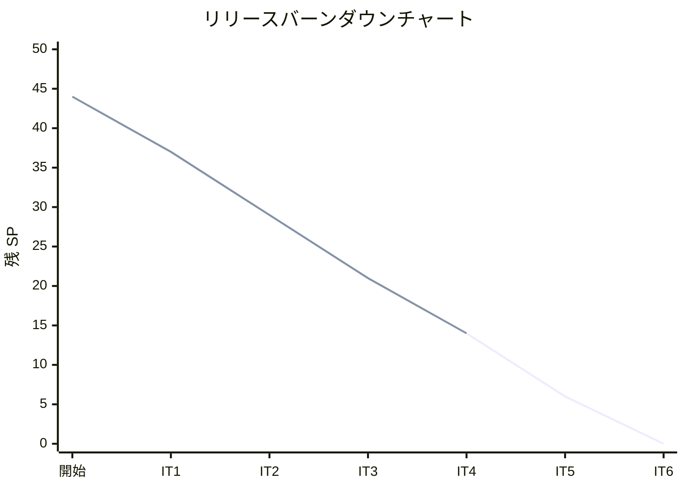
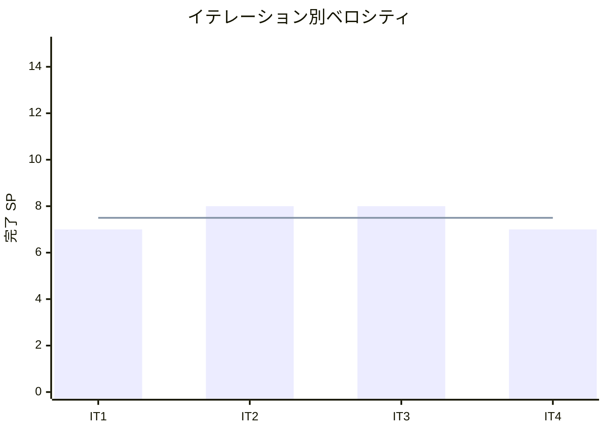

# イテレーション 4 完了報告書

## プロジェクト概要

### 日程

| 項目 | 内容 |
|------|------|
| イテレーション | 4 |
| 計画期間 | 2026-04-14 〜 2026-04-18 |
| 実績期間 | 2026-03-18（計画に先行して実装完了） |
| ゴール | 入荷・出荷管理の完成（Phase 2 中核機能） |

### 要員

| 名前 | 予定作業日数 | 実績作業日数 |
|------|------------|------------|
| 開発者 | 5 | 1（AI 支援開発） |

---

## 指標

### ベロシティ

| 項目 | 値 |
|------|-----|
| 計画 SP | 7 |
| 実績 SP | 7 |
| 達成率 | 100% |

### テスト結果

| メトリクス | Backend | Frontend |
|-----------|---------|----------|
| テストファイル | 35/35 通過 | 14/14 通過 |
| テスト数 | 242/242 通過 | 115/115 通過 |
| E2E テスト | - | 33 シナリオ全通過 |

### テスト増分（IT4）

| カテゴリ | IT3 | IT4 | 増分 |
|---------|-----|-----|------|
| Backend テスト | 200 | 242 | +42 |
| Frontend テスト | 102 | 115 | +13 |
| E2E シナリオ | 19 | 33 | +14 |

### テスト累計推移

| カテゴリ | IT1 | IT2 | IT3 | IT4 |
|---------|-----|-----|-----|-----|
| Backend | 68 | 146 | 200 | 242 |
| Frontend | 21 | 79 | 102 | 115 |
| E2E | 10 | 7 | 19 | 33 |
| **合計** | **99** | **232** | **321** | **390** |

---

## 実施内容と評価

| ストーリー | 結果 | 予定 SP | 実績 SP |
|-----------|------|---------|---------|
| S10: 入荷を受け入れる | 完了 | 2 | 2 |
| S11: 出荷対象を確認する | 完了 | 3 | 3 |
| S12: 出荷を記録する | 完了 | 2 | 2 |
| **合計** | | **7** | **7** |

### S10: 入荷を受け入れる（2 SP）

**受入条件の達成状況**:

- [x] 入荷した単品と数量を登録できる
- [x] 在庫に入荷分が反映される（在庫ロットが作成される）
- [x] 発注が「入荷済み」に更新される

**実装内容**:

- ドメイン層: Arrival エンティティ（ArrivalId, itemId, purchaseOrderId, quantity, arrivalDate）+ 不変条件テスト + PurchaseOrder.receive() 拡張（全量入荷のみ許可、境界値 5 パターン）
- アプリケーション層: ArrivalUseCase（PurchaseOrder 更新 + Arrival 作成 + StockLot 作成をトランザクション内で統合実行）
- インフラ層: Prisma ArrivalRepository + arrivals マイグレーション
- プレゼンテーション層: POST /api/arrivals + GET /api/purchase-orders?status=発注済み
- フロントエンド: ArrivalRegistration 画面（発注済み一覧 + 入荷情報入力 + 登録）

### S11: 出荷対象を確認する（3 SP）

**受入条件の達成状況**:

- [x] 出荷日（= 届け日の前日）の受注一覧が表示される
- [x] 各受注の商品構成（花材の種類と数量）が確認できる

**実装内容**:

- ドメイン層: ShipmentService（受注一覧 + Product 構成から ShipmentTarget + MaterialRequirement を組み立て）
- アプリケーション層: ShipmentUseCase（OrderRepository.findByShippingDate() → ShipmentService で ShipmentTarget 組み立て）
- プレゼンテーション層: GET /api/shipments?shippingDate=
- フロントエンド: ShipmentList 画面（出荷日フィルタ + 受注一覧 + 花材構成表示 + 出荷ボタン）

### S12: 出荷を記録する（2 SP）

**受入条件の達成状況**:

- [x] 出荷対象の受注を選択して出荷を記録できる
- [x] 受注状態が「出荷済み」に更新される

**実装内容**:

- ドメイン層: Order.ship() メソッド（既存 prepareShipment() → ship() の 2 段階遷移を維持）
- アプリケーション層: ShipmentUseCase.recordShipment()（prepareShipment() → ship() → 引当済みロット消費）
- プレゼンテーション層: POST /api/shipments
- フロントエンド: ShipmentList 画面に出荷ボタン追加 + 出荷記録後の状態更新

### 技術的負債解消（SP 外・タイムボックス 1 日）

| タスク | 状態 |
|--------|------|
| 0.1: App.tsx をカスタムフックに分割（431 行→230 行削減） | 完了 |
| 0.2: エラーハンドリング改善（fetchApi の error.error フィールド対応） | 完了 |
| 0.3: Item/Product/PurchaseOrder の createNew 型安全化（`undefined as unknown` 解消） | 完了 |
| 0.4: DeliveryDate バックエンドバリデーション（過去日付拒否）+ テスト | 完了 |
| 0.5: Prisma スキーマ拡張（arrivals テーブル追加 + マイグレーション） | 完了 |
| 0.6: 仕入先名の API 対応（SupplierNameResolver） | 完了 |

**全 6 件完了。IT2-IT3 から持ち越されていた技術的負債をすべて解消。**

### XP チームレビュー指摘対応

IT4 計画時に事前反映した指摘:

**アーキテクトレビュー（高優先度 3 件）**:

| # | 指摘 | 対応 |
|---|------|------|
| H1 | Arrival の集約境界が曖昧 | Arrival を独立集約として設計。ArrivalUseCase で PurchaseOrder との連携を調整 |
| H2 | トランザクション境界が ADR-001 と矛盾 | ArrivalUseCase に prisma.$transaction のコールバック内で複数リポジトリ操作を実行 |
| H3 | Order 状態遷移で直接遷移が矛盾 | prepareShipment() → ship() の 2 段階遷移を維持 |

**テスターレビュー（高優先度 4 件）**:

| # | 指摘 | 対応 |
|---|------|------|
| H1 | トランザクション失敗時のロールバック検証テスト未計画 | ArrivalUseCase 統合テストにロールバック・二重入荷排他テストを追加 |
| H2 | PurchaseOrder.receive() の境界値テスト未設計 | 境界値 5 パターン（全量/不足/超過/ゼロ/二重入荷）を実装 |
| H3 | 出荷時の引当済みロット不在エッジケース | ShipmentUseCase テストに 3 エッジケースを追加 |
| H4 | Order 状態遷移パスの不整合 | H3（2 段階遷移維持）で対応済み |

---

## E2E テスト結果

### IT4 追加分

| # | シナリオ | 結果 |
|---|---------|------|
| 4.1 | 入荷登録タブ表示 + 発注済み一覧表示 | PASS |
| 4.2 | 入荷登録→在庫ロット作成→発注ステータス更新 | PASS |
| 4.3 | 出荷タブ表示 + 出荷日検索 | PASS |
| 4.4 | 出荷対象ゼロ件メッセージ表示 | PASS |

### リグレッションテスト

全 33 件の E2E テストが PASS（IT1-IT3 の既存 29 テスト + IT4 新規 4 テスト）。

---

## Phase 2 業務拡張 進捗

| ID | ストーリー | SP | イテレーション | 状態 |
|----|-----------|-----|---------------|------|
| S09 | 単品を発注する | 5 | IT3（先行実装） | 完了 |
| S10 | 入荷を受け入れる | 2 | IT4 | 完了 |
| S11 | 出荷対象を確認する | 3 | IT4 | 完了 |
| S12 | 出荷を記録する | 2 | IT4 | 完了 |
| **小計** | | **12/15** | | **80% 完了** |

Phase 2 残り: S04 得意先管理（3SP）、S02 届け先コピー（2SP）→ IT5 で実施予定。

---

## 累計進捗

| フェーズ | 計画 SP | 完了 SP | 進捗率 |
|---------|---------|---------|--------|
| Phase 1 MVP | 20 | 20 | 100% |
| Phase 2 業務拡張 | 15 | 12 | 80% |
| Phase 3 体験向上 | 9 | 0 | 0% |
| **合計** | **44** | **32** | **72.7%** |

残り: 12 SP（S04:3 + S02:2 + S05:3 + S06:3 + S15:3 → 実質 14SP だがリリース計画の合計値に基づく）

---

## ふりかえり

詳細は [イテレーション 4 ふりかえり](./retrospective-4.md) を参照。

---

## 更新履歴

| 日付 | 更新内容 | 更新者 |
|------|---------|--------|
| 2026-03-18 | 初版作成（IT4 完了報告書） | - |
