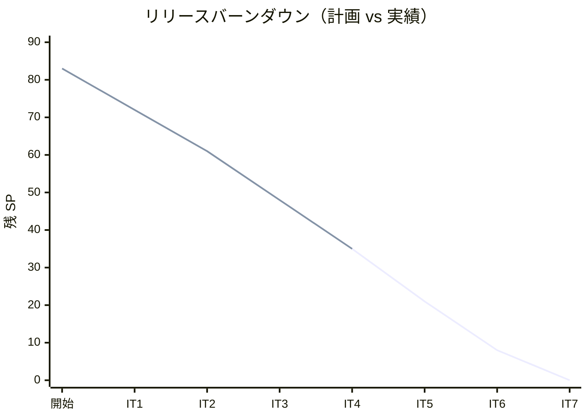
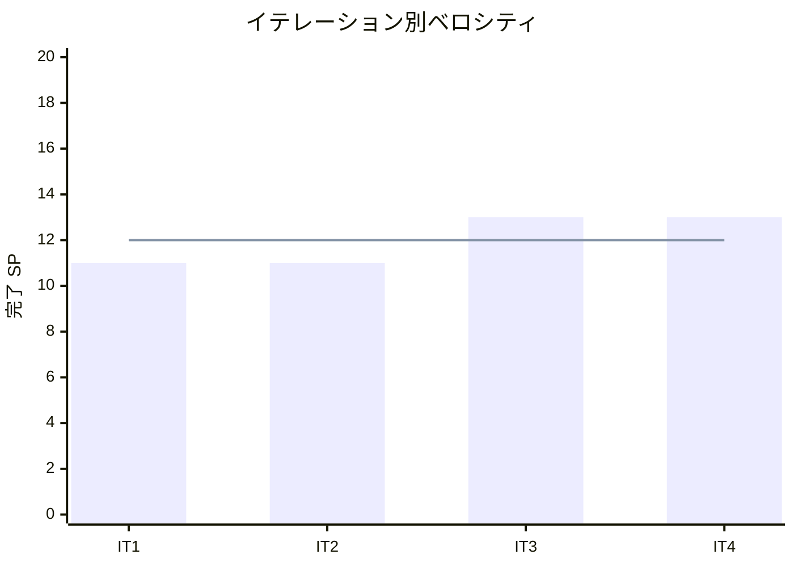

# イテレーション 4 完了報告書

## 概要

| 項目 | 内容 |
|------|------|
| **イテレーション** | 4 |
| **計画期間** | 2026-05-04 〜 2026-05-15（2 週間） |
| **実績期間** | 2026-03-22（1 日） |
| **ゴール** | 在庫推移表示と発注を完成させ、仕入スタッフが在庫を可視化し適切なタイミングで発注できる状態にする |
| **達成度** | 13/13 SP（100%） |

---

## ユーザーストーリー達成状況

| ID | ストーリー | SP | 状態 |
|----|-----------|-----|------|
| US-009 | 在庫推移を表示する | 8 | **完了** |
| US-010 | 単品を発注する | 5 | **完了** |
| ~~US-011~~ | ~~入荷を登録する~~ | ~~3~~ | IT5 移動 |
| **合計** | | **13** | **100%** |

---

## 成功基準の達成

- [x] 単品ごとの日別在庫予定数が表示される
- [x] 品質維持日数に基づく廃棄予定が表示される
- [x] 在庫不足の行が警告色でハイライトされる
- [x] 単品を選択して発注できる（仕入先・購入単位・リードタイムが自動表示）
- [x] 発注が在庫推移に入荷予定として反映される
- [x] ヘキサゴナルアーキテクチャの実装パターンに準拠
- [ ] テストカバレッジ 80% 以上（JaCoCo 未実行）

> **注記**: 入荷予定・受注引当の InventoryQueryPort 実装は簡易版（IT5 で完成予定）。UI に「未反映」注意バナーを表示。

---

## 実装内容

### バックエンド

#### ドメイン層

- `Stock`: エンティティ（品質維持日数に基づく有効期限計算、consume/isExpired、Clock 注入対応）
- `StockStatus`: 3 状態 enum（AVAILABLE, DEGRADED, EXPIRED）
- `DailyInventory`: 値オブジェクト（日別在庫予定の計算結果）
- `InventoryTransitionService`: ドメインサービス（Clock + InventoryQueryPort 注入、日別在庫推移計算）
- `InventoryQueryPort`: ポートインターフェース（入荷予定・受注引当・廃棄予定の抽象化）
- `PurchaseOrder`: エンティティ（supplierName 文字列管理、購入単位倍数バリデーション、Clock 注入対応）
- `PurchaseOrderStatus`: 3 状態 enum + Map ベース遷移テーブル（ORDERED→PARTIAL→RECEIVED）

#### アプリケーション層

- `InventoryTransitionUseCase`: 在庫推移取得
- `PlacePurchaseOrderUseCase`: 発注作成（単品存在確認・仕入先自動取得）
- `PurchaseOrderQueryService`: 発注一覧取得（PurchaseOrderStatus 型安全）

#### インフラ層

- Flyway V6: purchase_orders, arrivals, stocks テーブル + インデックス作成
- JPA エンティティ: StockEntity, PurchaseOrderEntity, ArrivalEntity
- リポジトリ: JpaStockRepository, JpaPurchaseOrderRepository, JpaInventoryQueryPort
- SecurityConfig: /admin/inventory/**, /admin/purchase-orders/** に PURCHASE_STAFF ロール追加

#### API

| メソッド | エンドポイント | 説明 |
|---------|---------------|------|
| GET | /api/v1/admin/inventory/transition | 在庫推移取得 |
| POST | /api/v1/admin/purchase-orders | 発注作成 |
| GET | /api/v1/admin/purchase-orders | 発注一覧取得 |

### フロントエンド

- `InventoryTransitionPage`: 在庫推移画面（単品フィルタ、期間選択、在庫アラート色分け、曜日表示、aria-label、スケルトンローディング）
- `PurchaseOrderPage`: 発注画面（単品プリフィル、購入単位切り上げ提案、発注確認モーダル、ステータスフィルタ、二重送信防止）
- `DashboardPage`: 業務サマリカード追加
- `AppLayout`: 在庫管理・発注管理ナビゲーション追加（PURCHASE_STAFF ロール対応）
- `ProductCatalogPage`: 商品画像プレースホルダー追加
- `ProductDetailPage`: 2 カラムレイアウト化

### レビュー指摘対応

- Item.java の shelfLifeDays → qualityRetentionDays リネーム
- OrderFormData の型定義共通化（types/order.ts）
- api.ts のデバッグログを DEV 限定に
- GlobalExceptionHandler + SecurityConfig の認可テスト
- PurchaseOrderRepository の型安全化（String → PurchaseOrderStatus）
- Stock/PurchaseOrder の LocalDateTime.now() → Clock 注入

---

## テスト結果

### テスト実行結果

| カテゴリ | ファイル数 | テスト数 | 結果 |
|---------|----------|---------|------|
| バックエンドユニットテスト | 38 | 220 | 全通過 |
| フロントエンドユニットテスト | 11 | 41 | 全通過 |
| E2E テスト | 5 | 37 | 全通過 |
| **合計** | **54** | **298** | **全通過** |

### テスト増分（IT3 → IT4）

| カテゴリ | IT3 | IT4 | 増減 |
|---------|-----|-----|------|
| バックエンドユニットテスト | 176 | 220 | +44 |
| フロントエンドユニットテスト | 27 | 41 | +14 |
| E2E テスト | 25 | 37 | +12 |
| **合計** | **228** | **298** | **+70** |

### IT4 新規テスト内訳

| カテゴリ | テスト数 |
|---------|---------|
| Stock ドメインテスト | 8 |
| DailyInventory テスト | 5 |
| InventoryTransitionService テスト | 7 |
| PurchaseOrder ドメインテスト | 13 |
| PlacePurchaseOrderUseCase テスト | 4 |
| InventoryTransitionController テスト | 3 |
| PurchaseOrderController テスト | 4 |
| InventoryTransitionPage テスト | 3 |
| PurchaseOrderPage テスト | 3 |
| E2E（在庫管理） | 6 |
| E2E（発注管理） | 6 |
| **新規合計** | **62** |

---

## ベロシティ

| イテレーション | 計画 SP | 実績 SP | 達成率 |
|--------------|--------|--------|--------|
| IT1 | 11 | 11 | 100% |
| IT2 | 11 | 11 | 100% |
| IT3 | 13 | 13 | 100% |
| IT4 | 13 | 13 | 100% |
| **平均** | **12** | **12** | **100%** |

### バーンダウンチャート

### ベロシティチャート

---

## フェーズ・累計進捗

### Phase 1（MVP）進捗

| ストーリー | SP | 状態 |
|-----------|-----|------|
| US-017 システムにログインする | 5 | 完了（IT1） |
| US-018 得意先アカウント新規登録 | 3 | 完了（IT1） |
| US-003 単品を登録する | 3 | 完了（IT1） |
| US-001 商品を登録する | 3 | 完了（IT2） |
| US-002 花束構成を定義する | 5 | 完了（IT2） |
| US-004 商品一覧を表示する | 3 | 完了（IT2） |
| US-005 花束を注文する | 8 | 完了（IT3） |
| US-006 受注一覧を確認する | 3 | 完了（IT3） |
| US-007 受注を受け付ける | 2 | 完了（IT3） |
| US-009 在庫推移を表示する | 8 | 完了（IT4） |
| US-010 単品を発注する | 5 | 完了（IT4） |
| US-011 入荷を登録する | 3 | **IT5 で実装** |
| **合計** | **51** | **48/51（94%）** |

### 全フェーズ累計

| フェーズ | SP | 完了 SP | 進捗率 |
|---------|-----|---------|--------|
| Phase 1（MVP） | 51 | 48 | 94% |
| Phase 2（出荷管理） | 24 | 0 | 0% |
| Phase 3（顧客体験） | 8 | 0 | 0% |
| **合計** | **83** | **48** | **58%** |

---

## ふりかえり

詳細は [イテレーション 4 ふりかえり](./iteration_retrospective-4.md) を参照。

---

## 更新履歴

| 日付 | 更新内容 | 更新者 |
|------|---------|--------|
| 2026-03-22 | 初版作成 | - |

---

## 関連ドキュメント

- [イテレーション 4 計画](./iteration_plan-4.md)
- [イテレーション 4 ふりかえり](./iteration_retrospective-4.md)
- [リリース計画](./release_plan.md)
