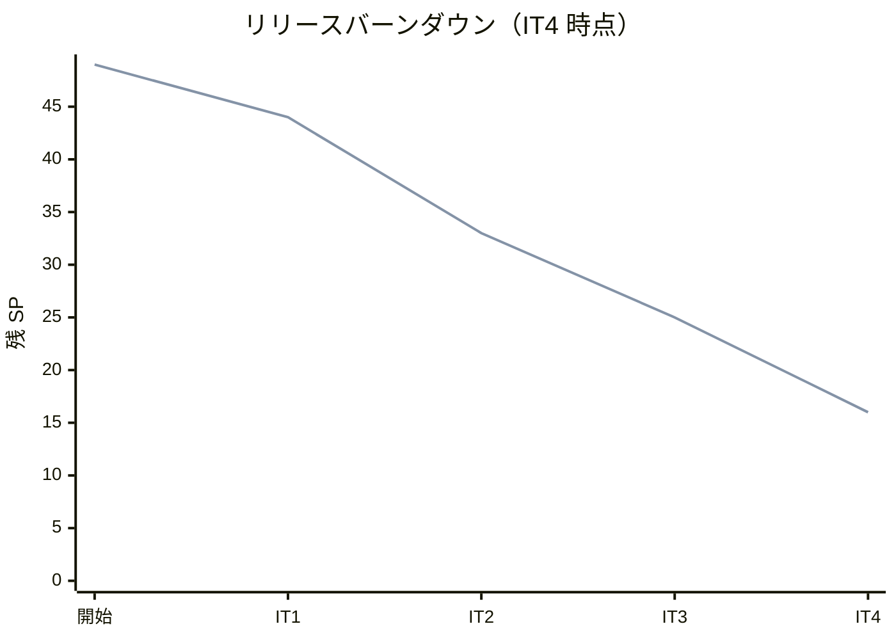
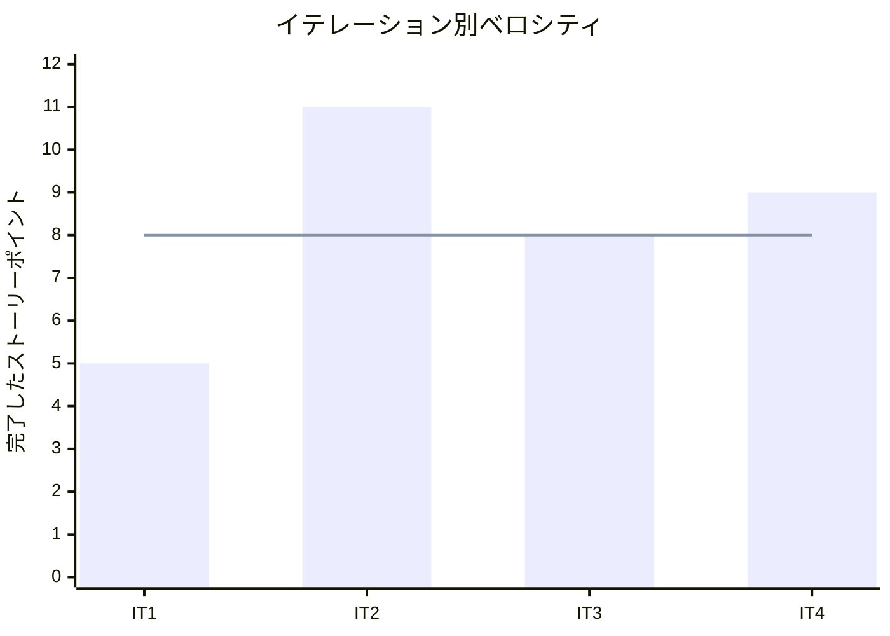

# イテレーション 4 完了報告書

## プロジェクト概要

| 項目 | 内容 |
|------|------|
| イテレーション | IT4 |
| 計画期間 | 2026-05-04 から 2026-05-15 まで |
| 実績記録日 | 2026-03-25 |
| ゴール | 入荷実績から出荷準備完了までの現場オペレーションを成立させる |
| 要員 | 2 名想定 |

## 指標

### ベロシティ

| 項目 | 値 |
|------|-----|
| 計画 SP | 9 |
| 実績 SP | 9 |
| 達成率 | 100% |

### リリースバーンダウン

### ベロシティ推移

## テスト結果

| メトリクス | Backend | Frontend |
|-----------|---------|----------|
| テストファイル | 7 / 7 通過 | 4 / 4 通過 |
| テスト数 | 22 / 22 通過 | 29 / 29 通過 |
| カバレッジ | 未取得 | 未取得 |
| E2E テスト | - | 1 / 1 シナリオ通過 |

`2026-03-25` 時点で `npm run test:backend`、 `npm run test:frontend`、 `npm run test:e2e:frontend` を実行し、 Backend 22 件、 Frontend 29 件、 E2E 1 件の通過を確認した。

### テスト増分

| メトリクス | IT3 | IT4 | 増分 |
|-----------|-----|-----|------|
| Backend テストファイル | 6 | 7 | +1 |
| Backend テスト数 | 16 | 22 | +6 |
| Frontend テストファイル | 4 | 4 | +0 |
| Frontend テスト数 | 27 | 29 | +2 |
| E2E シナリオ | 1 | 1 | +0 |

## 実施内容と評価

| ストーリー | 結果 | 予定ポイント | ベロシティ加算ポイント |
|-----------|------|-------------|------------------------|
| US-06 入荷実績を登録して在庫へ反映したい | 完了 | 3 | 3 |
| US-09 出荷対象と必要花材を確認したい | 完了 | 3 | 3 |
| US-09B 花束の結束完了を登録したい | 完了 | 3 | 3 |
| 合計 |  | 9 | 9 |

### 受け入れ基準達成状況

- [x] `US-06` の入荷対象一覧、数量入力、一部入荷 / 入荷完了保持、在庫反映を実装した。
- [x] `US-09` の出荷対象一覧、必要花材表示、空状態を実装した。
- [x] `US-09B` の結束完了登録、状態遷移、在庫不足 / 保留 / 二重登録の拒否を実装した。
- [x] 入荷登録から出荷準備完了までの主要統合テストを Backend / Frontend で実行可能にした。

### 主な実装内容

- Backend に入荷対象一覧 / 入荷登録 API と、出荷対象取得 / 結束完了 API を追加した。
- 在庫サービスに入荷反映後の在庫予定と出荷対象判定を接続し、入荷実績が下流導線へ反映されるようにした。
- 管理画面に `入荷管理` と `出荷管理` ワークベンチを追加し、入荷入力から結束完了までを操作可能にした。
- 結束完了は在庫不足または保留中の対象を拒否し、状態が `出荷準備完了` へ遷移するようにした。

## 追加タスク（SP 外）

- `iteration_plan-4.md` の実績メモを更新し、 `IT4` の完了状態を記録した。
- `Release 1.1` 完了条件に向けて、 `US-00` と `US-10` を `IT5` の調整対象として切り出した。
- `tracking-progress --update` に備えて、 `release_plan.md` と開発ドキュメントの反映差分を整理した。

## E2E テスト結果

| シナリオ | 結果 |
|---------|------|
| 顧客が商品一覧から注文入力画面へ進める | 通過 |

既存の顧客注文スモーク 1 件を回帰確認し、 Phase 1 から継続している顧客導線が `IT4` の業務画面拡張後も維持されていることを確認した。

## フェーズ・累計進捗

| フェーズ | 計画 SP | 完了 SP | 達成率 |
|---------|---------|---------|--------|
| Phase 1 | 16 | 16 | 100% |
| Phase 2 | 23 | 17 | 74% |
| Phase 3 | 10 | 0 | 0% |
| 合計 | 49 | 33 | 67% |

詳細は [イテレーション 4 ふりかえり](./retrospective-4.md) を参照。
