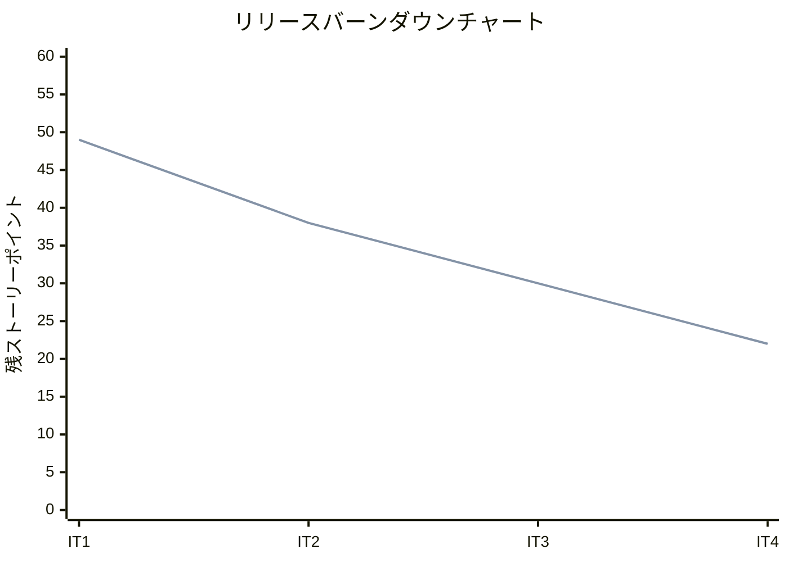
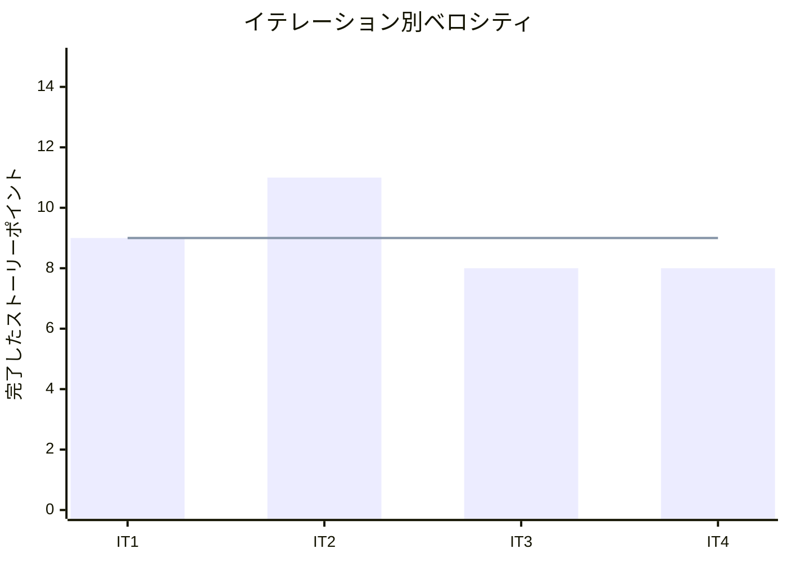

# イテレーション 4 完了報告書

## プロジェクト概要

### 日程

- イテレーション開始日: 2026-03-24
- イテレーション終了日: 2026-03-24
- 作業日数: 1 日

### 要員

| 名前 | 予定作業日数 | 実績作業日数 |
|------|------------|------------|
| Claude | 1 | 1 |

## 指標

### ベロシティ

| 項目 | 値 |
|------|-----|
| 計画 SP | 8 |
| 実績 SP | 8 |
| 達成率 | 100% |

### イテレーションバーンダウン

### ベロシティチャート

## テスト結果

| メトリクス | 結果 |
|-----------|------|
| テスト | 165 examples, 0 failures |
| カバレッジ | 95.03% |
| RuboCop | 0 offenses |
| Brakeman | 0 warnings |

### テスト推移

| メトリクス | IT1 | IT2 | IT3 | IT4 | 増分 |
|-----------|-----|-----|-----|-----|------|
| テスト数 | 53 | 86 | 136 | 165 | +29 |
| カバレッジ | 87.29% | 90.76% | 94.01% | 95.03% | +1.02% |

## 実施内容と評価

| ストーリー | 結果 | 予定ポイント | ベロシティ加算ポイント |
|-----------|------|------------|-------------------|
| S09: 発注する | 完了 | 5 | 5 |
| S10: 入荷を受け入れる | 完了 | 3 | 3 |
| 合計 | | 8 | 8 |

### 受入条件達成状況

#### S09: 発注する

- [x] 単品を選択して発注数量と希望納品日を入力できる
- [x] 仕入先・購入単位・リードタイムが自動表示される
- [x] 発注を確定すると発注が記録され、入荷予定に反映される
- [x] 発注数量が購入単位の整数倍でない場合はエラーが表示される

#### S10: 入荷を受け入れる

- [x] 発注一覧から対象の発注を選択できる
- [x] 入荷数量を入力して入荷を記録できる
- [x] 入荷を記録すると在庫が増加する
- [x] 発注が「入荷済み」に更新される

### 実装内容

| レイヤー | 実装内容 |
|---------|---------|
| サービス | PurchaseOrderService（発注作成 + 入荷受入 + 購入単位バリデーション） |
| プレゼンテーション | PurchaseOrdersController（一覧/新規/詳細）+ ArrivalsController（入荷受入） |
| ビュー | 発注一覧・新規・詳細画面、入荷記録画面 |
| ルーティング | purchase_orders（ネスト: arrivals）追加 |
| レビュー対応 | Date.parse 例外ハンドリング、ステータスホワイトリスト |

### イテレーションレビュー

| アクションアイテム | 担当 |
|------------------|------|
| Controller のエラーハンドリングを最初から網羅的に設計する | Claude |
| ステータスバッジの helper メソッド化（3 画面に達したら） | Claude |
| 部分入荷の業務要件を明確化する | Claude |

## フェーズ・累計進捗

### Phase 2（仕入出荷）進捗

| ストーリー | SP | イテレーション | 状態 |
|-----------|-----|--------------|------|
| S09: 発注する | 5 | IT4 | 完了 |
| S10: 入荷を受け入れる | 3 | IT4 | 完了 |
| S11: 出荷一覧を確認する | 3 | IT5 | 未着手 |
| S12: 出荷処理を行う | 5 | IT5 | 未着手 |
| **合計** | **16** | | **50%** |

### 累計進捗

| フェーズ | 計画 SP | 実績 SP | 達成率 |
|---------|---------|---------|--------|
| Phase 1 (MVP) | 28 | 28 | 100% |
| Phase 2 (仕入出荷) | 16 | 8 | 50% |
| Phase 3 (顧客体験) | 14 | - | 0% |
| **全体** | **58** | **36** | **62%** |

## ふりかえり

詳細は [イテレーション 4 ふりかえり](./retrospective-4.md) を参照。

## 更新履歴

| 日付 | 更新内容 | 更新者 |
|------|---------|--------|
| 2026-03-24 | 初版作成 | - |
