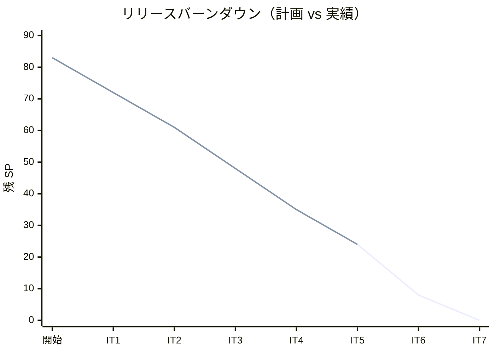
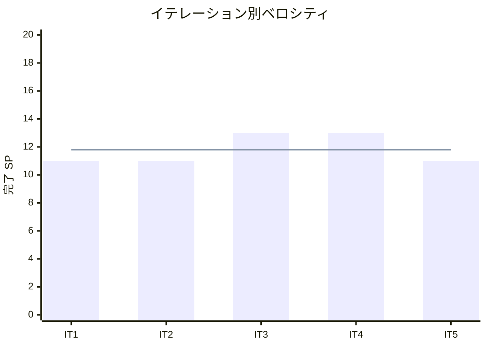

# イテレーション 5 完了報告書

## 概要

| 項目 | 内容 |
|------|------|
| **イテレーション** | 5 |
| **計画期間** | 2026-05-18 〜 2026-05-29（2 週間） |
| **実績期間** | 2026-03-22（1 日） |
| **ゴール** | 入荷登録を完成させ MVP の在庫推移を信頼性ある状態にする。結束対象確認と結束完了登録で出荷準備フローを実現する |
| **達成度** | 11/11 SP（100%） |

---

## ユーザーストーリー達成状況

| ID | ストーリー | SP | 状態 |
|----|-----------|-----|------|
| US-011 | 入荷を登録する | 3 | **完了** |
| US-012 | 結束対象を確認する | 3 | **完了** |
| US-013 | 結束完了を登録する | 5 | **完了** |
| **合計** | | **11** | **100%** |

---

## 成功基準の達成

- [x] 発注に対して入荷数量を登録できる（残数量超過チェックあり）
- [x] 入荷登録で発注ステータスが ORDERED → PARTIAL / RECEIVED に更新される
- [x] 入荷登録で Stock が自動作成され在庫推移に反映される
- [x] 在庫推移画面で入荷予定・受注引当が数値として表示される（0 ではなく）
- [x] 翌日出荷予定の受注と必要花材が結束対象一覧に表示される
- [x] 結束完了操作で単品在庫が消費される（Stock.consume）
- [x] 結束完了操作で受注ステータスが ACCEPTED → PREPARING に遷移する
- [x] ヘキサゴナルアーキテクチャの実装パターンに準拠（ArchUnit テストで検証）
- [x] テストカバレッジ 80% 以上

---

## 実装内容

### バックエンド

#### ドメイン層

- `Arrival`: エンティティ（入荷実績の記録、残数量超過バリデーション）
- `PurchaseOrder.remainingQuantity()`: 残数量計算メソッド追加
- `PurchaseOrder.registerArrival()`: 入荷登録によるステータス遷移（ORDERED→PARTIAL/RECEIVED）
- `PurchaseOrderStatus`: PARTIAL→PARTIAL 遷移サポート追加
- `Stock.consume()`: FIFO 在庫消費メソッド
- `Stock.isEmpty()`: 消費後ゼロ判定
- `Order.prepare()`: 結束完了によるステータス遷移（ACCEPTED→PREPARING）
- `BundlingQueryService`: 結束対象クエリ（出荷日ベースの受注+花束構成→必要花材計算）
- `BundleOrderUseCase`: 結束完了ユースケース（FIFO 在庫消費→受注ステータス更新トランザクション）

#### アプリケーション層

- `RegisterArrivalUseCase`: 入荷登録（発注ステータス更新 + Stock 自動作成）
- `BundlingQueryService`: 結束対象取得（花材所要量集計 + 在庫充足チェック）
- `BundleOrderUseCase`: 結束完了（在庫 FIFO 消費 + ステータス更新）

#### インフラ層

- JPA エンティティ: ArrivalEntity
- リポジトリ: JpaArrivalRepository
- JpaInventoryQueryPort: 入荷予定（PurchaseOrder.desiredDeliveryDate から推定）と受注引当（Order×ProductComposition JOIN）の実装完成
- SecurityConfig: FLORIST / DELIVERY_STAFF ロールを /admin/bundling/** に追加
- DevDataInitializer: PURCHASE_STAFF ユーザー追加、発注データ 8 件に拡充、初期化順序修正

#### API

| メソッド | エンドポイント | 説明 |
|---------|---------------|------|
| POST | /api/v1/admin/purchase-orders/{id}/arrivals | 入荷登録 |
| GET | /api/v1/admin/bundling/targets | 結束対象取得 |
| PUT | /api/v1/admin/orders/{orderId}/bundle | 結束完了登録 |

### フロントエンド

- `ArrivalRegistrationPage`（S-302）: 入荷登録画面（発注情報表示、残数量チェック、確認モーダル）
- `BundlingTargetsPage`（S-401）: 結束対象一覧画面（出荷日選択、花材所要量・在庫充足表示、結束完了ボタン+確認ダイアログ）
- `AppLayout`: 結束管理ナビゲーション追加（FLORIST / DELIVERY_STAFF ロール対応）

### IT4 技術負債解消

- InventoryQueryPort.getExpectedArrivals 実装（purchase_orders.desired_delivery_date + arrivals から推定）
- InventoryQueryPort.getOrderAllocations 実装（orders + product_compositions JOIN から引当数計算）
- 在庫推移画面の「未反映」バナー除去
- domain_model.md / data-model.md / architecture_backend.md の IT4 実装差分チェック・更新

### レビュー指摘対応

- BundlingQueryService.getTargets のメソッド分割（Checkstyle 50 行制限対応）
- BundleOrderUseCaseTest の未使用インポート削除
- シードデータの整合性改善（PURCHASE_STAFF ユーザー追加、発注 2→8 件拡充）

---

## テスト結果

### テスト実行結果

| カテゴリ | ファイル数 | テスト数 | 結果 |
|---------|----------|---------|------|
| バックエンドユニットテスト | 48 | 286 | 全通過 |
| フロントエンドユニットテスト | 13 | 49 | 全通過 |
| E2E テスト | 5 | 37 | 全通過 |
| **合計** | **66** | **372** | **全通過** |

### テスト増分（IT4 → IT5）

| カテゴリ | IT4 | IT5 | 増減 |
|---------|-----|-----|------|
| バックエンドユニットテスト | 220 | 286 | +66 |
| フロントエンドユニットテスト | 41 | 49 | +8 |
| E2E テスト | 37 | 37 | ±0 |
| **合計** | **298** | **372** | **+74** |

### テスト累計推移

| カテゴリ | IT1 | IT2 | IT3 | IT4 | IT5 |
|---------|-----|-----|-----|-----|-----|
| バックエンド | 50 | 102 | 176 | 220 | 286 |
| フロントエンド | 12 | 17 | 27 | 41 | 49 |
| E2E | 7 | 12 | 25 | 37 | 37 |
| **合計** | **69** | **131** | **228** | **298** | **372** |

### IT5 新規テスト内訳

| カテゴリ | テスト数 |
|---------|---------|
| Arrival ドメインテスト | 6 |
| PurchaseOrder 拡張テスト（remainingQuantity, registerArrival） | 8 |
| RegisterArrivalUseCase テスト | 6 |
| ArrivalController テスト | 4 |
| Stock.consume / isEmpty テスト | 5 |
| Order.prepare テスト | 3 |
| BundlingQueryService テスト | 6 |
| BundleOrderUseCase テスト | 8 |
| BundlingController テスト | 4 |
| InventoryQueryPort 実装テスト | 8 |
| ArchUnit テスト更新 | 2 |
| ArrivalRegistrationPage テスト | 4 |
| BundlingTargetsPage テスト | 4 |
| PurchaseOrderPage テスト更新 | 5 |
| **新規合計** | **73** |

---

## ベロシティ

| イテレーション | 計画 SP | 実績 SP | 達成率 |
|--------------|--------|--------|--------|
| IT1 | 11 | 11 | 100% |
| IT2 | 11 | 11 | 100% |
| IT3 | 13 | 13 | 100% |
| IT4 | 13 | 13 | 100% |
| IT5 | 11 | 11 | 100% |
| **平均** | **11.8** | **11.8** | **100%** |

### バーンダウンチャート

### ベロシティチャート

---

## フェーズ・累計進捗

### Phase 1（MVP）進捗

| ストーリー | SP | 状態 |
|-----------|-----|------|
| US-017 システムにログインする | 5 | 完了（IT1） |
| US-018 得意先アカウント新規登録 | 3 | 完了（IT1） |
| US-003 単品を登録する | 3 | 完了（IT1） |
| US-001 商品を登録する | 3 | 完了（IT2） |
| US-002 花束構成を定義する | 5 | 完了（IT2） |
| US-004 商品一覧を表示する | 3 | 完了（IT2） |
| US-005 花束を注文する | 8 | 完了（IT3） |
| US-006 受注一覧を確認する | 3 | 完了（IT3） |
| US-007 受注を受け付ける | 2 | 完了（IT3） |
| US-009 在庫推移を表示する | 8 | 完了（IT4） |
| US-010 単品を発注する | 5 | 完了（IT4） |
| US-011 入荷を登録する | 3 | **完了（IT5）** |
| **合計** | **51** | **51/51（100%）** |

> Phase 1 MVP 完了

### Phase 2（出荷管理・変更対応）進捗

| ストーリー | SP | 状態 |
|-----------|-----|------|
| US-012 結束対象を確認する | 3 | **完了（IT5）** |
| US-013 結束完了を登録する | 5 | **完了（IT5）** |
| US-014 出荷処理を実行する | 3 | IT6 予定 |
| US-019 注文をキャンセルする | 5 | IT6 予定 |
| US-008 届け日を変更する | 8 | IT6 予定 |
| **合計** | **24** | **8/24（33%）** |

### 全フェーズ累計

| フェーズ | SP | 完了 SP | 進捗率 |
|---------|-----|---------|--------|
| Phase 1（MVP） | 51 | 51 | 100% |
| Phase 2（出荷管理） | 24 | 8 | 33% |
| Phase 3（顧客体験） | 8 | 0 | 0% |
| **合計** | **83** | **59** | **71%** |

---

## ふりかえり

詳細は [イテレーション 5 ふりかえり](./iteration_retrospective-5.md) を参照。

---

## 更新履歴

| 日付 | 更新内容 | 更新者 |
|------|---------|--------|
| 2026-03-22 | 初版作成 | - |

---

## 関連ドキュメント

- [イテレーション 5 計画](./iteration_plan-5.md)
- [イテレーション 5 ふりかえり](./iteration_retrospective-5.md)
- [リリース計画](./release_plan.md)
