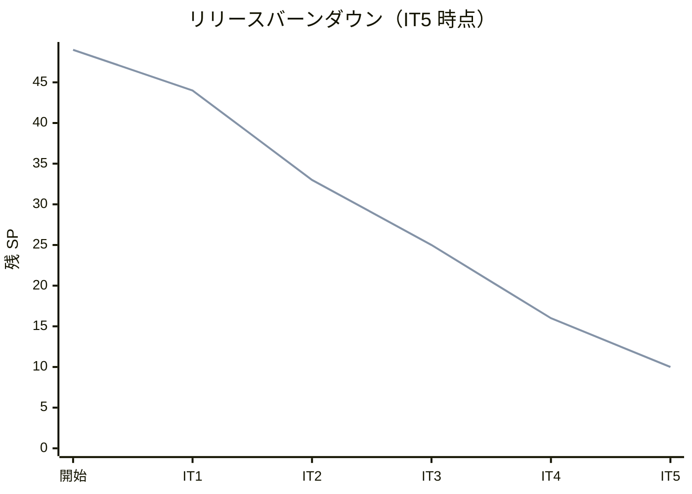
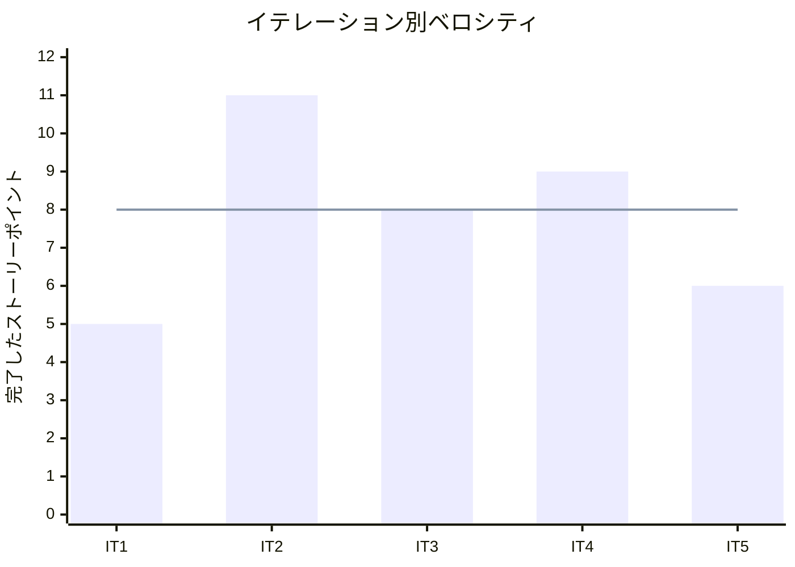

# イテレーション 5 完了報告書

## プロジェクト概要

| 項目 | 内容 |
|------|------|
| イテレーション | IT5 |
| 計画期間 | 2026-05-18 から 2026-05-29 まで |
| 実績記録日 | 2026-03-25 |
| ゴール | 商品マスタ管理と出荷確定を成立させ、 `Release 1.1` の業務フローを完了する |
| 要員 | 2 名想定 |

## 指標

### ベロシティ

| 項目 | 値 |
|------|-----|
| 計画 SP | 6 |
| 実績 SP | 6 |
| 達成率 | 100% |

### リリースバーンダウン

### ベロシティ推移

## テスト結果

| メトリクス | Backend | Frontend |
|-----------|---------|----------|
| テストファイル | 8 / 8 通過 | 4 / 4 通過 |
| テスト数 | 28 / 28 通過 | 35 / 35 通過 |
| カバレッジ | 未取得 | 未取得 |
| E2E テスト | - | 1 / 1 シナリオ通過 |

`2026-03-25` 時点で `npm run test:backend`、 `npm run test:frontend`、 `npm run test:e2e:frontend` を実行し、 Backend 28 件、 Frontend 35 件、 E2E 1 件の通過を確認した。

### テスト増分

| メトリクス | IT4 | IT5 | 増分 |
|-----------|-----|-----|------|
| Backend テストファイル | 7 | 8 | +1 |
| Backend テスト数 | 22 | 28 | +6 |
| Frontend テストファイル | 4 | 4 | +0 |
| Frontend テスト数 | 29 | 35 | +6 |
| E2E シナリオ | 1 | 1 | +0 |

## 実施内容と評価

| ストーリー | 結果 | 予定ポイント | ベロシティ加算ポイント |
|-----------|------|-------------|------------------------|
| US-00 花束商品と花束構成を管理したい | 完了 | 3 | 3 |
| US-10 出荷実績を確定したい | 完了 | 3 | 3 |
| 合計 |  | 6 | 6 |

### 受け入れ基準達成状況

- [x] `US-00` の商品一覧、新規登録 / 編集、販売状態更新、花束構成入力、保存反映を実装した。
- [x] `US-10` の出荷準備完了一覧、出荷確定、 `shipped` への状態更新、二重確定防止を実装した。
- [x] 商品マスタ更新から顧客注文導線への反映、および結束完了から出荷確定までの主要回帰テストを実行可能にした。
- [x] レビュー指摘を反映し、顧客画面の障害表示と商品管理の `新規登録` 導線を追加した。

### 主な実装内容

- Backend に商品 master API と出荷確定 API を追加し、 order / shipping の参照先を product master に接続した。
- Frontend の管理画面に `商品管理` と `出荷確定対象` の導線を追加し、商品保存から出荷確定までを操作可能にした。
- 顧客向け商品一覧と注文入力は商品 API を参照する形へ移行し、通信障害時は再試行付きの暫定表示にした。
- 実装レビューと UI/UX レビューを文書化し、高優先指摘を同一イテレーション内で解消した。

## 追加タスク（SP 外）

- `iteration_plan-5.md` の実績メモを更新し、 `IT5` の完了状態を記録した。
- `Release 1.1` の完了条件を見直し、 `Phase 2` を完了状態に更新する準備を行った。
- `IT6` で扱う `US-07`、 `US-08` の開始準備として issue / project の対象を整理した。

## E2E テスト結果

| シナリオ | 結果 |
|---------|------|
| 顧客が商品一覧から注文入力画面へ進める | 通過 |

既存の顧客注文スモーク 1 件を回帰確認し、商品 master 連携導入後も顧客導線が維持されていることを確認した。

## フェーズ・累計進捗

| フェーズ | 計画 SP | 完了 SP | 達成率 |
|---------|---------|---------|--------|
| Phase 1 | 16 | 16 | 100% |
| Phase 2 | 23 | 23 | 100% |
| Phase 3 | 10 | 0 | 0% |
| 合計 | 49 | 39 | 80% |

詳細は [イテレーション 5 ふりかえり](./retrospective-5.md) を参照。
