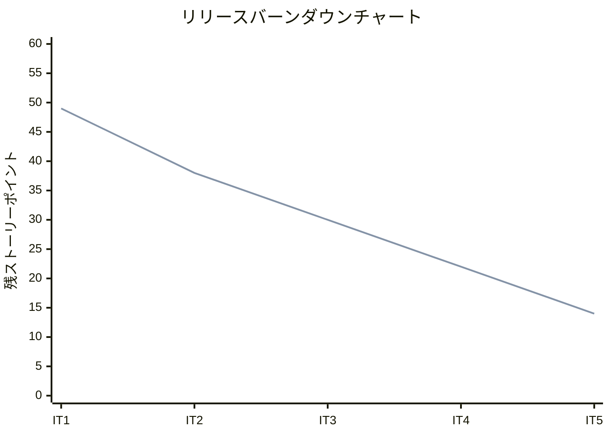
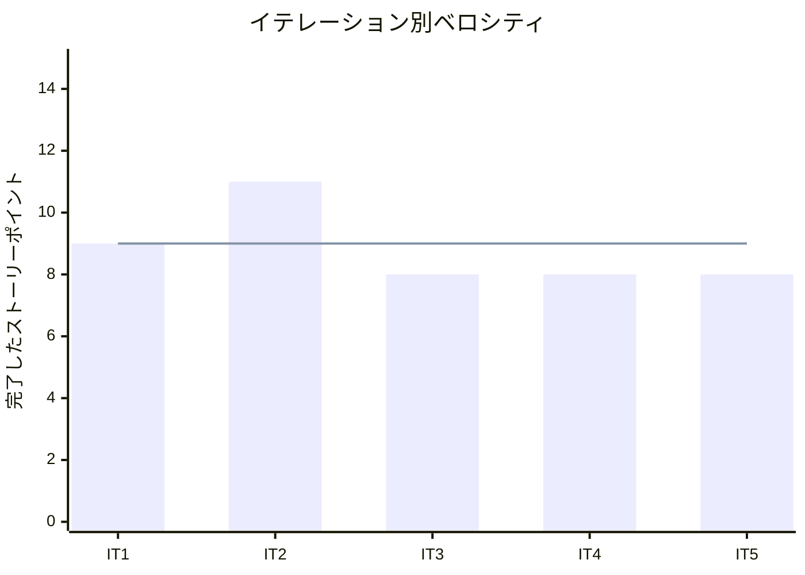

# イテレーション 5 完了報告書

## プロジェクト概要

### 日程

- イテレーション開始日: 2026-03-25
- イテレーション終了日: 2026-03-25
- 作業日数: 1 日

### 要員

| 名前 | 予定作業日数 | 実績作業日数 |
|------|------------|------------|
| Claude | 1 | 1 |

## 指標

### ベロシティ

| 項目 | 値 |
|------|-----|
| 計画 SP | 8 |
| 実績 SP | 8 |
| 達成率 | 100% |

### イテレーションバーンダウン

### ベロシティチャート

## テスト結果

| メトリクス | 結果 |
|-----------|------|
| テスト | 197 examples, 0 failures |
| カバレッジ | 95.85% |
| RuboCop | 0 offenses |
| Brakeman | 未実行 |

### テスト推移

| メトリクス | IT1 | IT2 | IT3 | IT4 | IT5 | 増分 |
|-----------|-----|-----|-----|-----|-----|------|
| テスト数 | 44 | 95 | 135 | 165 | 197 | +32 |
| カバレッジ | 95.15% | 93.52% | 95.26% | 95.03% | 95.85% | +0.82% |

## 完了ストーリー

| ID | ストーリー | SP | 状態 |
|----|-----------|----|----- |
| S11 | 出荷一覧を確認する | 3 | 完了 |
| S12 | 出荷処理を行う | 5 | 完了 |
| **合計** | | **8** | |

## 成果物

### 新規作成

| ファイル | 説明 |
|---------|------|
| `app/models/shipment.rb` | Shipment モデル（order_id UQ, shipped_at） |
| `app/services/shipping_service.rb` | 出荷サービス（出荷処理 + 在庫消費 + 悲観ロック） |
| `app/controllers/shipments_controller.rb` | 出荷一覧 + 出荷処理コントローラ |
| `app/views/shipments/index.html.erb` | 出荷一覧画面 |
| `db/migrate/..._create_shipments.rb` | shipments テーブルマイグレーション |
| `spec/models/shipment_spec.rb` | Shipment モデルテスト（3 examples） |
| `spec/services/shipping_service_spec.rb` | ShippingService テスト（13 examples） |
| `spec/requests/shipments_spec.rb` | Request テスト（8 examples） |

### 変更

| ファイル | 変更内容 |
|---------|---------|
| `app/models/order.rb` | has_one :shipment, shippable?, shipped?, ordered?, for_shipping_date スコープ |
| `app/views/layouts/application.html.erb` | ナビゲーションに「出荷管理」追加 |
| `config/routes.rb` | `resources :shipments, only: [:index, :create]` |

## コードレビュー

5 つの XP エージェント（programmer, tester, architect, technical-writer, user-representative）による並列レビューを実施。

### 重要度「高」の指摘と対応

| # | 指摘 | 対応 |
|---|------|------|
| 1 | `ship_all` のトランザクション境界が個別（部分出荷リスク） | 単一トランザクションに統合（All-or-Nothing） |
| 2 | 在庫消費の排他制御欠如（TOCTOU 競合） | `FOR UPDATE` 悲観ロック追加 |
| 3 | 在庫消費の境界値テスト不足 | 複数ロット FEFO、期限切れスキップ、ちょうど消費、部分失敗ロールバックの 4 テスト追加 |

### レビュー詳細

`docs/review/it5_shipment_review_20260325.md` を参照。

## ふりかえり

### Keep（続けること）

- TDD サイクル（Red → Green → Refactor）の厳守
- PurchaseOrderService パターンの踏襲による設計の一貫性
- 5 エージェント並列レビューによる多角的フィードバック
- FEFO（先期限先出）の在庫消費ロジック

### Problem（問題点）

- `ship_all` のトランザクション境界設計が初期実装で不十分だった
- 在庫消費の排他制御（悲観ロック）が初期実装で考慮されていなかった
- ステータスバッジ helper の DRY 化が見送りになった
- E2E 統合テスト・StockForecast 連携テストが見送りになった

### Try（次に試すこと）

- 一括処理系のサービスは最初からトランザクション設計を明示する
- 更新系処理では排他制御（FOR UPDATE）を初期設計で検討する
- Order モデルの status を `enum` に統一する（影響範囲が広いためリファクタリングタスクとして計画）
- 出荷処理の確認ダイアログを追加する

## Phase 2 完了サマリー

IT5 の完了により、Phase 2（仕入出荷）の全機能が実装完了。

| IT | ストーリー | SP | 内容 |
|----|-----------|----|----- |
| IT4 | S09: 発注する | 5 | 発注管理 |
| IT4 | S10: 入荷を受け入れる | 3 | 入荷受入 + 在庫作成 |
| IT5 | S11: 出荷一覧を確認する | 3 | 出荷一覧（日付フィルタ + 花束構成表示） |
| IT5 | S12: 出荷処理を行う | 5 | 出荷処理（在庫消費 + 状態更新） |
| **合計** | | **16** | **発注→入荷→出荷の一貫したフロー** |

## 次のイテレーション

IT6 では Phase 3（業務改善）に着手予定。

| ID | ストーリー | SP | 優先度 |
|----|-----------|----|----- |
| S05 | 届け日を変更する | 5 | 高 |
| S06 | 届け先をコピーする | 3 | 高 |
| S13 | 得意先を管理する | 3 | 高 |
| S14 | 注文をキャンセルする | 3 | 高 |
