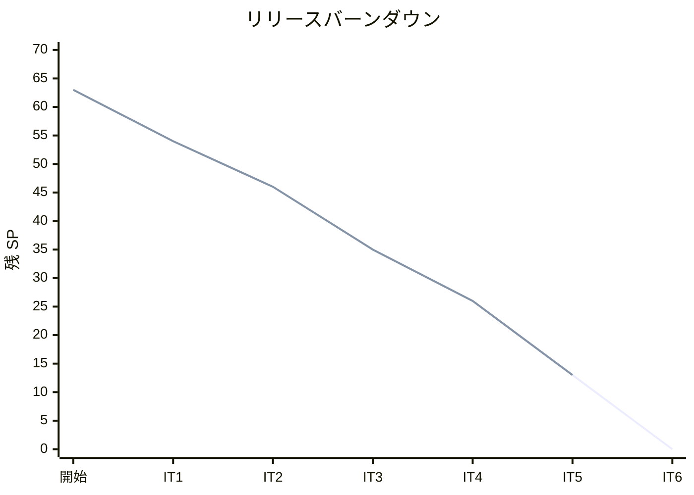
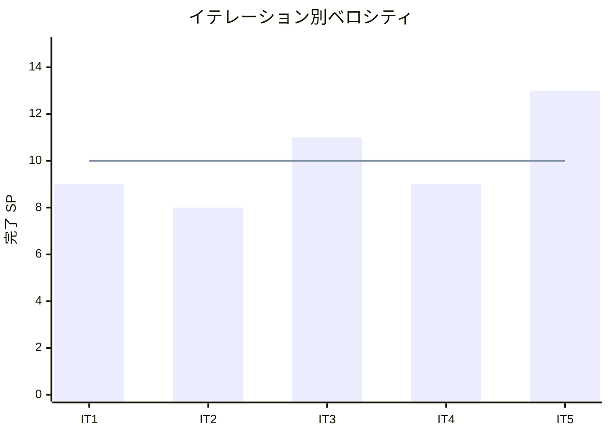

# イテレーション 5 完了報告書

## 概要

| 項目 | 内容 |
| :--- | :--- |
| **イテレーション** | 5 |
| **期間** | Week 9-10 |
| **ゴール** | 仕入・入荷管理と品質期限アラートを実装し、在庫推移に入荷予定を反映する |
| **達成状況** | 完了（13/13 SP、100%） |

---

## 成果

### 実装したユーザーストーリー

| ID | ストーリー | SP | 状態 |
| :--- | :--- | :--- | :--- |
| US-008 | 仕入先に発注する | 5 | 完了 |
| US-009 | 入荷を受け入れる | 5 | 完了 |
| US-012 | 品質維持期限アラートを確認する | 3 | 完了 |
| **合計** | | **13** | |

### 技術成果

| カテゴリ | 内容 |
| :--- | :--- |
| **発注登録（US-008）** | PurchaseOrder 集約ルート（domain/entities.py）、PurchaseOrderStatus 値オブジェクト、PurchaseOrderRepository（ABC + Django 実装）、PurchasingService.place_order()、発注一覧画面・発注登録画面 |
| **入荷受入（US-009）** | Arrival 集約ルート、ArrivalRepository（ABC + Django 実装）、PurchasingService.receive_arrival()（入荷→在庫ロット自動作成・品質維持期限算出・発注ステータス遷移）、入荷登録画面（差異表示付き） |
| **品質期限アラート（US-012）** | ExpiryAlertView（品質維持期限残り 2 日以内の在庫ロットをアラート表示）、品質期限アラート画面 |
| **在庫推移連携** | StockForecastService に incoming_schedule パラメータ追加（後方互換）、InventoryService に PurchaseOrderRepository を注入し発注データを在庫推移に反映 |
| **新規 Django アプリ** | purchasing アプリを DDD レイヤー構成で新規作成（14 ファイル、598 行） |

### 新規コンポーネント

| コンポーネント | ファイル |
| :--- | :--- |
| PurchaseOrder 集約 | `apps/purchasing/domain/entities.py` |
| Arrival 集約 | `apps/purchasing/domain/entities.py` |
| PurchaseOrderStatus | `apps/purchasing/domain/value_objects.py` |
| PurchaseOrderRepository | `apps/purchasing/domain/interfaces.py` |
| ArrivalRepository | `apps/purchasing/domain/interfaces.py` |
| DjangoPurchaseOrderRepository | `apps/purchasing/repositories.py` |
| DjangoArrivalRepository | `apps/purchasing/repositories.py` |
| PurchasingService | `apps/purchasing/services.py` |
| PlacePurchaseOrderCommand | `apps/purchasing/services.py` |
| ReceiveArrivalCommand | `apps/purchasing/services.py` |
| PurchaseOrder ORM モデル | `apps/purchasing/models.py` |
| Arrival ORM モデル | `apps/purchasing/models.py` |
| StockForecastService.incoming_schedule | `apps/inventory/domain/services.py` |
| InventoryService.po_repo | `apps/inventory/services.py` |

### 新規画面

| 画面 ID | 画面名 | URL | 種別 |
| :--- | :--- | :--- | :--- |
| A-10 | 発注一覧 | `/staff/purchasing/orders/` | スタッフ向け |
| A-10 | 発注登録 | `/staff/purchasing/orders/new/` | スタッフ向け |
| A-11 | 入荷登録 | `/staff/purchasing/arrivals/new/` | スタッフ向け |
| A-05 | 品質期限アラート | `/staff/purchasing/alerts/expiry/` | スタッフ向け |

---

## 品質メトリクス

| 指標 | IT4 末 | IT5 末 | 変化 |
| :--- | :--- | :--- | :--- |
| テスト数 | 215 | 261 | +46 |
| テストファイル数 | 13 | 17 | +4 |
| カバレッジ | 98% | 96% | -2%（新規 View 増加による） |
| Ruff エラー | 0 | 0 | 維持 |
| 新規テスト内訳 | | | |
| — ドメインテスト（purchasing） | | +16 | PurchaseOrder, Arrival, PurchaseOrderStatus |
| — リポジトリテスト（purchasing） | | +10 | DjangoPurchaseOrderRepository, DjangoArrivalRepository |
| — サービステスト（purchasing） | | +6 | place_order, receive_arrival, list_ordered |
| — View 統合テスト（purchasing） | | +12 | 発注一覧(2) + 発注登録(3) + 入荷登録(3) + アラート(4) |
| — 在庫推移拡張テスト（inventory） | | +2 | incoming_schedule 反映テスト |

### テストピラミッド（IT5 末）

```
         /  4  \   View 統合テスト（在庫推移）
        / 5 + 4 \  View 統合テスト（キャンセル + 既存注文）
       /   12    \  View 統合テスト（受注管理 + 注文履歴 + 届け先選択）
      /    12     \  View 統合テスト（発注一覧 + 発注登録 + 入荷登録 + アラート）
     /   29 + 6    \  サービステスト（Order + Inventory + Purchasing）
    /    17 + 10    \  Repository 統合テスト（Order + StockLot + Product + PurchaseOrder + Arrival）
   /   115 + 16 + 2 \  ドメインユニットテスト（商品 + 注文 + 在庫 + 仕入 + 在庫推移拡張）
   /    2 + 33       \  スモーク + その他
   ──────────────────────
        261 テスト
```

### テスト累計推移

| イテレーション | テスト数 | 増分 | カバレッジ |
| :--- | :--- | :--- | :--- |
| IT1 | 67 | +67 | 99% |
| IT2 | 130 | +63 | 99% |
| IT3 | 195 | +65 | 99% |
| IT4 | 215 | +20 | 98% |
| IT5 | 261 | +46 | 96% |

---

## 受入条件の達成状況

### US-008: 仕入先に発注する

- [x] 単品・数量・入荷予定日を入力して発注を登録できる
- [x] 仕入先は単品マスタから自動設定される
- [x] 発注が入荷予定として在庫推移に反映される

### US-009: 入荷を受け入れる

- [x] 発注番号を選択して入荷数量を登録できる
- [x] 入荷日が品質維持日数の起算日として設定される
- [x] 在庫ロットが作成され、在庫が更新される
- [x] 入荷数量が発注数量と異なる場合に差異が表示される

### US-012: 品質維持期限アラートを確認する

- [x] 品質維持期限まで残り 2 日以内の在庫ロットがアラート表示される
- [x] 在庫ロットごとに単品名、残数量、品質維持期限日が表示される

---

## 横断タスク

| タスク | 内容 |
| :--- | :--- |
| purchasing Django アプリ作成 | DDD レイヤー構成（domain → models → repositories → services → views）で新規作成 |
| StockForecastService 拡張 | incoming_schedule パラメータ追加（オプショナル、後方互換維持） |
| InventoryService 拡張 | PurchaseOrderRepository を DI で注入し、発注データを在庫推移に連携 |
| 在庫推移画面への導線 | 在庫推移画面に発注登録ボタンを配置（UI 設計 A-04 準拠） |
| DB マイグレーション | purchasing_purchase_order、purchasing_arrival テーブル作成 |

---

## ベロシティ分析

### 累積実績

| イテレーション | 計画 SP | 実績 SP | 達成率 | 累積完了 SP | 残 SP |
| :--- | :--- | :--- | :--- | :--- | :--- |
| IT1 | 9 | 9 | 100% | 9 | 54 |
| IT2 | 8 | 8 | 100% | 17 | 46 |
| IT3 | 11 | 11 | 100% | 28 | 35 |
| IT4 | 9 | 9 | 100% | 37 | 26 |
| IT5 | 13 | 13 | 100% | 50 | 13 |

### ベロシティ推移

| 指標 | 値 |
| :--- | :--- |
| IT1 | 9 SP |
| IT2 | 8 SP |
| IT3 | 11 SP |
| IT4 | 9 SP |
| IT5 | 13 SP |
| 平均 | 10.0 SP |
| 標準偏差 | 1.9 SP |

### バーンダウンチャート



### ベロシティチャート



### 完了見込み

- **Phase 2 進捗**: 13/26 SP 完了（50%）
- 残 SP: 13（US-010: 3SP + US-011: 5SP + US-013: 5SP）
- IT5 ベロシティ: 13 SP → IT6 でも同等のベロシティが期待できる
- **Phase 2 完了見込み**: IT6 で残 13SP を消化し v0.2.0 リリース

---

## フェーズ進捗

### Phase 2（仕入・出荷管理）— 進行中

| ID | ストーリー | SP | 完了 IT |
| :--- | :--- | :--- | :--- |
| US-008 | 仕入先に発注する | 5 | IT5 |
| US-009 | 入荷を受け入れる | 5 | IT5 |
| US-012 | 品質維持期限アラートを確認する | 3 | IT5 |
| US-010 | 結束対象を確認する | 3 | IT6 予定 |
| US-011 | 出荷処理を行い通知する | 5 | IT6 予定 |
| US-013 | 届け日を変更する | 5 | IT6 予定 |
| **合計** | | **26** | |

### 累計進捗

| フェーズ | SP | 完了 SP | 残 SP | 状態 |
| :--- | :--- | :--- | :--- | :--- |
| Phase 1（MVP） | 37 | 37 | 0 | **完了** |
| Phase 2（仕入・出荷） | 21 | 13 | 8 | 進行中 |
| Phase 3（顧客管理） | 5 | 0 | 5 | IT6 に吸収予定 |
| **合計** | **63** | **50** | **13** | |

---

## ふりかえり

詳細は [イテレーション 5 ふりかえり](./retrospective-5.md) を参照。

### 主要ポイント

- **Keep**: DDD レイヤー構成のパターン再利用、アプリ間連携、後方互換な拡張
- **Problem**: IT4 Try 持ち越し（SonarQube 3IT 連続）、N+1 アラートクエリ、コミット粒度
- **Try**: find_near_expiry メソッド追加、TDD コミット粒度改善、SonarQube 実施

---

## 更新履歴

| 日付 | 更新内容 |
| :--- | :--- |
| 2026-03-25 | 初版作成 |
