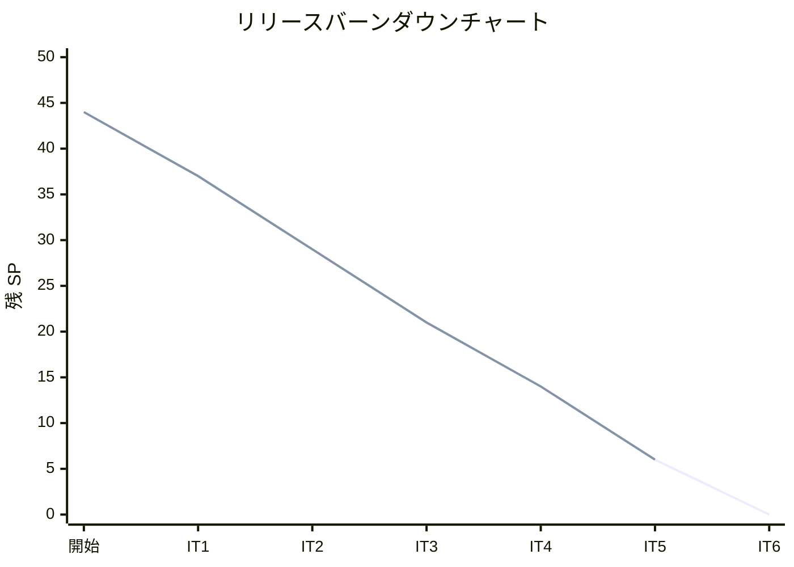
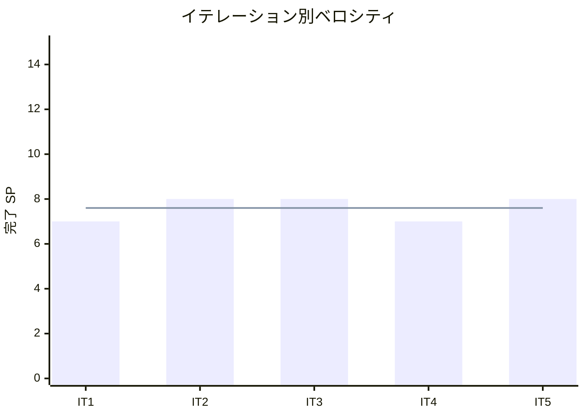

# イテレーション 5 完了報告書

## プロジェクト概要

### 日程

| 項目 | 内容 |
|------|------|
| イテレーション | 5 |
| 計画期間 | 2026-04-21 〜 2026-04-25 |
| 実績期間 | 2026-03-18（計画に先行して実装完了） |
| ゴール | 得意先管理・届け先コピー・届け日変更依頼（Phase 2 完了 + Phase 3 開始） |

### 要員

| 名前 | 予定作業日数 | 実績作業日数 |
|------|------------|------------|
| 開発者 | 5 | 1（AI 支援開発） |

---

## 指標

### ベロシティ

| 項目 | 値 |
|------|-----|
| 計画 SP | 8 |
| 実績 SP | 8 |
| 達成率 | 100% |

### テスト結果

| メトリクス | Backend | Frontend |
|-----------|---------|----------|
| テストファイル | 41/41 通過 | 16/16 通過 |
| テスト数 | 313/313 通過 | 135/135 通過 |
| E2E テスト | - | 33 シナリオ全通過 |

### テスト増分（IT5）

| カテゴリ | IT4 | IT5 | 増分 |
|---------|-----|-----|------|
| Backend テスト | 242 | 313 | +71 |
| Frontend テスト | 115 | 135 | +20 |
| E2E シナリオ | 33 | 33 | +0 |

### テスト累計推移

| カテゴリ | IT1 | IT2 | IT3 | IT4 | IT5 |
|---------|-----|-----|-----|-----|-----|
| Backend | 68 | 146 | 200 | 242 | 313 |
| Frontend | 21 | 79 | 102 | 115 | 135 |
| E2E | 10 | 7 | 19 | 33 | 33 |
| **合計** | **99** | **232** | **321** | **390** | **481** |

### SonarQube Quality Gate

| メトリクス | Backend | Frontend |
|-----------|---------|----------|
| Quality Gate | PASS | PASS |
| new_coverage | 87.1% | 89.2% |
| new_duplicated_lines | 0.06% | 0.0% |
| new_violations | 0 | 0 |

---

## 実施内容と評価

| ストーリー | 結果 | 予定 SP | 実績 SP |
|-----------|------|---------|---------|
| S04: 得意先を管理する | 完了 | 3 | 3 |
| S02: 届け先をコピーする | 完了 | 2 | 2 |
| S05: 届け日変更を依頼する | 完了 | 3 | 3 |
| **合計** | | **8** | **8** |

### S04: 得意先を管理する（3 SP）

**受入条件の達成状況**:

- [x] 得意先情報（名前・連絡先）を登録できる
- [x] 得意先の過去の届け先一覧が確認できる

**実装内容**:

- ドメイン層: Customer エンティティ（不変条件テスト: name 1-100 文字、phone 1-20 文字、email optional + format）+ Destination エンティティ（toSnapshot() 変換メソッド付き）
- アプリケーション層: CustomerUseCase（CRUD + 届け先一覧取得）
- インフラ層: Prisma CustomerRepository + DestinationRepository
- プレゼンテーション層: GET/POST/PUT /api/customers + GET /api/customers/:id/destinations
- フロントエンド: CustomerManagement 画面（一覧 + 新規登録 + 編集 + 届け先一覧表示）+ ナビゲーション追加

### S02: 届け先をコピーする（2 SP）

**受入条件の達成状況**:

- [x] 過去の届け先一覧が表示される
- [x] 選択した届け先の情報が注文画面に自動入力される

**実装内容**:

- バックエンド: OrderRepository.findByCustomerId() + GET /api/customers/:id/order-destinations（過去注文から届け先を重複排除）
- フロントエンド: OrderForm に「過去の届け先からコピー」機能（得意先選択 → 届け先選択 → フォーム自動入力）

### S05: 届け日変更を依頼する（3 SP）

**受入条件の達成状況**:

- [x] 状態が「注文済み」の受注に対してのみ届け日変更を依頼できる
- [x] 状態が「出荷準備中」「出荷済み」の受注は変更不可
- [x] 新しい届け日の出荷日が過去日付の場合は変更不可
- [x] 変更可能な場合、届け日と出荷日が更新される
- [x] 変更不可の場合、理由とともに通知される

**実装内容**:

- ドメイン層: Order.changeDeliveryDate() + DeliveryDateChangeValidator（状態チェック + 日付チェック）
- アプリケーション層: OrderUseCase.changeDeliveryDate()（ADR-003 に基づき MVP では在庫引当再計算なし）
- プレゼンテーション層: PUT /api/orders/:id/delivery-date
- フロントエンド: OrderDetail に届け日変更セクション（現在の届け日・出荷日表示 + 新届け日入力 + 結果表示）

### 技術的負債解消（SP 外）

| タスク | 状態 |
|--------|------|
| 0.1: Prisma Customer/Destination モデル追加 + Order FK optional 化 | 完了 |
| 0.4: StockLot.deallocate() メソッド追加 | 完了 |

### XP チームレビュー指摘対応

IT5 計画時に 5 エージェント並列レビューを実施し、高優先度 7 件・中優先度 4 件を計画に反映。

| # | 指摘 | 対応 |
|---|------|------|
| H1 | StockLot.deallocate() 欠落 | タスク 0.4 として追加・実装 |
| H2 | S05 受入条件が曖昧 | 状態制約・日付制約の 5 パターンを明記 |
| H3 | トランザクション設計未定義 | ADR-003 作成 |
| H4 | マイグレーション戦略未確定 | FK optional 採用 |
| H5 | Destination/DestinationSnapshot 関係未整理 | toSnapshot() 変換メソッド追加 |
| H6 | S05/S06 境界不明確 | スコープ境界を明記 |
| H7 | 変更不可時の理由表示なし | 受入条件に理由表示を追加 |

---

## 累計進捗

| フェーズ | 計画 SP | 完了 SP | 進捗率 |
|---------|---------|---------|--------|
| Phase 1 MVP | 20 | 20 | 100% |
| Phase 2 業務拡張 | 15 | 15 | 100% |
| Phase 3 体験向上 | 9 | 3 | 33% |
| **合計** | **44** | **38** | **86.4%** |

残り: 6 SP（S06:3 + S15:3）→ IT6 で完了予定

---

## ふりかえり

詳細は [イテレーション 5 ふりかえり](./retrospective-5.md) を参照。

---

## 更新履歴

| 日付 | 更新内容 | 更新者 |
|------|---------|--------|
| 2026-03-18 | 初版作成（IT5 完了報告書） | - |
