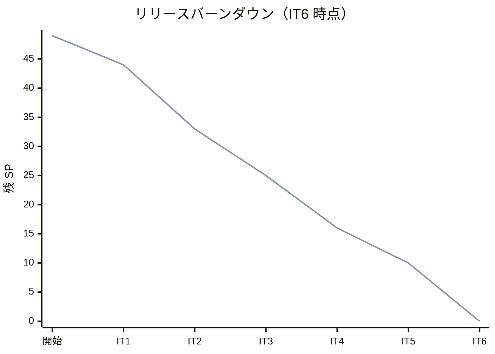
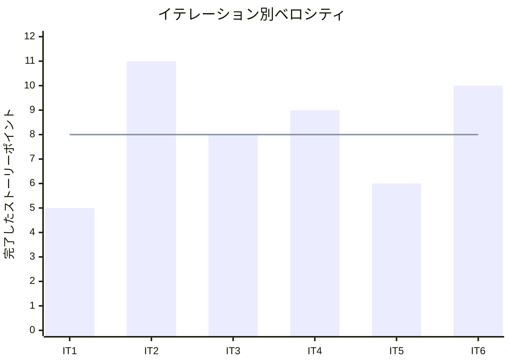

# イテレーション 6 完了報告書

## プロジェクト概要

| 項目 | 内容 |
|------|------|
| イテレーション | IT6 |
| 計画期間 | 2026-06-01 から 2026-06-12 まで |
| 実績記録日 | 2026-03-26 |
| ゴール | 届け先再利用と届け日変更を成立させ、 `Release 1.2` の体験改善機能を完了する |
| 要員 | 2 名想定 |

## 指標

### ベロシティ

| 項目 | 値 |
|------|-----|
| 計画 SP | 10 |
| 実績 SP | 10 |
| 達成率 | 100% |

### リリースバーンダウン

### ベロシティ推移

## テスト結果

| メトリクス | Backend | Frontend |
|-----------|---------|----------|
| テストファイル | 8 / 8 通過 | 4 / 4 通過 |
| テスト数 | 35 / 35 通過 | 39 / 39 通過 |
| カバレッジ | 未取得 | 未取得 |
| Typecheck | 通過 | 通過 |

`2026-03-26` 時点で `npm run test:backend`、 `npm run test:frontend`、 `npm run typecheck:backend`、 `npm run typecheck:frontend` を実行し、 Backend 35 件、 Frontend 39 件の通過を確認した。

### テスト増分

| メトリクス | IT5 | IT6 | 増分 |
|-----------|-----|-----|------|
| Backend テストファイル | 8 | 8 | +0 |
| Backend テスト数 | 28 | 35 | +7 |
| Frontend テストファイル | 4 | 4 | +0 |
| Frontend テスト数 | 35 | 39 | +4 |

## 実施内容と評価

| ストーリー | 結果 | 予定ポイント | ベロシティ加算ポイント |
|-----------|------|-------------|------------------------|
| US-07 過去の届け先を再利用して再注文したい | 完了 | 5 | 5 |
| US-08 条件を満たす場合に届け日を変更したい | 完了 | 5 | 5 |
| 合計 |  | 10 | 10 |

### 受け入れ基準達成状況

- [x] `US-07` の注文者照合、過去届け先一覧表示、届け先選択反映、履歴なし導線を実装した。
- [x] `US-08` の届け日入力、在庫不足 / 出荷準備済みの拒否、変更可能時の保存を実装した。
- [x] `developing-review` の指摘だった日付入力検証、照合正規化、管理画面の派生表示再取得を反映した。
- [x] `Release 1.2` の完了判定に必要な進捗更新、ふりかえり、完了報告書の準備を完了した。

### 主な実装内容

- Backend に届け先履歴取得 API と届け日変更 API を追加し、注文照合、変更可否判定、入力検証を実装した。
- Frontend に顧客向け再注文導線と、管理画面の届け日変更 UI を追加し、成功 / 失敗時の状態反映を整えた。
- レビュー指摘を受けて、メールアドレス / 電話番号の正規化、不正日付の `400` 応答、在庫 / 出荷系表示の再取得を追加した。
- `IT6` 完了に合わせて、計画書、ふりかえり、完了報告書、 GitHub Project 同期対象の差分を整理した。

## 追加タスク（SP 外）

- [development_it6_review_20260326.md](../review/development_it6_review_20260326.md) に `IT6` のレビュー結果を記録し、指摘 3 件を同一イテレーションで解消した。
- `iteration_plan-6.md` と `release_plan.md` に `Release 1.2` 完了状態を反映した。
- `docs/index.md`、 `docs/development/index.md`、 `mkdocs.yml` の開発ドキュメント導線を更新した。

## フェーズ・累計進捗

| フェーズ | 計画 SP | 完了 SP | 達成率 |
|---------|---------|---------|--------|
| Phase 1 | 16 | 16 | 100% |
| Phase 2 | 23 | 23 | 100% |
| Phase 3 | 10 | 10 | 100% |
| 合計 | 49 | 49 | 100% |

詳細は [イテレーション 6 ふりかえり](./retrospective-6.md) を参照。
