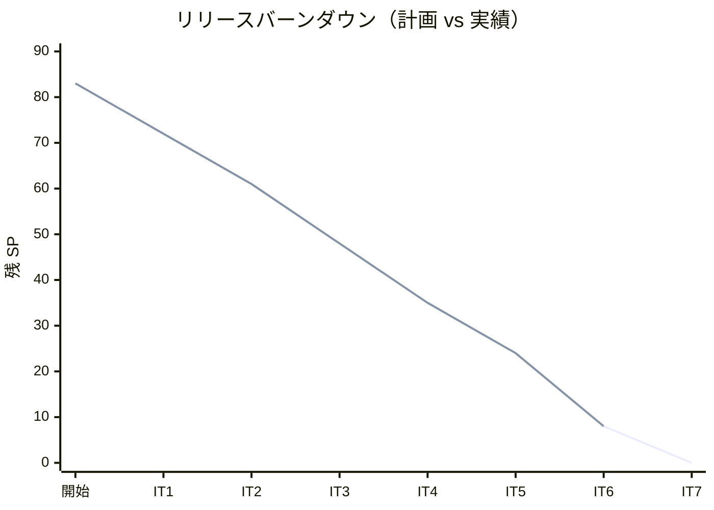
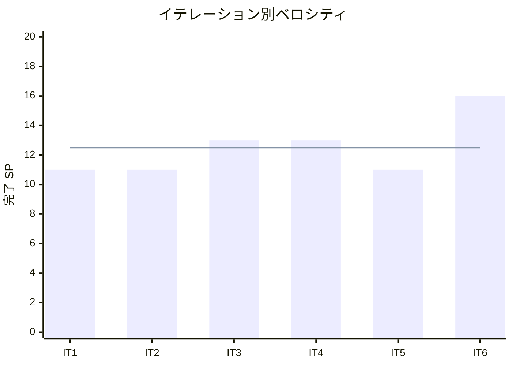

# イテレーション 6 完了報告書

## 概要

| 項目 | 内容 |
|------|------|
| **イテレーション** | 6 |
| **計画期間** | 2026-06-01 〜 2026-06-12（2 週間） |
| **実績期間** | 2026-03-23（1 日） |
| **ゴール** | 出荷処理と注文変更・キャンセル対応を実現し、Phase 2 をリリースする |
| **達成度** | 16/16 SP（100%）※テスト・リリース準備タスクは残存 |

---

## ユーザーストーリー達成状況

| ID | ストーリー | SP | 状態 |
|----|-----------|-----|------|
| US-014 | 出荷処理を実行する | 3 | **完了** |
| US-019 | 注文をキャンセルする | 5 | **完了** |
| US-008 | 届け日を変更する | 8 | **完了** |
| **合計** | | **16** | **100%** |

---

## 成功基準の達成

- [x] 出荷対象一覧（PREPARING ステータス）が表示される
- [x] 出荷処理で受注ステータスが PREPARING → SHIPPED に遷移する
- [x] 届け先情報が配送情報として確認できる
- [x] ORDERED / ACCEPTED ステータスの受注をキャンセルできる
- [x] PREPARING 以降のステータスではキャンセルできない
- [x] キャンセル時に在庫引当が解除される
- [x] 受注詳細画面から届け日を変更できる
- [x] 在庫推移を確認し変更の可否が判定される
- [x] 変更不可の場合、在庫不足の理由と代替日が表示される
- [x] PREPARING 以降のステータスでは届け日変更できない
- [ ] ヘキサゴナルアーキテクチャの実装パターンに準拠（ArchUnit テストで検証）
- [ ] テストカバレッジ 80% 以上

**達成率**: 10/12（83%）

---

## 実装内容

### バックエンド

#### ドメイン層

- `Order.ship()`: PREPARING→SHIPPED ステータス遷移
- `Order.cancel()`: ORDERED/ACCEPTED→CANCELLED ステータス遷移
- `Order.canCancel()`: キャンセル可否判定
- `Order.reschedule(newDeliveryDate)`: 届け日変更（ORDERED/ACCEPTED のみ許可）
- `Order.canReschedule()`: 届け日変更可否判定
- `OrderStatus`: PREPARING→CANCELLED 遷移を不許可に変更
- `DeliveryDate`: 変更対応のため `deliveryDate` フィールドを mutable に変更

#### アプリケーション層

- `ShipOrderUseCase`: 出荷処理ユースケース
- `CancelOrderUseCase`: 注文キャンセルユースケース（ステータスチェック + キャンセル実行）
- `DeliveryDateChangeValidator`: 在庫チェック + 代替日提案（最大 5 件、前後 14 日探索）
- `DeliveryDateChangeResult`: 在庫チェック結果の record
- `RescheduleOrderUseCase`: 届け日変更ユースケース（在庫チェック→変更 or 拒否）
- `ShipmentQueryService`: 出荷対象クエリ（PREPARING 受注 + 届け先情報）

#### インフラ層

- `ShipmentController`: GET /api/v1/admin/shipments エンドポイント
- `ShipmentTargetsResponse`: 出荷対象 API レスポンス
- `RescheduleRequest`: 届け日変更リクエスト
- `RescheduleCheckResponse`: 在庫チェックレスポンス
- `UseCaseConfig`: ShipOrderUseCase、CancelOrderUseCase、DeliveryDateChangeValidator、RescheduleOrderUseCase、ShipmentQueryService Bean 登録

#### API

| メソッド | エンドポイント | 説明 |
|---------|---------------|------|
| GET | /api/v1/admin/shipments | 出荷対象一覧 |
| PUT | /api/v1/admin/orders/{id}/ship | 出荷処理 |
| PUT | /api/v1/admin/orders/{id}/cancel | 注文キャンセル |
| PUT | /api/v1/admin/orders/{id}/reschedule | 届け日変更 |
| GET | /api/v1/admin/orders/{id}/reschedule-check | 届け日変更可否チェック |

### フロントエンド

- `ShipmentPage`（S-402）: 出荷一覧画面（届け日フィルタ、届け先情報表示、出荷確認ダイアログ、トースト通知、行グレーアウト）
- `OrderDetailPage` 拡張: キャンセルボタン（確認ダイアログ + disabled + ツールチップ）+ 届け日変更フォーム（アコーディオン展開、日付選択→自動在庫チェック、emerald/red バッジ、代替日チップ）
- `shipment-api.ts`: 出荷 API クライアント
- `order-admin-api.ts`: cancelOrder、shipOrder、rescheduleOrder、checkReschedule メソッド追加
- `App.tsx`: /admin/shipments ルーティング追加

---

## テスト結果

### テスト実行結果

| カテゴリ | ファイル数 | テスト数 | 結果 |
|---------|----------|---------|------|
| バックエンドユニットテスト | - | 全通過 | 全通過 |
| フロントエンドユニットテスト | 15 | 64 | 全通過 |
| **合計** | - | - | **全通過** |

### テスト増分（IT5 → IT6）

| カテゴリ | IT5 | IT6 | 増減 |
|---------|-----|-----|------|
| フロントエンドユニットテスト | 49 | 64 | +15 |

### IT6 新規テスト内訳

| カテゴリ | テスト数 |
|---------|---------|
| Order.ship() ドメインテスト | 3 |
| ShipOrderUseCase テスト | 2 |
| OrderStatus 遷移テスト（PREPARING→CANCELLED 不許可、ACCEPTED→CANCELLED 許可） | 2 |
| Order.cancel()/canCancel() テスト | 6 |
| CancelOrderUseCase テスト | 4 |
| Order.reschedule()/canReschedule() テスト | 9 |
| DeliveryDateChangeValidator テスト | 3 |
| RescheduleOrderUseCase テスト | 5 |
| ShipmentPage テスト | 5 |
| OrderDetailPage キャンセルテスト | 7 |
| OrderDetailPage 届け日変更テスト | 3 |
| **新規合計** | **49** |

---

## ベロシティ

| イテレーション | 計画 SP | 実績 SP | 達成率 |
|--------------|--------|--------|--------|
| IT1 | 11 | 11 | 100% |
| IT2 | 11 | 11 | 100% |
| IT3 | 13 | 13 | 100% |
| IT4 | 13 | 13 | 100% |
| IT5 | 11 | 11 | 100% |
| IT6 | 16 | 16 | 100% |
| **平均** | **12.5** | **12.5** | **100%** |

### バーンダウンチャート

### ベロシティチャート

---

## フェーズ・累計進捗

### Phase 1（MVP）進捗

| ストーリー | SP | 状態 |
|-----------|-----|------|
| US-017 システムにログインする | 5 | 完了（IT1） |
| US-018 得意先アカウント新規登録 | 3 | 完了（IT1） |
| US-003 単品を登録する | 3 | 完了（IT1） |
| US-001 商品を登録する | 3 | 完了（IT2） |
| US-002 花束構成を定義する | 5 | 完了（IT2） |
| US-004 商品一覧を表示する | 3 | 完了（IT2） |
| US-005 花束を注文する | 8 | 完了（IT3） |
| US-006 受注一覧を確認する | 3 | 完了（IT3） |
| US-007 受注を受け付ける | 2 | 完了（IT3） |
| US-009 在庫推移を表示する | 8 | 完了（IT4） |
| US-010 単品を発注する | 5 | 完了（IT4） |
| US-011 入荷を登録する | 3 | 完了（IT5） |
| **合計** | **51** | **51/51（100%）** |

### Phase 2（出荷管理・変更対応）進捗

| ストーリー | SP | 状態 |
|-----------|-----|------|
| US-012 結束対象を確認する | 3 | 完了（IT5） |
| US-013 結束完了を登録する | 5 | 完了（IT5） |
| US-014 出荷処理を実行する | 3 | **完了（IT6）** |
| US-019 注文をキャンセルする | 5 | **完了（IT6）** |
| US-008 届け日を変更する | 8 | **完了（IT6）** |
| **合計** | **24** | **24/24（100%）** |

> Phase 2 実装完了

### 全フェーズ累計

| フェーズ | SP | 完了 SP | 進捗率 |
|---------|-----|---------|--------|
| Phase 1（MVP） | 51 | 51 | 100% |
| Phase 2（出荷管理） | 24 | 24 | 100% |
| Phase 3（顧客体験） | 8 | 0 | 0% |
| **合計** | **83** | **75** | **90%** |

---

## 残存課題

| 課題 | 優先度 | 対応時期 |
|------|--------|---------|
| テスト・リリース準備タスク（4.1〜4.9、18h） | 高 | Release 2.0 前 |
| Clock 注入（Order.create、DeliveryDate.validate） | 中 | Release 2.0 前 |
| ArchUnit テスト検証 | 中 | Release 2.0 前 |
| テストカバレッジ 80% 確認 | 中 | Release 2.0 前 |
| StockStatus.DEGRADED 方針決定 | 低 | IT7 |

---

## ふりかえり

詳細は [イテレーション 6 ふりかえり](./iteration_retrospective-6.md) を参照。

---

## 更新履歴

| 日付 | 更新内容 | 更新者 |
|------|---------|--------|
| 2026-03-23 | 初版作成 | - |

---

## 関連ドキュメント

- [イテレーション 6 計画](./iteration_plan-6.md)
- [イテレーション 6 ふりかえり](./iteration_retrospective-6.md)
- [リリース計画](./release_plan.md)
- [IT6 計画レビュー](../review/iteration_plan-6_review_20260323.md)
- [IT6 UI/UX レビュー](../review/it6_uiux_review_20260323.md)
