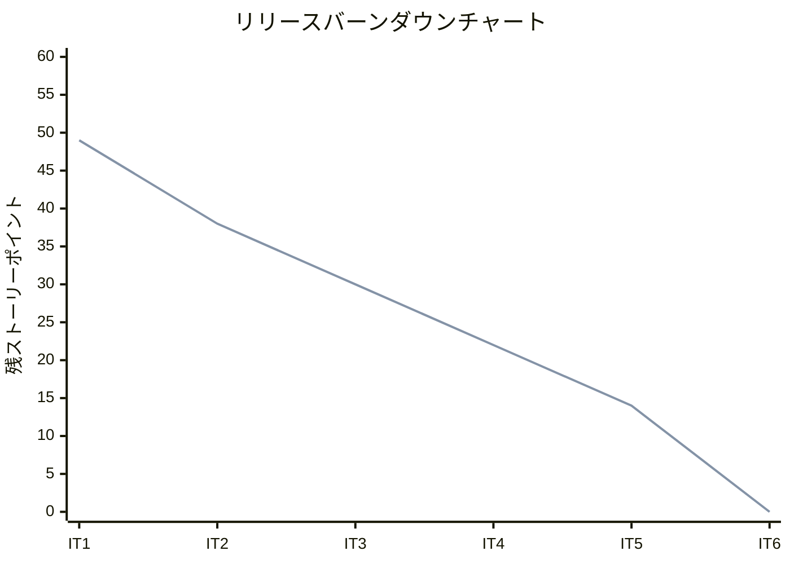
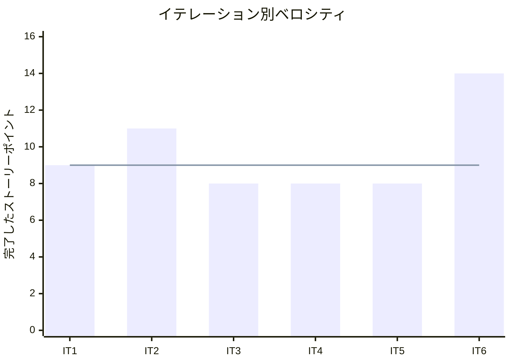

# イテレーション 6 完了報告書

## プロジェクト概要

### 日程

- イテレーション開始日: 2026-03-25
- イテレーション終了日: 2026-03-25
- 作業日数: 1 日

### 要員

| 名前 | 予定作業日数 | 実績作業日数 |
|------|------------|------------|
| Claude | 1 | 1 |

## 指標

### ベロシティ

| 項目 | 値 |
|------|-----|
| 計画 SP | 14 |
| 実績 SP | 14 |
| 達成率 | 100% |

### イテレーションバーンダウン

### ベロシティチャート

## テスト結果

| メトリクス | 結果 |
|-----------|------|
| テスト | 233 examples, 0 failures |
| カバレッジ | 95.68% |
| RuboCop | 12 offenses（既存、IT6 変更分は 0） |
| Brakeman | 未実行 |

### テスト推移

| メトリクス | IT1 | IT2 | IT3 | IT4 | IT5 | IT6 | 増分 |
|-----------|-----|-----|-----|-----|-----|-----|------|
| テスト数 | 44 | 95 | 135 | 165 | 197 | 233 | +36 |
| カバレッジ | 95.15% | 93.52% | 95.26% | 95.03% | 95.85% | 95.68% | -0.17% |

## 完了ストーリー

| ID | ストーリー | SP | 状態 |
|----|-----------|----|----- |
| S05 | 届け日を変更する | 5 | 完了 |
| S14 | 注文をキャンセルする | 3 | 完了 |
| S13 | 得意先を管理する | 3 | 完了 |
| S06 | 届け先をコピーする | 3 | 完了 |
| **合計** | | **14** | |

## 成果物

### 新規作成

| ファイル | 説明 |
|---------|------|
| `app/services/order_service.rb` | 注文サービス（届け日変更 + キャンセル、悲観ロック付き） |
| `app/controllers/customers_controller.rb` | 得意先管理コントローラ（index, edit, update） |
| `app/views/customers/index.html.erb` | 得意先一覧画面 |
| `app/views/customers/edit.html.erb` | 得意先編集画面 |
| `app/views/customers/_form.html.erb` | 得意先フォームパーシャル |
| `app/javascript/controllers/address_copy_controller.js` | 届け先コピー Stimulus controller |
| `spec/services/order_service_spec.rb` | OrderService テスト（8 examples） |
| `spec/requests/customers_spec.rb` | Customers Request テスト（6 examples） |

### 変更

| ファイル | 変更内容 |
|---------|---------|
| `app/models/order.rb` | enum :status 移行、cancel!、change_delivery_date!、cancellable? 追加 |
| `app/models/delivery_address.rb` | for_customer スコープ追加 |
| `app/controllers/orders_controller.rb` | update（届け日変更）+ cancel アクション追加 |
| `app/controllers/shop/orders_controller.rb` | 過去届け先一覧の取得追加 |
| `app/views/orders/show.html.erb` | 届け日変更フォーム + キャンセルボタン（確認ダイアログ付き） |
| `app/views/orders/index.html.erb` | enum 対応（Order.statuses.keys） |
| `app/views/shop/orders/new.html.erb` | 届け先コピーセレクト追加 |
| `app/views/layouts/application.html.erb` | ナビゲーションに「得意先」追加 |
| `config/routes.rb` | orders に update/cancel、customers リソース追加 |

## コードレビュー

3 つの XP エージェント（programmer, tester, architect）による並列レビューを実施。

### 重要度「高」の指摘と対応

| # | 指摘 | 対応 |
|---|------|------|
| 1 | `cancel!` で `cancellable?` を再利用していない（ビジネスルール重複） | `cancellable?` を使うよう修正 |
| 2 | `OrderService` の `current_date` DI が未使用（YAGNI 違反） | 未使用の `current_date` を削除 |
| 3 | Customer 一覧の N+1 クエリ（`customer.orders.count`） | `includes(:orders)` + `.size` に変更 |

### レビュー詳細

IT6 コードレビューは会話内で実施。

## ふりかえり

### Keep（続けること）

- TDD サイクル（Red → Green → Refactor）の厳守
- Service Object パターンの一貫した活用
- 3 エージェント並列レビュー（API リミット回避しつつ多角的フィードバック）
- 確認ダイアログ（data-turbo-confirm）による誤操作防止

### Problem（問題点）

- Order enum 移行時に View の `Order::STATUSES` 参照が残り既存テスト失敗
- OrderService の `current_date` DI を実装したが実際には未使用
- 在庫引当の明示的な解放処理が未実装（StockForecastService の設計で自動的に解決されるが、ドメインモデル設計との乖離あり）

### Try（次に試すこと）

- enum 移行時は全参照箇所を事前に grep で確認する
- DI は実際に使用する段階で追加する（YAGNI）
- ドメインモデル設計と実装の整合性を定期的にチェックする

## Phase 3 完了サマリー

IT6 の完了により、Phase 3（顧客体験）の全機能が実装完了。プロジェクト全体が完了。

| IT | ストーリー | SP | 内容 |
|----|-----------|----|----- |
| IT6 | S05: 届け日を変更する | 5 | 届け日変更（Order enum 移行 + OrderService） |
| IT6 | S14: 注文をキャンセルする | 3 | キャンセル処理（確認ダイアログ付き） |
| IT6 | S13: 得意先を管理する | 3 | 得意先 CRUD（管理画面 + ナビ追加） |
| IT6 | S06: 届け先をコピーする | 3 | 届け先コピー（Stimulus controller） |
| **合計** | | **14** | **顧客体験向上機能一式** |

## プロジェクト全体サマリー

| フェーズ | イテレーション | SP | 達成率 |
|---------|--------------|-----|--------|
| Phase 1（MVP） | IT1-IT3 | 28 | 100% |
| Phase 2（仕入出荷） | IT4-IT5 | 16 | 100% |
| Phase 3（顧客体験） | IT6 | 14 | 100% |
| **合計** | **IT1-IT6** | **58** | **100%** |

## 更新履歴

| 日付 | 更新内容 | 更新者 |
|------|---------|--------|
| 2026-03-25 | 初版作成 | - |
