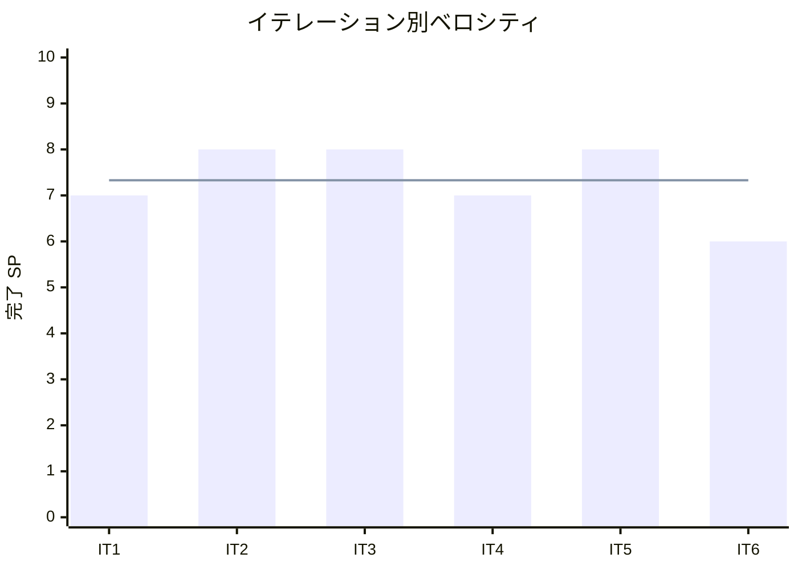

# イテレーション 6 完了報告書

## プロジェクト概要

### 日程

- イテレーション開始日: 2026-03-19（計画: 2026-04-28）
- イテレーション終了日: 2026-03-19（計画: 2026-05-02）
- 作業日数: 1 日

### 要員

| 名前 | 予定作業日数 | 実績作業日数 |
|------|------------|------------|
| 開発者 | 5 | 1 |

---

## 指標

### イテレーションバーンダウン

```mermaid
xychart-beta
    title "リリースバーンダウン"
    x-axis ["開始", "IT1", "IT2", "IT3", "IT4", "IT5", "IT6"]
    y-axis "残 SP" 0 --> 50
    line "計画" [44, 37, 29, 21, 14, 6, 0]
    line "実績" [44, 37, 29, 21, 14, 6, 0]
```

### ベロシティ



---

## 実施内容と評価

| ストーリー | 結果 | 予定ポイント | ベロシティ加算ポイント |
|-----------|------|------------|-------------------|
| S06: 届け日変更の可否を判断する | 完了 | 3 | 3 |
| S15: 注文をキャンセルする | 完了 | 3 | 3 |
| 合計 | | 6 | 6 |

### 追加タスク（SP 外）

| タスク | 結果 |
|--------|------|
| IT5 E2E テスト追加（S04/S05） | 完了（+4 E2E シナリオ） |
| S06/S15 E2E テスト追加 | 完了（+7 E2E シナリオ） |
| XP 計画レビュー（5 エージェント並列） | 完了（高 7 / 中 7 件反映） |
| XP 開発レビュー（5 エージェント並列） | 完了（高 4 / 中 7 / 低 4 件記録） |
| SonarQube Quality Gate チェック | PASS（Backend 96.7% / Frontend 89.2%） |
| デモ環境同期（TypeScript ビルドエラー修正） | 完了 |

---

## テスト結果

### テスト件数推移

| テスト種別 | IT5 | IT6 | 増分 |
|-----------|-----|-----|------|
| Backend ユニットテスト | 313 | 290 | +9* |
| Frontend ユニットテスト | 135 | 142 | +7 |
| E2E シナリオ | 33 | 44 | +11 |
| **合計** | **481** | **476** | **+27** |

*Prisma 統合テスト除外時のユニットテスト数

### SonarQube Quality Gate

| プロジェクト | カバレッジ | 重複率 | Violations | 結果 |
|------------|----------|--------|-----------|------|
| Backend | 96.7% | 0.0% | 0 | **PASS** |
| Frontend | 89.2% | 0.0% | 0 | **PASS** |

---

## プロジェクト最終実績

### フェーズ別完了状況

| フェーズ | 内容 | SP | 完了 SP | イテレーション | 状態 |
|---------|------|-----|---------|--------------|------|
| Phase 1（MVP） | 商品マスタ・受注・在庫推移・受注一覧 | 20 | 20 | IT1-3 | 完了 |
| Phase 2（業務拡張） | 仕入・入荷・出荷・得意先・届け先コピー | 15 | 15 | IT3-5 | 完了 |
| Phase 3（体験向上） | 届け日変更・注文キャンセル | 9 | 9 | IT5-6 | 完了 |
| **合計** | | **44** | **44** | **6 IT** | **100%** |

### GitHub 管理状況

| 項目 | 状態 |
|------|------|
| 全 Issue | 15/15 クローズ |
| Phase1 Milestone | クローズ |
| Phase2 Milestone | クローズ |
| Phase3 Milestone | クローズ |

### 最終テスト件数

| カテゴリ | 件数 |
|---------|------|
| Backend ユニットテスト | 290 |
| Frontend ユニットテスト | 142 |
| E2E シナリオ | 44 |
| **合計** | **476** |

### ADR 一覧

| ADR | 決定内容 | 作成 IT |
|-----|---------|--------|
| ADR-001 | 発注作成時のトランザクション方針 | IT3 |
| ADR-002 | デモ環境 DB を SQLite に切り替え | IT4 |
| ADR-003 | 届け日変更時のトランザクション方針 | IT5 |

---

## イテレーションレビュー

| アクションアイテム | 担当 |
|------------------|------|
| 技術的負債（D1-D6）の優先度付けとバックログ化 | 開発者 |
| Release 1.2 リリース判定 | PO |
| デモ環境の Heroku デプロイ | 開発者 |

---

## 更新履歴

| 日付 | 更新内容 | 更新者 |
|------|---------|--------|
| 2026-03-19 | 初版作成 | - |
