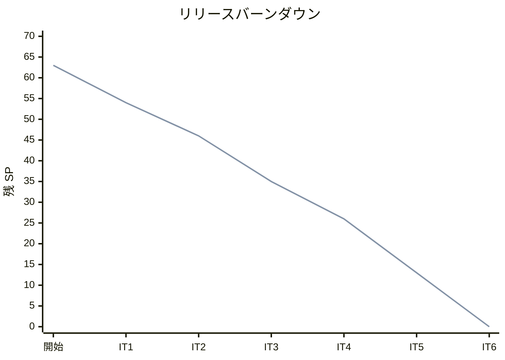
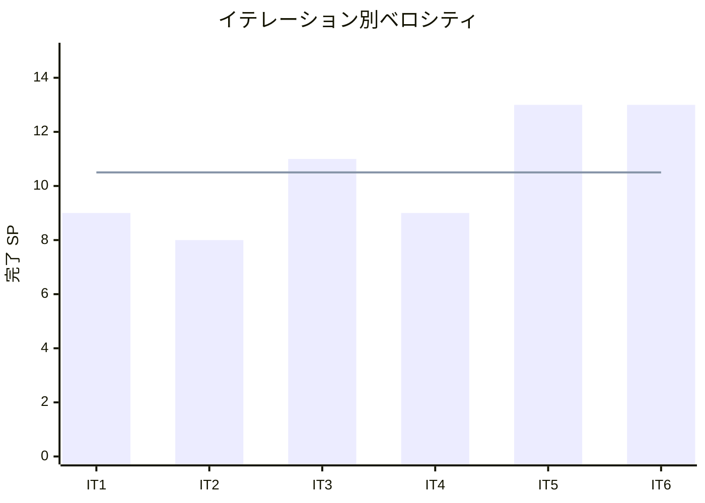

# イテレーション 6 完了報告書

## 概要

| 項目 | 内容 |
| :--- | :--- |
| **イテレーション** | 6 |
| **期間** | Week 11-12 |
| **ゴール** | 出荷管理と届け日変更を完成させ、全機能リリース（v0.2.0） |
| **達成状況** | 完了（13/13 SP、100%） |

---

## 成果

### 実装したユーザーストーリー

| ID | ストーリー | SP | 状態 |
| :--- | :--- | :--- | :--- |
| US-010 | 結束対象を確認する | 3 | 完了 |
| US-011 | 出荷処理を行い通知する | 5 | 完了 |
| US-013 | 届け日を変更する | 5 | 完了 |
| **合計** | | **13** | |

### 技術成果

| カテゴリ | 内容 |
| :--- | :--- |
| **結束対象確認（US-010）** | BundlingSummary / BundlingTarget / BundlingItem データ構造、ShippingService.get_bundling_summary()（花材別必要数量の集計）、結束一覧画面 |
| **出荷処理（US-011）** | Shipment 集約ルート、ShipmentRepository（ABC + Django 実装）、ShippingService.ship_order()（CONFIRMED→PREPARING→SHIPPED 遷移 + 出荷記録作成 + ログ通知）、出荷管理画面 |
| **届け日変更（US-013）** | Order.change_delivery_date()（変更期限 = 届け日 3 日前）、OrderService.change_delivery_date()、届け日変更画面（バリデーション付き） |
| **OrderStatus 拡張** | PREPARING（出荷準備中）/ SHIPPED（出荷済み）追加、ORM choices 同期、マイグレーション作成 |
| **レビュー対応** | H-1〜H-7 高優先度指摘全件修正（ORM/ドメイン不整合、timezone.now、@transaction.atomic、テスト追加等） |

### 新規コンポーネント

| コンポーネント | ファイル |
| :--- | :--- |
| Shipment 集約 | `apps/shipping/domain/entities.py` |
| BundlingSummary / BundlingTarget / BundlingItem | `apps/shipping/domain/entities.py` |
| ShipmentRepository | `apps/shipping/domain/interfaces.py` |
| DjangoShipmentRepository | `apps/shipping/repositories.py` |
| ShippingService | `apps/shipping/services.py` |
| Shipment ORM モデル | `apps/shipping/models.py` |
| PurchaseOrder.reconstruct() | `apps/purchasing/domain/entities.py` |

### 新規画面

| 画面 ID | 画面名 | URL | 種別 |
| :--- | :--- | :--- | :--- |
| A-12 | 結束一覧 | `/staff/shipping/bundling/` | スタッフ向け |
| A-13 | 出荷管理 | `/staff/shipping/shipments/` | スタッフ向け |
| C-07 | 届け日変更 | `/shop/orders/<番号>/change-delivery-date/` | 得意先向け |

---

## 品質メトリクス

| 指標 | IT5 末 | IT6 末 | 変化 |
| :--- | :--- | :--- | :--- |
| テスト数 | 261 | 308 | +47 |
| テストファイル数 | 17 | 19 | +2 |
| カバレッジ | 96% | 96% | 維持 |
| Ruff エラー | 0 | 0 | 維持 |
| 新規テスト内訳 | | | |
| — ドメインテスト（shipping） | | +7 | Shipment, BundlingSummary, BundlingTarget, BundlingItem |
| — サービステスト（shipping） | | +11 | get_bundling_summary(5), ship_order(4), list_shippable_orders(1), エラーケース追加 |
| — View 統合テスト（shipping） | | +5 | 結束一覧(3) + 出荷管理(2) |
| — ドメインテスト（orders） | | +10 | OrderStatus 拡張（PREPARING, SHIPPED, 遷移ガード） |
| — サービステスト（orders） | | +7 | change_delivery_date, 変更期限ギリギリ/超過テスト |
| — View 統合テスト（orders） | | +4 | 届け日変更画面（表示、成功、期限超過エラー、セッション制御） |
| — 境界値テスト（purchasing） | | +3 | 品質期限アラート閾値（残り 0/2/3 日） |

### テストピラミッド（IT6 末）

```
         /  4  \   View 統合テスト（在庫推移）
        / 5 + 4 \  View 統合テスト（キャンセル + 既存注文）
       /   12    \  View 統合テスト（受注管理 + 注文履歴 + 届け先選択）
      / 12 + 15   \  View 統合テスト（発注 + 入荷 + アラート + 結束 + 出荷）
     /  36 + 6     \  サービステスト（Order + Inventory + Purchasing + Shipping）
    /   17 + 10     \  Repository 統合テスト（全アプリ）
   / 132 + 16 + 2    \  ドメインユニットテスト（商品 + 注文 + 在庫 + 仕入 + 出荷）
   /    2 + 35        \  スモーク + その他
   ──────────────────────
        308 テスト
```

### テスト累計推移

| イテレーション | テスト数 | 増分 | カバレッジ |
| :--- | :--- | :--- | :--- |
| IT1 | 67 | +67 | 99% |
| IT2 | 130 | +63 | 99% |
| IT3 | 195 | +65 | 99% |
| IT4 | 215 | +20 | 98% |
| IT5 | 261 | +46 | 96% |
| IT6 | 308 | +47 | 96% |

---

## 受入条件の達成状況

### US-010: 結束対象を確認する

- [x] 出荷日を指定して結束対象一覧を表示できる
- [x] 花材別の必要総数量が集計・表示される
- [x] 注文別の結束リスト（届け先氏名・商品名・花材内訳）が表示される
- [x] 異なる届け日の注文やキャンセル済み注文は含まれない

### US-011: 出荷処理を行い通知する

- [x] 確定済み注文を出荷処理できる
- [x] 注文ステータスが CONFIRMED → PREPARING → SHIPPED に遷移する
- [x] 出荷記録（Shipment）が作成される
- [x] 出荷通知がログ出力される（SES 連携はスタブ）
- [x] 出荷済み・キャンセル済み・保留中の注文は出荷できない（エラー）

### US-013: 届け日を変更する

- [x] 届け日変更画面で新しい届け日を入力できる
- [x] 変更期限内（届け日 3 日前まで）であれば変更が成功する
- [x] 変更期限超過時にエラーメッセージが表示される
- [x] キャンセル済み・出荷準備以降の注文は変更できない

---

## 追加タスク（SP 外）

| タスク | 内容 |
| :--- | :--- |
| shipping Django アプリ作成 | DDD レイヤー構成（domain → models → repositories → services → views）で新規作成 |
| OrderStatus ORM choices 同期 | preparing / shipped を Django choices に追加（H-1） |
| PurchaseOrder.reconstruct() | DB 復元時のバリデーションスキップパターン追加（H-2） |
| timezone.now() 修正 | datetime.now() → django.utils.timezone.now()（H-3） |
| @transaction.atomic 追加 | receive_arrival() のトランザクション保証（H-4） |
| テスト名/内容矛盾修正 | test_変更期限超過でエラー の修正 + 真のエラーケース追加（H-5） |
| 境界値テスト追加 | 品質期限アラート残り 0/2/3 日テスト（H-6）、出荷エラーケース 3 件（H-7） |
| DB マイグレーション | shipping_shipment テーブル作成、orders_order の status choices 更新 |

---

## ベロシティ分析

### 累積実績

| イテレーション | 計画 SP | 実績 SP | 達成率 | 累積完了 SP | 残 SP |
| :--- | :--- | :--- | :--- | :--- | :--- |
| IT1 | 9 | 9 | 100% | 9 | 54 |
| IT2 | 8 | 8 | 100% | 17 | 46 |
| IT3 | 11 | 11 | 100% | 28 | 35 |
| IT4 | 9 | 9 | 100% | 37 | 26 |
| IT5 | 13 | 13 | 100% | 50 | 13 |
| IT6 | 13 | 13 | 100% | 63 | 0 |

### ベロシティ推移

| 指標 | 値 |
| :--- | :--- |
| IT1 | 9 SP |
| IT2 | 8 SP |
| IT3 | 11 SP |
| IT4 | 9 SP |
| IT5 | 13 SP |
| IT6 | 13 SP |
| 平均 | 10.5 SP |
| 標準偏差 | 2.1 SP |

### バーンダウンチャート



### ベロシティチャート



### プロジェクト完了

- **全 63 SP 完了**: 計画通り 6 イテレーションで全ストーリーを消化
- **達成率 100%**: 全 6 イテレーションで 100% 達成を維持
- **ベロシティ上昇トレンド**: Phase 1 平均 9.25SP → Phase 2 平均 13SP（+40%）
- **バーンダウン**: 計画線と実績線が完全一致（理想的なバーンダウン）

---

## フェーズ進捗

### Phase 2（仕入・出荷管理）— 完了

| ID | ストーリー | SP | 完了 IT |
| :--- | :--- | :--- | :--- |
| US-008 | 仕入先に発注する | 5 | IT5 |
| US-009 | 入荷を受け入れる | 5 | IT5 |
| US-012 | 品質維持期限アラートを確認する | 3 | IT5 |
| US-010 | 結束対象を確認する | 3 | IT6 |
| US-011 | 出荷処理を行い通知する | 5 | IT6 |
| **合計** | | **21** | |

### Phase 3（顧客管理拡充）— 完了（Phase 2 に吸収）

| ID | ストーリー | SP | 完了 IT |
| :--- | :--- | :--- | :--- |
| US-013 | 届け日を変更する | 5 | IT6 |
| **合計** | | **5** | |

### 累計進捗

| フェーズ | SP | 完了 SP | 残 SP | 状態 |
| :--- | :--- | :--- | :--- | :--- |
| Phase 1（MVP） | 37 | 37 | 0 | **完了** |
| Phase 2（仕入・出荷） | 21 | 21 | 0 | **完了** |
| Phase 3（顧客管理） | 5 | 5 | 0 | **完了** |
| **合計** | **63** | **63** | **0** | **全完了** |

---

## ふりかえり

詳細は [イテレーション 6 ふりかえり](./retrospective-6.md) を参照。

### 主要ポイント

- **Keep**: DDD パターン再利用の定着、2IT 連続 13SP 達成、レビュー指摘全件対応
- **Problem**: SonarQube 5IT 連続持ち越し、ORM/ドメイン不整合の構造的リスク、コミット粒度
- **Try**: SonarQube CI 組み込み、ORM/Enum 同期チェック、timezone.now() リントルール

---

## 更新履歴

| 日付 | 更新内容 |
| :--- | :--- |
| 2026-03-25 | 初版作成 |
