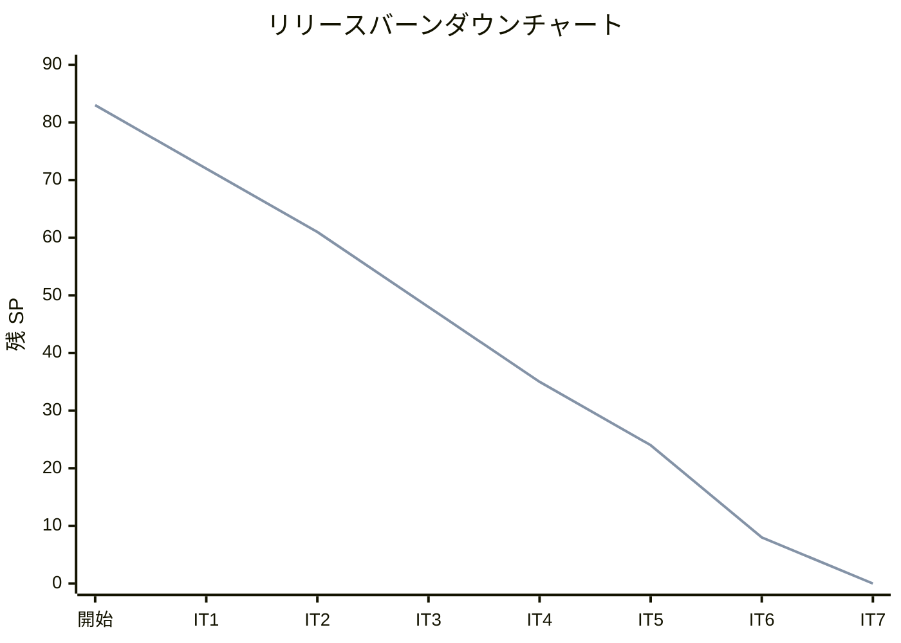
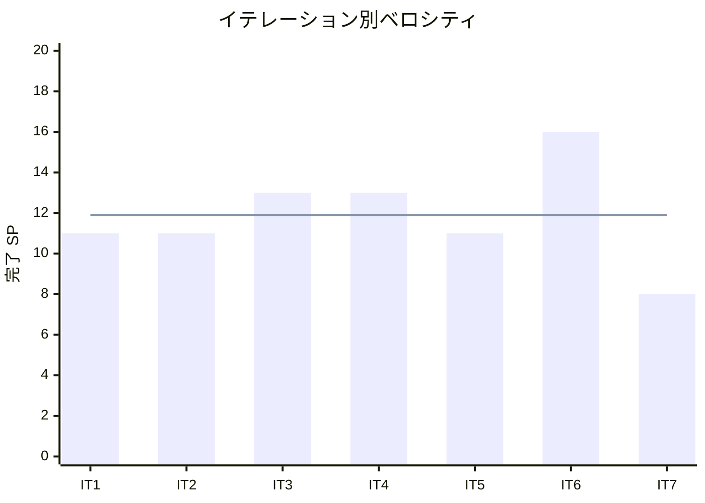

# イテレーション 7 完了報告書

## プロジェクト概要

| 項目 | 内容 |
|------|------|
| **イテレーション** | 7（最終イテレーション） |
| **計画期間** | 2026-06-15 〜 2026-06-26（2 週間） |
| **実績期間** | 2026-03-23（1 日） |
| **ゴール** | 顧客体験向上機能を完成し、Phase 3 をリリースする |

### 要員

| 名前 | 予定作業日数 | 実績作業日数 |
|------|------------|------------|
| AI アシスタント | 10 | 1 |

---

## 指標

### ベロシティ

| 項目 | 値 |
|------|-----|
| 計画 SP | 8 |
| 実績 SP | 8 |
| 達成率 | 100% |

### 成功基準達成状況

| # | 基準 | 達成 |
|---|------|------|
| 1 | 注文画面の届け先入力で「過去の届け先から選択」が選べる | ✅ |
| 2 | 過去の届け先が一覧表示される | ✅ |
| 3 | 選択すると届け先情報が注文画面にコピーされる | ✅ |
| 4 | コピー後に情報を編集できる | ✅ |
| 5 | 得意先一覧から得意先を検索・選択できる | ✅ |
| 6 | 得意先の基本情報が表示される | ✅ |
| 7 | 得意先の過去の注文履歴が表示される | ✅ |
| 8 | ヘキサゴナルアーキテクチャ準拠（ArchUnit） | ❌ 未実施 |
| 9 | テストカバレッジ 80% 以上 | ✅（88.5%） |
| 10 | 全フェーズ回帰テスト完了 | ❌ 未実施 |

**達成率**: 8/10（80%）

---

## 実装内容

### ストーリー完了状況

| ストーリー | 結果 | 予定 SP | 実績 SP |
|-----------|------|--------|--------|
| US-015 届け先をコピーする | 完了 | 5 | 5 |
| US-016 得意先情報を確認する | 完了 | 3 | 3 |
| **合計** | | **8** | **8** |

### バックエンド

- **GetDeliveryDestinationsUseCase**: 顧客 ID で過去の届け先一覧を取得
- **CustomerQueryPort + JpaCustomerQueryAdapter**: 管理者向け検索クエリ専用ポート（findAll / searchByName 部分一致検索）
- **GetCustomerDetailUseCase**: 得意先基本情報 + 注文履歴の取得（application 層内でレスポンス組み立て完結）
- **CustomerAdminController**: GET /api/v1/admin/customers, GET /api/v1/admin/customers/{id}
- **DeliveryDestinationController**: GET /api/v1/customers/me/delivery-destinations
- **DashboardQueryService**: 在庫アラート（品目別現在庫 vs 発注単位）+ 出荷サマリ（結束待ち/出荷待ち）を追加
- **DashboardAdminController**: `/api/v1/admin/dashboard/summary` に責務分離（OrderAdminController から移設）

### フロントエンド

- **OrderFormPage 拡張**: 届け先選択モード（「過去の届け先から選択」ラジオ + 一覧テーブル + フォーム自動入力 + 0 件時非表示）
- **AdminCustomersPage（S-601）**: 得意先一覧画面（名前部分一致検索 + テーブル + 空状態表示）
- **AdminCustomerDetailPage（S-602）**: 得意先詳細画面（基本情報 + 注文履歴テーブル + 空状態表示）
- **DashboardPage（S-100）**: S-100 準拠 3 カード構成（本日の受注 / 在庫アラート / 本日の出荷）+ ローディング/エラー状態 + ロール制御改善
- **dashboard-api.ts**: ダッシュボード専用 API クライアント（order-admin-api から分離）

---

## 追加対応（SP 外）

| # | タスク | 状態 |
|---|--------|------|
| 4.1 | 得意先シードデータ追加（customer2@example.com）+ DevDataInitializer DRY リファクタリング | ✅ |
| 4.2 | ダッシュボード S-100 マルチパースペクティブレビュー + 責務分離 + API パス修正 + テスト追加 | ✅ |
| 4.3 | ダッシュボード S-100 3 カード構成実装（在庫アラート・出荷サマリ） | ✅ |

---

## テスト結果

### テスト実行結果

| カテゴリ | ファイル数 | テスト数 | 結果 |
|---------|----------|---------|------|
| バックエンドユニットテスト | 62 | 361 | 全通過 |
| フロントエンドユニットテスト | 18 | 78 | 全通過 |
| **合計** | **80** | **439** | **全通過** |

### カバレッジ

| メトリクス | 値 |
|-----------|-----|
| 行カバレッジ | 88.5% |
| 命令カバレッジ | 84.1% |
| 分岐カバレッジ | 89.1% |
| メソッドカバレッジ | 97.7% |

### テスト増分（IT6 → IT7）

| カテゴリ | IT6 | IT7 | 増減 |
|---------|-----|-----|------|
| フロントエンドユニットテスト | 64 | 78 | +14 |

### IT7 新規テスト内訳

| カテゴリ | テスト数 |
|---------|---------|
| DashboardQueryServiceTest（受注サマリ/在庫アラート/出荷サマリ） | 9 |
| AdminCustomersPage.test.tsx | 3 |
| AdminCustomerDetailPage.test.tsx | 3 |
| OrderFormPage.test.tsx 届け先選択テスト | 8 |
| **新規合計** | **23** |

---

## ベロシティ

| イテレーション | 計画 SP | 実績 SP | 達成率 |
|--------------|--------|--------|--------|
| IT1 | 11 | 11 | 100% |
| IT2 | 11 | 11 | 100% |
| IT3 | 13 | 13 | 100% |
| IT4 | 13 | 13 | 100% |
| IT5 | 11 | 11 | 100% |
| IT6 | 16 | 16 | 100% |
| **IT7** | **8** | **8** | **100%** |
| **累計** | **83** | **83** | **100%** |

**平均ベロシティ**: 11.9 SP/イテレーション

### バーンダウンチャート

### ベロシティチャート

---

## フェーズ・累計進捗

### Phase 3（顧客体験向上）進捗

| ストーリー | SP | 状態 |
|-----------|-----|------|
| US-015 届け先をコピーする | 5 | **完了（IT7）** |
| US-016 得意先情報を確認する | 3 | **完了（IT7）** |
| **合計** | **8** | **8/8（100%）** |

> Phase 3 実装完了

### 全フェーズ累計

| フェーズ | SP | 完了 SP | 進捗率 |
|---------|-----|---------|--------|
| Phase 1（MVP） | 51 | 51 | 100% |
| Phase 2（出荷管理） | 24 | 24 | 100% |
| Phase 3（顧客体験） | 8 | 8 | 100% |
| **合計** | **83** | **83** | **100%** |

---

## 残存課題

| 課題 | 優先度 | 対応時期 |
|------|--------|---------|
| 統合テスト（認可テスト含む）タスク 3.1-3.2 | 高 | バッファイテレーション |
| 全フェーズ回帰テスト タスク 3.5 | 高 | バッファイテレーション |
| E2E テスト タスク 3.4 | 中 | バッファイテレーション |
| ArchUnit テスト検証 タスク 3.7 | 中 | バッファイテレーション |
| Clock 注入（Order.create + DeliveryDate.validate）タスク 3.6 | 中 | バッファイテレーション |
| Release 3.0 リリース準備 タスク 3.8 | 高 | バッファイテレーション |

---

## ふりかえり

詳細は [イテレーション 7 ふりかえり](./iteration_retrospective-7.md) を参照。

---

## 更新履歴

| 日付 | 更新内容 |
|------|---------|
| 2026-03-23 | 初版作成 |
