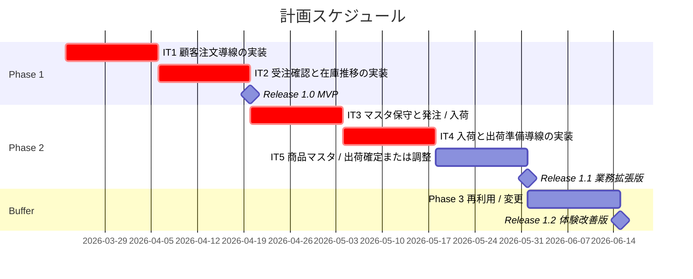
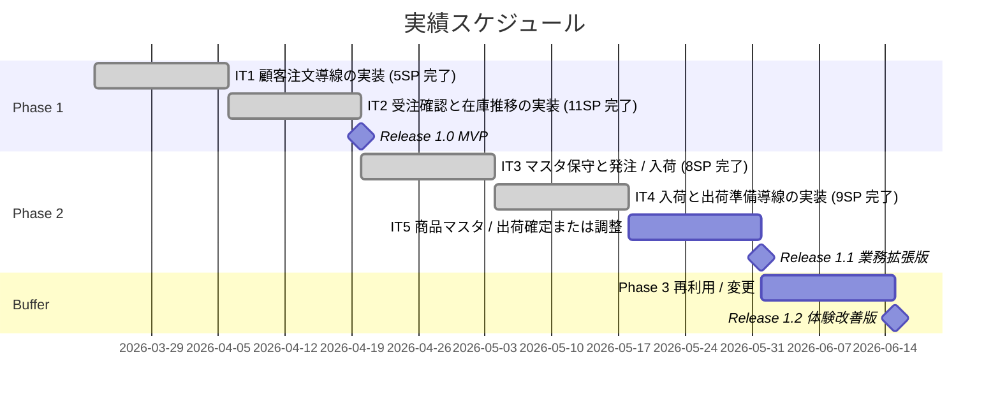
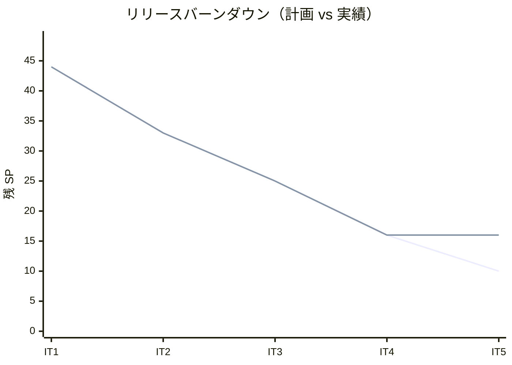

# リリース計画 - フラワーショップ「フレール・メモワール」

## 概要

本ドキュメントは、フラワーショップ「フレール・メモワール」 WEB ショップシステムの初回リリース計画を定義します。分析、要件、設計で整理した `US-01` から `US-10` を基に、MVP から業務拡張までを段階的に提供します。

### プロジェクト情報

| 項目 | 内容 |
|------|------|
| **プロジェクト名** | フラワーショップ「フレール・メモワール」 WEB ショップシステム |
| **目的** | 受注から出荷までの業務を効率化し、在庫推移の可視化とリピーターの再注文体験を実現する |
| **対象ユーザー** | 得意先、受注スタッフ、仕入スタッフ、フローリスト |
| **開発チーム** | 2 名想定（フルスタック 1、アプリ / 運用兼務 1） |

## 満足条件

### スコープ

初回計画では、顧客注文と在庫確認を先に提供する MVP を最優先とし、その後に業務運用で必要なマスタ保守、発注、入荷、出荷を追加します。届け先再利用と届け日変更は Phase 3 とし、MVP の立ち上がりと業務基盤の安定を優先します。

| フェーズ | 内容 | ユースケース数 |
|---------|------|---------------|
| Phase 1 | 顧客注文、受注確認、在庫推移確認による MVP リリース | 3 UC |
| Phase 2 | 商品 / 花材マスタ保守、発注、入荷、出荷の業務機能拡張 | 7 UC |
| Phase 3 | リピーター向け届け先再利用、届け日変更 | 2 UC |
| **合計** | | **12 UC** |

### スケジュール

- **開発期間**: 2026-03-23 から 2026-05-29 までの 10 週間
- **イテレーション**: 2 週間 × 4 イテレーション + リリースバッファ 2 週間
- **リリース**: `Release 1.0 MVP` → `Release 1.1 業務拡張版` → `Release 1.2 体験改善版`

### リソース

- **開発者**: 2 名
- **想定稼働時間**: 1 人あたり 週 25-30 時間

## ユーザーストーリー一覧とストーリーポイント

### 優先順位マトリックス

4 軸評価で優先順位を決定します。

1. **金銭価値（BV）**: ビジネス価値
2. **コスト（C）**: 開発コスト
3. **知識習得（KA）**: 技術的学習価値
4. **リスク軽減（RR）**: リスク軽減効果

### Phase 1: MVP 立ち上げ（イテレーション 1-2）

| ID | ユーザーストーリー | SP | BV | C | KA | RR | 優先度 |
|----|-------------------|----|----|---|----|----|--------|
| US-01 | 商品を選んで注文内容を入力したい | 5 | 高 | 中 | 中 | 高 | 必須 |
| US-02 | 注文内容を確認して確定したい | 3 | 高 | 低 | 低 | 高 | 必須 |
| US-03 | 受注一覧と詳細を確認したい | 3 | 高 | 低 | 低 | 中 | 必須 |
| US-04 | 日別の在庫推移を確認したい | 5 | 高 | 中 | 中 | 高 | 必須 |
| **合計** | | **16** | | | | | |

### Phase 2: 業務拡張版（イテレーション 3-4）

| ID | ユーザーストーリー | SP | BV | C | KA | RR | 優先度 |
|----|-------------------|----|----|---|----|----|--------|
| US-00 | 花束商品と花束構成を管理したい | 3 | 中 | 中 | 低 | 中 | 必須 |
| US-00B | 花材と仕入条件を管理したい | 3 | 中 | 中 | 低 | 高 | 必須 |
| US-05 | 仕入先別に発注を確定したい | 5 | 高 | 中 | 中 | 高 | 必須 |
| US-06 | 入荷実績を登録して在庫へ反映したい | 3 | 高 | 低 | 低 | 高 | 必須 |
| US-09 | 出荷対象と必要花材を確認したい | 3 | 高 | 低 | 低 | 中 | 必須 |
| US-09B | 花束の結束完了を登録したい | 3 | 高 | 低 | 中 | 高 | 必須 |
| US-10 | 出荷実績を確定したい | 3 | 高 | 低 | 低 | 高 | 必須 |
| **合計** | | **23** | | | | | |

### Phase 3: 体験改善版（バッファまたは次リリース）

| ID | ユーザーストーリー | SP | BV | C | KA | RR | 優先度 |
|----|-------------------|----|----|---|----|----|--------|
| US-07 | 過去の届け先を再利用して再注文したい | 5 | 高 | 中 | 中 | 中 | 中 |
| US-08 | 条件を満たす場合に届け日を変更したい | 5 | 中 | 中 | 中 | 高 | 中 |
| **合計** | | **10** | | | | | |

### 全体サマリー

| フェーズ | ストーリーポイント | イテレーション |
|---------|-------------------|---------------|
| Phase 1 | 16 SP | IT1-IT2 |
| Phase 2 | 23 SP | IT3-IT4 |
| Phase 3 | 10 SP | バッファまたは次リリース |
| **合計** | **49 SP** | **4 イテレーション + バッファ** |

## ベロシティ見積もり

### 初期ベロシティ推定

| 項目 | 値 |
|------|-----|
| **イテレーション期間** | 2 週間 |
| **チーム規模** | 2 名 |
| **想定ベロシティ** | 10-12 SP / イテレーション |
| **バッファ係数** | 0.7（30% フィーチャバッファ） |
| **実効ベロシティ** | 7-8 SP / イテレーション |

### ベロシティ検証計画

- IT1 から IT3 の実績で初期ベロシティの妥当性を確認する
- 3 イテレーション終了後に平均ベロシティを再計算する
- 計画値との差が 20% を超えた場合は、Phase 3 のスコープを次リリースへ送る

### ベロシティ再計画（IT3 実績反映）

| 項目 | 値 |
|------|-----|
| IT1-IT3 実績 | 5, 11, 8 |
| 平均ベロシティ | 8 SP / イテレーション |
| 再計画方針 | IT4 は `US-06`, `US-09`, `US-09B` を優先し、 `US-00` と `US-10` は次の調整枠へ送る |

## 段階的リリース戦略

### リリーススケジュール

#### 計画スケジュール

#### 実績スケジュール

### リリース内容

#### Release 1.0（Phase 1 完了）: MVP

**目標**: 顧客が WEB から注文でき、スタッフが受注確認と在庫推移確認を開始できる状態を作る。

**含まれる機能**:

- 顧客注文導線
- 注文確認と完了
- 受注一覧 / 詳細
- 在庫推移確認

**リリース条件**:

- [ ] 全ユニットテストがパス
- [ ] 主要注文導線の E2E がパス
- [ ] 基本監視と障害案内導線が確認済み

#### Release 1.1（Phase 2 完了）: 業務拡張版

**目標**: 商品 / 花材マスタ保守、発注、入荷、出荷までの業務フローを一通り運用できる状態を作る。

**含まれる機能**:

- 商品 / 花材マスタ保守
- 発注と入荷登録
- 出荷対象確認、結束完了登録、出荷確定

**リリース条件**:

- [ ] 全テストがパス
- [ ] 出荷 / 発注 / 入荷の主要統合テストがパス
- [ ] 監査ログとロールバック手順が確認済み

#### Release 1.2（Phase 3 またはバッファ活用）: 体験改善版

**目標**: リピーターの再注文体験と届け日変更の運用性を向上させる。

**含まれる機能**:

- 届け先再利用
- 条件付き届け日変更

**リリース条件**:

- [ ] 全テストがパス
- [ ] リピーター導線の受け入れテストがパス
- [ ] 運用実績を踏まえたベロシティ再評価が反映済み

## バッファ戦略

### フィーチャバッファ

| フェーズ | 計画 SP | バッファ（30%） | 実効 SP |
|---------|---------|-----------------|---------|
| Phase 1 | 16 | 5 | 11 |
| Phase 2 | 23 | 7 | 16 |
| Phase 3 | 10 | 3 | 7 |

### スケジュールバッファ

- **予備イテレーション**: IT5 を調整バッファとして確保する
- **全体バッファ**: 20% 相当の期間を Release 1.2 側へ吸収する

### バッファ消費ルール

1. フィーチャバッファを先に消費する
2. Phase 3 のストーリーを次リリースへ送る
3. IT5 は最後の手段として使う

## イテレーション計画概要

### イテレーション 1（Week 1-2）

**ゴール**: 顧客が商品を選択し、注文入力を完了できる MVP の入口導線を成立させる。

**主なタスク**:

- [x] 注文導線のフロント実装
- [x] 基本バリデーションとエラー表示
- [x] 顧客注文導線の E2E スモーク整備

**目標 SP**: 5

詳細は `iteration_plan-1.md` を参照する。

### イテレーション 2（Week 3-4）

**ゴール**: MVP の残りである受注確認と在庫推移確認を成立させる。

**主なタスク**:

- [x] 注文確認、受注登録、完了画面
- [x] 受注一覧 / 詳細
- [x] 在庫推移表示
- [x] MVP 受け入れテスト

**目標 SP**: 11

**実績 SP**: 11

**状態**: 完了

詳細は `iteration_plan-2.md` を参照する。

### イテレーション 3（Week 5-6）

**ゴール**: 花材前提データを整備し、在庫推移から発注確定まで進められる状態を作る。

**主なタスク**:

- [x] 花材と仕入条件の一覧 / 編集 / 保存
- [x] 発注候補の表示と数量検証
- [x] 発注確定と `送信待ち / 送信済み` 状態表示
- [x] 発注導線の回帰テストと `npm run dev` 実行確認

**目標 SP**: 8

**実績 SP**: 8

**状態**: 完了

詳細は `iteration_plan-3.md` を参照する。

### イテレーション 4（Week 7-8）

**ゴール**: 入荷実績から出荷準備完了までの現場オペレーションを成立させる。

**主なタスク**:

- [x] 入荷一覧 / 入荷登録 / 在庫反映
- [x] 出荷対象一覧と必要花材表示
- [x] 結束完了登録と状態遷移
- [x] 入荷から出荷準備までの統合テスト

**目標 SP**: 9

**実績 SP**: 9

**状態**: 完了

詳細は `iteration_plan-4.md` を参照する。

### イテレーション 5（Week 9-10）

**ゴール**: 商品マスタ管理と出荷確定をつなぎ、 Phase 2 の業務フローを完了させる。

**主なタスク**:

- [ ] 商品一覧 / 編集 / 販売状態更新
- [ ] 花束構成の管理と注文画面への反映
- [ ] 出荷準備完了一覧と出荷確定
- [ ] Release 1.1 に向けた業務フロー回帰確認

**目標 SP**: 6

**状態**: 計画済み

詳細は `iteration_plan-5.md` を参照する。

## リスク管理

### 技術リスク

| リスク | 影響度 | 発生確率 | 対策 |
|--------|--------|----------|------|
| 在庫推移算出が想定より複雑 | 高 | 中 | IT2 で早期に縦切り実装し、必要なら Phase 2 で非同期化を検討する |
| 出荷状態遷移の実装ずれ | 高 | 中 | UC / US / test_strategy を先に固定し、統合テストを先行する |
| partner API 契約の確定遅延 | 中 | 中 | Release 1.1 の直前ではなく IT3 時点で最低契約を決める |

### スケジュールリスク

| リスク | 影響度 | 発生確率 | 対策 |
|--------|--------|----------|------|
| 初期ベロシティの過大評価 | 高 | 高 | IT1-IT3 の実績で再計画し、Phase 3 を可変スコープにする |
| ドキュメント先行で実装課題が後出しになる | 中 | 中 | 各イテレーション開始時に設計差分レビューを行う |

## 進捗管理

### メトリクス

| メトリクス | 目標 |
|-----------|------|
| ベロシティ | 10-12 SP / イテレーション |
| テストカバレッジ | バックエンド 85% 以上、フロント Feature 80% 以上 |
| バグ密度 | 0.5 件 / SP 以下 |
| 予定達成率 | 80% 以上 |

### 進捗状況

| イテレーション | 計画 SP | 実績 SP | 達成率 | 状態 |
|---------------|---------|---------|--------|------|
| IT1 | 5 | 5 | 100% | 完了 |
| IT2 | 11 | 11 | 100% | 完了 |
| IT3 | 8 | 8 | 100% | 完了 |
| IT4 | 9 | 9 | 100% | 完了 |
| IT5 | 6 | - | - | 計画済み |

### バーンダウンチャート

