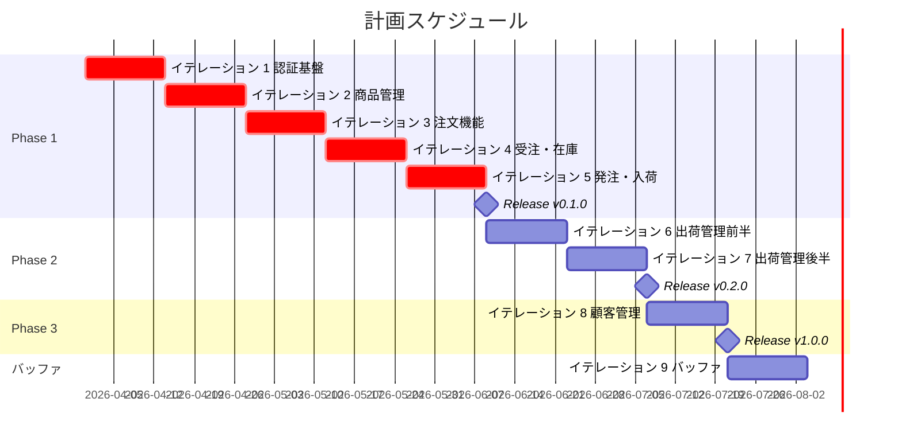
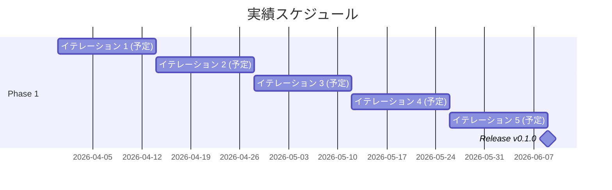
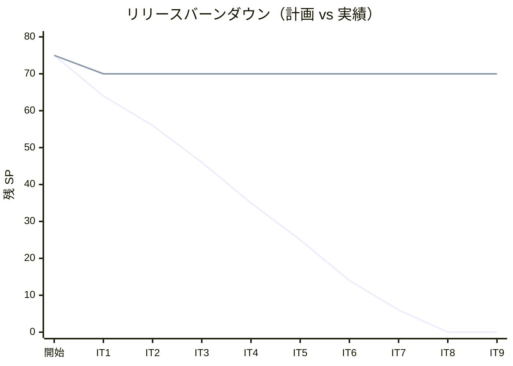

# リリース計画 - フレール・メモワール

## 概要

本ドキュメントは、フレール・メモワール WEB ショップシステムのリリース計画を定義します。

### プロジェクト情報

| 項目 | 内容 |
|------|------|
| **プロジェクト名** | フレール・メモワール |
| **目的** | 花束のオンライン注文・在庫管理・出荷管理を実現する WEB ショップシステムの構築 |
| **対象ユーザー** | 得意先（一般顧客）、経営者、受注スタッフ、仕入スタッフ、フローリスト、配送スタッフ |
| **開発チーム** | 1 名 + AI ペアプログラミング |

---

## 満足条件

### スコープ

段階的リリース戦略により、MVP から順次機能を拡張する。

| フェーズ | 内容 | ストーリー数 |
|---------|------|-------------|
| Phase 1 | 認証・商品管理・受注・在庫管理の基盤構築（MVP） | 12 ストーリー |
| Phase 2 | 出荷管理・届け日変更・キャンセル機能の追加 | 5 ストーリー |
| Phase 3 | 顧客管理・届け先コピー機能の追加 | 2 ストーリー |
| **合計** | | **19 ストーリー** |

### スケジュール

- **開発期間**: 18 週間（イテレーション 2 週間 × 9 回）
- **イテレーション**: 2 週間 × 9 イテレーション（IT1〜IT8 実装 + IT9 バッファ）
- **リリース**: 3 段階リリース（v0.1.0 → v0.2.0 → v1.0.0）

### リソース

- **開発者**: 1 名 + AI ペアプログラミング
- **想定稼働時間**: 40 時間/週

---

## 現在の進捗（2026-03-25 時点）

| 項目 | 状況 |
|------|------|
| 全体進捗 | 5 / 75 SP（6.7%） |
| 現在イテレーション | IT1（開始前の先行実装） |
| IT1 進捗 | 5 / 11 SP（US-017 完了） |
| テスト結果 | Backend 46 passed / Frontend 27 passed |
| カバレッジ | Backend LINE 77.7%（139/179）、BRANCH 69.2%（18/26） |

---

## ユーザーストーリー一覧とストーリーポイント

### 優先順位マトリックス

4 軸評価で優先順位を決定:

1. **金銭価値（BV）**: ビジネス価値
2. **コスト（C）**: 開発コスト
3. **知識習得（KA）**: 技術的学習価値
4. **リスク軽減（RR）**: リスク軽減効果

### Phase 1: MVP - 認証・商品管理・受注・在庫管理（イテレーション 1-5）

| ID | ユーザーストーリー | SP | BV | C | KA | RR | 優先度 |
|----|-------------------|----|----|---|----|----|--------|
| US-017 | システムにログインする | 5 | 高 | 中 | 高 | 高 | 必須 |
| US-018 | 得意先アカウント新規登録 | 3 | 高 | 低 | 中 | 高 | 必須 |
| US-003 | 単品を登録する | 3 | 高 | 低 | 高 | 中 | 必須 |
| US-001 | 商品を登録する | 3 | 高 | 低 | 中 | 中 | 必須 |
| US-002 | 花束構成を定義する | 3 | 高 | 低 | 中 | 中 | 必須 |
| US-004 | 商品一覧を表示する | 2 | 高 | 低 | 中 | 低 | 必須 |
| US-005 | 花束を注文する | 8 | 高 | 高 | 高 | 高 | 必須 |
| US-006 | 受注一覧を確認する | 3 | 中 | 低 | 中 | 中 | 必須 |
| US-007 | 受注を受け付ける | 2 | 中 | 低 | 低 | 中 | 必須 |
| US-009 | 在庫推移を表示する | 8 | 高 | 高 | 高 | 高 | 必須 |
| US-010 | 単品を発注する | 5 | 高 | 中 | 中 | 高 | 必須 |
| US-011 | 入荷を登録する | 5 | 高 | 中 | 中 | 中 | 必須 |
| **合計** | | **50** | | | | | |

### Phase 2: 出荷管理・受注拡張（イテレーション 6-7）

| ID | ユーザーストーリー | SP | BV | C | KA | RR | 優先度 |
|----|-------------------|----|----|---|----|----|--------|
| US-008 | 届け日を変更する | 5 | 中 | 中 | 中 | 中 | 中 |
| US-012 | 結束対象を確認する | 3 | 中 | 低 | 低 | 中 | 中 |
| US-013 | 結束完了を登録する | 5 | 中 | 中 | 中 | 中 | 中 |
| US-014 | 出荷処理を実行する | 3 | 中 | 低 | 低 | 中 | 中 |
| US-019 | 注文をキャンセルする | 3 | 中 | 低 | 低 | 中 | 中 |
| **合計** | | **19** | | | | | |

### Phase 3: 顧客管理（イテレーション 8）

| ID | ユーザーストーリー | SP | BV | C | KA | RR | 優先度 |
|----|-------------------|----|----|---|----|----|--------|
| US-015 | 届け先をコピーする | 3 | 低 | 低 | 低 | 低 | 低 |
| US-016 | 得意先情報を確認する | 3 | 低 | 低 | 低 | 低 | 低 |
| **合計** | | **6** | | | | | |

### 全体サマリー

| フェーズ | ストーリーポイント | イテレーション |
|---------|-------------------|---------------|
| Phase 1 | 50 SP | 1-5 |
| Phase 2 | 19 SP | 6-7 |
| Phase 3 | 6 SP | 8 |
| バッファ | - | 9 |
| **合計** | **75 SP** | 9 イテレーション |

---

## ベロシティ見積もり

イテレーション期間 2 週間をベースに、チーム規模とプロジェクト特性からベロシティを推定する。

### 初期ベロシティ推定

| 項目 | 値 |
|------|-----|
| **イテレーション期間** | 2 週間 |
| **チーム規模** | 1 名 + AI |
| **想定ベロシティ** | 8-11 SP/イテレーション |
| **バッファ係数** | 0.8（20% バッファ） |
| **実効ベロシティ** | 6-9 SP/イテレーション |

### ベロシティ検証計画

- IT1〜IT3 の実績ベロシティを計測し、IT4 以降の計画を調整する
- 3 イテレーション経過後にベロシティが安定しない場合はスコープを再検討する

---

## 段階的リリース戦略

### リリーススケジュール

#### 計画スケジュール

#### 実績スケジュール

### リリース内容

#### Release v0.1.0（Phase 1 完了）: MVP リリース

**目標**: 認証・商品管理・受注・在庫管理の基本機能を提供する

**含まれる機能**:

- 認証（ログイン・アカウント登録）
- 商品管理（商品登録・花束構成定義・単品登録）
- 受注管理（商品一覧・注文・受注一覧・受付）
- 在庫管理（在庫推移表示・発注・入荷登録）

**リリース条件**:

- [ ] 全ユニットテストがパス
- [ ] E2E テストがパス
- [ ] セキュリティレビュー完了

#### Release v0.2.0（Phase 2 完了）: 出荷管理リリース

**目標**: 出荷管理と受注の柔軟な変更機能を提供する

**含まれる機能**:

- 届け日変更
- 結束管理（結束対象確認・結束完了登録）
- 出荷処理
- 注文キャンセル

**リリース条件**:

- [ ] 全テストがパス
- [ ] パフォーマンステスト完了

#### Release v1.0.0（Phase 3 完了）: 全機能リリース

**目標**: 顧客管理機能を追加し、全機能を提供する

**含まれる機能**:

- 届け先コピー
- 得意先情報確認

**リリース条件**:

- [ ] 全テストがパス
- [ ] 全機能の受け入れテスト完了
- [ ] 運用マニュアル整備完了

---

## バッファ戦略

フィーチャバッファとスケジュールバッファの 2 層でリスクを吸収する。

**フィーチャバッファ**

| フェーズ | 計画 SP | バッファ（30%） | 実効 SP |
|---------|---------|-----------------|---------|
| Phase 1 | 50 | 15 | 35 |
| Phase 2 | 19 | 6 | 13 |
| Phase 3 | 6 | 2 | 4 |

**スケジュールバッファ**

- **予備イテレーション**: IT9（2 週間）をバッファイテレーションとして確保
- **全体バッファ**: 実装 8 イテレーション + バッファ 1 イテレーション（約 11%）

**バッファ消費ルール**

1. フィーチャバッファを先に消費（低優先度ストーリーを後回し）
2. スケジュールバッファは最後の手段
3. バッファ消費が 50% を超えた場合はスコープを再検討

---

## イテレーション計画概要

### イテレーション 1（Week 1-2）

**ゴール**: 認証基盤の構築

**主なタスク**:

- [x] US-017: システムにログインする
- [ ] US-018: 得意先アカウント新規登録
- [ ] US-003: 単品を登録する

**目標 SP**: 11

詳細は [iteration_plan-1.md](./iteration_plan-1.md) を参照。

### イテレーション 2（Week 3-4）

**ゴール**: 商品管理機能の構築

**主なタスク**:

- [ ] US-001: 商品を登録する
- [ ] US-002: 花束構成を定義する
- [ ] US-004: 商品一覧を表示する

**目標 SP**: 8

詳細は [iteration_plan-2.md](./iteration_plan-2.md) を参照。

### イテレーション 3（Week 5-6）

**ゴール**: 注文機能の構築

**主なタスク**:

- [ ] US-005: 花束を注文する
- [ ] US-007: 受注を受け付ける

**目標 SP**: 10

詳細は [iteration_plan-3.md](./iteration_plan-3.md) を参照。

### イテレーション 4（Week 7-8）

**ゴール**: 受注管理と在庫推移の構築

**主なタスク**:

- [ ] US-006: 受注一覧を確認する
- [ ] US-009: 在庫推移を表示する

**目標 SP**: 11

詳細は [iteration_plan-4.md](./iteration_plan-4.md) を参照。

### イテレーション 5（Week 9-10）

**ゴール**: 発注・入荷管理の構築と Phase 1 完了

**主なタスク**:

- [ ] US-010: 単品を発注する
- [ ] US-011: 入荷を登録する

**目標 SP**: 10

詳細は [iteration_plan-5.md](./iteration_plan-5.md) を参照。

### イテレーション 6（Week 11-12）

**ゴール**: 出荷管理前半（届け日変更・結束確認・キャンセル）

**主なタスク**:

- [ ] US-008: 届け日を変更する
- [ ] US-012: 結束対象を確認する
- [ ] US-019: 注文をキャンセルする

**目標 SP**: 11

詳細は [iteration_plan-6.md](./iteration_plan-6.md) を参照。

### イテレーション 7（Week 13-14）

**ゴール**: 出荷管理後半（結束完了・出荷処理）と Phase 2 完了

**主なタスク**:

- [ ] US-013: 結束完了を登録する
- [ ] US-014: 出荷処理を実行する

**目標 SP**: 8

詳細は [iteration_plan-7.md](./iteration_plan-7.md) を参照。

### イテレーション 8（Week 15-16）

**ゴール**: 顧客管理機能の構築と Phase 3 完了

**主なタスク**:

- [ ] US-015: 届け先をコピーする
- [ ] US-016: 得意先情報を確認する

**目標 SP**: 6

詳細は [iteration_plan-8.md](./iteration_plan-8.md) を参照。

### イテレーション 9（Week 17-18）

**ゴール**: バッファイテレーション（未完了タスクの消化・品質改善）

**主なタスク**:

- [ ] 未完了ストーリーの消化
- [ ] 全体テスト・品質改善
- [ ] ドキュメント整備

**目標 SP**: 0（バッファ）

詳細は [iteration_plan-9.md](./iteration_plan-9.md) を参照。

---

## リスク管理

### 技術リスク

| リスク | 影響度 | 発生確率 | 対策 |
|--------|--------|----------|------|
| 認証基盤の実装遅延 | 高 | 中 | IT1 で認証を最優先実装し、早期にリスクを検証する |
| 在庫推移計算の複雑性 | 高 | 中 | IT4 で集中的に取り組み、必要に応じてスコープを調整する |
| フロントエンド・バックエンド統合 | 中 | 中 | 各イテレーションで統合テストを実施する |

### スケジュールリスク

| リスク | 影響度 | 発生確率 | 対策 |
|--------|--------|----------|------|
| ベロシティの過大見積もり | 高 | 中 | IT3 終了後にベロシティを再計測し計画を調整する |
| 要件の追加・変更 | 中 | 高 | バッファ戦略で吸収し、スコープ調整で対応する |
| 1 名体制による属人性 | 中 | 低 | AI ペアプログラミングとドキュメント整備で軽減する |

---

## 進捗管理

### メトリクス

| メトリクス | 目標 |
|-----------|------|
| ベロシティ | 8-11 SP/イテレーション |
| テストカバレッジ | 80% 以上 |
| バグ密度 | 1.0 件/SP 以下 |
| 予定達成率 | 90% 以上 |

### 進捗状況

| イテレーション | 計画 SP | 実績 SP | 達成率 | 状態 |
|---------------|---------|---------|--------|------|
| 1 | 11 | 5 | 45% | 進行中（先行実装あり） |
| 2 | 8 | - | - | 未着手 |
| 3 | 10 | - | - | 未着手 |
| 4 | 11 | - | - | 未着手 |
| 5 | 10 | - | - | 未着手 |
| 6 | 11 | - | - | 未着手 |
| 7 | 8 | - | - | 未着手 |
| 8 | 6 | - | - | 未着手 |
| 9 | 0 | - | - | 未着手 |

### バーンダウンチャート

---

## 次のステップ

1. ~~IT1 のイテレーション計画を作成する（`iteration_plan-1.md`）~~ ✅ 完了
2. ~~認証基盤の技術検証を実施する~~ ✅ 完了
3. ~~開発環境のセットアップを完了する~~ ✅ 完了
4. GitHub Project に同期する

---

## 更新履歴

| 日付 | 更新内容 | 更新者 |
|------|---------|--------|
| 2026-03-25 | 初版作成 | AI |
| 2026-03-25 | IT1 イテレーション計画作成完了 | AI |
| 2026-03-25 | IT1 進捗更新（US-017 完了、実績 SP / テスト / カバレッジ反映） | AI |
