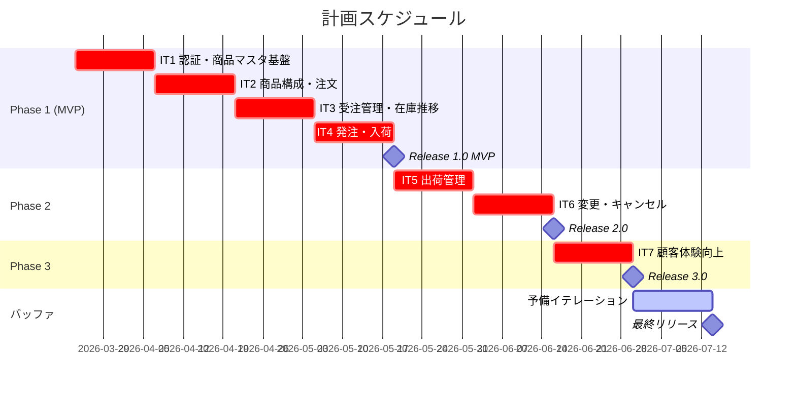
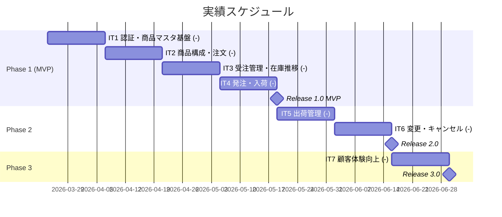
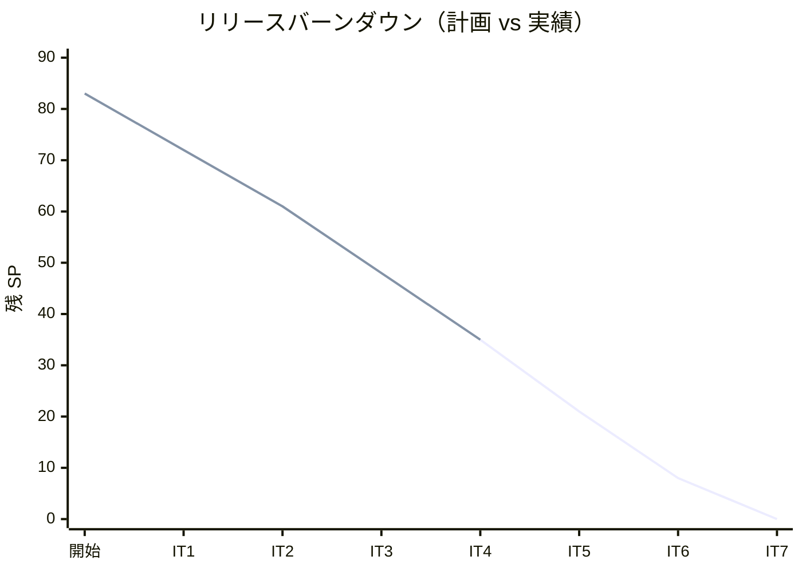

# リリース計画 - フレール・メモワール WEB ショップシステム

## 概要

本ドキュメントは、フレール・メモワール WEB ショップシステムのリリース計画を定義します。

### プロジェクト情報

| 項目 | 内容 |
|------|------|
| **プロジェクト名** | フレール・メモワール WEB ショップシステム（花束注文管理システム） |
| **目的** | 受注から出荷までの業務を効率化し、在庫推移の可視化により廃棄ロスを最小化する |
| **対象ユーザー** | 得意先（個人顧客）、受注スタッフ、仕入スタッフ、フローリスト、配送スタッフ、経営者 |
| **開発チーム** | 開発者 1 名（AI アシスタント併用） |

---

## 満足条件

### スコープ

インセプションデッキで定義したロードマップに基づき、3 フェーズに分けて段階的にリリースする。

| フェーズ | 内容 | ユーザーストーリー数 |
|---------|------|---------------------|
| Phase 1（MVP） | 認証・商品マスタ・受注・在庫推移・発注・入荷 | 12 US |
| Phase 2 | 出荷管理・届け日変更・注文キャンセル | 5 US |
| Phase 3 | 届け先コピー・顧客情報管理 | 2 US |
| **合計** | | **19 US** |

### スケジュール

- **開発期間**: 2026-03-24 ~ 2026-07-17（約 17 週間）
- **イテレーション**: 2 週間 × 7 イテレーション（6 計画 + 1 バッファ）
- **リリース**: Phase ごとの段階的リリース

### リソース

- **開発者**: 1 名（AI アシスタント併用）
- **想定稼働時間**: 40 時間/週

---

## ユーザーストーリー一覧とストーリーポイント

### 優先順位マトリックス

4 軸評価で優先順位を決定:

1. **金銭価値（BV）**: ビジネス価値
2. **コスト（C）**: 開発コスト
3. **知識習得（KA）**: 技術的学習価値
4. **リスク軽減（RR）**: リスク軽減効果

### Phase 1: MVP（イテレーション 1-4）

| ID | ユーザーストーリー | SP | BV | C | KA | RR | 優先度 |
|----|-------------------|----|----|---|----|----|--------|
| US-017 | システムにログインする | 5 | 高 | 中 | 高 | 高 | 必須 |
| US-018 | 得意先アカウント新規登録 | 3 | 高 | 低 | 中 | 高 | 必須 |
| US-003 | 単品（花材）を登録する | 3 | 高 | 低 | 高 | 中 | 必須 |
| US-001 | 商品（花束）を登録する | 3 | 高 | 低 | 中 | 中 | 必須 |
| US-002 | 花束の構成を定義する | 5 | 高 | 中 | 中 | 中 | 必須 |
| US-004 | 商品一覧を表示する | 3 | 高 | 低 | 高 | 低 | 必須 |
| US-005 | 花束を注文する | 8 | 高 | 高 | 中 | 高 | 必須 |
| US-006 | 受注一覧を確認する | 3 | 高 | 低 | 低 | 中 | 必須 |
| US-007 | 受注を受け付ける | 2 | 中 | 低 | 低 | 中 | 必須 |
| US-009 | 在庫推移を表示する | 8 | 高 | 高 | 高 | 高 | 必須 |
| US-010 | 単品を発注する | 5 | 高 | 中 | 中 | 高 | 必須 |
| US-011 | 入荷を登録する | 3 | 中 | 低 | 低 | 中 | 必須 |
| **合計** | | **51** | | | | | |

### Phase 2: 出荷管理・変更対応（イテレーション 5-6）

| ID | ユーザーストーリー | SP | BV | C | KA | RR | 優先度 |
|----|-------------------|----|----|---|----|----|--------|
| US-012 | 結束対象を確認する | 3 | 高 | 低 | 低 | 中 | 必須 |
| US-013 | 結束完了を登録する | 5 | 高 | 中 | 中 | 高 | 必須 |
| US-014 | 出荷処理を実行する | 3 | 高 | 低 | 低 | 高 | 必須 |
| US-019 | 注文をキャンセルする | 5 | 中 | 中 | 低 | 中 | 中 |
| US-008 | 届け日を変更する | 8 | 高 | 高 | 中 | 高 | 中 |
| **合計** | | **24** | | | | | |

### Phase 3: 顧客体験向上（イテレーション 7）

| ID | ユーザーストーリー | SP | BV | C | KA | RR | 優先度 |
|----|-------------------|----|----|---|----|----|--------|
| US-015 | 届け先をコピーする | 5 | 中 | 中 | 低 | 低 | 中 |
| US-016 | 得意先情報を確認する | 3 | 中 | 低 | 低 | 低 | 低 |
| **合計** | | **8** | | | | | |

### 全体サマリー

| フェーズ | ストーリーポイント | イテレーション |
|---------|-------------------|---------------|
| Phase 1（MVP） | 51 SP | 1-4 |
| Phase 2 | 24 SP | 5-6 |
| Phase 3 | 8 SP | 7 |
| **合計** | **83 SP** | **7 イテレーション** |

---

## ベロシティ見積もり

### 初期ベロシティ推定

| 項目 | 値 |
|------|-----|
| **イテレーション期間** | 2 週間 |
| **チーム規模** | 1 名 + AI アシスタント |
| **想定ベロシティ** | 12-16 SP/イテレーション |
| **バッファ係数** | 0.8（20%バッファ） |
| **実効ベロシティ** | 10-13 SP/イテレーション |
| **計画ベロシティ** | 13 SP/イテレーション |

### ベロシティ根拠

| 要因 | 影響 | 説明 |
|------|------|------|
| AI アシスタント併用 | +40% | コード生成、テスト作成、リファクタリングの加速 |
| 1 人開発 | -30% | レビュー相手不在、判断の全責任 |
| ヘキサゴナルアーキテクチャ | -10% | レイヤー数が多く、1 ストーリーあたりの作業量が増加 |
| TDD | -15% | テスト先行で品質は向上するが、速度は低下 |
| 初回イテレーション | -20% | パターン確立、CI/CD 調整で追加工数 |

### ベロシティ検証計画

- イテレーション 1 完了後に実績ベロシティを測定し、計画ベロシティを見直す
- イテレーション 2 以降は直近 2 イテレーションの平均値を計画ベロシティとして採用
- 実績が計画の 80% を下回った場合、スコープ調整を検討する

---

## 段階的リリース戦略

### リリーススケジュール

#### 計画スケジュール

#### 実績スケジュール

### リリース内容

#### Release 1.0（Phase 1 完了）: MVP - 受注・在庫基盤

**目標**: 商品登録から受注・在庫推移表示・発注・入荷まで、基本的な業務フローを実現する

**含まれる機能**:

- 認証（ログイン・新規登録）
- 商品マスタ管理（花束登録・構成定義・単品登録）
- 商品一覧表示・花束注文
- 受注一覧確認・受注受付
- 在庫推移表示
- 単品発注・入荷登録

**リリース条件**:

- [ ] 全ユニットテストがパス（カバレッジ 80% 以上）
- [ ] 統合テストがパス
- [ ] E2E テスト（主要フロー）がパス
- [ ] ArchUnit テストがパス
- [ ] セキュリティレビュー完了（認証機能）
- [ ] パフォーマンス基準を満たす（レスポンス 200ms 以下）

#### Release 2.0（Phase 2 完了）: 出荷管理・変更対応

**目標**: 結束から出荷までの後工程と、届け日変更・キャンセルの柔軟な対応を実現する

**含まれる機能**:

- 結束対象確認・結束完了登録
- 出荷処理
- 注文キャンセル
- 届け日変更

**リリース条件**:

- [ ] 全テストがパス
- [ ] 在庫推移と出荷の連動テスト完了
- [ ] 届け日変更時の在庫整合性テスト完了

#### Release 3.0（Phase 3 完了）: 顧客体験向上

**目標**: リピーターの利便性向上と顧客管理機能を実現する

**含まれる機能**:

- 届け先コピー機能
- 得意先情報確認（注文履歴含む）

**リリース条件**:

- [ ] 全テストがパス
- [ ] リピート注文フローの E2E テスト完了
- [ ] 全機能の回帰テスト完了

---

## バッファ戦略

### フィーチャバッファ

| フェーズ | 計画 SP | バッファ（30%） | 実効 SP |
|---------|---------|-----------------|---------|
| Phase 1 | 51 | 15 | 36 |
| Phase 2 | 24 | 7 | 17 |
| Phase 3 | 8 | 2 | 6 |
| **合計** | **83** | **24** | **59** |

### スケジュールバッファ

- **予備イテレーション**: 1 イテレーション（2 週間）を全体バッファとして確保
- **全体バッファ率**: 14.3%（1/7 イテレーション）
- **フェーズ間調整**: Phase 完了が早まった場合、次 Phase を前倒し開始可能

### バッファ消費ルール

1. フィーチャバッファを先に消費（低優先度ストーリーを後回し）
2. フェーズ内で消化しきれないストーリーは次フェーズの冒頭に移動
3. スケジュールバッファ（予備イテレーション）は最後の手段
4. バッファを 50% 以上消費した場合、ステークホルダーに報告

---

## イテレーション計画概要

### イテレーション 1（Week 1-2: 2026-03-24 ~ 2026-04-04）

**ゴール**: 認証基盤と商品マスタの CRUD を確立し、開発パターンを固める

**主なタスク**:

- [x] 認証基盤の実装（Spring Security + JWT）
- [x] US-017: システムにログインする（5 SP）
- [x] US-018: 得意先アカウント新規登録（3 SP）
- [x] US-003: 単品（花材）を登録する（3 SP）
- [x] 開発パターンの確立（ヘキサゴナルアーキテクチャの各レイヤー実装テンプレート）

**目標 SP**: 11

詳細は [iteration_plan-1.md](./iteration_plan-1.md) を参照。

### イテレーション 2（Week 3-4: 2026-04-07 ~ 2026-04-18）

**ゴール**: 商品管理と注文の基本フローを実現する

**主なタスク**:

- [x] US-001: 商品（花束）を登録する（3 SP）
- [x] US-002: 花束の構成を定義する（5 SP）
- [x] US-004: 商品一覧を表示する（3 SP）
- [x] フロントエンド商品管理画面

**目標 SP**: 11

詳細は [iteration_plan-2.md](./iteration_plan-2.md) を参照。

### イテレーション 3（Week 5-6: 2026-04-21 ~ 2026-05-02）

**ゴール**: 注文フローと受注管理を完成させる

**主なタスク**:

- [x] US-005: 花束を注文する（8 SP）
- [x] US-006: 受注一覧を確認する（3 SP）
- [x] US-007: 受注を受け付ける（2 SP）

**目標 SP**: 13

詳細は [iteration_plan-3.md](./iteration_plan-3.md) を参照。

### イテレーション 4（Week 7-8: 2026-05-04 ~ 2026-05-15）

**ゴール**: 在庫推移表示と発注・入荷を完成し、MVP をリリースする

**主なタスク**:

- [x] US-009: 在庫推移を表示する（8 SP）
- [x] US-010: 単品を発注する（5 SP）
- [ ] US-011: 入荷を登録する（3 SP）
- [ ] MVP リリース準備（回帰テスト、デプロイ確認）

**目標 SP**: 16

詳細は [iteration_plan-4.md](./iteration_plan-4.md) を参照。

### イテレーション 5（Week 9-10: 2026-05-18 ~ 2026-05-29）

**ゴール**: 結束から出荷までのフローを実現する

**主なタスク**:

- [ ] US-012: 結束対象を確認する（3 SP）
- [ ] US-013: 結束完了を登録する（5 SP）
- [ ] US-014: 出荷処理を実行する（3 SP）

**目標 SP**: 11

詳細は [iteration_plan-5.md](./iteration_plan-5.md) を参照。

### イテレーション 6（Week 11-12: 2026-06-01 ~ 2026-06-12）

**ゴール**: 注文変更・キャンセル対応を実現し、Phase 2 をリリースする

**主なタスク**:

- [ ] US-019: 注文をキャンセルする（5 SP）
- [ ] US-008: 届け日を変更する（8 SP）
- [ ] Phase 2 リリース準備

**目標 SP**: 13

詳細は [iteration_plan-6.md](./iteration_plan-6.md) を参照。

### イテレーション 7（Week 13-14: 2026-06-15 ~ 2026-06-26）

**ゴール**: 顧客体験向上機能を完成し、Phase 3 をリリースする

**主なタスク**:

- [ ] US-015: 届け先をコピーする（5 SP）
- [ ] US-016: 得意先情報を確認する（3 SP）
- [ ] Phase 3 リリース準備
- [ ] 全体回帰テスト

**目標 SP**: 8

詳細は [iteration_plan-7.md](./iteration_plan-7.md) を参照。

---

## リスク管理

### 技術リスク

| リスク | 影響度 | 発生確率 | 対策 |
|--------|--------|----------|------|
| 在庫推移の計算ロジックが複雑で、品質維持日数・廃棄予定の正確な算出が困難 | 高 | 中 | IT4 で集中的に取り組む。ドメインモデルのユニットテストを充実させ、エッジケースを網羅する |
| Spring Security + JWT の認証基盤構築に想定以上の工数がかかる | 中 | 中 | IT1 で最優先に取り組み、早期にリスクを解消する。既存の Spring Security スターターを活用する |
| Testcontainers を用いた統合テストの実行速度が遅く、CI パイプラインがボトルネックになる | 中 | 中 | テストの並列実行を設定する。統合テストの対象を絞り、ドメイン層のユニットテストを厚くする |
| フロントエンドとバックエンドの API 連携で型の不整合が発生する | 中 | 低 | OpenAPI 仕様を先行定義し、コード生成で型安全性を確保する |
| ヘキサゴナルアーキテクチャの各レイヤー間の責務分離が曖昧になる | 中 | 低 | ArchUnit テストでアーキテクチャルールを強制する。IT1 でパターンを確立する |

### スケジュールリスク

| リスク | 影響度 | 発生確率 | 対策 |
|--------|--------|----------|------|
| 1 人開発のため、病気や急用で開発が停止する | 高 | 中 | バッファイテレーションを確保済み。CI/CD による自動化で再開時のオーバーヘッドを最小化する |
| IT4（MVP リリース）の SP が 16 と高く、消化しきれない可能性がある | 高 | 中 | US-011（入荷登録 3SP）を IT5 に移動可能。在庫推移表示を優先する |
| 要件の追加・変更が発生し、スコープが膨張する | 中 | 中 | フィーチャバッファ 30% で吸収。スコープ外項目は Phase 3 以降に先送りする |
| AI アシスタントの出力品質が不安定で、手戻りが発生する | 中 | 低 | TDD で品質を担保。AI 生成コードは必ずテストで検証する |

---

## 進捗管理

### メトリクス

| メトリクス | 目標 |
|-----------|------|
| ベロシティ | 11-16 SP/イテレーション |
| テストカバレッジ | 80% 以上 |
| バグ密度 | 0.5 件/SP 以下 |
| 予定達成率 | 90% 以上 |
| ビルド成功率 | 95% 以上 |

### 進捗状況

| イテレーション | 期間 | 計画 SP | 実績 SP | 達成率 | 状態 |
|---------------|------|---------|---------|--------|------|
| 1 | 03/24 - 04/04 | 11 | 11 | 100% | 完了 |
| 2 | 04/07 - 04/18 | 11 | 11 | 100% | 完了 |
| 3 | 04/21 - 05/02 | 13 | 13 | 100% | 完了 |
| 4 | 05/04 - 05/15 | 13 | 13 | 100% | 完了 |
| 5 | 05/18 - 05/29 | 11 | - | - | 未着手 |
| 6 | 06/01 - 06/12 | 13 | - | - | 未着手 |
| 7 | 06/15 - 06/26 | 8 | - | - | 未着手 |

### バーンダウンチャート

---

## 次のステップ

1. イテレーション 1 の詳細計画（iteration_plan-1.md）を作成する
2. GitHub Project にユーザーストーリーを Issue として登録する
3. 開発環境の最終確認（Docker、CI/CD パイプライン）を実施する
4. イテレーション 1 を開始し、認証基盤と商品マスタの TDD 開発に着手する

---

## 更新履歴

| 日付 | 更新内容 | 更新者 |
|------|---------|--------|
| 2026-03-20 | 初版作成 | - |
| 2026-03-21 | IT3 完了に伴う進捗更新 | - |
| 2026-03-22 | IT4 完了に伴う進捗更新。US-009, US-010 完了（13SP）。US-011 は IT5 に移動。累計 48/83 SP（58%） | - |
