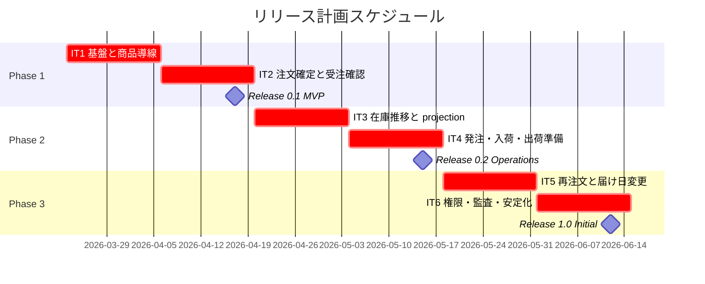

# リリース計画 - フレール・メモワール WEB ショップシステム

## 概要

本ドキュメントは、フレール・メモワール WEB ショップシステムのリリース計画を定義します。

### プロジェクト情報

| 項目 | 内容 |
| :--- | :--- |
| **プロジェクト名** | フレール・メモワール WEB ショップシステム |
| **目的** | 個人顧客向け花束注文を Web で完結させ、受注から在庫確認、発注、入荷、出荷準備までを段階的にシステム化する |
| **対象ユーザー** | 得意先、受注スタッフ、仕入スタッフ、フローリスト、経営者 |
| **開発チーム** | 1 〜 2 名のフルスタック XP チーム |

---

## 満足条件

### スコープ

本計画では、まず **顧客注文の成立** と **スタッフの受注確認** を最短で成立させ、その後に在庫 / 仕入 / 出荷準備、最後に再注文・届け日変更・KPI 可視化を追加します。

| フェーズ | 内容 | ユースケース数 |
| :--- | :--- | :--- |
| Phase 1 | 顧客注文 MVP、受注確認、開発基盤 | 4 UC |
| Phase 2 | 在庫推移、発注、入荷、出荷準備、運用基盤 | 5 UC |
| Phase 3 | 届け先再利用、届け日変更、KPI 可視化、権限 / 監査強化 | 4 UC |
| **合計** | 主要顧客 / スタッフ導線の段階提供 | **13 UC** |

### スケジュール

- **開発期間**: 約 3 か月
- **イテレーション**: 2 週間 × 6 イテレーション
- **リリース**: MVP → 業務拡張版 → 初回安定版の 3 段階

### リソース

- **開発者**: 2 名想定
- **想定稼働時間**: 合計 50 〜 60 時間 / 週

---

## ユーザーストーリー一覧とストーリーポイント

### 優先順位マトリックス

4 軸評価で優先順位を決定します。

1. **金銭価値（BV）**: 売上、機会損失防止、業務効率化への寄与
2. **コスト（C）**: 実装コスト
3. **知識習得（KA）**: 将来の開発を加速する学習価値
4. **リスク軽減（RR）**: 後工程の不確実性や障害リスクの削減効果

### Phase 1: 顧客注文 MVP（イテレーション 1-2）

| ID | ユーザーストーリー | SP | BV | C | KA | RR | 優先度 |
| :--- | :--- | :--- | :--- | :--- | :--- | :--- | :--- |
| US-001 | 得意先として商品一覧 / 商品詳細を見て候補を選びたい | 5 | 高 | 中 | 中 | 中 | 必須 |
| US-002 | 得意先として届け日・届け先・メッセージを入力して注文を確定したい | 8 | 高 | 高 | 中 | 高 | 必須 |
| US-003 | 受注スタッフとして受注一覧と受注詳細を確認したい | 5 | 高 | 中 | 中 | 中 | 必須 |
| EN-001 | 開発チームとして `web` / `api` / CI / PostgreSQL の最小縦スライスを構築したい | 8 | 中 | 高 | 高 | 高 | 必須 |
| **合計** |  | **26** |  |  |  |  |  |

### Phase 2: 在庫・仕入・出荷準備（イテレーション 3-4）

| ID | ユーザーストーリー | SP | BV | C | KA | RR | 優先度 |
| :--- | :--- | :--- | :--- | :--- | :--- | :--- | :--- |
| US-004 | 仕入スタッフとして在庫推移と不足見込みを確認したい | 8 | 高 | 高 | 高 | 高 | 必須 |
| US-005 | 仕入スタッフとして発注を登録したい | 5 | 高 | 中 | 中 | 中 | 必須 |
| US-006 | 仕入スタッフとして入荷実績を記録したい | 5 | 高 | 中 | 中 | 中 | 必須 |
| US-007 | フローリストとして出荷対象一覧を確認したい | 3 | 中 | 低 | 低 | 中 | 中 |
| EN-002 | 開発チームとして監視、バックアップ、runbook の最小基盤を入れたい | 6 | 中 | 中 | 高 | 高 | 必須 |
| **合計** |  | **27** |  |  |  |  |  |

### Phase 3: 再注文・変更対応・安定化（イテレーション 5-6）

| ID | ユーザーストーリー | SP | BV | C | KA | RR | 優先度 |
| :--- | :--- | :--- | :--- | :--- | :--- | :--- | :--- |
| US-008 | 得意先として過去の届け先を再利用して再注文したい | 5 | 高 | 中 | 中 | 中 | 必須 |
| US-009 | 得意先 / 受注スタッフとして届け日変更可否を確認し変更を確定したい | 8 | 高 | 高 | 高 | 高 | 必須 |
| US-010 | 経営者として受注量と廃棄リスクを把握したい | 5 | 中 | 中 | 中 | 中 | 中 |
| EN-003 | 開発チームとして認証 / RBAC / 監査ログ / リリース hardening を固めたい | 7 | 中 | 高 | 高 | 高 | 必須 |
| **合計** |  | **25** |  |  |  |  |  |

### 全体サマリー

| フェーズ | ストーリーポイント | イテレーション |
| :--- | :--- | :--- |
| Phase 1 | 26 SP | 1-2 |
| Phase 2 | 27 SP | 3-4 |
| Phase 3 | 25 SP | 5-6 |
| **合計** | **78 SP** | **6 イテレーション** |

---

## ベロシティ見積もり

### 初期ベロシティ推定

| 項目 | 値 |
| :--- | :--- |
| **イテレーション期間** | 2 週間 |
| **チーム規模** | 2 名 |
| **想定ベロシティ** | 18 〜 20 SP / イテレーション |
| **フィーチャバッファ** | 30% |
| **実効コミットメント** | 13 〜 14 SP / イテレーション |

### ベロシティ検証計画

- イテレーション 1 〜 3 は実績を優先し、計画精度よりも計測精度を重視します
- イテレーション 3 完了時点で、実績 SP と carry over を使って再見積もりします
- `stock_projection` 周辺の難易度が想定を超えた場合は、Phase 3 の中優先度項目を後ろへ送ります

---

## 段階的リリース戦略

### リリーススケジュール

#### 計画スケジュール

### リリース内容

#### Release 0.1 MVP（Phase 1 完了）

**目標**: 顧客が注文でき、スタッフが受注を確認できる最小業務導線を成立させる。

**含まれる機能**:

- 商品一覧 / 商品詳細
- 注文フォームと注文確定 API
- 受注一覧 / 受注詳細
- CI、DB、最小監視の土台

**リリース条件**:

- [ ] 顧客注文導線の E2E が成功する
- [ ] 注文 API 契約テストが成功する
- [ ] PostgreSQL を含む統合テストが成功する

#### Release 0.2 Operations（Phase 2 完了）

**目標**: 在庫推移と仕入・入荷・出荷準備が業務利用できる状態にする。

**含まれる機能**:

- 在庫推移画面
- 発注登録、入荷登録
- 出荷対象一覧
- backup / restore、runbook、alert の最小運用基盤

**リリース条件**:

- [ ] `stock_projection` シナリオテストが成功する
- [ ] 発注 / 入荷 / 出荷一覧の主要統合テストが成功する
- [ ] backup / restore 手順が staging で検証済みである

#### Release 1.0 Initial（Phase 3 完了）

**目標**: 再注文、届け日変更、権限制御を含む初回安定版を成立させる。

**含まれる機能**:

- 届け先再利用
- 届け日変更の判定と確定
- KPI / 廃棄リスクの可視化
- RBAC、監査ログ、release hardening

**リリース条件**:

- [ ] 注文、再注文、届け日変更の主要 E2E が成功する
- [ ] 主要 API 契約 / 統合 / scenario test が成功する
- [ ] P1 / P2 runbook と rollback 手順が整備済みである

---

## バッファ戦略

### フィーチャバッファ

| フェーズ | 選定 SP | バッファ（30%） | 目安 capacity |
| :--- | :--- | :--- | :--- |
| Phase 1 | 26 | 8 | 34 |
| Phase 2 | 27 | 8 | 35 |
| Phase 3 | 25 | 8 | 33 |

### スケジュールバッファ

- **リリース直前バッファ**: 各リリース判定時に 1 〜 2 日を smoke test、fix、doc 更新に充てます
- **全体バッファ**: イテレーション 6 は機能追加より hardening を優先し、必要時は Phase 3 の中優先度項目を後ろ倒しにします

### バッファ消費ルール

1. まず中優先度ストーリーを後ろへ移動する。
2. 次に各イテレーション内の feature buffer を使う。
3. それでも不足する場合のみ、全体スケジュールバッファを消費する。

---

## イテレーション計画概要

### イテレーション 1

**ゴール**: `web` / `api` / PostgreSQL の縦スライスを起動し、商品一覧から注文画面へ到達できる状態を作る。

**主なタスク**:

- `apps/web` と `apps/api` の workspace 骨格を作る
- PostgreSQL 接続、migration、seed の最小経路を作る
- 商品一覧 / 商品詳細の取得と表示を成立させる
- CI の build / test / docs build を整える

**目標 SP**: 13

### イテレーション 2

**ゴール**: 顧客注文確定とスタッフ受注確認を end-to-end で成立させる。

**主なタスク**:

- 注文確定 API と受注保存を実装する
- 注文フォームとバリデーションを実装する
- 受注一覧 / 詳細を実装する
- 注文導線 E2E と API 契約テストを追加する

**目標 SP**: 13

### イテレーション 3

**ゴール**: `stock_projection` を中心に在庫推移の整合した読み取りモデルを成立させる。

**主なタスク**:

- projection 更新ロジックと scenario test を実装する
- 在庫推移 API と画面を実装する
- 不足見込み / 廃棄リスク表示を実装する

**目標 SP**: 14

### イテレーション 4

**ゴール**: 発注・入荷・出荷準備を業務導線として成立させ、最小運用基盤を入れる。

**主なタスク**:

- 発注登録、入荷登録、出荷一覧を実装する
- alert、backup、runbook の最小構成を整える
- 運用観点の smoke test を追加する

**目標 SP**: 13

### イテレーション 5

**ゴール**: 再注文と届け日変更の顧客 / スタッフ導線を成立させる。

**主なタスク**:

- 届け先再利用 API と UI を実装する
- 変更可否判定 / 変更確定 API と UI を実装する
- 主要 E2E と scenario test を拡張する

**目標 SP**: 13

### イテレーション 6

**ゴール**: 権限、監査、KPI、リリース hardening を完了し、初回安定版を出せる状態にする。

**主なタスク**:

- RBAC、監査ログ、認証基盤を整える
- KPI / 廃棄リスク可視化を追加する
- runbook、release checklist、rollback 手順を更新する

**目標 SP**: 12

---

## リスク管理

### 技術リスク

| リスク | 影響度 | 発生確率 | 対策 |
| :--- | :--- | :--- | :--- |
| `stock_projection` 実装難度が高い | 高 | 高 | イテレーション 3 に集中配置し、scenario test を先行させる |
| 認証方式の確定遅延 | 高 | 中 | Phase 3 の先頭で方針固定し、Cookie session + OIDC 対応で逃げ道を持つ |
| Next.js / API の境界が曖昧になる | 中 | 中 | Route Handler を最小化し、REST 契約を先に固定する |

### スケジュールリスク

| リスク | 影響度 | 発生確率 | 対策 |
| :--- | :--- | :--- | :--- |
| 初期ベロシティの過大評価 | 高 | 高 | 3 イテレーション後に再見積もりし、中優先度項目を調整する |
| 運用基盤が後回しになる | 高 | 中 | EN-002、EN-003 を明示的なストーリーとして管理する |
| ドキュメント / runbook 更新漏れ | 中 | 中 | 各リリース判定条件に docs 更新を含める |

---

## 進捗管理

### メトリクス

| メトリクス | 目標 |
| :--- | :--- |
| ベロシティ | 13 〜 14 SP / イテレーション |
| 顧客向け主要導線 E2E | Release 0.1 で注文、Release 1.0 で再注文 / 変更を 100% |
| `stock_projection` 重点シナリオ | Release 0.2 までに 100% |
| 予定達成率 | 80% 以上 |

### 進捗状況

| イテレーション | 計画 SP | 実績 SP | 達成率 | 状態 |
| :--- | :--- | :--- | :--- | :--- |
| 1 | 13 | - | - | 未着手 |
| 2 | 13 | - | - | 未着手 |
| 3 | 14 | - | - | 未着手 |
| 4 | 13 | - | - | 未着手 |
| 5 | 13 | - | - | 未着手 |
| 6 | 12 | - | - | 未着手 |

### 調整ルール

- carry over が 20% を超えたら次イテレーション開始前に再計画します
- P1 / P2 障害対応に 2 日以上を使った場合は、同 iteration の中優先度ストーリーを自動で見直します
- ふりかえりで決まった改善アクションは、次イテレーション計画へ 1 件以上織り込みます
