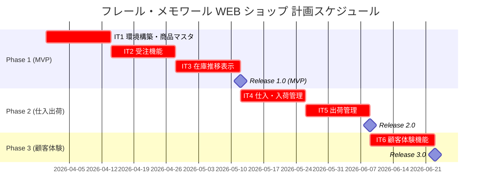

# リリース計画 - フレール・メモワール WEB ショップシステム

## 概要

### プロジェクト情報

| 項目 | 内容 |
|------|------|
| **プロジェクト名** | フレール・メモワール WEB ショップシステム |
| **目的** | 受注管理・在庫推移可視化・仕入管理の一元化による業務効率化と廃棄ロス削減 |
| **対象ユーザー** | 得意先（個人顧客）、スタッフ（受注・仕入・フローリスト・配送） |
| **開発チーム** | フルスタック開発者 1-2 名 |
| **技術スタック** | Ruby on Rails 7.2 / Hotwire / PostgreSQL / Heroku |

---

## 満足条件

### スコープ

インセプションデッキのフェーズ分割に準拠し、3 フェーズでリリースする。

| フェーズ | 内容 | ストーリー数 |
|---------|------|-------------|
| Phase 1（MVP） | 商品マスタ、受注、在庫推移表示 | 7 ストーリー |
| Phase 2（仕入出荷） | 仕入管理、入荷管理、出荷管理 | 3 ストーリー |
| Phase 3（顧客体験） | 届け先コピー、届け日変更、得意先管理、キャンセル | 4 ストーリー |
| **合計** | | **14 ストーリー** |

### スケジュール

- **開発期間**: 2026-03-31 〜 2026-06-20（約 12 週間）
- **イテレーション**: 2 週間 x 6 イテレーション
- **リリース**: 3 回（Phase 1 → Phase 2 → Phase 3）

### リソース

- **開発者**: 1 名
- **想定稼働時間**: 20 時間/週

---

## ユーザーストーリー一覧とストーリーポイント

### 優先順位マトリックス

4 軸評価で優先順位を決定:

1. **金銭価値（BV）**: ビジネス価値
2. **コスト（C）**: 開発コスト
3. **知識習得（KA）**: 技術的学習価値
4. **リスク軽減（RR）**: リスク軽減効果

### Phase 1: MVP（イテレーション 1-3）

| ID | ユーザーストーリー | SP | BV | C | KA | RR | 優先度 |
|----|-------------------|----|----|---|----|----|--------|
| S01 | 商品を登録する | 3 | 高 | 低 | 高 | 高 | 必須 |
| S02 | 単品を管理する | 3 | 高 | 低 | 中 | 高 | 必須 |
| S03 | 花束構成を定義する | 3 | 高 | 中 | 中 | 中 | 必須 |
| S04a | 商品を選択する | 3 | 高 | 低 | 高 | 高 | 必須 |
| S04b | 注文を確定する | 5 | 高 | 高 | 高 | 高 | 必須 |
| S07 | 受注を確認する | 3 | 高 | 低 | 低 | 中 | 必須 |
| S08 | 在庫推移を確認する | 8 | 高 | 高 | 中 | 高 | 必須 |
| **合計** | | **28** | | | | | |

### Phase 2: 仕入出荷（イテレーション 4-5）

| ID | ユーザーストーリー | SP | BV | C | KA | RR | 優先度 |
|----|-------------------|----|----|---|----|----|--------|
| S09 | 発注する | 5 | 高 | 中 | 低 | 中 | 必須 |
| S10 | 入荷を受け入れる | 3 | 高 | 低 | 低 | 中 | 必須 |
| S11 | 出荷一覧を確認する | 3 | 高 | 低 | 低 | 中 | 必須 |
| S12 | 出荷処理を行う | 5 | 高 | 中 | 低 | 中 | 必須 |
| **合計** | | **16** | | | | | |

### Phase 3: 顧客体験（イテレーション 6）

| ID | ユーザーストーリー | SP | BV | C | KA | RR | 優先度 |
|----|-------------------|----|----|---|----|----|--------|
| S05 | 届け日を変更する | 5 | 中 | 高 | 低 | 中 | 高 |
| S06 | 届け先をコピーする | 3 | 中 | 低 | 低 | 低 | 高 |
| S13 | 得意先を管理する | 3 | 中 | 低 | 低 | 低 | 高 |
| S14 | 注文をキャンセルする | 3 | 中 | 低 | 低 | 中 | 高 |
| **合計** | | **14** | | | | | |

### 全体サマリー

| フェーズ | ストーリーポイント | イテレーション |
|---------|-------------------|---------------|
| Phase 1（MVP） | 28 SP | IT1-IT3 |
| Phase 2（仕入出荷） | 16 SP | IT4-IT5 |
| Phase 3（顧客体験） | 14 SP | IT6 |
| **合計** | **58 SP** | 6 イテレーション |

---

## ベロシティ見積もり

### 初期ベロシティ推定

| 項目 | 値 |
|------|-----|
| **イテレーション期間** | 2 週間 |
| **チーム規模** | 1 名 |
| **想定ベロシティ** | 10-12 SP/イテレーション |
| **バッファ係数** | 0.8（20% バッファ） |
| **実効ベロシティ** | 8-10 SP/イテレーション |

### ベロシティ検証計画

- IT1 の実績ベロシティを測定し、IT2 以降の計画を調整する
- IT3 完了時点で安定ベロシティを確定し、Phase 2 以降の計画を精緻化する

---

## 段階的リリース戦略

### リリーススケジュール

#### 計画スケジュール

### リリース内容

#### Release 1.0（Phase 1 完了）: MVP

**目標**: 商品マスタ・受注・在庫推移表示の基本機能を提供し、業務のシステム化を開始する

**含まれる機能**:

- 商品（花束）の登録・管理（S01, S03）
- 単品（花）の登録・管理（S02）
- 得意先の WEB 注文（S04a, S04b）
- 受注一覧・詳細の確認（S07）
- 在庫推移の表示（S08）
- 認証（会員登録・ログイン）

**リリース条件**:

- [ ] 全ユニットテストがパス
- [ ] 統合テストがパス
- [ ] E2E テスト（注文フロー）がパス
- [ ] テストカバレッジ 85% 以上
- [ ] Brakeman Critical 0 件

#### Release 2.0（Phase 2 完了）: 仕入出荷管理

**目標**: 仕入・入荷・出荷管理を追加し、受注から出荷までの一連の業務フローをシステム化する

**含まれる機能**:

- 仕入先への発注（S09）
- 入荷の受け入れ（S10）
- 出荷一覧の確認（S11）
- 出荷処理（S12）

**リリース条件**:

- [ ] 全テストがパス
- [ ] テストカバレッジ 85% 以上
- [ ] 在庫推移と仕入・出荷の連動確認

#### Release 3.0（Phase 3 完了）: 顧客体験

**目標**: 得意先の利便性向上機能を追加し、リピーター体験を改善する

**含まれる機能**:

- 届け日変更（S05）
- 届け先コピー（S06）
- 得意先管理（S13）
- 注文キャンセル（S14）

**リリース条件**:

- [ ] 全テストがパス
- [ ] テストカバレッジ 85% 以上

---

## バッファ戦略

### フィーチャバッファ

| フェーズ | 計画 SP | バッファ（30%） | 実効 SP |
|---------|---------|-----------------|---------|
| Phase 1 | 28 | 8 | 36 |
| Phase 2 | 16 | 5 | 21 |
| Phase 3 | 14 | 4 | 18 |

### スケジュールバッファ

- **予備イテレーション**: 1 イテレーション（IT7 として確保）
- **全体バッファ**: 約 15%

### バッファ消費ルール

1. フィーチャバッファを先に消費
2. 低優先度ストーリーを後回し
3. スケジュールバッファは最後の手段

---

## イテレーション計画概要

### イテレーション 1（Week 1-2: 2026-03-31 〜 2026-04-11）

**ゴール**: Rails プロジェクト初期構築と商品マスタ CRUD の完成

**主なタスク**:

- [x] Rails プロジェクト作成、Devise 認証設定
- [x] 商品（S01）・単品（S02）の Model/Controller/View
- [x] 花束構成（S03）の Model/Controller/View

**目標 SP**: 9 / **実績 SP**: 9 / **達成率**: 100%

### イテレーション 2（Week 3-4: 2026-04-14 〜 2026-04-25）

**ゴール**: 得意先の注文フローと受注管理の完成

**主なタスク**:

- [x] 商品カタログ画面（S04a）
- [x] 注文入力・確認・完了画面（S04b）
- [x] 受注一覧・詳細画面（S07）

**目標 SP**: 11 / **実績 SP**: 11 / **達成率**: 100%

### イテレーション 3（Week 5-6: 2026-04-28 〜 2026-05-09）

**ゴール**: 在庫推移表示の完成と MVP リリース

**主なタスク**:

- [x] 在庫推移計算（StockForecastService）
- [x] 在庫推移画面（S08）
- [x] MVP リリース準備（E2E テスト、デプロイ設定）

**目標 SP**: 8 / **実績 SP**: 8 / **達成率**: 100%

### イテレーション 4（Week 7-8: 2026-05-12 〜 2026-05-23）

**ゴール**: 仕入管理と入荷管理の完成

**主なタスク**:

- [x] 発注画面・PurchaseOrderService（S09）
- [x] 入荷画面（S10）

**目標 SP**: 8 / **実績 SP**: 8 / **達成率**: 100%

### イテレーション 5（Week 9-10: 2026-05-26 〜 2026-06-06）

**ゴール**: 出荷管理の完成と Phase 2 リリース

**主なタスク**:

- [x] 出荷一覧画面（S11）
- [x] 出荷処理・ShippingService（S12）
- [x] Phase 2 リリース準備

**目標 SP**: 8 / **実績 SP**: 8 / **達成率**: 100%

### イテレーション 6（Week 11-12: 2026-06-09 〜 2026-06-20）

**ゴール**: 顧客体験機能の完成と全機能リリース

**主なタスク**:

- [x] 届け日変更（S05）
- [x] 届け先コピー（S06）
- [x] 得意先管理（S13）
- [x] 注文キャンセル（S14）
- [x] Phase 3 リリース準備

**目標 SP**: 14 / **実績 SP**: 14 / **達成率**: 100%

---

## リスク管理

### 技術リスク

| リスク | 影響度 | 発生確率 | 対策 |
|--------|--------|----------|------|
| 在庫推移計算のパフォーマンス | 高 | 中 | IT3 で早期にプロトタイプを実装し検証 |
| Heroku デプロイの問題 | 中 | 低 | IT1 で早期にデプロイパイプラインを構築 |
| Devise の認証カスタマイズ | 低 | 低 | 標準設定で対応。カスタマイズは最小限に |

### スケジュールリスク

| リスク | 影響度 | 発生確率 | 対策 |
|--------|--------|----------|------|
| 初期ベロシティが想定以下 | 高 | 中 | Phase 3 のスコープ調整で吸収 |
| 要件の追加・変更 | 中 | 高 | フィーチャバッファ 30% で吸収 |
| 開発者の離脱 | 高 | 低 | ドキュメント整備で引き継ぎ可能な状態を維持 |

---

## 進捗管理

### メトリクス

| メトリクス | 目標 |
|-----------|------|
| ベロシティ | 8-10 SP/イテレーション |
| テストカバレッジ | 85% 以上 |
| バグ密度 | 0.5 件/SP 以下 |
| 予定達成率 | 80% 以上 |

### 進捗状況

| イテレーション | 計画 SP | 実績 SP | 達成率 | 状態 |
|---------------|---------|---------|--------|------|
| IT1 | 9 | 9 | 100% | 完了 |
| IT2 | 11 | 11 | 100% | 完了 |
| IT3 | 8 | 8 | 100% | 完了 |
| IT4 | 8 | 8 | 100% | 完了 |
| IT5 | 8 | 8 | 100% | 完了 |
| IT6 | 14 | 14 | 100% | 完了 |

---

## 次のステップ

全 6 イテレーション・14 ストーリー（58 SP）が完了。Release 3.0 のリリース準備に移行する。

1. Release 3.0 のリリース準備（E2E テスト、デプロイ設定）
2. リリース完了報告書の作成

---

## 更新履歴

| 日付 | 更新内容 | 更新者 |
|------|---------|--------|
| 2026-03-24 | 初版作成 | - |
| 2026-03-24 | IT3 完了（実績 8SP、達成率 100%）、次のステップ更新 | - |
| 2026-03-25 | IT5 完了（実績 8SP、達成率 100%）、Phase 2 完了、次のステップ更新 | - |
| 2026-03-25 | IT6 完了（実績 14SP、達成率 100%）、Phase 3 完了、プロジェクト完了 | - |
