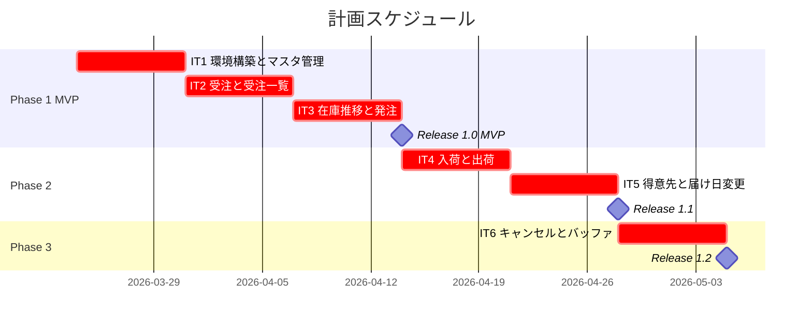
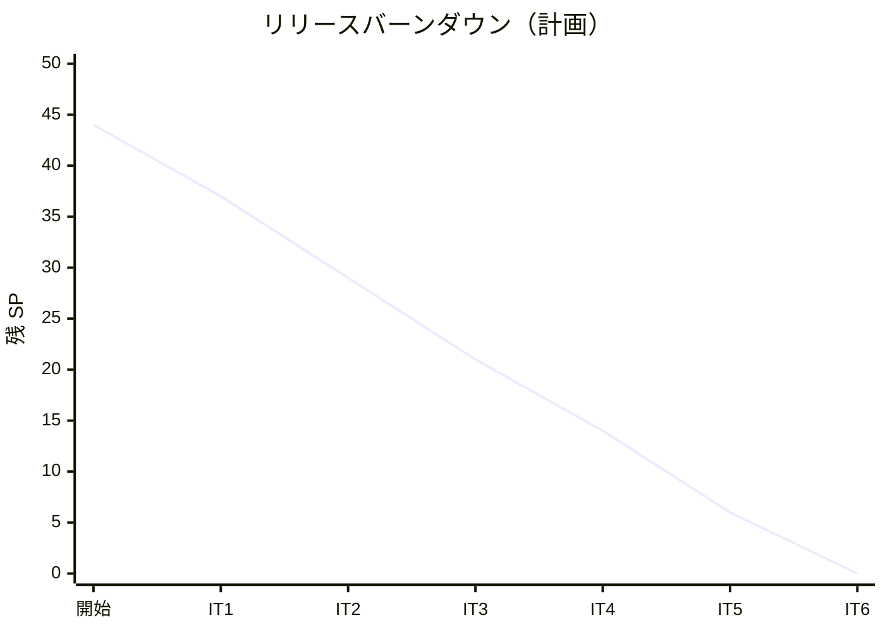

# リリース計画 - フレール・メモワール WEB ショップ

## 概要

### プロジェクト情報

| 項目 | 内容 |
|------|------|
| **プロジェクト名** | フレール・メモワール WEB ショップ |
| **目的** | 受注管理のシステム化と在庫推移の可視化により、廃棄ロスを最小化する |
| **対象ユーザー** | 得意先（個人顧客）、フレール・メモワール スタッフ |
| **開発チーム** | 1-2 名フルスタック |

---

## 満足条件

### スコープ

3 フェーズに分割し、MVP から段階的にリリースする。

| フェーズ | 内容 | ストーリー数 | SP |
|---------|------|-------------|-----|
| Phase 1（MVP） | 商品マスタ・受注・在庫推移・受注一覧 | 6 | 20 |
| Phase 2（業務拡張） | 仕入・入荷・出荷・得意先・届け先コピー | 6 | 15 |
| Phase 3（体験向上） | 届け日変更・注文キャンセル | 3 | 9 |
| **合計** | | **15** | **44** |

### スケジュール

- **開発期間**: 6 週間（+ バッファ 1 週間）
- **イテレーション**: 1 週間 × 6 イテレーション
- **リリース**: Phase 1 完了時に MVP リリース、以降 Phase 完了ごとにリリース

### リソース

- **開発者**: 1-2 名（フルスタック TypeScript）
- **想定稼働時間**: 40 時間/週

---

## ユーザーストーリー一覧とストーリーポイント

### 優先順位マトリックス

### Phase 1: MVP（イテレーション 1-2）

| ID | ユーザーストーリー | SP | BV | C | KA | RR | 優先度 |
|----|-------------------|----|----|---|----|----|--------|
| S14 | 単品（花）を管理する | 2 | 高 | 低 | 高 | 高 | 必須 |
| S13 | 商品（花束）を管理する | 3 | 高 | 低 | 高 | 高 | 必須 |
| S03 | 商品一覧を閲覧する | 2 | 高 | 低 | 中 | 中 | 必須 |
| S01 | 花束を注文する | 5 | 高 | 高 | 高 | 高 | 必須 |
| S07 | 受注一覧を確認する | 3 | 高 | 中 | 中 | 中 | 必須 |
| S08 | 在庫推移を確認する | 5 | 高 | 高 | 高 | 高 | 必須 |
| **合計** | | **20** | | | | | |

### Phase 2: 業務拡張（イテレーション 3-4）

| ID | ユーザーストーリー | SP | BV | C | KA | RR | 優先度 |
|----|-------------------|----|----|---|----|----|--------|
| S09 | 単品を発注する | 3 | 高 | 中 | 中 | 高 | 必須 |
| S10 | 入荷を受け入れる | 2 | 高 | 低 | 低 | 中 | 必須 |
| S11 | 出荷対象を確認する | 3 | 高 | 中 | 中 | 中 | 必須 |
| S12 | 出荷を記録する | 2 | 高 | 低 | 低 | 中 | 必須 |
| S04 | 得意先を管理する | 3 | 中 | 中 | 低 | 中 | 中 |
| S02 | 届け先をコピーする | 2 | 中 | 低 | 低 | 低 | 中 |
| **合計** | | **15** | | | | | |

### Phase 3: 体験向上（イテレーション 5-6）

| ID | ユーザーストーリー | SP | BV | C | KA | RR | 優先度 |
|----|-------------------|----|----|---|----|----|--------|
| S05 | 届け日変更を依頼する | 3 | 中 | 中 | 中 | 中 | 中 |
| S06 | 届け日変更の可否を判断する | 3 | 中 | 中 | 中 | 中 | 中 |
| S15 | 注文をキャンセルする | 3 | 中 | 中 | 低 | 高 | 中 |
| **合計** | | **9** | | | | | |

### 全体サマリー

| フェーズ | ストーリーポイント | イテレーション |
|---------|-------------------|---------------|
| Phase 1（MVP） | 20 SP | 1-2 |
| Phase 2（業務拡張） | 15 SP | 3-4 |
| Phase 3（体験向上） | 9 SP | 5-6 |
| **合計** | **44 SP** | **6 イテレーション** |

---

## ベロシティ見積もり

### 初期ベロシティ推定

| 項目 | 値 |
|------|-----|
| **イテレーション期間** | 1 週間 |
| **チーム規模** | 1-2 名 |
| **想定ベロシティ** | 8-10 SP/イテレーション |
| **バッファ係数** | 0.8（20% バッファ） |
| **実効ベロシティ** | 6-8 SP/イテレーション |

### ベロシティ検証計画

- イテレーション 1-2 の実績でベロシティを計測
- イテレーション 3 開始時に計画を再調整
- 実効ベロシティが 6 SP 未満の場合、Phase 2 以降のスコープを再検討

---

## 段階的リリース戦略

### リリーススケジュール

#### 計画スケジュール

### リリース内容

#### Release 1.0（Phase 1 完了）: MVP

**目標**: 受注と在庫推移の可視化を提供し、手作業管理の限界を解消する

**含まれる機能**:

- 単品・商品マスタの登録・管理
- 商品一覧の閲覧（価格表示付き）
- 花束の注文（届け日・届け先・メッセージ指定）
- 受注一覧の確認（状態フィルタリング）
- 在庫推移の表示（日別在庫予定数）

**リリース条件**:

- [ ] 全ユニットテスト・統合テストがパス
- [ ] テストカバレッジ: ドメイン層 90% 以上、全体 80% 以上
- [ ] 受注→在庫引当フローの E2E テストがパス
- [ ] 受注状態遷移・在庫状態遷移の全パスが検証済み
- [ ] PO（経営者/スタッフ）による受入テスト合格
- [ ] CI パイプライン全ゲートがグリーン

#### Release 1.1（Phase 2 完了）: 業務拡張

**目標**: 仕入・出荷管理とリピーター体験を提供し、業務サイクルを完結させる

**含まれる機能**:

- 単品の発注・入荷登録
- 出荷対象の確認・出荷記録
- 得意先管理・届け先コピー機能

**リリース条件**:

- [ ] 全テストがパス、カバレッジ目標達成
- [ ] 受注→仕入→入荷→結束→出荷の E2E テストがパス
- [ ] Release 1.0 からのリグレッションテスト合格
- [ ] PO による受入テスト合格

#### Release 1.2（Phase 3 完了）: 体験向上

**目標**: 届け日変更と注文キャンセルを提供し、柔軟な顧客対応を実現する

**含まれる機能**:

- 届け日変更（可否判定付き）
- 注文キャンセル（在庫引当解除付き）

**リリース条件**:

- [ ] 全テストがパス、カバレッジ目標達成
- [ ] 全状態遷移パスの E2E テストがパス
- [ ] リグレッションテスト合格
- [ ] PO による受入テスト合格

---

## バッファ戦略

### フィーチャバッファ

| フェーズ | 計画 SP | バッファ（30%） | 実効 SP |
|---------|---------|-----------------|---------|
| Phase 1 | 20 | 6 | 14 |
| Phase 2 | 15 | 5 | 10 |
| Phase 3 | 9 | 3 | 6 |

### スケジュールバッファ

- **予備イテレーション**: イテレーション 6 はバッファ込み（Phase 3 は 9SP で 1 週間で十分。余剰をバッファとする）
- **全体バッファ**: 約 15%（6 週間中の余剰分）

### バッファ消費ルール

1. フィーチャバッファを先に消費（低優先度ストーリーを後回し）
2. Phase 内でスコープ調整が困難な場合、次 Phase に延期
3. スケジュールバッファは最後の手段

---

## イテレーション計画概要

### 週次サイクル

| 曜日 | 内容 |
| :--- | :--- |
| 月曜 AM | イテレーション計画（30 分） |
| 月曜-木曜 | 開発（TDD サイクル） |
| 金曜 AM | 統合テスト・バグ修正 |
| 金曜 PM | デモ・ふりかえり（60 分） |

### イテレーション完了条件（全イテレーション共通）

- [ ] ユニットテスト全パス、カバレッジ目標達成
- [ ] 統合テスト: 当該イテレーションの UC 連携確認
- [ ] CI パイプライン全ゲートがグリーン
- [ ] 回帰テスト合格（IT2 以降）

### イテレーション 1（Week 1: 2026-03-24 〜 2026-03-28）

**ゴール**: 開発環境構築とマスタ管理機能の完成

**環境構築タイムボックス**: 2 日（月-火）— SP 外

**主なタスク**:

- [x] Docker Compose + PostgreSQL + Express + React 環境構築
- [x] Prisma スキーマ定義・マイグレーション
- [x] ESLint + Prettier + Husky + CI 基本設定
- [x] S14: 単品管理（バックエンド + フロントエンド）
- [x] S13: 商品管理（バックエンド + フロントエンド）
- [x] S03: 商品一覧閲覧

**目標 SP**: 7（S14:2 + S13:3 + S03:2）

### イテレーション 2（Week 2: 2026-03-31 〜 2026-04-04）

**ゴール**: 受注機能と受注一覧の完成

**主なタスク**:

- [ ] S01: 花束注文（注文画面 + 受注登録 + 在庫引当）
- [ ] S07: 受注一覧確認

**目標 SP**: 8（S01:5 + S07:3）

詳細は [iteration_plan-2.md](./iteration_plan-2.md) を参照。

### イテレーション 3（Week 3: 2026-04-07 〜 2026-04-11）

**ゴール**: 在庫推移表示と発注機能の完成 → **MVP リリース**

**主なタスク**:

- [ ] S08: 在庫推移表示
- [ ] S09: 単品発注
- [ ] MVP リリース検証（E2E テスト 2 件: 注文フロー、在庫推移フロー）

**目標 SP**: 8（S08:5 + S09:3）

### イテレーション 4（Week 4: 2026-04-14 〜 2026-04-18）

**ゴール**: 入荷・出荷管理の完成

**主なタスク**:

- [ ] S10: 入荷登録
- [ ] S11: 出荷対象確認
- [ ] S12: 出荷記録

**目標 SP**: 7（S10:2 + S11:3 + S12:2）

### イテレーション 5（Week 5: 2026-04-21 〜 2026-04-25）

**ゴール**: 得意先管理・届け先コピー・届け日変更 → **業務拡張リリース**

**主なタスク**:

- [ ] S04: 得意先管理
- [ ] S02: 届け先コピー
- [ ] S05: 届け日変更依頼

**目標 SP**: 8（S04:3 + S02:2 + S05:3）

### イテレーション 6（Week 6: 2026-04-28 〜 2026-05-02）

**ゴール**: 届け日変更可否・注文キャンセル・全体統合テスト → **完成版リリース**

**主なタスク**:

- [ ] S06: 届け日変更可否判断
- [ ] S15: 注文キャンセル
- [ ] 全体 E2E テスト・バグ修正

**目標 SP**: 6（S06:3 + S15:3）+ バッファ

---

## リスク管理

### 技術リスク

| リスク | 影響度 | 発生確率 | 対策 |
|--------|--------|----------|------|
| 在庫推移計算のパフォーマンス不足 | 中 | 低 | インデックス最適化、計算結果のキャッシュ検討 |
| Prisma のマイグレーション失敗 | 中 | 低 | 開発環境で十分にテスト後に適用 |
| 在庫引当のロット分割ロジックの複雑さ | 高 | 中 | TDD で段階的に実装、境界値テストを充実させる |

### スケジュールリスク

| リスク | 影響度 | 発生確率 | 対策 |
|--------|--------|----------|------|
| イテレーション 2 の SP が 13 と高い | 高 | 中 | S08（在庫推移）が予想以上に複雑な場合、イテレーション 3 に延期 |
| 初期ベロシティの予測ズレ | 中 | 中 | イテレーション 2 終了時に計画を再調整 |

---

## 進捗管理

### メトリクス

| メトリクス | 目標 |
|-----------|------|
| ベロシティ | 8-10 SP/イテレーション |
| テストカバレッジ | 80% 以上 |
| バグ密度 | 1.0 件/SP 以下 |
| 予定達成率 | 80% 以上 |

### 進捗状況

| イテレーション | 計画 SP | 実績 SP | 達成率 | 状態 |
|---------------|---------|---------|--------|------|
| 1 | 7 | 7 | 100% | 完了 |
| 2 | 8 | 8 | 100% | 完了 |
| 3 | 8 | - | - | 未着手 |
| 4 | 7 | - | - | 未着手 |
| 5 | 8 | - | - | 未着手 |
| 6 | 6 | - | - | 未着手 |

### バーンダウンチャート

---

## 次のステップ

1. イテレーション 1 の詳細計画を作成する
2. 開発環境を構築する（Docker Compose + PostgreSQL + Express + React）
3. TDD で S14（単品管理）から開発を開始する

---

## 更新履歴

| 日付 | 更新内容 | 更新者 |
|------|---------|--------|
| 2026-03-17 | 初版作成 | - |
| 2026-03-17 | IT1 完了: S14, S13, S03 実装完了。GitHub Issues クローズ。進捗更新 | - |
| 2026-03-17 | IT2 完了: S01, S07 実装完了。XP レビュー指摘 5 件対応。Quality Gate PASS。GitHub Issues クローズ。進捗更新 | - |
