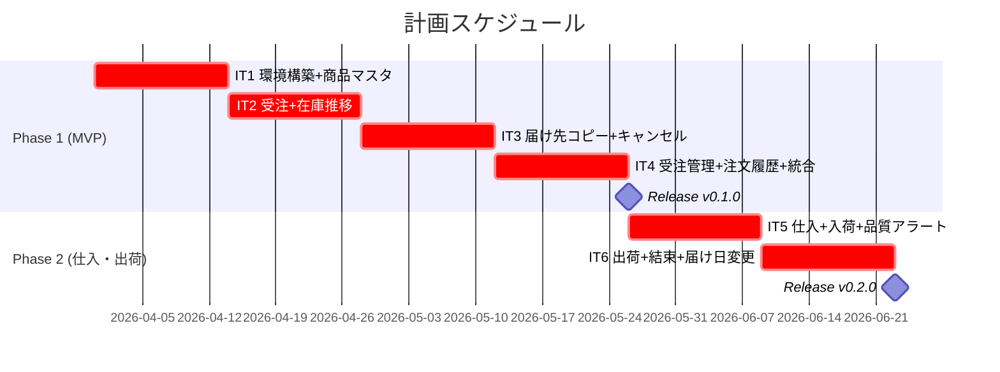
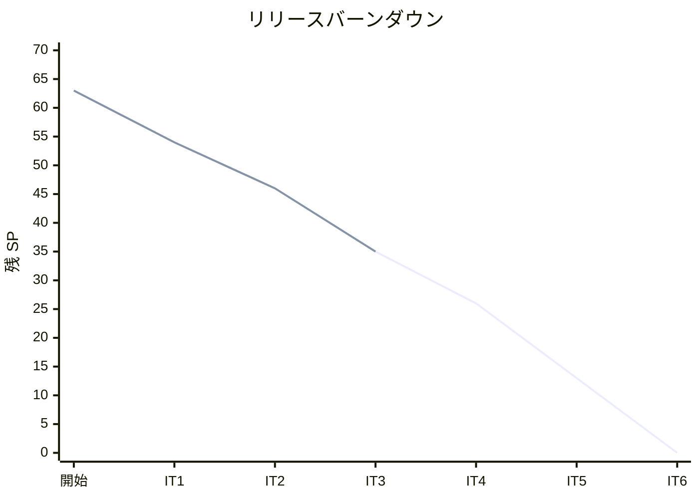

# リリース計画 - フレール・メモワール WEB ショップシステム

## 概要

### プロジェクト情報

| 項目 | 内容 |
| :--- | :--- |
| **プロジェクト名** | フレール・メモワール WEB ショップシステム |
| **目的** | 受注から出荷までの業務効率化、在庫推移可視化による廃棄ロス最小化 |
| **対象ユーザー** | 得意先（個人顧客）、受注スタッフ、仕入スタッフ、フローリスト |
| **開発チーム** | 1-2 名（フルスタック） |

---

## 満足条件

### スコープ

3 フェーズに分けて段階的にリリースする。

| フェーズ | 内容 | ストーリー数 | SP |
| :--- | :--- | :--- | :--- |
| Phase 1（MVP） | 商品管理、受注、在庫推移、届け先コピー、受注管理、キャンセル、注文履歴 | 10 | 37 |
| Phase 2（仕入・出荷） | 仕入管理、入荷、結束、出荷、品質期限アラート | 5 | 21 |
| Phase 3（顧客管理拡充） | 届け日変更 | 1 | 5 |
| **合計** | | **16** | **63** |

### スケジュール

- **開発期間**: 約 12 週間（3 ヶ月）
- **イテレーション**: 2 週間 × 6 イテレーション
- **リリース**: フェーズ完了ごとにリリース

### リソース

- **開発者**: 1 名
- **想定稼働時間**: 30 時間/週

---

## ユーザーストーリー一覧とストーリーポイント

### 優先順位マトリックス

| 略称 | 評価軸 | 説明 |
| :--- | :--- | :--- |
| BV | 金銭価値 | ビジネス価値 |
| C | コスト | 開発コスト |
| KA | 知識習得 | 技術的学習価値 |
| RR | リスク軽減 | リスク軽減効果 |

### Phase 1: MVP（イテレーション 1-4）

| ID | ユーザーストーリー | SP | BV | C | KA | RR | 優先度 |
| :--- | :--- | :--- | :--- | :--- | :--- | :--- | :--- |
| US-001 | 単品マスタを登録する | 3 | 高 | 低 | 高 | 高 | 必須 |
| US-002 | 商品（花束）を登録する | 3 | 高 | 低 | 中 | 中 | 必須 |
| US-003 | 花束構成を定義する | 3 | 高 | 中 | 中 | 高 | 必須 |
| US-004 | 商品を選択する | 3 | 高 | 低 | 中 | 中 | 必須 |
| US-005 | 届け日・届け先・メッセージを入力して注文する | 5 | 高 | 高 | 高 | 高 | 必須 |
| US-006 | 届け先をコピーして再注文する | 3 | 高 | 中 | 低 | 中 | 必須 |
| US-007 | 在庫推移を確認する | 8 | 高 | 高 | 高 | 高 | 必須 |
| US-014 | 注文をキャンセルする | 3 | 中 | 低 | 低 | 高 | 必須 |
| US-015 | 受注状況を確認する | 3 | 高 | 低 | 低 | 中 | 必須 |
| US-016 | 注文履歴・注文状況を確認する | 3 | 中 | 低 | 低 | 中 | 必須 |
| **合計** | | **37** | | | | | |

### Phase 2: 仕入・出荷管理（イテレーション 5-6）

| ID | ユーザーストーリー | SP | BV | C | KA | RR | 優先度 |
| :--- | :--- | :--- | :--- | :--- | :--- | :--- | :--- |
| US-008 | 仕入先に発注する | 5 | 高 | 中 | 中 | 中 | 必須 |
| US-009 | 入荷を受け入れる | 5 | 高 | 中 | 中 | 高 | 必須 |
| US-010 | 結束対象を確認する | 3 | 中 | 低 | 低 | 中 | 必須 |
| US-011 | 出荷処理を行い通知する | 5 | 高 | 中 | 中 | 中 | 必須 |
| US-012 | 品質維持期限アラートを確認する | 3 | 高 | 低 | 低 | 高 | 必須 |
| **合計** | | **21** | | | | | |

### Phase 3: 顧客管理の拡充（Phase 2 内で吸収可能）

| ID | ユーザーストーリー | SP | BV | C | KA | RR | 優先度 |
| :--- | :--- | :--- | :--- | :--- | :--- | :--- | :--- |
| US-013 | 届け日を変更する | 5 | 中 | 中 | 低 | 中 | 高 |
| **合計** | | **5** | | | | | |

### 全体サマリー

| フェーズ | ストーリーポイント | イテレーション |
| :--- | :--- | :--- |
| Phase 1 | 37 SP | IT1-IT4 |
| Phase 2 | 21 SP | IT5-IT6 |
| Phase 3 | 5 SP | IT6（Phase 2 に吸収） |
| **合計** | **63 SP** | **6 イテレーション** |

---

## ベロシティ見積もり

### 初期ベロシティ推定

| 項目 | 値 |
| :--- | :--- |
| **イテレーション期間** | 2 週間 |
| **チーム規模** | 1 名 |
| **想定ベロシティ** | 10-12 SP/イテレーション |
| **バッファ係数** | 0.8（20% バッファ） |
| **実効ベロシティ** | 8-10 SP/イテレーション |

### ベロシティ検証計画

- イテレーション 1-2 の実績で初期ベロシティを検証
- イテレーション 3 以降で安定したベロシティを確立
- 実績が想定を下回る場合はスコープを調整（Phase 3 を Phase 2 に吸収 or 延期）

---

## 段階的リリース戦略

### リリーススケジュール

#### 計画スケジュール

### リリース内容

#### Release v0.1.0（Phase 1 完了）: MVP

**目標**: 受注業務のシステム化と在庫推移の可視化

**含まれる機能**:

- 商品マスタ管理（花束・単品・構成）
- WEB 受注（商品選択・届け日・届け先・メッセージ）
- 届け先コピー機能（リピーター向け）
- 在庫推移表示（日別・単品別）
- 注文キャンセル
- 受注状況確認（スタッフ向け）
- 注文履歴・注文状況確認（得意先向け）
- 得意先認証（メール + パスワード）

**リリース条件**:

- [ ] 全ユニットテストがパス（カバレッジ 70% 以上）
- [ ] 統合テストがパス
- [ ] E2E テストがパス（注文フロー、リピート注文）
- [ ] セキュリティスキャン（Ruff + bandit + pip-audit）に問題なし

#### Release v0.2.0（Phase 2 完了）: 全機能リリース

**目標**: 仕入・出荷管理の追加と業務フロー全体のシステム化

**含まれる機能**:

- 仕入管理（発注・入荷）
- 出荷管理（結束確認・出荷処理・出荷通知）
- 品質維持期限アラート
- 届け日変更（Phase 3 を吸収）

**リリース条件**:

- [ ] 全テストがパス
- [ ] 負荷テスト完了（Locust）
- [ ] ステージング環境での動作確認完了

---

## バッファ戦略

### フィーチャバッファ

| フェーズ | 計画 SP | バッファ（30%） | 実効 SP |
| :--- | :--- | :--- | :--- |
| Phase 1 | 37 | 11 | 48 |
| Phase 2+3 | 26 | 8 | 34 |

### スケジュールバッファ

- **予備**: Phase 3（5SP）を Phase 2 に吸収する余地あり
- **全体バッファ**: ベロシティ実績が 8SP/IT なら 8 イテレーション必要（2 IT のバッファ）

### バッファ消費ルール

1. フィーチャバッファを先に消費（低優先度ストーリーを後回し）
2. Phase 3 のスコープを Phase 2 に統合して効率化
3. スケジュールバッファは最後の手段

---

## イテレーション計画概要

### イテレーション 1（Week 1-2）✅ 完了

**ゴール**: 開発環境構築と商品マスタの CRUD を完成させる

**主なタスク**:

- [x] Django プロジェクト初期セットアップ（uv + Django 5.2 + PostgreSQL）
- [x] US-001: 単品マスタ登録（3SP）
- [x] US-002: 商品登録（3SP）
- [x] US-003: 花束構成定義（3SP）

**実績 SP**: 9 / 9（達成率 100%）

### イテレーション 2（Week 3-4）✅ 完了

**ゴール**: 顧客向け商品閲覧画面と注文機能のバックエンドを TDD で実装する

**主なタスク**:

- [x] US-004: 商品選択画面（3SP）
- [x] US-005: 注文入力・確定（5SP）

**実績 SP**: 8 / 8（達成率 100%）

### イテレーション 3（Week 5-6）✅ 完了

**ゴール**: 在庫推移表示の基盤を TDD で実装し、注文キャンセル機能を完成させる

**主なタスク**:

- [x] IT2 ふりかえり対応（Application 層導入、ファクトリメソッド標準化）
- [x] US-007: 在庫推移確認（8SP）
- [x] US-014: 注文キャンセル（3SP）

**実績 SP**: 11 / 11（達成率 100%）

### イテレーション 4（Week 7-8）

**ゴール**: 届け先コピー・受注管理・注文履歴を完成させ、MVP リリース

**主なタスク**:

- [ ] US-006: 届け先コピー（3SP）
- [ ] US-015: 受注状況確認（3SP）
- [ ] US-016: 注文履歴確認（3SP）
- [ ] 統合テスト・E2E テスト
- [ ] MVP リリース準備

**目標 SP**: 9

### イテレーション 5（Week 9-10）

**ゴール**: 仕入・入荷管理と品質期限アラートを実装する

**主なタスク**:

- [ ] US-008: 仕入先に発注（5SP）
- [ ] US-009: 入荷受入（5SP）
- [ ] US-012: 品質維持期限アラート（3SP）

**目標 SP**: 13

### イテレーション 6（Week 11-12）

**ゴール**: 出荷管理と届け日変更を完成させ、全機能リリース

**主なタスク**:

- [ ] US-010: 結束対象確認（3SP）
- [ ] US-011: 出荷処理・通知（5SP）
- [ ] US-013: 届け日変更（5SP）
- [ ] 全体統合テスト・負荷テスト
- [ ] 全機能リリース準備

**目標 SP**: 13

---

## リスク管理

### 技術リスク

| リスク | 影響度 | 発生確率 | 対策 |
| :--- | :--- | :--- | :--- |
| 在庫推移計算の複雑さが見積もりを超過 | 高 | 中 | IT2 でスパイクを実施し、IT3 で完成 |
| FIFO 引当のデッドロック | 中 | 低 | ロック順序の統一、リトライ戦略 |
| ECS Fargate のメモリ不足 | 中 | 低 | 0.5vCPU/1GB 構成、CloudWatch 監視 |

### スケジュールリスク

| リスク | 影響度 | 発生確率 | 対策 |
| :--- | :--- | :--- | :--- |
| ベロシティが想定を下回る | 高 | 中 | IT3 終了時に計画再調整 |
| 技術的負債の蓄積 | 中 | 中 | 各 IT でリファクタリング時間を確保 |
| 1 名体制での属人化 | 中 | 高 | ドキュメント・テスト・CI の徹底 |

---

## 進捗管理

### メトリクス

| メトリクス | 目標 |
| :--- | :--- |
| ベロシティ | 8-12 SP/イテレーション |
| テストカバレッジ | 70% 以上 |
| バグ密度 | 0.5 件/SP 以下 |
| 予定達成率 | 80% 以上 |

### 進捗状況

| イテレーション | 計画 SP | 実績 SP | 達成率 | 状態 |
| :--- | :--- | :--- | :--- | :--- |
| IT1 | 9 | 9 | 100% | 完了 |
| IT2 | 8 | 8 | 100% | 完了 |
| IT3 | 11 | 11 | 100% | 完了 |
| IT4 | 9 | - | - | 未着手 |
| IT5 | 13 | - | - | 未着手 |
| IT6 | 13 | - | - | 未着手 |

### ベロシティ実績

| 指標 | 値 |
| :--- | :--- |
| IT1 ベロシティ | 9 SP |
| IT2 ベロシティ | 8 SP |
| IT3 ベロシティ | 11 SP |
| 平均ベロシティ | 9.3 SP |
| テストカバレッジ | 99%（IT3 末） |
| テスト数 | 195（IT3 末） |

### バーンダウンチャート

---

## 次のステップ

1. イテレーション 4 の開発を開始する（US-006 + US-015 + US-016 = 9SP）
2. IT4 完了後に Phase 1 MVP リリース準備

---

## 更新履歴

| 日付 | 更新内容 | 更新者 |
| :--- | :--- | :--- |
| 2026-03-24 | 初版作成 | - |
| 2026-03-24 | IT1-IT2 実績反映、IT3 計画調整（US-007 全体実装、US-006 を IT4 に繰り越し） | - |
| 2026-03-24 | IT3 実績反映（11/11SP 達成）、ベロシティ更新（平均 9.3SP）、バーンダウン更新 | - |
