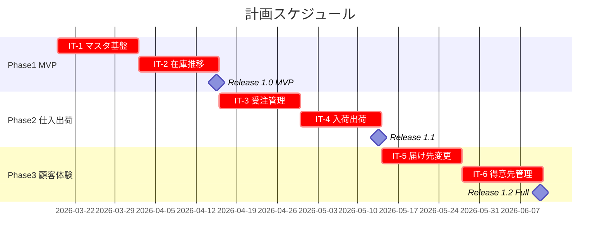
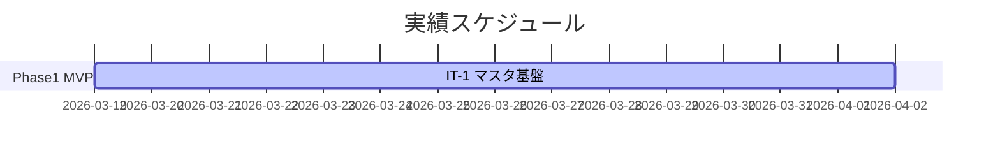
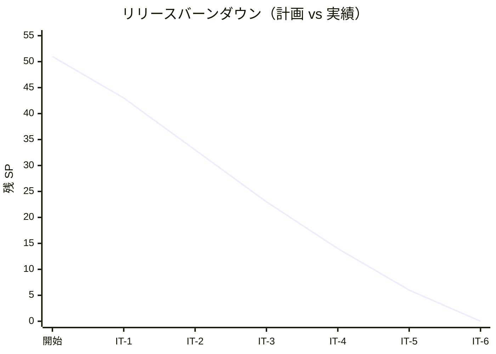

# リリース計画 - フレール・メモワール WEB ショップシステム

## 概要

### プロジェクト情報

| 項目 | 内容 |
| :--- | :--- |
| **プロジェクト名** | フレール・メモワール WEB ショップシステム |
| **目的** | 受注から出荷までの業務を効率化し、在庫推移の可視化により廃棄ロスを最小化する |
| **対象ユーザー** | 得意先（個人顧客）、受注スタッフ、仕入スタッフ、フローリスト |
| **開発チーム** | 開発者 1〜2 名、プロダクトオーナー 1 名 |

---

## 満足条件

### スコープ

3 フェーズで段階的にリリースする。

| フェーズ | 内容 | ストーリー数 |
| :--- | :--- | :--- |
| Phase 1: MVP | マスタ管理・受注・在庫推移 | 5 US |
| Phase 2: 仕入・出荷 | 発注・入荷・出荷管理 | 5 US |
| Phase 3: 顧客体験 | 届け先コピー・届け日変更・得意先管理 | 4 US |
| **合計** | | **14 US** |

### スケジュール

- **開発開始**: 2026-03-19
- **イテレーション**: 2 週間 × 6 イテレーション
- **全体期間**: 約 12 週間（2026-03-19 〜 2026-06-11）

### リソース

- **開発者**: 1〜2 名
- **想定稼働時間**: 40 時間/週

---

## ユーザーストーリー一覧とストーリーポイント

### 優先順位マトリックス

4 軸評価（高=3 / 中=2 / 低=1）で優先順位を決定:

1. **金銭価値（BV）**: ビジネス価値
2. **コスト（C）**: 開発コスト（低いほど優先）
3. **知識習得（KA）**: 技術的学習価値
4. **リスク軽減（RR）**: リスク軽減効果

### Phase 1: MVP（イテレーション 1〜2）

| ID | ユーザーストーリー | SP | BV | C | KA | RR | 優先度 |
| :--- | :--- | :--- | :--- | :--- | :--- | :--- | :--- |
| US-12 | 商品マスタを管理する | 3 | 高 | 低 | 低 | 高 | 必須 |
| US-13 | 単品マスタを管理する | 3 | 高 | 低 | 低 | 高 | 必須 |
| US-01 | 商品一覧を見る | 2 | 高 | 低 | 低 | 中 | 必須 |
| US-02 | 花束を注文する | 5 | 高 | 高 | 高 | 高 | 必須 |
| US-07 | 在庫推移を確認する | 8 | 高 | 高 | 高 | 高 | 必須 |
| **合計** | | **21** | | | | | |

### Phase 2: 仕入・出荷管理（イテレーション 3〜4）

| ID | ユーザーストーリー | SP | BV | C | KA | RR | 優先度 |
| :--- | :--- | :--- | :--- | :--- | :--- | :--- | :--- |
| US-05 | 受注一覧を確認する | 3 | 高 | 低 | 低 | 中 | 必須 |
| US-06 | 受注詳細を確認する | 2 | 高 | 低 | 低 | 中 | 必須 |
| US-08 | 仕入先に発注する | 5 | 高 | 中 | 中 | 高 | 必須 |
| US-09 | 入荷を登録する | 3 | 高 | 低 | 低 | 高 | 必須 |
| US-10 | 出荷対象を確認する | 3 | 高 | 低 | 低 | 中 | 必須 |
| US-11 | 出荷を登録する | 3 | 高 | 低 | 低 | 中 | 必須 |
| **合計** | | **19** | | | | | |

### Phase 3: 顧客体験向上（イテレーション 5〜6）

| ID | ユーザーストーリー | SP | BV | C | KA | RR | 優先度 |
| :--- | :--- | :--- | :--- | :--- | :--- | :--- | :--- |
| US-03 | 過去の届け先をコピーする | 3 | 中 | 低 | 低 | 低 | 高 |
| US-04 | 届け日を変更する | 5 | 高 | 中 | 中 | 中 | 高 |
| US-14 | 得意先を管理する | 3 | 中 | 低 | 低 | 低 | 高 |
| **合計** | | **11** | | | | | |

### 全体サマリー

| フェーズ | ストーリーポイント | イテレーション |
| :--- | :--- | :--- |
| Phase 1: MVP | 21 SP | IT-1〜2 |
| Phase 2: 仕入・出荷管理 | 19 SP | IT-3〜4 |
| Phase 3: 顧客体験向上 | 11 SP | IT-5〜6 |
| **合計** | **51 SP** | **6 イテレーション** |

---

## ベロシティ見積もり

### 初期ベロシティ推定

| 項目 | 値 |
| :--- | :--- |
| **イテレーション期間** | 2 週間 |
| **チーム規模** | 1〜2 名 |
| **想定ベロシティ** | 8〜12 SP/イテレーション |
| **バッファ係数** | 0.8（20% バッファ） |
| **実効ベロシティ** | 8〜10 SP/イテレーション |

### ベロシティ検証計画

- IT-1〜3 の実績を集計し、IT-4 以降の計画を調整する
- 初回ベロシティは推測値のため、3 イテレーション後に再調整する

---

## 段階的リリース戦略

### リリーススケジュール

#### 計画スケジュール

#### 実績スケジュール

### リリース内容

#### Release 1.0 MVP（Phase 1 完了）

**目標**: 商品マスタ・受注・在庫推移の基本機能を提供し、手作業の受注管理を置き換える

**含まれる機能**:

- 商品マスタ管理（US-12）
- 単品マスタ管理（US-13）
- 商品一覧表示（US-01）
- 花束の注文（US-02）
- 在庫推移確認（US-07）

**リリース条件**:

- [ ] 全ユニットテストがパス
- [ ] 統合テストがパス
- [ ] 主要 E2E テスト（注文フロー）がパス

#### Release 1.1（Phase 2 完了）

**目標**: 仕入・出荷管理を追加し、業務全体をシステムでカバーする

**含まれる機能**:

- 受注一覧・詳細確認（US-05, US-06）
- 発注管理（US-08）
- 入荷登録（US-09）
- 出荷対象確認・出荷登録（US-10, US-11）

**リリース条件**:

- [ ] 全テストがパス
- [ ] 出荷フロー E2E テストがパス

#### Release 1.2 Full（Phase 3 完了）

**目標**: リピーター体験を向上させ、顧客満足度を高める

**含まれる機能**:

- 届け先コピー（US-03）
- 届け日変更（US-04）
- 得意先管理（US-14）

**リリース条件**:

- [ ] 全テストがパス
- [ ] 全 E2E テストがパス

---

## バッファ戦略

### フィーチャバッファ

| フェーズ | 計画 SP | バッファ（30%） | 実効 SP |
| :--- | :--- | :--- | :--- |
| Phase 1 | 21 | 6 | 15 |
| Phase 2 | 19 | 6 | 13 |
| Phase 3 | 11 | 3 | 8 |

### スケジュールバッファ

- **予備期間**: 各フェーズ末に 0.5 イテレーション分の余裕を確保
- **全体バッファ**: 20%（約 2.5 週間）

### バッファ消費ルール

1. フィーチャバッファを先に消費（低優先度ストーリーを後回し）
2. スケジュールバッファは最後の手段
3. Phase 3 の US-03・US-14 はバッファ対象（必須ではない）

---

## イテレーション計画概要

### IT-1（2026-03-19 〜 2026-04-01）

**ゴール**: 開発環境構築とマスタ管理・受注基盤の実装

**主なストーリー**:

- [ ] US-12: 商品マスタを管理する（3 SP）
- [ ] US-13: 単品マスタを管理する（3 SP）
- [ ] US-01: 商品一覧を見る（2 SP）

**目標 SP**: 8

詳細は [iteration_plan-1.md](./iteration_plan-1.md) を参照。

### IT-2（2026-04-02 〜 2026-04-15）

**ゴール**: 注文機能と在庫推移の実装

**主なストーリー**:

- [ ] US-02: 花束を注文する（5 SP）
- [ ] US-07: 在庫推移を確認する（8 SP）

**目標 SP**: 10

詳細は [iteration_plan-2.md](./iteration_plan-2.md) を参照。

### IT-3（2026-04-16 〜 2026-04-29）

**ゴール**: 受注管理と発注機能の実装

**主なストーリー**:

- [ ] US-05: 受注一覧を確認する（3 SP）
- [ ] US-06: 受注詳細を確認する（2 SP）
- [ ] US-08: 仕入先に発注する（5 SP）

**目標 SP**: 10

詳細は [iteration_plan-3.md](./iteration_plan-3.md) を参照。

### IT-4（2026-04-30 〜 2026-05-13）

**ゴール**: 入荷・出荷管理の実装

**主なストーリー**:

- [ ] US-09: 入荷を登録する（3 SP）
- [ ] US-10: 出荷対象を確認する（3 SP）
- [ ] US-11: 出荷を登録する（3 SP）

**目標 SP**: 9

詳細は [iteration_plan-4.md](./iteration_plan-4.md) を参照。

### IT-5（2026-05-14 〜 2026-05-27）

**ゴール**: 届け先コピーと届け日変更の実装

**主なストーリー**:

- [ ] US-03: 過去の届け先をコピーする（3 SP）
- [ ] US-04: 届け日を変更する（5 SP）

**目標 SP**: 8

詳細は [iteration_plan-5.md](./iteration_plan-5.md) を参照。

### IT-6（2026-05-28 〜 2026-06-10）

**ゴール**: 得意先管理と全体仕上げ

**主なストーリー**:

- [ ] US-14: 得意先を管理する（3 SP）

**目標 SP**: 5（残りはバッファ・品質改善）

詳細は [iteration_plan-6.md](./iteration_plan-6.md) を参照。

---

## リスク管理

### 技術リスク

| リスク | 影響度 | 発生確率 | 対策 |
| :--- | :--- | :--- | :--- |
| 在庫推移計算の複雑さが想定以上 | 高 | 中 | IT-2 で早期に実装・検証する |
| TypeScript / Prisma の学習コスト | 中 | 低 | IT-1 で環境構築と PoC を実施する |
| フロントエンドとバックエンドの統合 | 中 | 中 | IT-1 から API 連携を含めて実装する |

### スケジュールリスク

| リスク | 影響度 | 発生確率 | 対策 |
| :--- | :--- | :--- | :--- |
| ベロシティが想定より低い | 高 | 中 | Phase 3 の US-03・US-14 をバッファとして後回し可能 |
| 要件の追加・変更 | 中 | 中 | スコープ外として管理し、次リリースに積み上げる |

---

## 進捗管理

### メトリクス

| メトリクス | 目標 |
| :--- | :--- |
| ベロシティ | 8〜10 SP/イテレーション |
| テストカバレッジ（ドメイン層） | 90% 以上 |
| テストカバレッジ（アプリ層） | 80% 以上 |
| 予定達成率 | 90% 以上 |

### 進捗状況

| イテレーション | 計画 SP | 実績 SP | 達成率 | 状態 |
| :--- | :--- | :--- | :--- | :--- |
| IT-1 | 8 | - | - | 未着手 |
| IT-2 | 10 | - | - | 未着手 |
| IT-3 | 10 | - | - | 未着手 |
| IT-4 | 9 | - | - | 未着手 |
| IT-5 | 8 | - | - | 未着手 |
| IT-6 | 5 | - | - | 未着手 |
| **合計** | **50** | **-** | **-** | |

### バーンダウンチャート

---

## 次のステップ

1. `syncing-github-project` で GitHub Project に Issue・Milestone を作成する
2. `planning-releases --iteration 1` で IT-1 の詳細計画を作成する
3. 開発環境（Docker Compose）をセットアップして開発を開始する

---

## 更新履歴

| 日付 | 更新内容 | 更新者 |
| :--- | :--- | :--- |
| 2026-03-19 | 初版作成 | - |
