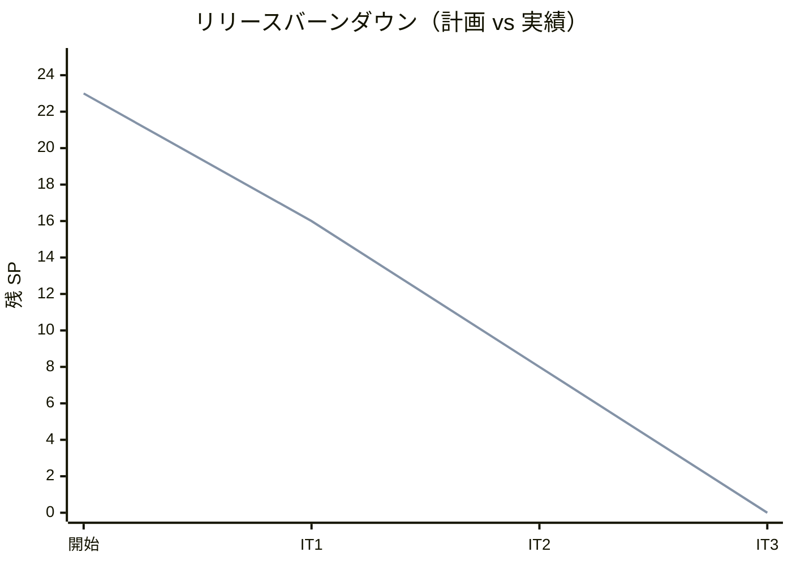
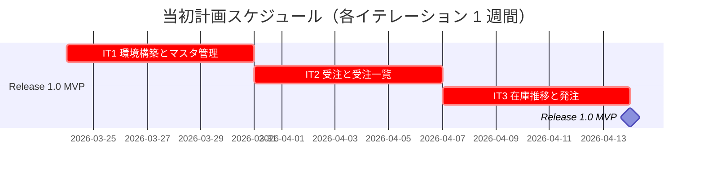
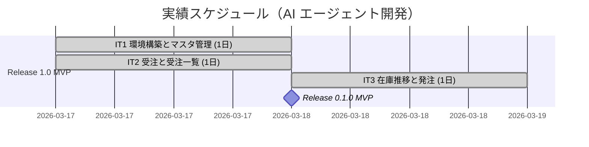
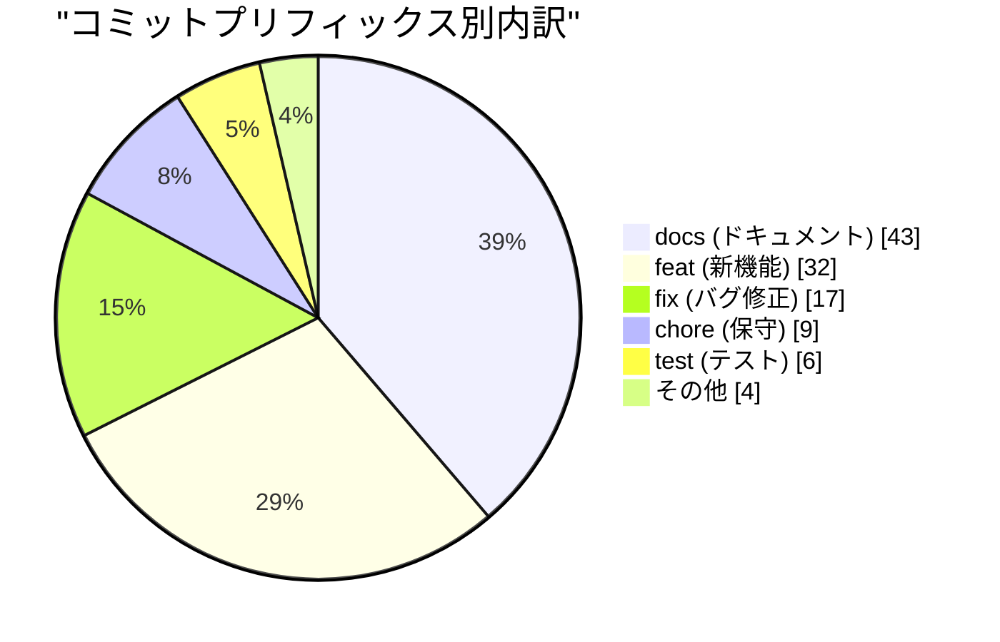
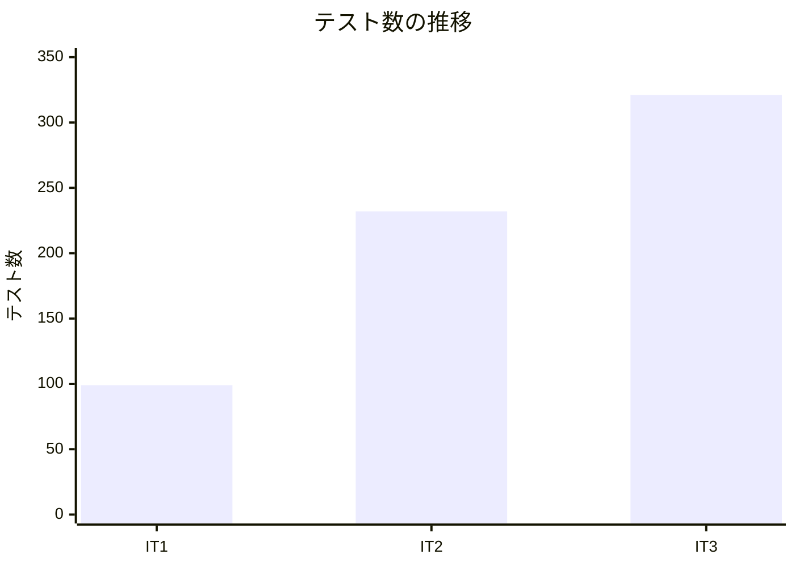
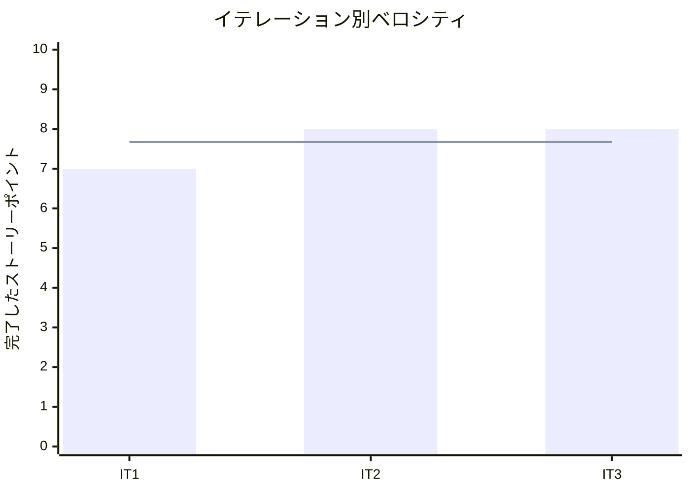

# リリース完了報告書 0.1.0 - フレール・メモワール WEB ショップ

**報告書作成日**: 2026-03-19

## 概要

フレール・メモワール WEB ショップ v0.1.0 のリリース完了報告書です。全 3 イテレーション、23 ストーリーポイントを 100% 達成し、MVP リリースを完了しました。

---

## プロジェクトサマリー

| 項目 | 値 |
|------|-----|
| **プロジェクト期間** | 2026-03-17 〜 2026-03-18 (2 日間) |
| **総イテレーション数** | 3 |
| **総ストーリーポイント** | 23 SP（Phase 1: 20 SP + Phase 2 先行: 3 SP） |
| **総コミット数** | 111 |
| **総テスト数** | 321 |
| **ユーザーストーリー数** | 7 |

---

## 計画と実績の差異分析

### イテレーション別達成状況

| イテレーション | リリース | 計画 SP | 実績 SP | 達成率 | 差異 |
|---------------|---------|---------|---------|--------|------|
| IT1 | 1.0 MVP | 7 | 7 | 100% | ±0 |
| IT2 | 1.0 MVP | 8 | 8 | 100% | ±0 |
| IT3 | 1.0 MVP | 8 | 8 | 100% | ±0 |
| **合計** | | **23** | **23** | **100%** | **±0** |

### リリース別達成状況

| リリース | 内容 | 計画 SP | 実績 SP | 達成率 |
|---------|------|---------|---------|--------|
| Release 0.1.0 MVP | 商品マスタ・受注・在庫推移・受注一覧・発注 | 23 | 23 | 100% |

### リリースバーンダウン

**分析結果**: 全 3 イテレーションで計画通りの消化を実現。IT1-2 は同日（2026-03-17）に完了し、IT3 は翌日（2026-03-18）に完了。AI 支援開発により計画を大幅に前倒しで達成しました。

---

## 計画日程 vs 実績日数の差異分析

### イテレーション別日程比較

当初計画では各イテレーション 1 週間（7 日）を想定していましたが、AI エージェント（Claude）による開発で大幅な工期短縮を実現しました。

| IT | 計画期間 | 計画日数 | 実績期間 | 実績日数 | 短縮日数 | 短縮率 |
|----|---------|---------|----------|---------|---------|--------|
| 1 | 2026-03-24 〜 2026-03-28 | 7 日 | 2026-03-17 | **1 日** | -6 日 | 85.7% |
| 2 | 2026-03-31 〜 2026-04-04 | 7 日 | 2026-03-17 | **1 日** | -6 日 | 85.7% |
| 3 | 2026-04-07 〜 2026-04-11 | 7 日 | 2026-03-18 | **1 日** | -6 日 | 85.7% |
| **合計** | **3 週間** | **21 日** | **2026-03-17 〜 2026-03-18** | **2 日** | **-19 日** | **90.5%** |

### 工期短縮の可視化

```mermaid
xychart-beta
    title "計画日数 vs 実績日数"
    x-axis ["IT1", "IT2", "IT3"]
    y-axis "日数" 0 --> 8
    bar "計画" [7, 7, 7]
    bar "実績" [1, 1, 1]
```

### 計画 vs 実績ガントチャート

#### 当初計画スケジュール（3 週間）

#### 実績スケジュール（2 日間）

### サマリー

| 指標 | 値 |
|------|-----|
| **計画総日数** | 21 日（3 週間） |
| **実績総日数** | 2 日 |
| **短縮日数** | 19 日 |
| **短縮率** | **90.5%** |
| **効率倍率** | **10.5 倍** |

### 差異分析

1. **大幅な工期短縮**: 計画 21 日 → 実績 2 日で、**90.5% の工期短縮**を達成
2. **計画開始日より 7 日前倒し**: 計画開始日 2026-03-24 に対し、2026-03-17 に開発を開始しリリース完了
3. **SP 達成率 100%**: 工期は短縮されたが、計画通りのストーリーポイントを完了。Phase 2 の S09 も先行実装

### 工期短縮の要因分析

| 要因 | 説明 |
|------|------|
| **AI エージェントによる高速開発** | Claude による TDD サイクルの高速反復で、各イテレーションを 1 日で完了 |
| **TDD サイクルの効率化** | テスト作成→実装→リファクタリングを短時間で反復し、品質を維持しつつ高速開発 |
| **パターン再利用による加速** | IT1 で確立した CRUD パターン（単品→商品）を IT2-3 の受注・在庫推移に適用 |
| **クリーンアーキテクチャの効果** | ドメイン層・アプリケーション層・インフラ層の分離により、独立した並行実装が可能 |
| **ドキュメント同時生成** | 設計書・レビュー・ふりかえりをコードと同時に生成 |

---

## コミットログ分析

### コミットプリフィックス別内訳

| プリフィックス | 件数 | 割合 | 説明 |
|---------------|------|------|------|
| docs | 43 | 38.7% | ドキュメント更新 |
| feat | 32 | 28.8% | 新機能追加 |
| fix | 17 | 15.3% | バグ修正 |
| chore | 9 | 8.1% | 保守作業 |
| test | 6 | 5.4% | テスト追加 |
| refactor | 1 | 0.9% | リファクタリング |
| release | 1 | 0.9% | リリース |
| その他 | 2 | 1.8% | Revert・初期コミット |
| **合計** | **111** | **100%** | |

### コミットプリフィックス別パイチャート

### 分析

1. **ドキュメントが最大（docs 38.7%）**: イテレーション計画・ふりかえり・完了報告書・ADR・レビュー記録が充実
2. **品質向上への注力（21.6%）**: fix (15.3%) + test (5.4%) + refactor (0.9%) = 21.6% が品質向上に貢献
3. **機能開発は約 3 割（feat 28.8%）**: 効率的な機能実装を示し、CRUD パターンの再利用が寄与

---

## 品質メトリクス

### テストカバレッジ

| 対象 | 目標 | IT1 | IT2 | IT3 (リリース時) | 判定 |
|------|------|-----|-----|-----------------|------|
| バックエンド | 80% | 97.8% | 95.0% | 95%+ | 達成 |
| フロントエンド | 80% | 75.0% | 93.8% | 93%+ | 達成 |

### テスト数の推移

| カテゴリ | IT1 | IT2 | IT3 | 増分合計 |
|---------|-----|-----|-----|---------|
| Backend テスト | 68 | 146 | 200 | +132 |
| Frontend テスト | 21 | 79 | 102 | +81 |
| E2E シナリオ | 10 | 7 | 19 | +9 |
| **合計** | **99** | **232** | **321** | **+222** |

### 静的解析

| 指標 | 結果 |
|------|------|
| ESLint | 0 エラー |
| SonarQube Quality Gate (Backend) | PASS |
| SonarQube Quality Gate (Frontend) | PASS |
| SonarQube BLOCKER | 0 |
| Flaky テスト率 | 0% |

### ベロシティ

| 項目 | 値 |
|------|-----|
| 平均ベロシティ | 7.67 SP/イテレーション |
| 最大ベロシティ | 8 SP (IT2, IT3) |
| 最小ベロシティ | 7 SP (IT1) |

---

## リリース履歴

| リリース | 含まれる IT | リリース日 | SP | 状態 |
|---------|-----------|-----------|-----|------|
| **Release 0.1.0 MVP** | IT1-3 | **2026-03-18** | **23** | リリース完了 |

---

## 主要な成果物

### 実装した主要機能

1. **単品・商品マスタ管理** (IT1 / S14, S13)
   - 単品（花）の CRUD 操作、仕入先管理
   - 商品（花束）の CRUD 操作、構成管理（花束⇔単品の紐付け）

2. **商品一覧閲覧** (IT1 / S03)
   - 得意先向け商品一覧画面（価格表示付き）

3. **花束注文** (IT2 / S01)
   - 注文入力→確認→完了フロー
   - 届け日・届け先・メッセージ指定
   - 在庫引当（StockLot 消費）

4. **受注一覧確認** (IT2 / S07)
   - 受注一覧画面、受注詳細画面
   - 状態フィルタリング

5. **在庫推移表示** (IT3 / S08)
   - 日別在庫予定数の表示
   - 入荷予定・出荷予定の可視化

6. **単品発注** (IT3 / S09)
   - 発注画面、発注登録
   - 在庫推移に基づく発注数量調整

### 技術的成果

| 成果 | 内容 |
|------|------|
| テスト駆動開発 | 321 テスト、バックエンドカバレッジ 95%+ |
| クリーンアーキテクチャ | ドメイン層・アプリケーション層・インフラ層の 3 層分離 |
| CI/CD | GitHub Actions（Backend CI + Frontend CI + E2E テスト） |
| 静的解析 | ESLint + SonarQube Quality Gate 全プロジェクト PASS |
| デモ環境 | Heroku Container + SQLite モードによるデモ環境構築（ADR-002） |
| ADR | ADR-001 発注作成時のトランザクション方針を記録 |

---

## 作業履歴

### 2026-03-18

- `feat`: S08 在庫推移機能・画面実装
- `feat`: S09 発注機能・画面実装
- `feat`: デモ環境用 SQLite モード追加（ADR-002）
- `feat`: Heroku コンテナデモ環境構築
- `docs`: IT3 計画・ふりかえり・完了報告書作成
- `docs`: ADR-001 発注作成時のトランザクション方針を記録
- `release`: v0.1.0

### 2026-03-17

- `feat`: S14 単品管理（バックエンド + フロントエンド）
- `feat`: S13 商品管理（バックエンド + フロントエンド）
- `feat`: S03 商品一覧画面
- `feat`: S01 注文フロー（入力→確認→完了）+ 受注登録 + 在庫引当
- `feat`: S07 受注一覧・詳細画面
- `chore`: Docker Compose + PostgreSQL + Express + React 環境構築
- `chore`: Prisma スキーマ定義・マイグレーション
- `docs`: IT1/IT2 計画・ふりかえり・完了報告書作成

---

## 総評

フレール・メモワール WEB ショップ v0.1.0 は、全 23 SP を 3 イテレーションで 100% 達成し、MVP リリースを完了しました。

### ハイライト

- **7 ユーザーストーリー完了**: 商品マスタ管理から受注・在庫推移・発注まで、業務の基幹フローを実装
- **321 テストによる品質保証**: Backend 200 + Frontend 102 + E2E 19
- **95%+ テストカバレッジ**: 目標 80% を大幅に上回る品質水準
- **90.5% の工期短縮**: 計画 21 日 → 実績 2 日（効率倍率 10.5 倍）
- **Phase 2 の先行実装**: S09（単品発注）を MVP と同時にリリースし、早期の価値提供を実現

### プロジェクト完了メトリクス

| 指標 | 値 |
|------|-----|
| **総ストーリーポイント** | 23 SP |
| **総コミット数** | 111 |
| **総テスト数** | 321 |
| **テストカバレッジ（Backend）** | 95%+ |
| **テストカバレッジ（Frontend）** | 93%+ |
| **リリース回数** | 1（v0.1.0 MVP） |
| **イテレーション回数** | 3 |
| **ユーザーストーリー数** | 7 |
| **ADR 数** | 1（ADR-001） |

---

**リリース完了** - Simple made easy.
