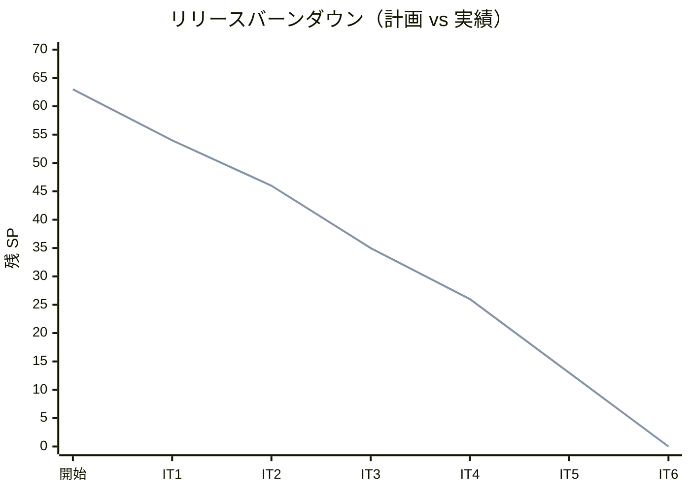
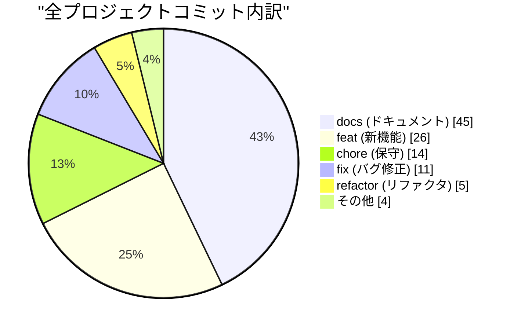
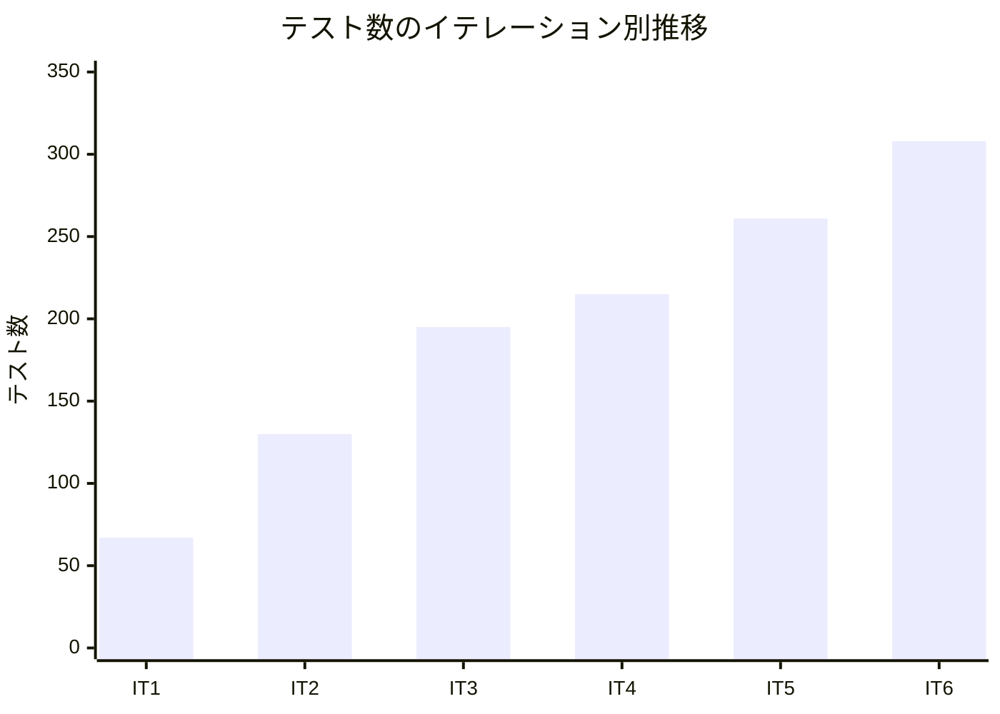
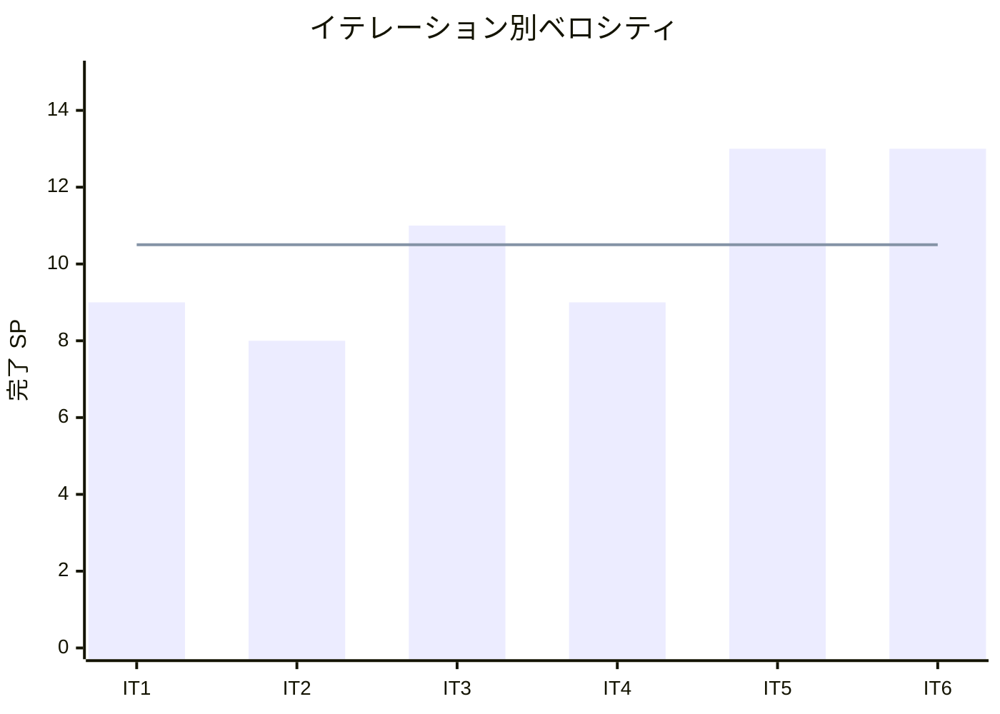

# リリース完了報告書 v0.2.0 - フレール・メモワール WEB ショップシステム

**報告書作成日**: 2026-03-25

## 概要

フレール・メモワール WEB ショップシステム v0.2.0 のリリース完了報告書です。全 6 イテレーション、63 ストーリーポイントを 100% 達成し、受注から出荷までの業務フロー全体をシステム化しました。

---

## プロジェクトサマリー

| 項目 | 値 |
| :--- | :--- |
| **プロジェクト期間** | 2026-03-17 〜 2026-03-25（約 1 週間） |
| **総イテレーション数** | 6 |
| **総ストーリーポイント** | 63 SP |
| **総コミット数** | 105（マージ除く） |
| **総テスト数** | 308 |
| **テストカバレッジ** | 96% |
| **ユーザーストーリー数** | 16 |

---

## 計画と実績の差異分析

### イテレーション別達成状況

| イテレーション | リリース | 計画 SP | 実績 SP | 達成率 | 差異 |
| :--- | :--- | :--- | :--- | :--- | :--- |
| IT1 | v0.1.0 | 9 | 9 | 100% | 0 |
| IT2 | v0.1.0 | 8 | 8 | 100% | 0 |
| IT3 | v0.1.0 | 11 | 11 | 100% | 0 |
| IT4 | v0.1.0 | 9 | 9 | 100% | 0 |
| IT5 | v0.2.0 | 13 | 13 | 100% | 0 |
| IT6 | v0.2.0 | 13 | 13 | 100% | 0 |
| **合計** | | **63** | **63** | **100%** | **0** |

### リリース別達成状況

| リリース | 内容 | 計画 SP | 実績 SP | 達成率 |
| :--- | :--- | :--- | :--- | :--- |
| v0.1.0（Phase 1 MVP） | 商品管理 + 受注 + 在庫推移 + 届け先コピー + 受注管理 + キャンセル + 注文履歴 | 37 | 37 | 100% |
| v0.2.0（Phase 2+3 全機能） | 仕入 + 出荷 + 品質期限アラート + 届け日変更 | 26 | 26 | 100% |

### リリースバーンダウン

**分析結果**: 計画線と実績線が完全に一致する理想的なバーンダウン。全 6 イテレーションで 100% 達成を維持し、スコープ変更なしで計画通りに完了した。Phase 3（US-013: 5SP）を Phase 2 の IT6 に吸収することで、追加イテレーションなしに全ストーリーを消化できた。

---

## コミットログ分析

### 全プロジェクトコミットプリフィックス別内訳

| プリフィックス | 件数 | 割合 | 説明 |
| :--- | :--- | :--- | :--- |
| docs | 45 | 42.9% | ドキュメント更新 |
| feat | 26 | 24.8% | 新機能追加 |
| fix | 11 | 10.5% | バグ修正・レビュー指摘対応 |
| chore | 14 | 13.3% | 保守作業 |
| refactor | 5 | 4.8% | リファクタリング |
| style | 1 | 1.0% | コードスタイル修正 |
| release | 1 | 1.0% | リリース |
| ci | 1 | 1.0% | CI/CD |
| その他 | 1 | 1.0% | Initial commit |
| **合計** | **105** | **100%** | |

### v0.2.0 リリース分（IT5-IT6）コミット内訳

| プリフィックス | 件数 | 割合 |
| :--- | :--- | :--- |
| docs | 7 | 36.8% |
| fix | 7 | 36.8% |
| feat | 5 | 26.3% |
| **合計** | **19** | **100%** |

### コミットプリフィックス別パイチャート

### 分析

1. **ドキュメント重視の開発**: docs が 42.9% と最大比率。分析→設計→開発→レビュー→報告書の一連のドキュメントを継続的に更新し、プロジェクトの透明性を確保した
2. **feat の集中度が高い**: 26 件の feat コミットで 16 ストーリー + 環境構築を実装。1 コミットあたりの変更量が大きく、TDD サイクル単位のコミット粒度改善が課題
3. **fix の増加（v0.2.0）**: v0.2.0 では fix が 36.8% を占める。XP レビュー指摘対応（H-1〜H-7）が主因で、レビュー駆動の品質改善が機能している

---

## 品質メトリクス

### テストカバレッジ

| 対象 | 目標 | 実績 | 判定 |
| :--- | :--- | :--- | :--- |
| バックエンド（Django） | 90% | 96% | ✅ 達成 |

### テスト数のイテレーション別推移

| イテレーション | テスト数 | 増分 | カバレッジ |
| :--- | :--- | :--- | :--- |
| IT1 | 67 | +67 | 99% |
| IT2 | 130 | +63 | 99% |
| IT3 | 195 | +65 | 99% |
| IT4 | 215 | +20 | 98% |
| IT5 | 261 | +46 | 96% |
| IT6 | 308 | +47 | 96% |

### テストピラミッド（最終状態）

| レイヤー | テスト数 | 割合 |
| :--- | :--- | :--- |
| ドメインユニットテスト | 150 | 48.7% |
| Repository 統合テスト | 27 | 8.8% |
| サービステスト | 42 | 13.6% |
| View 統合テスト | 52 | 16.9% |
| スモーク + その他 | 37 | 12.0% |
| **合計** | **308** | **100%** |

### 静的解析

| 指標 | 結果 |
| :--- | :--- |
| Ruff（lint + format） | ✅ クリーン |
| SonarQube | 未実施（次リリースで導入予定） |
| Flaky テスト率 | 0%（全 308 テスト安定） |

### ベロシティ

| 項目 | 値 |
| :--- | :--- |
| 平均ベロシティ | 10.5 SP/イテレーション |
| 最大ベロシティ | 13 SP（IT5, IT6） |
| 最小ベロシティ | 8 SP（IT2） |
| Phase 1 平均 | 9.25 SP |
| Phase 2 平均 | 13.0 SP（+40%） |

---

## リリース履歴

| リリース | 含まれる IT | リリース日 | SP | 状態 |
| :--- | :--- | :--- | :--- | :--- |
| v0.1.0（Phase 1 MVP） | IT1-IT4 | 2026-03-24 | 37 | 完了 |
| v0.2.0（Phase 2+3 全機能） | IT5-IT6 | 2026-03-25 | 26 | 完了 |

---

## 主要な成果物

### 実装した主要機能

#### v0.1.0 — Phase 1 MVP（IT1-IT4）

1. **商品マスタ管理**（IT1）
   - 単品マスタ CRUD（仕入先・品質維持日数・リードタイム管理）
   - 商品（花束）マスタ CRUD
   - 花束構成定義（単品 × 数量の組み合わせ）

2. **WEB 受注**（IT2）
   - 商品選択画面（カタログ表示・構成花材表示）
   - 注文入力・確認・完了フロー（届け日・届け先・メッセージ）

3. **在庫推移可視化**（IT3）
   - StockLot 集約（FIFO 引当・品質維持期限管理）
   - 14 日間の日別在庫推移表示（単品選択式）
   - 注文キャンセル機能（届け日 3 日前まで）

4. **受注管理・注文履歴**（IT4）
   - 届け先コピー（リピーター向け住所再利用）
   - スタッフ向け受注一覧・詳細画面
   - 得意先向け注文履歴・状況確認画面

#### v0.2.0 — Phase 2+3 全機能（IT5-IT6）

5. **仕入管理**（IT5）
   - 発注登録（単品選択→仕入先自動設定→入荷予定日指定）
   - 入荷受入（発注選択→数量入力→在庫ロット自動作成）
   - 品質維持期限アラート（残り 2 日以内の在庫ロット警告）
   - 在庫推移への入荷予定反映

6. **出荷管理**（IT6）
   - 結束対象確認（花材別必要総数量 + 注文別結束リスト）
   - 出荷処理（CONFIRMED→PREPARING→SHIPPED 遷移 + 出荷記録 + 通知）
   - 届け日変更（変更期限 = 届け日 3 日前）

### 技術的成果

| 成果 | 内容 |
| :--- | :--- |
| **テスト駆動開発** | 308 テスト、カバレッジ 96%。全ストーリーをインサイドアウト TDD で実装 |
| **DDD レイヤードアーキテクチャ** | 5 Django アプリ（products, orders, inventory, purchasing, shipping）を domain → models → repositories → services → views の一貫した構成で構築 |
| **ドメインモデル** | 12 集約ルート / エンティティ、15+ 値オブジェクト、5 ドメインサービス |
| **アプリ間連携** | Repository DI による疎結合なクロスアプリ連携（仕入→在庫、出荷→注文） |
| **XP プラクティス** | マルチパースペクティブレビュー（5 視点）、イテレーティブ開発、KPT ふりかえり |

### 画面一覧

| 種別 | 画面数 | 主な画面 |
| :--- | :--- | :--- |
| 得意先向け | 7 | 商品一覧・詳細、注文入力・確認・完了、注文履歴、届け日変更 |
| スタッフ向け | 10 | 商品/単品/仕入先管理、受注一覧・詳細、発注一覧・登録、入荷登録、品質期限アラート、結束一覧、出荷管理 |
| その他 | 1 | 在庫推移 |
| **合計** | **18** | |

---

## 総評

フレール・メモワール WEB ショップシステム v0.2.0 は、全 63 SP を 6 イテレーションで 100% 達成し、受注から出荷までの業務フロー全体のシステム化を完了しました。

### ハイライト

- **全 16 ユーザーストーリー完了**: 商品管理・受注・在庫推移・仕入・出荷・届け日変更の全機能を実装
- **308 テストによる品質保証**: ドメインユニット 150 + リポジトリ 27 + サービス 42 + View 52 + その他 37
- **96% テストカバレッジ**: 目標 90% を大幅に上回る品質水準を維持
- **2 段階リリース戦略の成功**: v0.1.0（MVP）で基盤を確立し、v0.2.0 で全機能を追加。Phase 3 を Phase 2 に吸収し効率化
- **ベロシティ向上トレンド**: Phase 1 平均 9.25SP → Phase 2 平均 13.0SP（+40%）。パターン再利用と習熟効果により生産性が向上

### プロジェクト完了メトリクス

| 指標 | 値 |
| :--- | :--- |
| **総ストーリーポイント** | 63 SP |
| **総コミット数** | 105 |
| **総テスト数** | 308 |
| **テストカバレッジ** | 96% |
| **リリース回数** | 2（v0.1.0, v0.2.0） |
| **イテレーション回数** | 6 |
| **ユーザーストーリー数** | 16 |
| **Django アプリ数** | 5（products, orders, inventory, purchasing, shipping） |
| **画面数** | 18 |
| **平均ベロシティ** | 10.5 SP/IT |
| **達成率** | 100%（全 6IT） |

### 残課題（技術的負債）

| 項目 | 優先度 | 説明 |
| :--- | :--- | :--- |
| SonarQube 導入 | 高 | 5IT 連続持ち越し。CI 組み込みが必要 |
| N+1 クエリ改善 | 中 | 品質期限アラートの find_near_expiry メソッド追加 |
| テストヘルパー共通化 | 低 | conftest.py によるセットアップコード DRY 化 |
| コミット粒度改善 | 低 | TDD サイクル（Red-Green-Refactor）単位のコミット徹底 |

---

**リリース完了** - Simple made easy.
