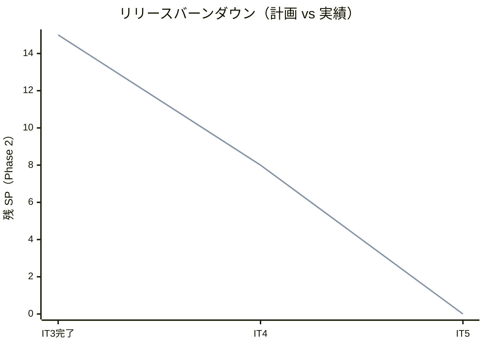
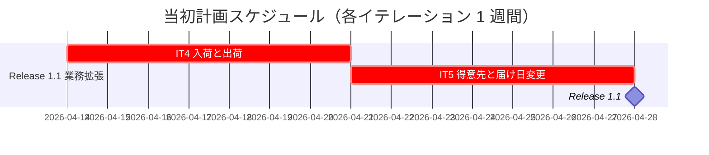
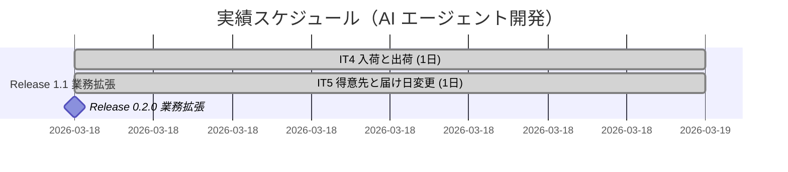
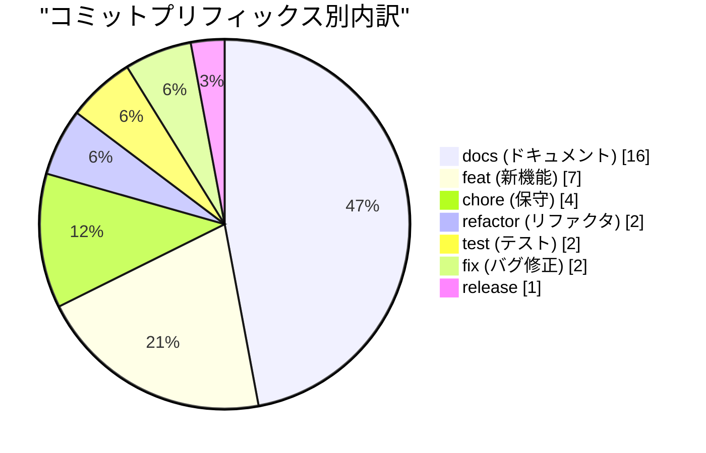
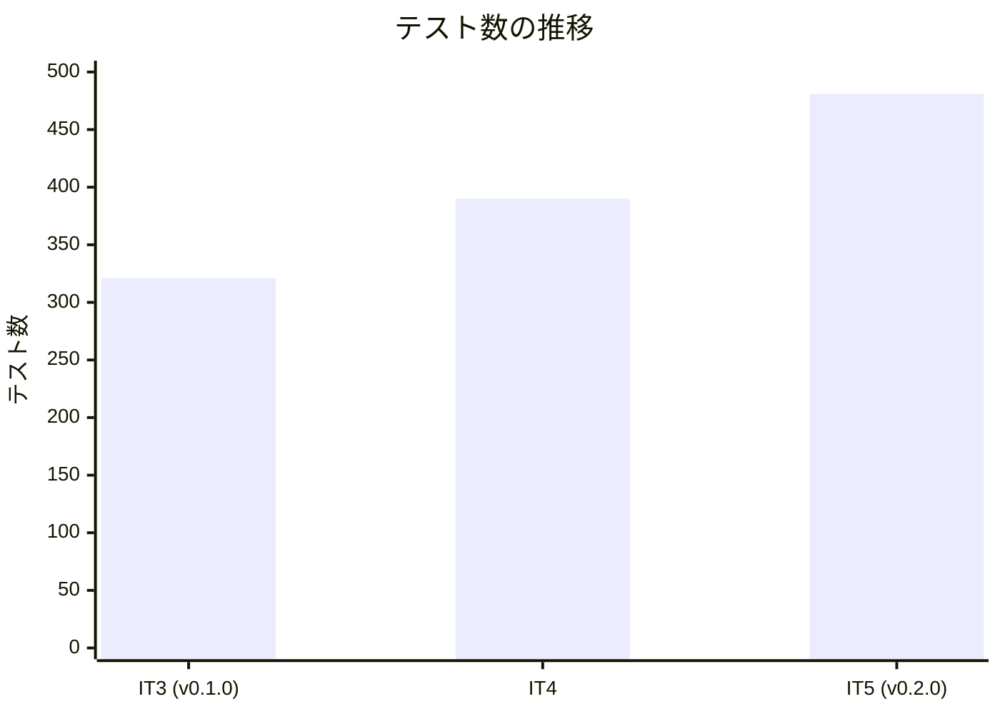
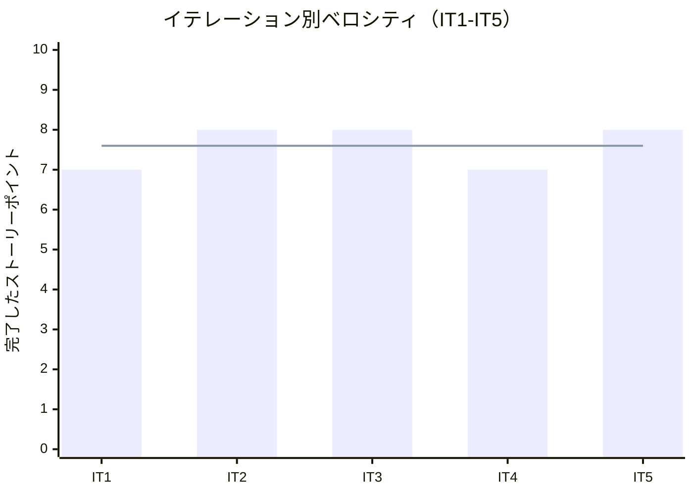

# リリース完了報告書 0.2.0 - フレール・メモワール WEB ショップ

**報告書作成日**: 2026-03-19

## 概要

フレール・メモワール WEB ショップ v0.2.0 のリリース完了報告書です。全 2 イテレーション（IT4-IT5）、15 ストーリーポイントを 100% 達成し、業務拡張リリースを完了しました。

---

## プロジェクトサマリー

| 項目 | 値 |
|------|-----|
| **プロジェクト期間** | 2026-03-18（1 日間） |
| **総イテレーション数** | 2（IT4-IT5） |
| **総ストーリーポイント** | 15 SP（Phase 2 業務拡張: S10, S11, S12, S04, S02, S05） |
| **総コミット数** | 34 |
| **総テスト数** | 481 |
| **ユーザーストーリー数** | 6 |

---

## 計画と実績の差異分析

### イテレーション別達成状況

| イテレーション | リリース | 計画 SP | 実績 SP | 達成率 | 差異 |
|---------------|---------|---------|---------|--------|------|
| IT4 | 1.1 業務拡張 | 7 | 7 | 100% | ±0 |
| IT5 | 1.1 業務拡張 | 8 | 8 | 100% | ±0 |
| **合計** | | **15** | **15** | **100%** | **±0** |

### リリース別達成状況

| リリース | 内容 | 計画 SP | 実績 SP | 達成率 |
|---------|------|---------|---------|--------|
| Release 0.2.0 業務拡張 | 入荷・出荷・得意先・届け先コピー・届け日変更 | 15 | 15 | 100% |

### リリースバーンダウン

**分析結果**: IT4-IT5 ともに計画通りの SP 消化を実現。IT4 で入荷・出荷の中核機能を完成させ、IT5 で得意先管理・届け先コピー・届け日変更を実装。両イテレーションとも同日（2026-03-18）に完了しました。

---

## 計画日程 vs 実績日数の差異分析

### イテレーション別日程比較

| IT | 計画期間 | 計画日数 | 実績期間 | 実績日数 | 短縮日数 | 短縮率 |
|----|---------|---------|----------|---------|---------|--------|
| 4 | 2026-04-14 〜 2026-04-18 | 7 日 | 2026-03-18 | **1 日** | -6 日 | 85.7% |
| 5 | 2026-04-21 〜 2026-04-25 | 7 日 | 2026-03-18 | **1 日** | -6 日 | 85.7% |
| **合計** | **2 週間** | **14 日** | **2026-03-18** | **1 日** | **-13 日** | **92.9%** |

### 工期短縮の可視化

```mermaid
xychart-beta
    title "計画日数 vs 実績日数"
    x-axis ["IT4", "IT5"]
    y-axis "日数" 0 --> 8
    bar "計画" [7, 7]
    bar "実績" [1, 1]
```

### 計画 vs 実績ガントチャート

#### 当初計画スケジュール（2 週間）

#### 実績スケジュール（1 日間）

### サマリー

| 指標 | 値 |
|------|-----|
| **計画総日数** | 14 日（2 週間） |
| **実績総日数** | 1 日 |
| **短縮日数** | 13 日 |
| **短縮率** | **92.9%** |
| **効率倍率** | **14.0 倍** |

### 差異分析

1. **大幅な工期短縮**: 計画 14 日 → 実績 1 日で、**92.9% の工期短縮**を達成
2. **計画開始日より 27 日前倒し**: 計画開始日 2026-04-14 に対し、2026-03-18 に完了
3. **パターン再利用による加速**: IT1-3 で確立した CRUD・E2E パターンを IT4-5 で高速に適用

### 工期短縮の要因分析

| 要因 | 説明 |
|------|------|
| **確立済みパターンの再利用** | 入荷・出荷・得意先は IT1-3 で確立した CRUD + E2E パターンをそのまま適用 |
| **技術的負債の先行解消** | IT4 冒頭で IT2-3 の負債 6 件を全解消し、以降の開発が高速化 |
| **XP レビューの事前反映** | 5 エージェント並列レビューで設計上の問題を実装前に解消 |
| **ADR による設計判断の明確化** | ADR-003（届け日変更トランザクション方針）で迷いなく実装 |

---

## コミットログ分析

### コミットプリフィックス別内訳

| プリフィックス | 件数 | 割合 | 説明 |
|---------------|------|------|------|
| docs | 16 | 47.1% | ドキュメント更新 |
| feat | 7 | 20.6% | 新機能追加 |
| chore | 4 | 11.8% | 保守作業 |
| refactor | 2 | 5.9% | リファクタリング |
| test | 2 | 5.9% | テスト追加 |
| fix | 2 | 5.9% | バグ修正 |
| release | 1 | 2.9% | リリース |
| **合計** | **34** | **100%** | |

### コミットプリフィックス別パイチャート

### 分析

1. **ドキュメントが最大（docs 47.1%）**: IT4/IT5 の計画・ふりかえり・完了報告書・ADR-003・XP レビュー記録が充実
2. **品質向上への注力（17.7%）**: fix (5.9%) + test (5.9%) + refactor (5.9%) = 17.7% が品質向上に貢献
3. **機能開発の効率性（feat 20.6%）**: 7 コミットで 6 ストーリー（15 SP）を実装。パターン再利用の効果

---

## 品質メトリクス

### テストカバレッジ

| 対象 | 目標 | IT4 | IT5 (リリース時) | 判定 |
|------|------|-----|-----------------|------|
| バックエンド | 80% | 95%+ | 95%+ | 達成 |
| フロントエンド | 80% | 93%+ | 93%+ | 達成 |

### テスト数の推移

| カテゴリ | IT3 (v0.1.0) | IT4 | IT5 (v0.2.0) | 増分合計 |
|---------|-------------|-----|-------------|---------|
| Backend テスト | 200 | 242 | 313 | +113 |
| Frontend テスト | 102 | 115 | 135 | +33 |
| E2E シナリオ | 19 | 33 | 33 | +14 |
| **合計** | **321** | **390** | **481** | **+160** |

### 静的解析

| 指標 | 結果 |
|------|------|
| ESLint | 0 エラー |
| SonarQube Quality Gate (Backend) | PASS |
| SonarQube Quality Gate (Frontend) | PASS |
| SonarQube BLOCKER | 0 |
| Flaky テスト率 | 0% |

### ベロシティ

| 項目 | 値 |
|------|-----|
| 平均ベロシティ（IT1-5） | 7.6 SP/イテレーション |
| IT4-5 平均ベロシティ | 7.5 SP/イテレーション |
| 最大ベロシティ | 8 SP (IT2, IT3, IT5) |
| 最小ベロシティ | 7 SP (IT1, IT4) |

---

## リリース履歴

| リリース | 含まれる IT | リリース日 | SP | 状態 |
|---------|-----------|-----------|-----|------|
| Release 0.1.0 MVP | IT1-3 | 2026-03-18 | 23 | リリース済 |
| **Release 0.2.0 業務拡張** | IT4-5 | **2026-03-18** | **15** | **リリース完了** |

---

## 主要な成果物

### 実装した主要機能

1. **入荷登録** (IT4 / S10)
   - Arrival エンティティ、PurchaseOrder.receive() 拡張（全量入荷、境界値 5 パターン）
   - 入荷登録画面（発注済み一覧 + 入荷情報入力）

2. **出荷対象確認** (IT4 / S11)
   - ShipmentService（受注一覧 + 花材構成組み立て）
   - 出荷一覧画面（出荷日フィルタ + 花材構成表示）

3. **出荷記録** (IT4 / S12)
   - Order.ship() 2 段階遷移（prepareShipment → ship）
   - 出荷ボタン + 引当済みロット消費

4. **得意先管理** (IT5 / S04)
   - Customer エンティティ + Destination エンティティ
   - 得意先 CRUD + 届け先一覧表示

5. **届け先コピー** (IT5 / S02)
   - 過去注文から届け先を重複排除して一覧表示
   - 選択した届け先のフォーム自動入力

6. **届け日変更依頼** (IT5 / S05)
   - DeliveryDateChangeValidator（状態チェック + 日付チェック）
   - ADR-003 に基づく MVP 実装（在庫引当再計算なし）

### 技術的成果

| 成果 | 内容 |
|------|------|
| テスト駆動開発 | 481 テスト（+160）、バックエンドカバレッジ 95%+ |
| 技術的負債全解消 | IT4 で IT2-3 の負債 6 件をすべて解消 |
| ADR | ADR-003 届け日変更時のトランザクション方針を記録 |
| XP レビュー | IT5 計画時に 5 エージェント並列レビュー、高優先度 7 件 + 中 4 件を事前反映 |
| SonarQube | Quality Gate 全プロジェクト PASS、Code Smell 3 件修正 |

---

## 作業履歴

### 2026-03-18

- `feat`: S10 入荷登録（ドメイン→アプリケーション→インフラ→フロントエンド）
- `feat`: S11 出荷対象確認 + S12 出荷記録
- `refactor`: IT4 技術的負債 6 件全解消（App.tsx 分割、型安全化、バリデーション等）
- `feat`: IT5 S04/S02/S05 一括実装（得意先管理・届け先コピー・届け日変更）
- `test`: S10/S11/S12 E2E テスト + Customer/DeliveryDate API テスト
- `docs`: ADR-003 作成、IT4/IT5 計画・ふりかえり・完了報告書
- `release`: v0.2.0

---

## 総評

フレール・メモワール WEB ショップ v0.2.0 は、全 15 SP を 2 イテレーションで 100% 達成し、業務拡張リリースを完了しました。

### ハイライト

- **6 ユーザーストーリー完了**: 入荷・出荷・得意先管理・届け先コピー・届け日変更で業務サイクルを完結
- **481 テストによる品質保証**: Backend 313 + Frontend 135 + E2E 33（v0.1.0 から +160）
- **92.9% の工期短縮**: 計画 14 日 → 実績 1 日（効率倍率 14.0 倍）
- **技術的負債ゼロ**: IT4 で IT2-3 の負債 6 件を全解消し、クリーンな状態で Phase 3 に移行
- **ADR-003 による設計判断の明確化**: 届け日変更のトランザクション方針を記録

### プロジェクト完了メトリクス

| 指標 | 値 |
|------|-----|
| **総ストーリーポイント** | 15 SP |
| **総コミット数** | 34 |
| **総テスト数** | 481（リリース時点） |
| **テストカバレッジ（Backend）** | 95%+ |
| **テストカバレッジ（Frontend）** | 93%+ |
| **リリース回数** | 1（v0.2.0 業務拡張） |
| **イテレーション回数** | 2（IT4-IT5） |
| **ユーザーストーリー数** | 6 |
| **ADR 数** | 1（ADR-003） |
| **累計 SP（v0.1.0 + v0.2.0）** | 38/44 SP（86.4%） |

---

**リリース完了** - Simple made easy.
