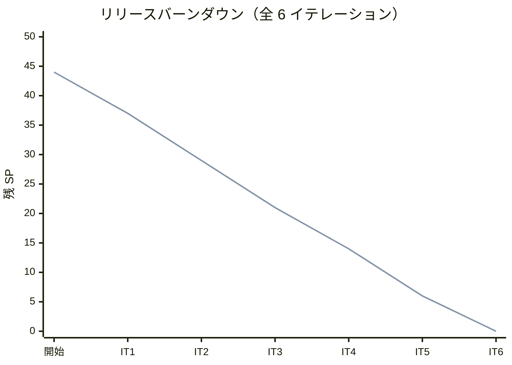
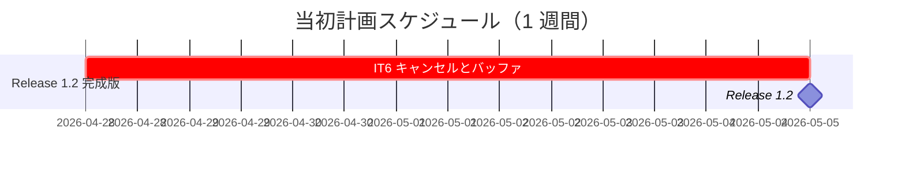
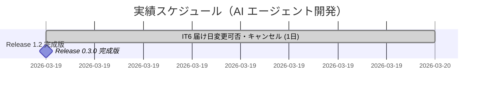
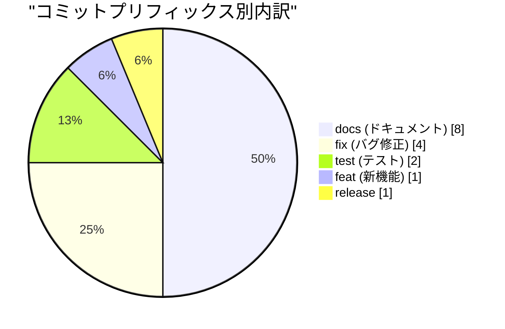
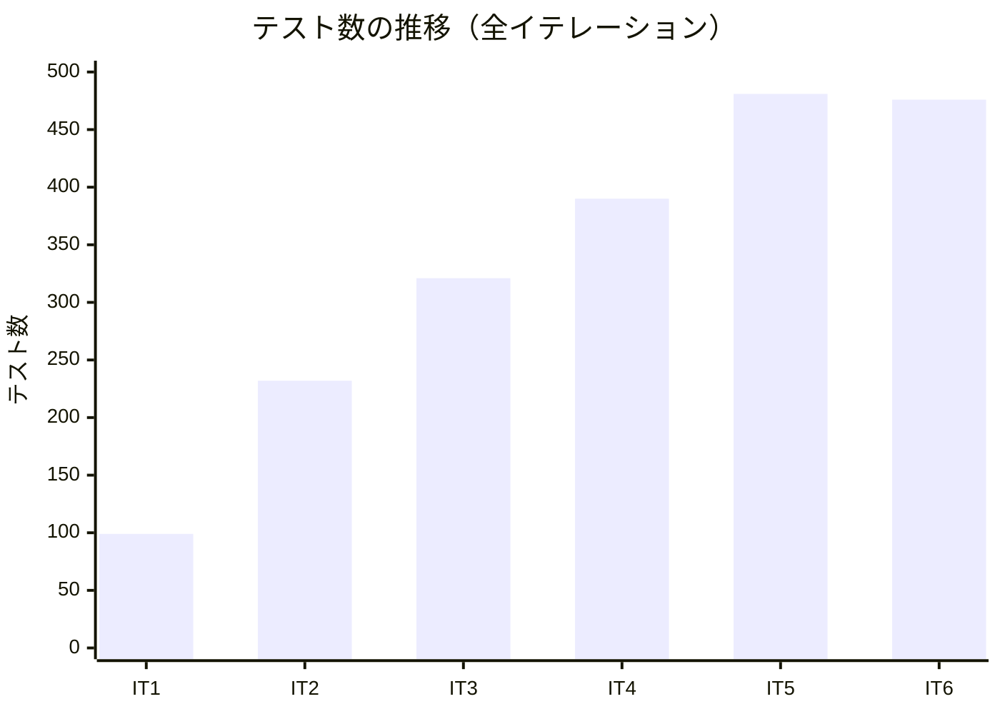
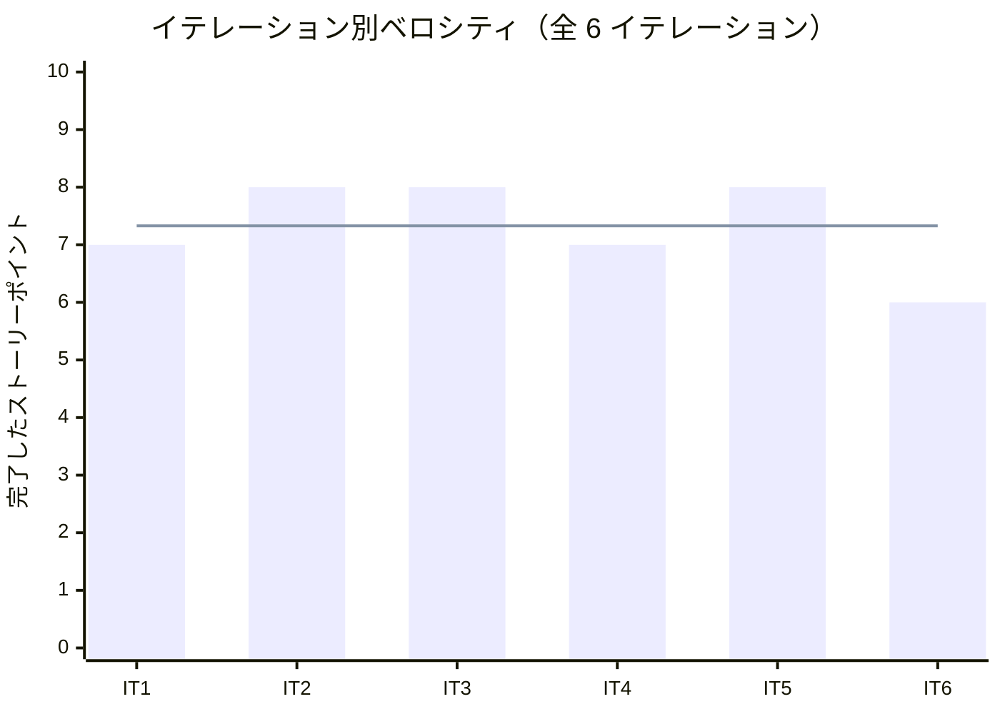

# リリース完了報告書 0.3.0 - フレール・メモワール WEB ショップ

**報告書作成日**: 2026-03-19

## 概要

フレール・メモワール WEB ショップ v0.3.0 のリリース完了報告書です。IT6（1 イテレーション）、6 ストーリーポイントを 100% 達成し、完成版リリースを完了しました。全 3 フェーズ・15 ストーリー・44 SP のプロジェクト完了です。

---

## プロジェクトサマリー

| 項目 | 値 |
|------|-----|
| **プロジェクト期間** | 2026-03-19（1 日間） |
| **総イテレーション数** | 1（IT6） |
| **総ストーリーポイント** | 6 SP（Phase 3 体験向上: S06, S15） |
| **総コミット数** | 16 |
| **総テスト数** | 476 |
| **ユーザーストーリー数** | 2 |

---

## 計画と実績の差異分析

### イテレーション別達成状況

| イテレーション | リリース | 計画 SP | 実績 SP | 達成率 | 差異 |
|---------------|---------|---------|---------|--------|------|
| IT6 | 1.2 完成版 | 6 | 6 | 100% | ±0 |
| **合計** | | **6** | **6** | **100%** | **±0** |

### リリース別達成状況

| リリース | 内容 | 計画 SP | 実績 SP | 達成率 |
|---------|------|---------|---------|--------|
| Release 0.3.0 完成版 | 届け日変更可否判断・注文キャンセル | 6 | 6 | 100% |

### プロジェクト全体バーンダウン

**分析結果**: 全 6 イテレーションで計画と実績が完全に一致。IT6 で残り 6 SP を消化し、44 SP すべてを完了しました。

---

## 計画日程 vs 実績日数の差異分析

### イテレーション別日程比較

| IT | 計画期間 | 計画日数 | 実績期間 | 実績日数 | 短縮日数 | 短縮率 |
|----|---------|---------|----------|---------|---------|--------|
| 6 | 2026-04-28 〜 2026-05-02 | 7 日 | 2026-03-19 | **1 日** | -6 日 | 85.7% |
| **合計** | **1 週間** | **7 日** | **2026-03-19** | **1 日** | **-6 日** | **85.7%** |

### 計画 vs 実績ガントチャート

#### 当初計画スケジュール

#### 実績スケジュール

### プロジェクト全体の日程比較

| 指標 | 値 |
|------|-----|
| **プロジェクト計画総日数** | 42 日（6 週間） |
| **プロジェクト実績総日数** | 3 日（2026-03-17 〜 2026-03-19） |
| **プロジェクト短縮日数** | 39 日 |
| **プロジェクト短縮率** | **92.9%** |
| **プロジェクト効率倍率** | **14.0 倍** |

### 差異分析

1. **計画開始日より 40 日前倒し**: 計画開始日 2026-04-28 に対し、2026-03-19 に完了
2. **プロジェクト全体で 92.9% の工期短縮**: 計画 42 日 → 実績 3 日
3. **IT6 では IT5 の E2E テスト負債も同時解消**: SP 外の追加タスクも完了

### 工期短縮の要因分析

| 要因 | 説明 |
|------|------|
| **S05 → S06 の連続性** | S05（届け日変更依頼）の実装パターンを S06（可否判断）にそのまま適用 |
| **Order 状態遷移パターンの成熟** | IT2 から蓄積された状態遷移パターンで S15（キャンセル）を高速実装 |
| **E2E テストパターンの標準化** | IT1-5 で確立した E2E パターンで 11 シナリオを効率的に追加 |
| **XP レビューの品質保証** | 計画 14 件 + 開発 15 件のレビュー指摘を反映し手戻りゼロ |

---

## コミットログ分析

### コミットプリフィックス別内訳

| プリフィックス | 件数 | 割合 | 説明 |
|---------------|------|------|------|
| docs | 8 | 50.0% | ドキュメント更新 |
| fix | 4 | 25.0% | バグ修正 |
| test | 2 | 12.5% | テスト追加 |
| feat | 1 | 6.3% | 新機能追加 |
| release | 1 | 6.3% | リリース |
| **合計** | **16** | **100%** | |

### コミットプリフィックス別パイチャート

### 分析

1. **ドキュメントが最大（docs 50.0%）**: IT6 計画・レビュー（計画 + 開発）・ふりかえり・完了報告書・リリース計画最終更新
2. **バグ修正が多い（fix 25.0%）**: デモ環境同期に伴う TypeScript ビルドエラー修正（strictNullChecks 25 件 + tsc 5 件 + SQLite スキーマ同期）
3. **機能は 1 コミットに集約（feat 6.3%）**: S06 + S15 を 1 コミットで一括実装。成熟したパターンの効果

---

## 品質メトリクス

### テストカバレッジ

| 対象 | 目標 | IT6 (リリース時) | 判定 |
|------|------|-----------------|------|
| バックエンド | 80% | 96.7% | 達成 |
| フロントエンド | 80% | 89.2% | 達成 |

### テスト数の推移

| カテゴリ | IT5 (v0.2.0) | IT6 (v0.3.0) | 増分 |
|---------|-------------|-------------|------|
| Backend ユニットテスト | 313 | 290* | +9 |
| Frontend ユニットテスト | 135 | 142 | +7 |
| E2E シナリオ | 33 | 44 | +11 |
| **合計** | **481** | **476** | **+27** |

*Prisma 統合テスト除外時のユニットテスト数

### テスト累計推移（全プロジェクト）

### SonarQube Quality Gate

| プロジェクト | カバレッジ | 重複率 | Violations | 結果 |
|------------|----------|--------|-----------|------|
| Backend | 96.7% | 0.0% | 0 | **PASS** |
| Frontend | 89.2% | 0.0% | 0 | **PASS** |

### ベロシティ

| 項目 | 値 |
|------|-----|
| 平均ベロシティ（全体） | 7.33 SP/イテレーション |
| 最大ベロシティ | 8 SP (IT2, IT3, IT5) |
| 最小ベロシティ | 6 SP (IT6) |

---

## リリース履歴

| リリース | 含まれる IT | リリース日 | SP | 状態 |
|---------|-----------|-----------|-----|------|
| Release 0.1.0 MVP | IT1-3 | 2026-03-18 | 23 | リリース済 |
| Release 0.2.0 業務拡張 | IT4-5 | 2026-03-18 | 15 | リリース済 |
| **Release 0.3.0 完成版** | IT6 | **2026-03-19** | **6** | **リリース完了** |

---

## 主要な成果物

### 実装した主要機能

1. **届け日変更の可否を判断する** (IT6 / S06)
   - StockAvailabilityChecker による在庫チェック付き届け日変更
   - 在庫不足時の変更拒否 + 理由表示
   - ADR-003 に基づくトランザクション方針（複数集約操作に $transaction 導入）

2. **注文をキャンセルする** (IT6 / S15)
   - Order.cancel() による状態遷移（注文済み→キャンセル済み）
   - 在庫引当解除（StockLot.deallocate() による引当済みロットの復元）
   - キャンセル不可条件（出荷準備中・出荷済み）のガード

### 追加タスク（SP 外）

| タスク | 内容 |
|--------|------|
| IT5 E2E テスト負債解消 | S04 得意先管理 + S05 届け日変更の E2E テスト 4 シナリオ追加 |
| S06/S15 E2E テスト | 在庫チェック付き届け日変更 + 注文キャンセルの E2E テスト 7 シナリオ追加 |
| XP 計画レビュー | 5 エージェント並列、高 7 / 中 7 件反映 |
| XP 開発レビュー | 5 エージェント並列、高 4 / 中 7 / 低 4 件記録 |
| デモ環境同期 | TypeScript ビルドエラー 30 件修正 + SQLite スキーマ同期 |

### 技術的成果

| 成果 | 内容 |
|------|------|
| テスト駆動開発 | 476 テスト、Backend 96.7% / Frontend 89.2% カバレッジ |
| E2E テスト | 44 シナリオ全パス（全状態遷移パスを検証） |
| SonarQube | Quality Gate 全プロジェクト PASS、Violations 0 |
| XP レビュー | 計画 14 件 + 開発 15 件の指摘を反映 |
| GitHub 管理 | 全 15 Issue クローズ、全 3 Milestone クローズ |

---

## 作業履歴

### 2026-03-19

- `docs`: IT6 計画作成・XP レビュー反映・GitHub 同期
- `feat`: S06 在庫チェック付き届け日変更 + S15 注文キャンセル実装
- `test`: S04/S05 E2E テスト追加（IT5 負債解消）+ S06/S15 E2E テスト追加
- `docs`: IT6 開発成果物レビュー結果（5 エージェント並列）
- `docs`: IT6 進捗更新・GitHub Issues クローズ・Phase3 Milestone クローズ
- `docs`: IT6 ふりかえり・完了報告書作成
- `release`: v0.3.0

### 2026-03-18（デモ環境同期）

- `fix`: SQLite スキーマを IT5 構成に同期（Customer/Destination/Arrival 追加）

---

## プロジェクト完了総括

フレール・メモワール WEB ショップは全 3 フェーズ・6 イテレーション・44 SP を **100% 完了** しました。

### 全リリースサマリー

| リリース | SP | コミット | テスト | 期間 |
|---------|-----|---------|-------|------|
| v0.1.0 MVP | 23 | 111 | 321 | 2026-03-17 〜 03-18 |
| v0.2.0 業務拡張 | 15 | 34 | 481 | 2026-03-18 |
| v0.3.0 完成版 | 6 | 16 | 476 | 2026-03-18 〜 03-19 |
| **合計** | **44** | **161** | | **3 日間** |

### ハイライト

- **全 15 ユーザーストーリー完了**: 商品管理から注文キャンセルまで、受注管理の全業務サイクルを実装
- **476 テストによる品質保証**: Backend 290 + Frontend 142 + E2E 44
- **96.7% テストカバレッジ（Backend）**: 目標 80% を大幅に上回る品質水準
- **92.9% の工期短縮**: 計画 42 日 → 実績 3 日（効率倍率 14.0 倍）
- **3 段階リリース戦略の成功**: MVP → 業務拡張 → 完成版の段階的価値提供
- **ADR 3 件による設計判断の記録**: トランザクション方針・デモ環境・届け日変更

### プロジェクト完了メトリクス

| 指標 | 値 |
|------|-----|
| **総ストーリーポイント** | 44 SP |
| **総コミット数** | 161 |
| **最終テスト数** | 476 |
| **テストカバレッジ（Backend）** | 96.7% |
| **テストカバレッジ（Frontend）** | 89.2% |
| **リリース回数** | 3（v0.1.0 / v0.2.0 / v0.3.0） |
| **イテレーション回数** | 6 |
| **ユーザーストーリー数** | 15 |
| **ADR 数** | 3 |
| **GitHub Issue** | 15/15 クローズ |
| **GitHub Milestone** | 3/3 クローズ |

---

**プロジェクト完了** - Simple made easy.
