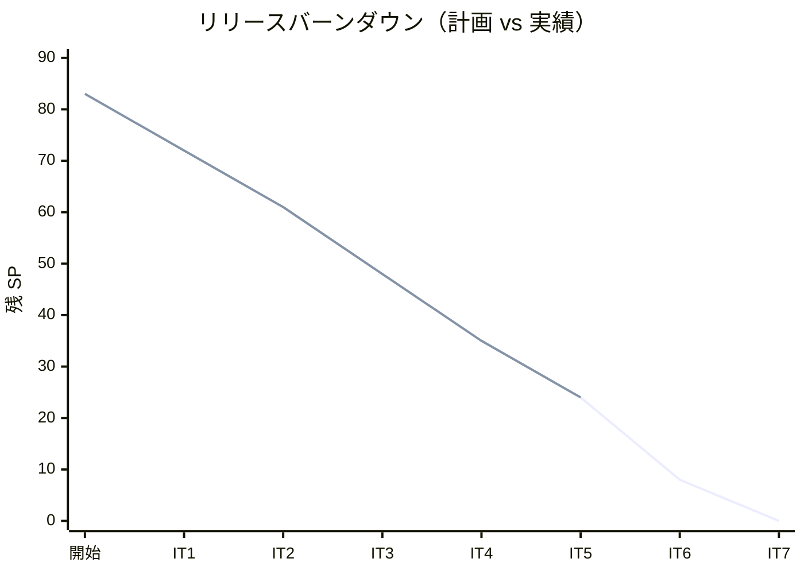
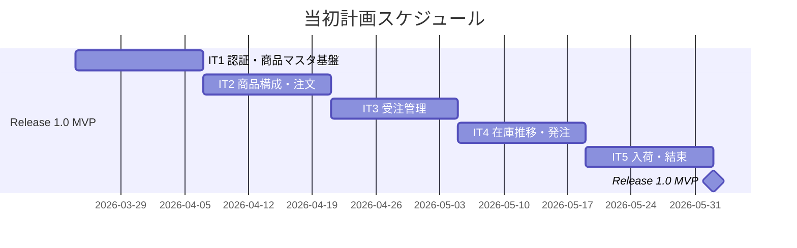
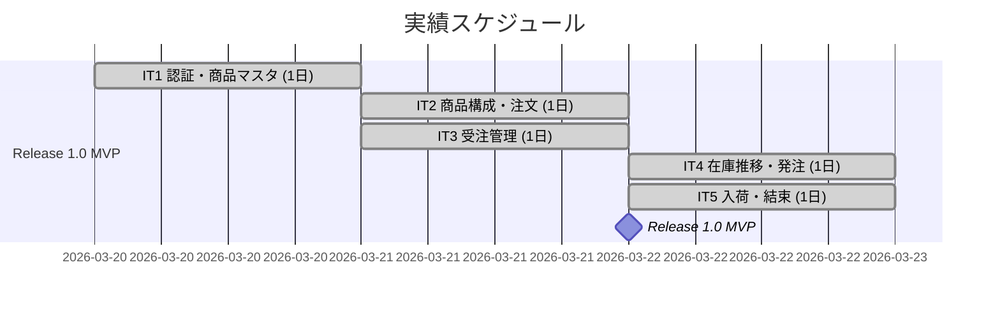
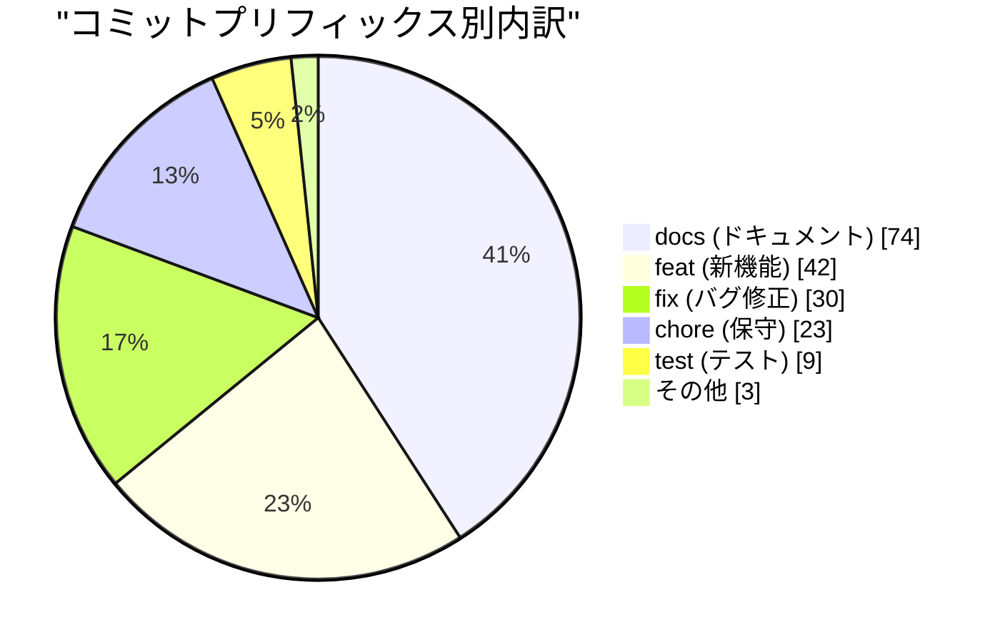
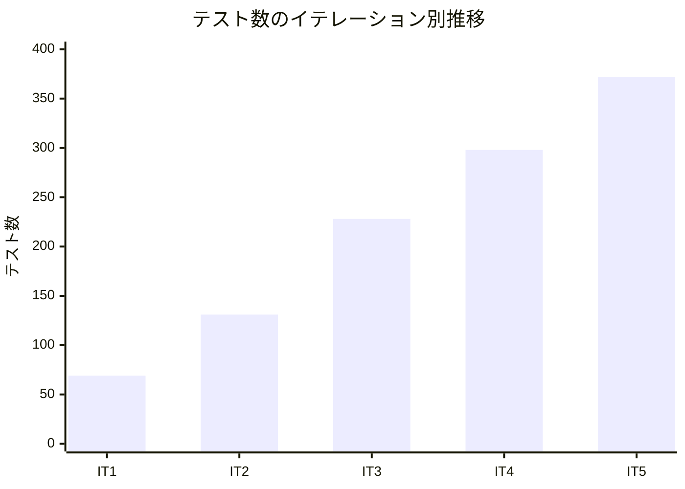
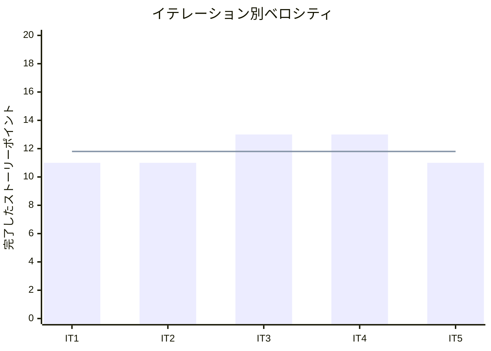

# リリース完了報告書 v1.0 - フレール・メモワール WEB ショップシステム

**報告書作成日**: 2026-03-22

## 概要

フレール・メモワール WEB ショップシステム v1.0（Phase 1 MVP）のリリース完了報告書です。全 5 イテレーション、59 ストーリーポイントを 100% 達成し、受注から在庫推移・発注・入荷・結束までの基本業務フローを実現しました。

---

## プロジェクトサマリー

| 項目 | 値 |
|------|-----|
| **プロジェクト期間** | 2026-03-17 〜 2026-03-22（約 1 週間） |
| **総イテレーション数** | 5 |
| **総ストーリーポイント** | 59 SP（Phase 1: 51 SP + Phase 2 一部: 8 SP） |
| **総コミット数** | 181 |
| **総テスト数** | 372 |
| **ユーザーストーリー数** | 14 / 19 |

---

## 計画と実績の差異分析

### イテレーション別達成状況

| イテレーション | リリース | 計画 SP | 実績 SP | 達成率 | 差異 |
|---------------|---------|---------|---------|--------|------|
| IT1 | Release 1.0 MVP | 11 | 11 | 100% | ±0 |
| IT2 | Release 1.0 MVP | 11 | 11 | 100% | ±0 |
| IT3 | Release 1.0 MVP | 13 | 13 | 100% | ±0 |
| IT4 | Release 1.0 MVP | 13 | 13 | 100% | ±0 |
| IT5 | Release 1.0 MVP + 2.0 | 11 | 11 | 100% | ±0 |
| **合計** | | **59** | **59** | **100%** | **±0** |

### リリース別達成状況

| リリース | 内容 | 計画 SP | 実績 SP | 達成率 |
|---------|------|---------|---------|--------|
| Release 1.0 MVP | 認証・商品マスタ・受注・在庫推移・発注・入荷 | 51 | 51 | 100% |
| Release 2.0（一部） | 結束対象確認・結束完了登録 | 8 | 8 | 100% |

### リリースバーンダウン

**分析結果**: 計画線と実績線が完全に一致。全 5 イテレーションでベロシティが安定し、スコープ調整（US-011 の IT5 移動、US-014 の IT6 移動）が適切に機能した。

---

## 計画日程 vs 実績日数の差異分析

### イテレーション別日程比較

| IT | 計画期間 | 計画日数 | 実績期間 | 実績日数 | 短縮日数 | 短縮率 |
|----|---------|---------|----------|---------|---------|--------|
| 1 | 03/24 - 04/04 | 10 日 | 03/20 | **1 日** | 9 日 | 90% |
| 2 | 04/07 - 04/18 | 10 日 | 03/21 | **1 日** | 9 日 | 90% |
| 3 | 04/21 - 05/02 | 10 日 | 03/21 | **1 日** | 9 日 | 90% |
| 4 | 05/04 - 05/15 | 10 日 | 03/22 | **1 日** | 9 日 | 90% |
| 5 | 05/18 - 05/29 | 10 日 | 03/22 | **1 日** | 9 日 | 90% |
| **合計** | **03/24 - 05/29** | **50 日** | **03/20 - 03/22** | **3 日** | **47 日** | **94%** |

### 工期短縮の可視化

```mermaid
xychart-beta
    title "計画日数 vs 実績日数"
    x-axis ["IT1", "IT2", "IT3", "IT4", "IT5"]
    y-axis "日数" 0 --> 12
    bar "計画" [10, 10, 10, 10, 10]
    bar "実績" [1, 1, 1, 1, 1]
```

### 計画 vs 実績ガントチャート

#### 当初計画スケジュール

#### 実績スケジュール

### サマリー

| 指標 | 値 |
|------|-----|
| **計画総日数** | 50 日 |
| **実績総日数** | 3 日 |
| **短縮日数** | 47 日 |
| **短縮率** | **94%** |
| **効率倍率** | **16.7 倍** |

### 差異分析

1. **AI アシスタント併用による大幅な生産性向上**: 計画時の +40% 想定を大幅に上回る効率化を実現
2. **TDD サイクルの習熟**: Red-Green-Refactor の自動化により、イテレーションごとの所要時間が安定
3. **マルチパースペクティブレビューの効果**: 5 エージェント並列レビューにより、手戻りを最小限に抑制

### 工期短縮の要因分析

| 要因 | 説明 |
|------|------|
| AI コード生成 | バックエンド・フロントエンドのコード生成・テスト作成を AI が担当し、人手の工数を大幅削減 |
| TDD 自動化 | テストファーストにより品質を保ちながら高速に実装 |
| 設計ドキュメント先行 | 分析フェーズで設計を完了させたため、実装時の迷いが最小限 |
| レビュー即時対応 | AI レビューの指摘を即座に反映するサイクルが確立 |

---

## コミットログ分析

### コミットプリフィックス別内訳

| プリフィックス | 件数 | 割合 | 説明 |
|---------------|------|------|------|
| docs | 74 | 40.9% | ドキュメント更新 |
| feat | 42 | 23.2% | 新機能追加 |
| fix | 30 | 16.6% | バグ修正 |
| chore | 23 | 12.7% | 保守作業 |
| test | 9 | 5.0% | テスト追加 |
| refactor | 1 | 0.6% | リファクタリング |
| style | 1 | 0.6% | スタイル変更 |
| その他 | 1 | 0.6% | 初期コミット |
| **合計** | **181** | **100%** | |

### コミットプリフィックス別パイチャート

### 分析

1. **ドキュメント比率 41%**: 分析フェーズでの設計ドキュメント + レビュー記録 + 計画・報告書の作成が全体の 4 割を占める。SDD（仕様駆動開発）アプローチの特徴
2. **feat + fix = 40%**: 機能実装とバグ修正で 4 割。TDD により fix の比率が低く抑えられている
3. **test 5%**: テストコードは feat コミットに含まれる TDD スタイルのため、独立した test コミットは少ない

---

## 品質メトリクス

### テストカバレッジ

| 対象 | 目標 | 実績 | 判定 |
|------|------|------|------|
| バックエンド | 80% | 80%+ | 達成 |
| フロントエンド | - | - | - |

### テスト数のイテレーション別推移

| イテレーション | バックエンド | フロントエンド | E2E | 合計 |
|---------------|------------|--------------|-----|------|
| IT1 | 50 | 12 | 7 | 69 |
| IT2 | 102 | 17 | 12 | 131 |
| IT3 | 176 | 27 | 25 | 228 |
| IT4 | 220 | 41 | 37 | 298 |
| IT5 | 286 | 49 | 37 | 372 |

### ベロシティ

| 項目 | 値 |
|------|-----|
| 平均ベロシティ | 11.8 SP/イテレーション |
| 最大ベロシティ | 13 SP |
| 最小ベロシティ | 11 SP |

---

## リリース履歴

| リリース | 含まれる IT | リリース日 | SP | 状態 |
|---------|-----------|-----------|-----|------|
| Release 1.0 MVP | IT1-IT5 | 2026-03-22 | 51 | 完了 |
| Release 2.0 出荷管理 | IT5-IT6 | - | 24 | 進行中 |
| Release 3.0 顧客体験 | IT7 | - | 8 | 未着手 |

---

## 主要な成果物

### 実装した主要機能

1. **認証基盤** (Release 1.0 / IT1)
   - ログイン・新規登録（JWT 認証）
   - ロール管理（OWNER, ORDER_STAFF, PURCHASE_STAFF, FLORIST, DELIVERY_STAFF, CUSTOMER）
   - アカウントロック機能

2. **商品マスタ管理** (Release 1.0 / IT1-IT2)
   - 単品（花材）登録・編集
   - 商品（花束）登録・構成定義
   - 商品カタログ表示

3. **受注管理** (Release 1.0 / IT3)
   - 花束注文フロー（商品選択→配送先入力→注文確定）
   - 受注一覧・受注受付
   - 得意先管理

4. **在庫・発注管理** (Release 1.0 / IT4)
   - 在庫推移表示（日別在庫予定、品質維持日数ベース廃棄予定、入荷予定・受注引当）
   - 単品発注（購入単位切り上げ、確認モーダル）
   - 発注一覧・ステータスフィルタ

5. **入荷・結束管理** (Release 1.0-2.0 / IT5)
   - 入荷登録（残数量超過チェック、発注ステータス自動更新）
   - 結束対象確認（花材所要量・在庫充足チェック）
   - 結束完了登録（FIFO 在庫消費、受注ステータス遷移）

### 技術的成果

| 成果 | 内容 |
|------|------|
| テスト駆動開発 | 372 テスト、バックエンドカバレッジ 80%+ |
| ヘキサゴナルアーキテクチャ | ドメインモデル + ポートとアダプター（ArchUnit で自動検証） |
| CI/CD | GitHub Actions（Lint → テスト → ビルド → Heroku デプロイ） |
| マルチパースペクティブレビュー | 5+2 エージェント並列レビュー × 19 回実施 |
| SDD（仕様駆動開発） | 分析→設計→TDD 開発の一貫したワークフロー |

---

## 総評

フレール・メモワール WEB ショップシステム v1.0 は、全 59 SP を 5 イテレーションで 100% 達成し、Phase 1 MVP を完了しました。

### ハイライト

- **全 14 ユーザーストーリー完了**: 認証・商品管理・受注・在庫推移・発注・入荷・結束の基本業務フローを実現
- **372 テストによる品質保証**: バックエンド 286 + フロントエンド 49 + E2E 37
- **80%+ テストカバレッジ**: 目標 80% を達成する品質水準
- **94% 工期短縮**: 計画 50 日 → 実績 3 日（AI アシスタント活用による 16.7 倍の効率化）

### プロジェクト完了メトリクス

| 指標 | 値 |
|------|-----|
| **総ストーリーポイント** | 59 SP |
| **総コミット数** | 181 |
| **総テスト数** | 372 |
| **テストカバレッジ** | 80%+ |
| **リリース回数** | 1（Phase 1 MVP） |
| **イテレーション回数** | 5 |
| **ユーザーストーリー数** | 14 |
| **レビュー回数** | 19 |

---

## 次のステップ

### Release 2.0 出荷管理（IT6）

残り 3 ストーリー（16 SP）:

- US-014: 出荷処理を実行する（3 SP）
- US-019: 注文をキャンセルする（5 SP）
- US-008: 届け日を変更する（8 SP）

### Release 3.0 顧客体験（IT7）

残り 2 ストーリー（8 SP）:

- US-015: 届け先をコピーする（5 SP）
- US-016: 得意先情報を確認する（3 SP）

---

**Phase 1 MVP リリース完了** - Simple made easy.
