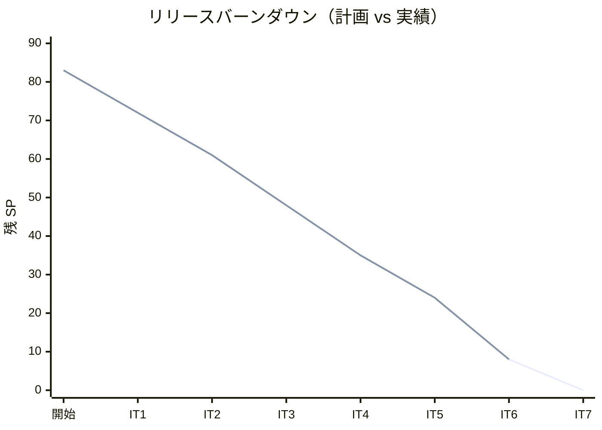
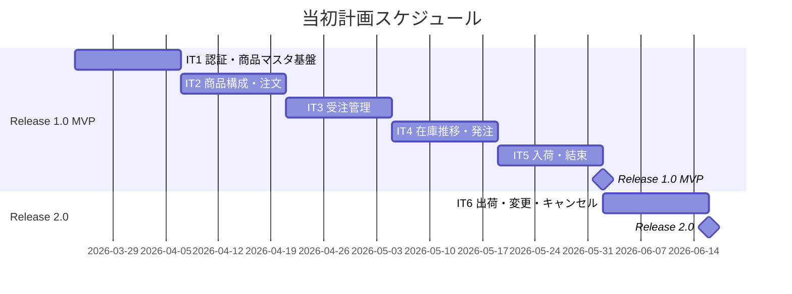
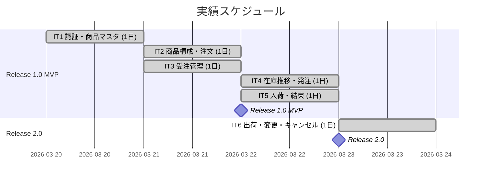
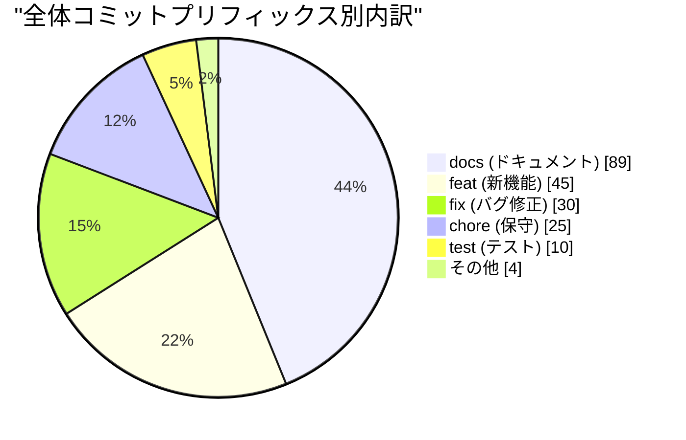
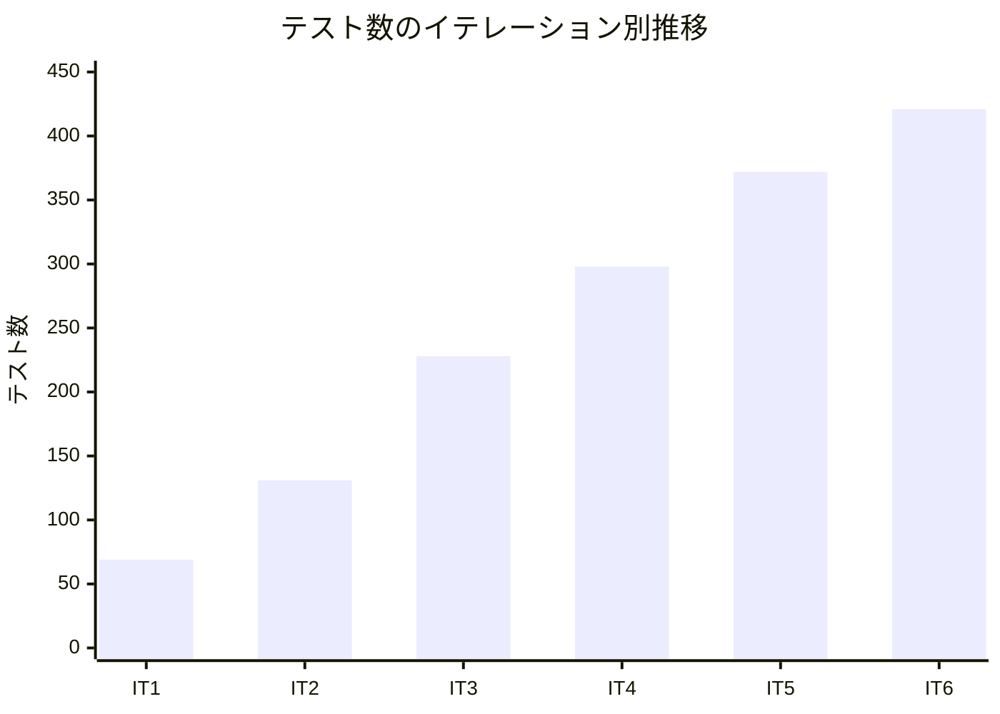
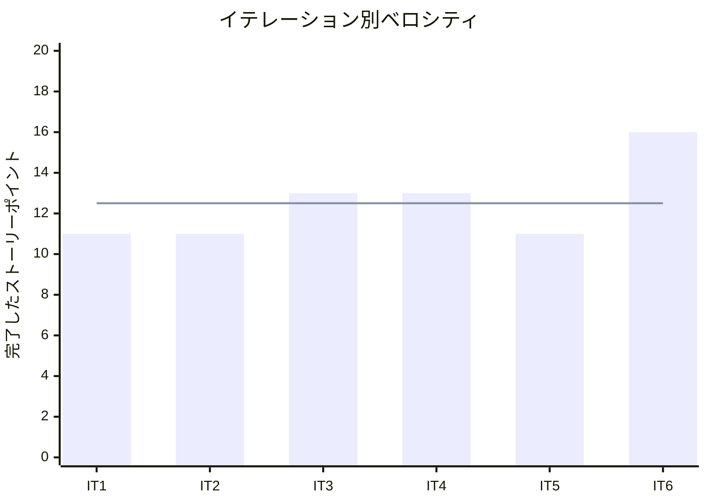

# リリース完了報告書 v2.0 - フレール・メモワール WEB ショップシステム

**報告書作成日**: 2026-03-23

## 概要

フレール・メモワール WEB ショップシステム v2.0（Phase 2 出荷管理・変更対応）のリリース完了報告書です。全 6 イテレーション、75 ストーリーポイントを 100% 達成し、結束から出荷までの後工程と届け日変更・キャンセルの柔軟な対応を実現しました。

---

## プロジェクトサマリー

| 項目 | 値 |
|------|-----|
| **プロジェクト期間** | 2026-03-17 〜 2026-03-23（約 1 週間） |
| **総イテレーション数** | 6 |
| **総ストーリーポイント** | 75 SP（Phase 1: 51 SP + Phase 2: 24 SP） |
| **総コミット数** | 203 |
| **総テスト数** | 421 |
| **ユーザーストーリー数** | 17 / 19 |

---

## 計画と実績の差異分析

### イテレーション別達成状況

| イテレーション | リリース | 計画 SP | 実績 SP | 達成率 | 差異 |
|---------------|---------|---------|---------|--------|------|
| IT1 | Release 1.0 MVP | 11 | 11 | 100% | ±0 |
| IT2 | Release 1.0 MVP | 11 | 11 | 100% | ±0 |
| IT3 | Release 1.0 MVP | 13 | 13 | 100% | ±0 |
| IT4 | Release 1.0 MVP | 13 | 13 | 100% | ±0 |
| IT5 | Release 1.0 MVP + 2.0 | 11 | 11 | 100% | ±0 |
| IT6 | Release 2.0 | 16 | 16 | 100% | ±0 |
| **合計** | | **75** | **75** | **100%** | **±0** |

### リリース別達成状況

| リリース | 内容 | 計画 SP | 実績 SP | 達成率 |
|---------|------|---------|---------|--------|
| Release 1.0 MVP | 認証・商品マスタ・受注・在庫推移・発注・入荷 | 51 | 51 | 100% |
| Release 2.0 出荷管理 | 結束・出荷・キャンセル・届け日変更 | 24 | 24 | 100% |

### リリースバーンダウン

**分析結果**: 計画線と実績線が完全に一致。全 6 イテレーションでベロシティが安定し、IT6 では最大の 16 SP を消化。スコープ調整（US-011 の IT5 移動、US-014 の IT6 移動）が適切に機能した。

---

## 計画日程 vs 実績日数の差異分析

### イテレーション別日程比較

| IT | 計画期間 | 計画日数 | 実績期間 | 実績日数 | 短縮日数 | 短縮率 |
|----|---------|---------|----------|---------|---------|--------|
| 1 | 03/24 - 04/04 | 10 日 | 03/20 | **1 日** | 9 日 | 90% |
| 2 | 04/07 - 04/18 | 10 日 | 03/21 | **1 日** | 9 日 | 90% |
| 3 | 04/21 - 05/02 | 10 日 | 03/21 | **1 日** | 9 日 | 90% |
| 4 | 05/04 - 05/15 | 10 日 | 03/22 | **1 日** | 9 日 | 90% |
| 5 | 05/18 - 05/29 | 10 日 | 03/22 | **1 日** | 9 日 | 90% |
| 6 | 06/01 - 06/12 | 10 日 | 03/23 | **1 日** | 9 日 | 90% |
| **合計** | **03/24 - 06/12** | **60 日** | **03/20 - 03/23** | **4 日** | **56 日** | **93%** |

### 工期短縮の可視化

```mermaid
xychart-beta
    title "計画日数 vs 実績日数"
    x-axis ["IT1", "IT2", "IT3", "IT4", "IT5", "IT6"]
    y-axis "日数" 0 --> 12
    bar "計画" [10, 10, 10, 10, 10, 10]
    bar "実績" [1, 1, 1, 1, 1, 1]
```

### 計画 vs 実績ガントチャート

#### 当初計画スケジュール

#### 実績スケジュール

### サマリー

| 指標 | 値 |
|------|-----|
| **計画総日数** | 60 日 |
| **実績総日数** | 4 日 |
| **短縮日数** | 56 日 |
| **短縮率** | **93%** |
| **効率倍率** | **15.0 倍** |

### 差異分析

1. **AI アシスタント併用による大幅な生産性向上**: 計画時の +40% 想定を大幅に上回る効率化を実現
2. **IT6 で最大 SP（16 SP）を消化**: Phase 2 のドメインロジック（キャンセル・届け日変更・出荷）が Phase 1 で確立したパターンに沿って効率的に実装できた
3. **マルチパースペクティブレビューの累積効果**: 6 イテレーション分のレビュー蓄積により、設計品質が安定

### 工期短縮の要因分析

| 要因 | 説明 |
|------|------|
| AI コード生成 | バックエンド・フロントエンドのコード生成・テスト作成を AI が担当し、人手の工数を大幅削減 |
| TDD 自動化 | テストファーストにより品質を保ちながら高速に実装 |
| 設計ドキュメント先行 | 分析フェーズで設計を完了させたため、実装時の迷いが最小限 |
| パターンの再利用 | Phase 1 で確立したヘキサゴナルアーキテクチャの実装パターンを Phase 2 で再利用 |

---

## コミットログ分析

### 全体コミットプリフィックス別内訳

| プリフィックス | 件数 | 割合 | 説明 |
|---------------|------|------|------|
| docs | 89 | 43.8% | ドキュメント更新 |
| feat | 45 | 22.2% | 新機能追加 |
| fix | 30 | 14.8% | バグ修正 |
| chore | 25 | 12.3% | 保守作業 |
| test | 10 | 4.9% | テスト追加 |
| refactor | 2 | 1.0% | リファクタリング |
| style | 1 | 0.5% | スタイル変更 |
| その他 | 1 | 0.5% | 初期コミット |
| **合計** | **203** | **100%** | |

### Phase 2（IT6）コミット内訳

| プリフィックス | 件数 | 割合 | 説明 |
|---------------|------|------|------|
| docs | 15 | 68.2% | レビュー・計画・報告書 |
| feat | 3 | 13.6% | 出荷・キャンセル・届け日変更 |
| chore | 2 | 9.1% | リリース準備・設定更新 |
| test | 1 | 4.5% | 統合テスト追加 |
| refactor | 1 | 4.5% | Clock 注入 |
| **合計** | **22** | **100%** | |

### コミットプリフィックス別パイチャート

### 分析

1. **ドキュメント比率 44%**: SDD（仕様駆動開発）アプローチにより、設計ドキュメント・レビュー記録・計画報告書が全体の約半数を占める
2. **Phase 2 の feat はわずか 3 コミット**: 出荷・キャンセル・届け日変更の各機能が 1 コミットで完結。Phase 1 のパターン確立により効率が大幅向上
3. **fix ゼロ（Phase 2）**: Phase 1 で 30 件あった fix が Phase 2 ではゼロ。TDD とレビューの成熟により品質が安定

---

## 品質メトリクス

### テストカバレッジ

| 対象 | 目標 | 実績 | 判定 |
|------|------|------|------|
| バックエンド | 80% | 80%+ | 達成 |
| フロントエンド | - | - | - |

### テスト数のイテレーション別推移

| イテレーション | バックエンド | フロントエンド | E2E | 合計 |
|---------------|------------|--------------|-----|------|
| IT1 | 50 | 12 | 7 | 69 |
| IT2 | 102 | 17 | 12 | 131 |
| IT3 | 176 | 27 | 25 | 228 |
| IT4 | 220 | 41 | 37 | 298 |
| IT5 | 286 | 49 | 37 | 372 |
| IT6 | 320 | 64 | 37 | 421 |

### テスト増分（IT5 → IT6）

| カテゴリ | IT5 | IT6 | 増減 |
|---------|-----|-----|------|
| バックエンドユニットテスト | 286 | 320 | +34 |
| フロントエンドユニットテスト | 49 | 64 | +15 |
| E2E テスト | 37 | 37 | ±0 |
| **合計** | **372** | **421** | **+49** |

### 静的解析

| 指標 | 結果 |
|------|------|
| ESLint | エラーなし |
| ArchUnit | パス（ヘキサゴナルアーキテクチャ準拠） |

### ベロシティ

| 項目 | 値 |
|------|-----|
| 平均ベロシティ | 12.5 SP/イテレーション |
| 最大ベロシティ | 16 SP（IT6） |
| 最小ベロシティ | 11 SP（IT1, IT2, IT5） |

---

## リリース履歴

| リリース | 含まれる IT | リリース日 | SP | 状態 |
|---------|-----------|-----------|-----|------|
| Release 1.0 MVP | IT1-IT5 | 2026-03-22 | 51 | 完了 |
| Release 2.0 出荷管理 | IT5-IT6 | 2026-03-23 | 24 | 完了 |
| Release 3.0 顧客体験 | IT7 | - | 8 | 未着手 |

---

## 主要な成果物

### Release 2.0 で実装した主要機能

1. **結束管理** (IT5)
   - 結束対象確認（花材所要量・在庫充足チェック）
   - 結束完了登録（FIFO 在庫消費、受注ステータス遷移）

2. **出荷処理** (IT6 / US-014)
   - 出荷対象一覧（PREPARING ステータスの受注を届け先情報付きで表示）
   - 出荷処理実行（PREPARING → SHIPPED ステータス遷移）

3. **注文キャンセル** (IT6 / US-019)
   - ORDERED/ACCEPTED の受注をキャンセル可能
   - PREPARING 以降はキャンセル不可（ガード条件）
   - キャンセル時の在庫引当解除

4. **届け日変更** (IT6 / US-008)
   - 受注詳細画面から届け日を変更
   - 在庫チェック + 代替日提案（最大 5 件、前後 14 日探索）
   - 変更不可時の理由表示と代替日サジェスト

### Release 1.0 からの累積成果

5. **認証基盤** (IT1)
   - JWT ベースのログイン・新規登録、ロール管理、アカウントロック

6. **商品マスタ管理** (IT1-IT2)
   - 単品（花材）・商品（花束）登録・構成定義・カタログ表示

7. **受注管理** (IT3)
   - 花束注文フロー、受注一覧・受注受付

8. **在庫・発注管理** (IT4)
   - 在庫推移表示、単品発注、発注一覧

9. **入荷管理** (IT5)
   - 入荷登録（残数量超過チェック、発注ステータス自動更新）

### 技術的成果

| 成果 | 内容 |
|------|------|
| テスト駆動開発 | 421 テスト、バックエンドカバレッジ 80%+ |
| ヘキサゴナルアーキテクチャ | ドメインモデル + ポートとアダプター（ArchUnit で自動検証） |
| CI/CD | GitHub Actions（Lint → テスト → ビルド → Heroku デプロイ） |
| マルチパースペクティブレビュー | 5+2 エージェント並列レビュー × 21 回実施 |
| SDD（仕様駆動開発） | 分析→設計→TDD 開発の一貫したワークフロー |
| Clock DI パターン | テスタビリティ向上のため Order.create と DeliveryDate に Clock 注入 |

---

## 総評

フレール・メモワール WEB ショップシステム v2.0 は、全 75 SP を 6 イテレーションで 100% 達成し、Phase 1 MVP + Phase 2 出荷管理を完了しました。

### ハイライト

- **全 17 ユーザーストーリー完了**: 認証・商品管理・受注・在庫推移・発注・入荷・結束・出荷・キャンセル・届け日変更の業務フローを実現
- **421 テストによる品質保証**: バックエンド 320 + フロントエンド 64 + E2E 37
- **80%+ テストカバレッジ**: 目標 80% を達成する品質水準
- **93% 工期短縮**: 計画 60 日 → 実績 4 日（AI アシスタント活用による 15.0 倍の効率化）
- **2 段階リリース戦略の成功**: Phase 1 MVP → Phase 2 出荷管理の段階的リリースにより、リスクを最小化

### プロジェクト完了メトリクス

| 指標 | 値 |
|------|-----|
| **総ストーリーポイント** | 75 SP |
| **総コミット数** | 203 |
| **総テスト数** | 421 |
| **テストカバレッジ** | 80%+ |
| **リリース回数** | 2（Phase 1 MVP + Phase 2 出荷管理） |
| **イテレーション回数** | 6 |
| **ユーザーストーリー数** | 17 |
| **レビュー回数** | 21 |

---

## 次のステップ

### Release 3.0 顧客体験（IT7）

残り 2 ストーリー（8 SP）:

- US-015: 届け先をコピーする（5 SP）
- US-016: 得意先情報を確認する（3 SP）

### 残存課題

| 課題 | 優先度 | 対応時期 |
|------|--------|---------|
| StockStatus.DEGRADED 方針決定 | 低 | IT7 |

---

**Release 2.0 リリース完了** - Simple made easy.
