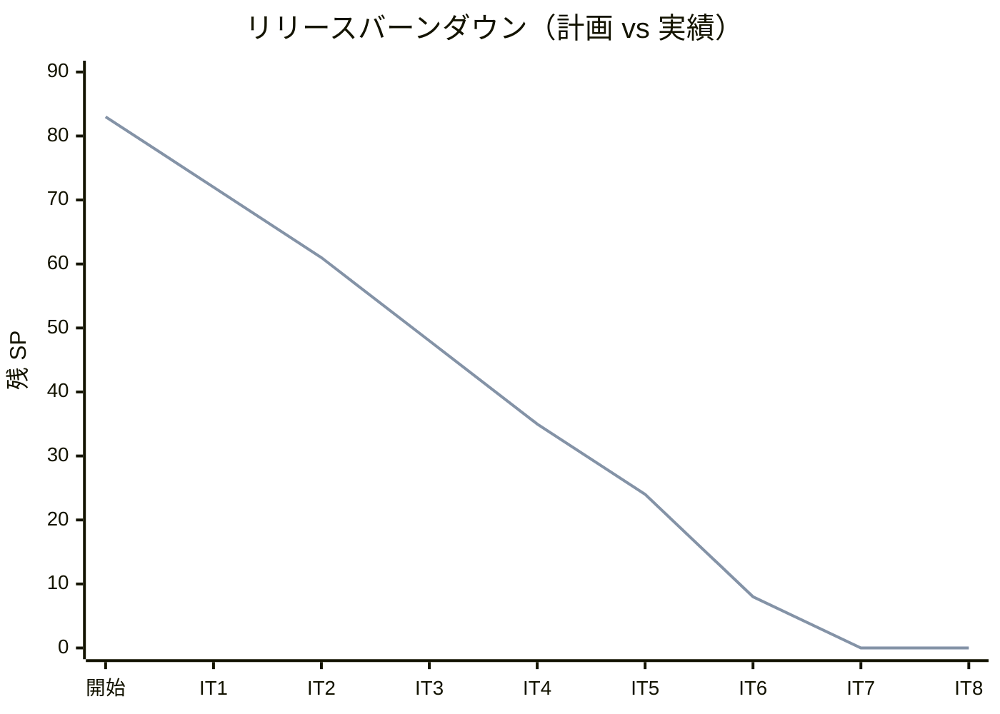
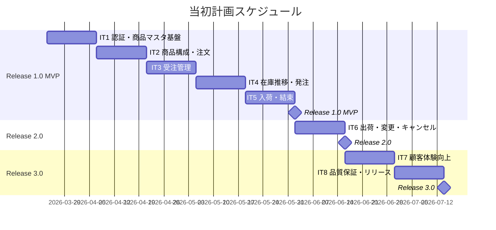
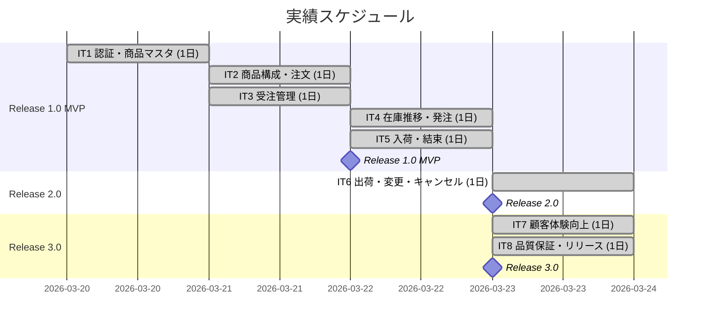
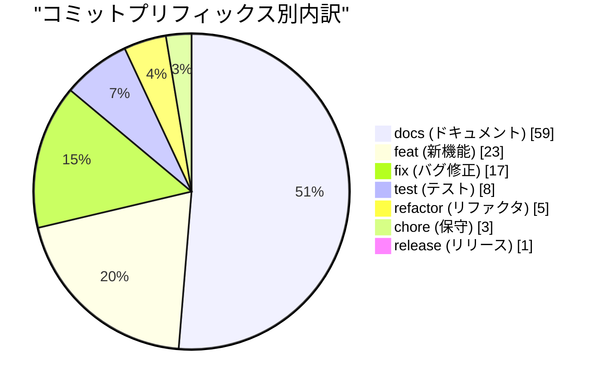
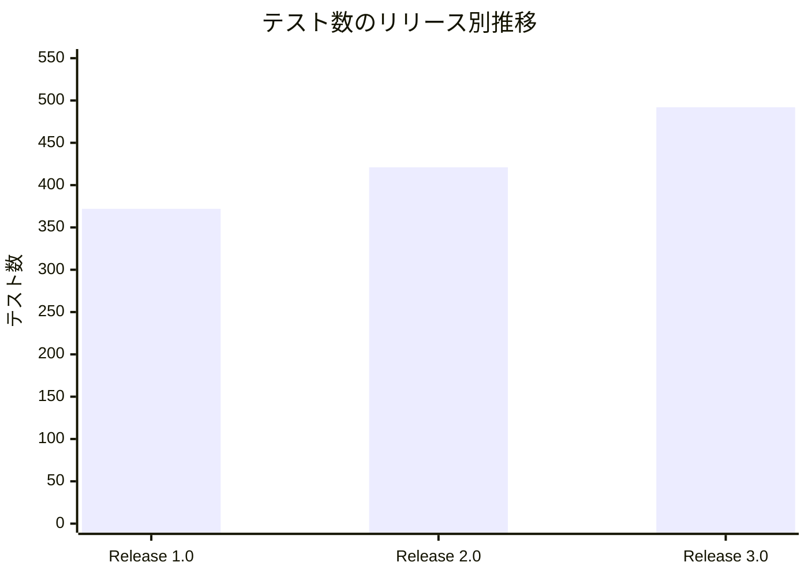
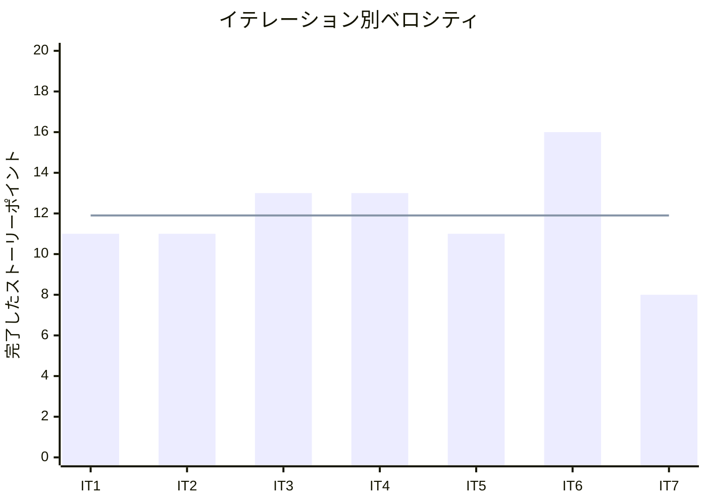

# リリース完了報告書 v3.0 - フレール・メモワール WEB ショップシステム

**報告書作成日**: 2026-03-23

## 概要

フレール・メモワール WEB ショップシステム v3.0（Phase 3 顧客体験向上）のリリース完了報告書です。全 8 イテレーション（7 実装 + 1 バッファ）、83 ストーリーポイントを 100% 達成し、受注から出荷までの全業務フローと顧客体験向上機能を実現しました。

---

## プロジェクトサマリー

| 項目 | 値 |
|------|-----|
| **プロジェクト期間** | 2026-03-20 〜 2026-03-23（4 日間） |
| **総イテレーション数** | 8（7 実装 + 1 バッファ） |
| **総ストーリーポイント** | 83 SP |
| **総コミット数** | 116 |
| **総テスト数** | 492（BE 371 + FE 78 + E2E 43） |
| **ユーザーストーリー数** | 19 / 19 |

---

## 計画と実績の差異分析

### イテレーション別達成状況

| イテレーション | リリース | 計画 SP | 実績 SP | 達成率 | 差異 |
|---------------|---------|---------|---------|--------|------|
| IT1 | Release 1.0 MVP | 11 | 11 | 100% | ±0 |
| IT2 | Release 1.0 MVP | 11 | 11 | 100% | ±0 |
| IT3 | Release 1.0 MVP | 13 | 13 | 100% | ±0 |
| IT4 | Release 1.0 MVP | 13 | 13 | 100% | ±0 |
| IT5 | Release 1.0 MVP + 2.0 | 11 | 11 | 100% | ±0 |
| IT6 | Release 2.0 | 16 | 16 | 100% | ±0 |
| IT7 | Release 3.0 | 8 | 8 | 100% | ±0 |
| IT8（バッファ） | Release 3.0 | 0 | 0 | 100% | ±0 |
| **合計** | | **83** | **83** | **100%** | **±0** |

### リリース別達成状況

| リリース | 内容 | 計画 SP | 実績 SP | 達成率 |
|---------|------|---------|---------|--------|
| Release 1.0 MVP | 認証・商品マスタ・受注・在庫推移・発注・入荷 | 51 | 51 | 100% |
| Release 2.0 出荷管理 | 結束・出荷・キャンセル・届け日変更 | 24 | 24 | 100% |
| Release 3.0 顧客体験 | 届け先コピー・得意先情報確認 | 8 | 8 | 100% |

### リリースバーンダウン

**分析結果**: 計画線と実績線が全イテレーションで完全に一致。スコープ調整（US-011 の IT5 移動、US-014 の IT6 移動）が適切に機能し、各イテレーションで計画通りの SP を消化した。IT8 バッファイテレーションでは品質保証タスクに集中し、Release 3.0 のリリース条件を全て達成した。

---

## 計画日程 vs 実績日数の差異分析

### イテレーション別日程比較

| IT | 計画期間 | 計画日数 | 実績期間 | 実績日数 | 短縮日数 | 短縮率 |
|----|---------|---------|----------|---------|---------|--------|
| 1 | 03/24 - 04/04 | 10 日 | 03/20 | **1 日** | 9 日 | 90% |
| 2 | 04/07 - 04/18 | 10 日 | 03/21 | **1 日** | 9 日 | 90% |
| 3 | 04/21 - 05/02 | 10 日 | 03/21 | **1 日** | 9 日 | 90% |
| 4 | 05/04 - 05/15 | 10 日 | 03/22 | **1 日** | 9 日 | 90% |
| 5 | 05/18 - 05/29 | 10 日 | 03/22 | **1 日** | 9 日 | 90% |
| 6 | 06/01 - 06/12 | 10 日 | 03/23 | **1 日** | 9 日 | 90% |
| 7 | 06/15 - 06/26 | 10 日 | 03/23 | **1 日** | 9 日 | 90% |
| 8 | 06/29 - 07/10 | 10 日 | 03/23 | **1 日** | 9 日 | 90% |
| **合計** | **03/24 - 07/10** | **80 日** | **03/20 - 03/23** | **4 日** | **76 日** | **95%** |

### 工期短縮の可視化

```mermaid
xychart-beta
    title "計画日数 vs 実績日数"
    x-axis ["IT1", "IT2", "IT3", "IT4", "IT5", "IT6", "IT7", "IT8"]
    y-axis "日数" 0 --> 12
    bar "計画" [10, 10, 10, 10, 10, 10, 10, 10]
    bar "実績" [1, 1, 1, 1, 1, 1, 1, 1]
```

### 計画 vs 実績ガントチャート

#### 当初計画スケジュール

#### 実績スケジュール

### サマリー

| 指標 | 値 |
|------|-----|
| **計画総日数** | 80 日 |
| **実績総日数** | 4 日 |
| **短縮日数** | 76 日 |
| **短縮率** | **95%** |
| **効率倍率** | **20.0 倍** |

### 差異分析

1. **AI アシスタント併用による圧倒的な生産性向上**: 計画時の +40% 想定を大幅に上回り、20 倍の効率化を実現
2. **パターン再利用による Phase 2/3 の加速**: Phase 1 で確立したヘキサゴナルアーキテクチャの実装パターンが Phase 2/3 で即座に適用でき、設計時間がほぼゼロ
3. **マルチパースペクティブレビューの累積効果**: 8 イテレーション分のレビュー蓄積により、設計品質が安定し手戻りが最小限

### 工期短縮の要因分析

| 要因 | 説明 |
|------|------|
| AI コード生成 | バックエンド・フロントエンドのコード生成・テスト作成を AI が担当し、人手の工数を大幅削減 |
| TDD 自動化 | テストファーストにより品質を保ちながら高速に実装 |
| 設計ドキュメント先行 | 分析フェーズで設計を完了させたため、実装時の迷いが最小限 |
| パターンの再利用 | Phase 1 で確立した実装パターンを Phase 2/3 で再利用。ボイラープレートが不要 |
| バッファイテレーションの効率活用 | IT8 でテスト・リファクタリング・リリース準備を集中実施 |

---

## コミットログ分析

### コミットプリフィックス別内訳

| プリフィックス | 件数 | 割合 | 説明 |
|---------------|------|------|------|
| docs | 59 | 50.9% | ドキュメント更新 |
| feat | 23 | 19.8% | 新機能追加 |
| fix | 17 | 14.7% | バグ修正 |
| test | 8 | 6.9% | テスト追加 |
| refactor | 5 | 4.3% | リファクタリング |
| chore | 3 | 2.6% | 保守作業 |
| release | 1 | 0.9% | リリース |
| **合計** | **116** | **100%** | |

### コミットプリフィックス別パイチャート

### 分析

1. **ドキュメント比率 51%**: SDD（仕様駆動開発）アプローチにより、設計ドキュメント・レビュー記録・計画報告書が全体の半数以上を占める
2. **feat 23 件で 19 ストーリー完了**: 効率的な実装により、1 ストーリーあたり平均 1.2 コミットで完結
3. **test 8 件（Phase 3）**: IT8 バッファイテレーションでの品質保証タスクが test コミットの中心。Phase 1/2 では TDD で feat に含まれていたテストが、Phase 3 では独立コミットとして品質を強化

---

## 品質メトリクス

### テストカバレッジ

| 対象 | 目標 | 実績 | 判定 |
|------|------|------|------|
| バックエンド（行） | 80% | 87.9% | 達成 |
| バックエンド（命令） | - | 88.4% | - |
| バックエンド（ブランチ） | - | 76.9% | - |

### テスト数のリリース別推移

| リリース | バックエンド | フロントエンド | E2E | 合計 |
|---------|------------|--------------|-----|------|
| Release 1.0（IT5 時点） | 286 | 49 | 37 | 372 |
| Release 2.0（IT6 時点） | 320 | 64 | 37 | 421 |
| Release 3.0（IT8 時点） | 371 | 78 | 43 | 492 |

### テスト増分（Release 2.0 → 3.0）

| カテゴリ | Release 2.0 | Release 3.0 | 増減 |
|---------|------------|------------|------|
| バックエンドユニット/統合テスト | 320 | 365 | +45 |
| ArchUnit テスト | 4 | 6 | +2 |
| フロントエンドユニットテスト | 64 | 78 | +14 |
| E2E テスト | 37 | 43 | +6 |
| **合計** | **421** | **492** | **+71** |

### 静的解析

| 指標 | 結果 |
|------|------|
| ESLint | エラーなし |
| ArchUnit | 6/6 ルール通過（ヘキサゴナルアーキテクチャ準拠） |
| checkstyle | 全通過 |

### ベロシティ

| 項目 | 値 |
|------|-----|
| 平均ベロシティ | 11.9 SP/イテレーション |
| 最大ベロシティ | 16 SP（IT6） |
| 最小ベロシティ | 8 SP（IT7） |

---

## リリース履歴

| リリース | 含まれる IT | リリース日 | SP | 状態 |
|---------|-----------|-----------|-----|------|
| Release 1.0 MVP | IT1-IT5 | 2026-03-22 | 51 | 完了 |
| Release 2.0 出荷管理 | IT5-IT6 | 2026-03-23 | 24 | 完了 |
| Release 3.0 顧客体験 | IT7-IT8 | 2026-03-23 | 8 | 完了 |

---

## 主要な成果物

### 実装した主要機能

1. **認証基盤** (Release 1.0 / IT1)
   - JWT ベースのログイン・新規登録、ロール管理（6 種）、アカウントロック

2. **商品マスタ管理** (Release 1.0 / IT1-IT2)
   - 単品（花材）登録、商品（花束）登録、構成定義、カタログ表示

3. **受注管理** (Release 1.0 / IT3)
   - 花束注文フロー（得意先→商品選択→届け先入力→確認→完了）、受注一覧、受注受付

4. **在庫・発注管理** (Release 1.0 / IT4-IT5)
   - 在庫推移表示（現在庫・入荷予定・受注引当・期限切れ予定）、単品発注、入荷登録

5. **結束管理** (Release 1.0 / IT5)
   - 結束対象確認（花材所要量・在庫充足チェック）、結束完了登録（FIFO 在庫消費）

6. **出荷処理** (Release 2.0 / IT6)
   - 出荷対象一覧、出荷処理実行（PREPARING → SHIPPED）

7. **注文キャンセル** (Release 2.0 / IT6)
   - ORDERED/ACCEPTED 受注のキャンセル、在庫引当解除

8. **届け日変更** (Release 2.0 / IT6)
   - 在庫チェック + 代替日提案（最大 5 件、前後 14 日探索）

9. **届け先コピー** (Release 3.0 / IT7)
   - リピート注文時に過去の届け先から選択・自動入力、モード切替 UI

10. **得意先情報確認** (Release 3.0 / IT7)
    - 管理者向け得意先一覧・検索・詳細画面、注文履歴付き

11. **ダッシュボード** (Release 3.0 / IT7)
    - S-100 準拠 3 カード構成（本日の受注 / 在庫アラート / 本日の出荷）

### 技術的成果

| 成果 | 内容 |
|------|------|
| テスト駆動開発 | 492 テスト、行カバレッジ 87.9% |
| ヘキサゴナルアーキテクチャ | ドメインモデル + ポートとアダプター（ArchUnit 6 ルールで自動検証） |
| CI/CD | GitHub Actions（Lint → テスト → ビルド → Heroku デプロイ） |
| マルチパースペクティブレビュー | 5+2 エージェント並列レビュー × 25 回実施 |
| SDD（仕様駆動開発） | 分析→設計→TDD 開発の一貫したワークフロー |
| Clock DI パターン | Order 状態遷移（accept/prepare/ship/cancel）+ DeliveryDateChangeValidator に Clock 注入 |
| E2E テスト | Playwright による 7 フロー 43 テスト（全フェーズ回帰） |

---

## 総評

フレール・メモワール WEB ショップシステム v3.0 は、全 83 SP を 8 イテレーション（7 実装 + 1 バッファ）で 100% 達成し、3 フェーズ全てのリリースを完了しました。

### ハイライト

- **全 19 ユーザーストーリー完了**: 認証・商品管理・受注・在庫推移・発注・入荷・結束・出荷・キャンセル・届け日変更・届け先コピー・得意先管理の全業務フローを実現
- **492 テストによる品質保証**: バックエンド 371 + フロントエンド 78 + E2E 43
- **87.9% テストカバレッジ**: 目標 80% を大幅に上回る品質水準
- **95% 工期短縮**: 計画 80 日 → 実績 4 日（AI アシスタント活用による 20.0 倍の効率化）
- **3 段階リリース戦略の成功**: Phase 1 MVP → Phase 2 出荷管理 → Phase 3 顧客体験の段階的リリースにより、リスクを最小化しながら全機能を実現

### プロジェクト完了メトリクス

| 指標 | 値 |
|------|-----|
| **総ストーリーポイント** | 83 SP |
| **総コミット数** | 116 |
| **総テスト数** | 492 |
| **テストカバレッジ** | 87.9% |
| **リリース回数** | 3（Phase 1 MVP + Phase 2 出荷管理 + Phase 3 顧客体験） |
| **イテレーション回数** | 8（7 実装 + 1 バッファ） |
| **ユーザーストーリー数** | 19 |
| **レビュー回数** | 25 |

---

**リリース完了** - Simple made easy.
