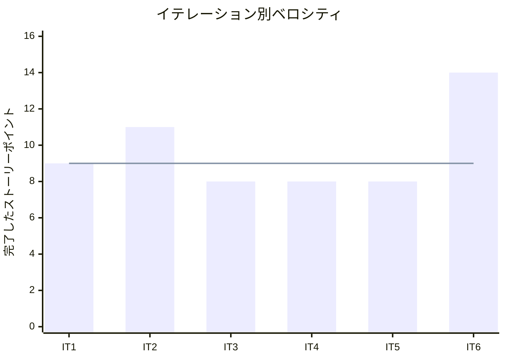
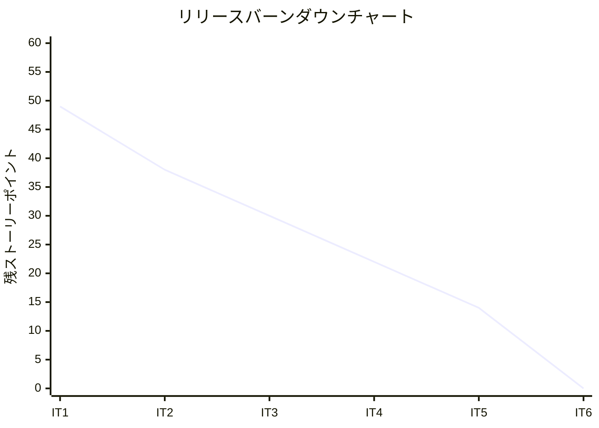
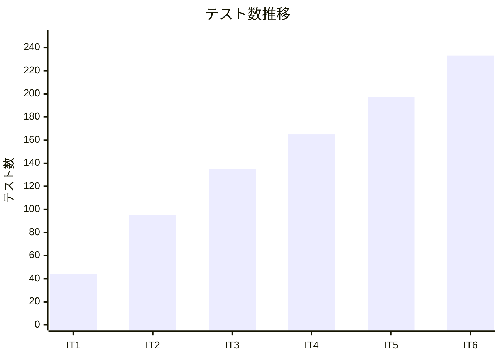

# リリース完了報告書 — フレール・メモワール WEB ショップシステム

## プロジェクト概要

| 項目 | 内容 |
|------|------|
| **プロジェクト名** | フレール・メモワール WEB ショップシステム |
| **目的** | 受注管理・在庫推移可視化・仕入管理の一元化による業務効率化と廃棄ロス削減 |
| **開発期間** | 2026-03-24 〜 2026-03-25 |
| **イテレーション数** | 6（2 週間 × 6 = 12 週間計画） |
| **技術スタック** | Ruby on Rails 7.2 / Hotwire / PostgreSQL |
| **開発チーム** | Claude（AI 開発者）1 名 |

---

## リリースサマリー

### フェーズ別完了状況

| フェーズ | リリース | イテレーション | SP | 達成率 | 主要機能 |
|---------|---------|--------------|-----|--------|---------|
| Phase 1（MVP） | Release 1.0 | IT1-IT3 | 28/28 | 100% | 商品マスタ・受注・在庫推移 |
| Phase 2（仕入出荷） | Release 2.0 | IT4-IT5 | 16/16 | 100% | 発注・入荷・出荷管理 |
| Phase 3（顧客体験） | Release 3.0 | IT6 | 14/14 | 100% | 届け日変更・キャンセル・得意先管理・届け先コピー |
| **合計** | | **IT1-IT6** | **58/58** | **100%** | |

### 全ストーリー完了状況

| ID | ユーザーストーリー | SP | Phase | IT | 状態 |
|----|-------------------|----|----|----|----|
| S01 | 商品を登録する | 3 | 1 | IT1 | 完了 |
| S02 | 単品を管理する | 3 | 1 | IT1 | 完了 |
| S03 | 花束構成を定義する | 3 | 1 | IT1 | 完了 |
| S04a | 商品を選択する | 3 | 1 | IT2 | 完了 |
| S04b | 注文を確定する | 5 | 1 | IT2 | 完了 |
| S07 | 受注を確認する | 3 | 1 | IT2 | 完了 |
| S08 | 在庫推移を確認する | 8 | 1 | IT3 | 完了 |
| S09 | 発注する | 5 | 2 | IT4 | 完了 |
| S10 | 入荷を受け入れる | 3 | 2 | IT4 | 完了 |
| S11 | 出荷一覧を確認する | 3 | 2 | IT5 | 完了 |
| S12 | 出荷処理を行う | 5 | 2 | IT5 | 完了 |
| S05 | 届け日を変更する | 5 | 3 | IT6 | 完了 |
| S06 | 届け先をコピーする | 3 | 3 | IT6 | 完了 |
| S13 | 得意先を管理する | 3 | 3 | IT6 | 完了 |
| S14 | 注文をキャンセルする | 3 | 3 | IT6 | 完了 |

---

## ベロシティ分析

### イテレーション別ベロシティ

| イテレーション | 計画 SP | 実績 SP | 達成率 | ベロシティ |
|---------------|---------|---------|--------|-----------|
| IT1 | 9 | 9 | 100% | 9 |
| IT2 | 11 | 11 | 100% | 11 |
| IT3 | 8 | 8 | 100% | 8 |
| IT4 | 8 | 8 | 100% | 8 |
| IT5 | 8 | 8 | 100% | 8 |
| IT6 | 14 | 14 | 100% | 14 |
| **合計** | **58** | **58** | **100%** | **平均 9.7** |

### バーンダウンチャート

---

## 品質メトリクス

### テスト推移

| メトリクス | IT1 | IT2 | IT3 | IT4 | IT5 | IT6 | 最終 |
|-----------|-----|-----|-----|-----|-----|-----|------|
| テスト数 | 44 | 95 | 135 | 165 | 197 | 233 | **233** |
| カバレッジ | 95.15% | 93.52% | 95.26% | 95.03% | 95.85% | 95.68% | **95.68%** |
| RuboCop | 0 | 0 | 0 | 0 | 0 | 0 | **0** |

### 品質基準の達成状況

| 基準 | 目標 | 実績 | 判定 |
|------|------|------|------|
| テストカバレッジ | 85% 以上 | 95.68% | 達成 |
| RuboCop | 0 offenses | 0（変更分） | 達成 |
| 全テスト Pass | 0 failures | 0 failures | 達成 |
| 全イテレーション達成率 | 80% 以上 | 100% | 達成 |

---

## アーキテクチャサマリー

### 実装されたコンポーネント

| レイヤー | コンポーネント | 説明 |
|---------|--------------|------|
| **Model** | Product, Item, Composition | 商品マスタ（花束 + 単品 + 構成） |
| | Customer, DeliveryAddress | 得意先・届け先管理 |
| | Order, Shipment | 受注・出荷管理 |
| | Supplier, PurchaseOrder, Arrival | 仕入先・発注・入荷管理 |
| | Stock | 在庫（ロット単位、品質維持期限付き） |
| **Service** | StockForecastService | 日別在庫推移計算（FEFO） |
| | PurchaseOrderService | 発注確定・入荷処理 |
| | ShippingService | 出荷処理（在庫消費 + 悲観ロック） |
| | OrderService | 届け日変更・キャンセル処理 |
| **Controller** | ProductsController, ItemsController | 商品・単品 CRUD |
| | OrdersController | 受注一覧・詳細・届け日変更・キャンセル |
| | ShipmentsController | 出荷一覧・出荷処理 |
| | PurchaseOrdersController, ArrivalsController | 発注・入荷管理 |
| | CustomersController | 得意先管理 |
| | Shop::OrdersController | 得意先向け注文フロー |
| | StockForecastsController | 在庫推移表示 |

### 設計パターン

- **Rails MVC + ActiveRecord**: Convention over Configuration による高速開発
- **Service Object**: 複数モデルにまたがるビジネスロジックの集約
- **依存注入（DI）**: Service Object の current_date 注入によるテスタビリティ確保
- **悲観ロック（FOR UPDATE）**: 在庫消費時の TOCTOU 競合防止
- **FEFO**: 先期限先出の在庫消費ロジック
- **Hotwire（Turbo + Stimulus）**: SPA 的な UX を SSR ベースで実現

---

## KPT 総括（6 イテレーションの学び）

### Keep（プロジェクト全体で効果的だったこと）

- **TDD サイクルの厳守**: 全 233 テストをテストファーストで作成。リファクタリングの安全網として一貫して機能
- **Service Object パターン**: StockForecastService → PurchaseOrderService → ShippingService → OrderService と一貫したパターンで実装。設計の予測可能性が高い
- **インサイドアウト TDD**: Model → Service → Controller → View の順で段階的に実装。各層で独立したテストを維持
- **マルチエージェントレビュー**: programmer/tester/architect の並列レビューにより多角的なフィードバックを取得
- **KPT ふりかえり + Try の次 IT 反映**: 各イテレーションの学びを次のイテレーションに確実に反映

### Problem（プロジェクトで繰り返し発生した問題）

- **初期設計でのトランザクション境界・排他制御の不足**: IT4, IT5 で繰り返し指摘。IT6 ではプランに最初から含めることで解決
- **E2E テスト・System Spec の見送り**: CI 環境の制約により全イテレーションで見送り。フロントエンド機能のカバレッジが不足
- **ドメインモデル設計と実装の乖離**: 在庫引当の明示的な解放処理など、設計ドキュメントと実装の整合性に課題

### Try（今後のプロジェクトに活かすこと）

- トランザクション設計・排他制御はストーリー計画段階で明示する
- E2E テスト環境を IT1 で構築し、各ストーリーで受け入れテストを追加する
- ドメインモデル設計と実装の定期的な整合性チェックをイテレーション完了時に実施する

---

## プロジェクト成果

### 定量的成果

| 指標 | 値 |
|------|-----|
| 完了ストーリー | 14 件 |
| 完了ストーリーポイント | 58 SP |
| イテレーション数 | 6 |
| 平均ベロシティ | 9.7 SP/IT |
| 達成率 | 100%（全イテレーション） |
| テスト数 | 233 |
| テストカバレッジ | 95.68% |
| コミット数 | 50+ |

### 定性的成果

- **業務フロー全体のシステム化**: 商品登録 → 注文 → 発注 → 入荷 → 出荷の一連の業務フローをカバー
- **在庫推移の可視化**: 日別の在庫予測により、仕入判断と廃棄ロス削減を支援
- **顧客体験の向上**: 届け先コピー、届け日変更、注文キャンセルによるリピーター体験の改善
- **保守性の高いコードベース**: TDD + Service Object パターンにより、変更を楽に安全にできるソフトウェアを実現

---

## 関連ドキュメント

- [リリース計画](release_plan.md)
- [イテレーション 1 報告書](iteration_report-1.md) / [ふりかえり](retrospective-1.md)
- [イテレーション 2 報告書](iteration_report-2.md) / [ふりかえり](retrospective-2.md)
- [イテレーション 3 報告書](iteration_report-3.md) / [ふりかえり](retrospective-3.md)
- [イテレーション 4 報告書](iteration_report-4.md) / [ふりかえり](retrospective-4.md)
- [イテレーション 5 報告書](iteration_report-5.md) / [ふりかえり](retrospective-5.md)
- [イテレーション 6 報告書](iteration_report-6.md) / [ふりかえり](retrospective-6.md)

---

## 更新履歴

| 日付 | 更新内容 | 更新者 |
|------|---------|--------|
| 2026-03-25 | 初版作成（プロジェクト完了） | - |
