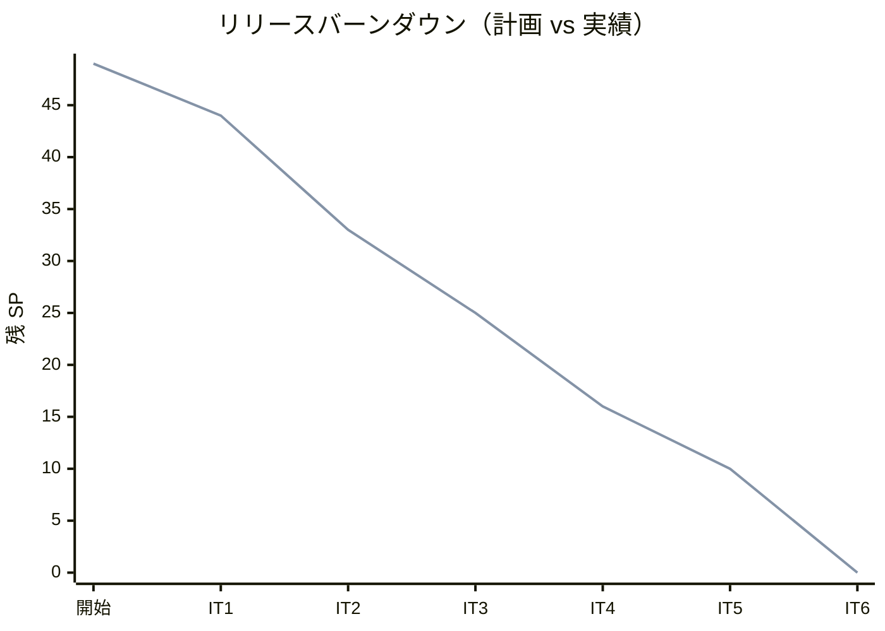
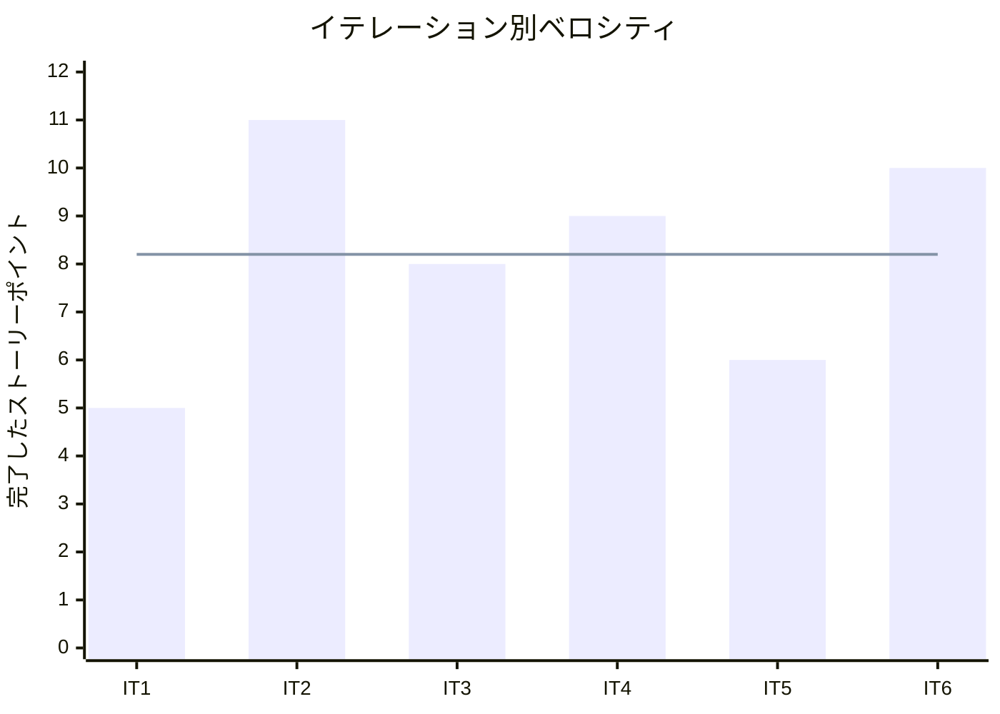
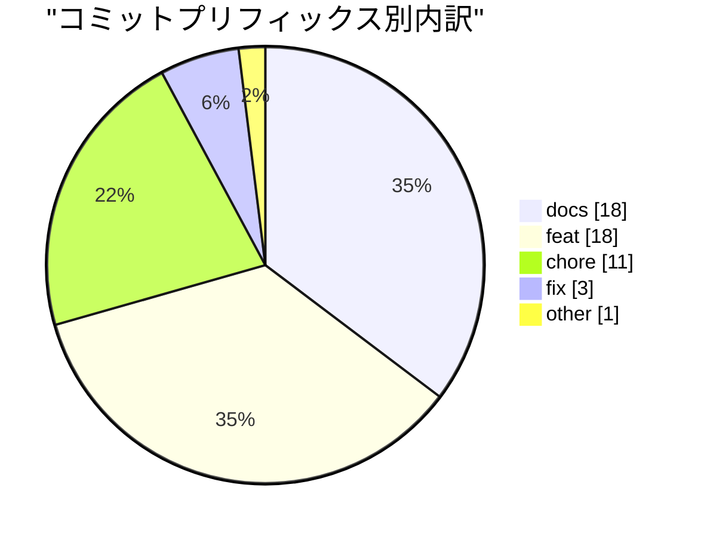
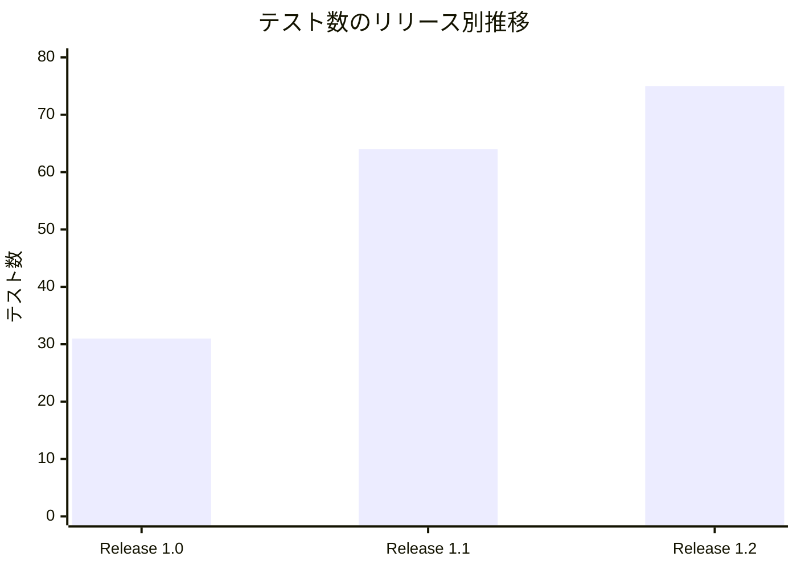

# リリース完了報告書

## 概要

フラワーショップ「フレール・メモワール」 WEB ショップシステムの `Release 1.0` から `Release 1.2` までの完了報告書です。全 6 イテレーション、 49 SP を 100% 完了し、顧客注文から受注、在庫推移、発注、入荷、出荷、再注文支援、届け日変更までの業務導線を一通り成立させました。

> 注記: 本ブランチでは `CHANGELOG.md` が未整備で、最新 git tag `v0.3.0` も `Release 1.2` 完了時点には未同期です。この報告書は `release_plan.md` と各 `iteration_report` を正として、 `Release 1.2` 完了時点の実績を集計しています。

## プロジェクトサマリー

| 項目 | 値 |
|------|-----|
| **プロジェクト期間** | 2026-03-17 〜 2026-03-26 （約 2 週間） |
| **総イテレーション数** | 6 |
| **総ストーリーポイント** | 49 SP |
| **総コミット数** | 51 |
| **総テスト数** | 75 |
| **ユーザーストーリー数** | 12 |

## 計画と実績の差異分析

### イテレーション別達成状況

| イテレーション | リリース | 計画 SP | 実績 SP | 達成率 | 差異 |
|---------------|---------|---------|---------|--------|------|
| IT1 | Release 1.0 MVP | 5 | 5 | 100% | 0 |
| IT2 | Release 1.0 MVP | 11 | 11 | 100% | 0 |
| IT3 | Release 1.1 業務拡張版 | 8 | 8 | 100% | 0 |
| IT4 | Release 1.1 業務拡張版 | 9 | 9 | 100% | 0 |
| IT5 | Release 1.1 業務拡張版 | 6 | 6 | 100% | 0 |
| IT6 | Release 1.2 体験改善版 | 10 | 10 | 100% | 0 |
| **合計** | | **49** | **49** | **100%** | **0** |

### リリース別達成状況

| リリース | 内容 | 計画 SP | 実績 SP | 達成率 |
|---------|------|---------|---------|--------|
| Release 1.0 MVP | 顧客注文、受注確認、在庫推移確認 | 16 | 16 | 100% |
| Release 1.1 業務拡張版 | 商品 / 花材マスタ、発注、入荷、出荷 | 23 | 23 | 100% |
| Release 1.2 体験改善版 | 届け先再利用、届け日変更 | 10 | 10 | 100% |

### リリースバーンダウン

**分析結果**: 全イテレーションで計画 SP と実績 SP が一致し、バーンダウンは終始計画線上を維持しました。初期の Phase 3 可変スコープ前提に対し、最終的には `IT6` で 10 SP を完了し、全スコープを取り切っています。

## ベロシティ分析

| 項目 | 値 |
|------|-----|
| **平均ベロシティ** | 8.2 SP / イテレーション |
| **最大ベロシティ** | 11 SP |
| **最小ベロシティ** | 5 SP |

## コミットログ分析

### コミットプリフィックス別内訳

| プリフィックス | 件数 | 割合 | 説明 |
|---------------|------|------|------|
| docs | 18 | 35.3% | 計画、報告、レビュー、索引更新 |
| feat | 18 | 35.3% | 機能追加 |
| chore | 11 | 21.6% | 環境整備、依存関係、設定更新 |
| fix | 3 | 5.9% | 障害耐性、入力検証、 CI 失敗修正 |
| other | 1 | 2.0% | 初期コミットなど |
| **合計** | **51** | **100%** | |

### 分析

1. `docs` と `feat` が同数で、実装と計画 / 報告の更新を並行して進めた履歴になっています。
2. `chore` 比率が 2 割超あるのは、開発環境、 Gulp タスク、依存関係、ジャーナル生成など基盤整備を早期に進めたためです。
3. `fix` は少数に抑えられており、多くの変更が TDD とレビュー内で吸収できています。

## 品質メトリクス

### テスト数のリリース別推移

| リリース | バックエンド | フロントエンド | E2E | 合計 |
|---------|------------|--------------|-----|------|
| Release 1.0 | 9 | 21 | 1 | 31 |
| Release 1.1 | 28 | 35 | 1 | 64 |
| Release 1.2 | 35 | 39 | 1 | 75 |

### 静的解析と品質確認

| 指標 | 結果 |
|------|------|
| ESLint | Frontend lint 通過確認済み |
| TypeScript typecheck | Backend / Frontend 通過 |
| SonarQube Quality Gate | 未取得 |
| テストカバレッジ | 未取得 |
| Flaky テスト率 | 未取得 |

### 品質評価

1. リリース終盤の実測では Backend 35 件、 Frontend 39 件、 E2E 1 件の計 75 テストを維持しました。
2. カバレッジと SonarQube の数値は未整備のため、品質評価はテスト通過、型検査、レビュー結果を主根拠にしています。
3. `IT6` ではレビュー指摘を同一イテレーション内で解消し、入力検証、照合正規化、派生表示再取得まで回収できました。

## リリース履歴

| リリース | 含まれる IT | 完了状態 | SP | 状態 |
|---------|-----------|---------|-----|------|
| Release 1.0 MVP | IT1-IT2 | 顧客注文と受注 / 在庫推移導線を成立 | 16 | 完了 |
| Release 1.1 業務拡張版 | IT3-IT5 | 商品 / 花材マスタ、発注、入荷、出荷を成立 | 23 | 完了 |
| Release 1.2 体験改善版 | IT6 | 届け先再利用と届け日変更を成立 | 10 | 完了 |

## 主要な成果物

### 実装した主要機能

1. **顧客注文と受注確認** （Release 1.0 / IT1-IT2）
   - 商品選択、注文入力、注文確認、注文確定、受注一覧 / 詳細、在庫推移確認を実装しました。

2. **業務運用フロー** （Release 1.1 / IT3-IT5）
   - 花材管理、発注確定、入荷登録、出荷対象確認、結束完了、商品管理、出荷確定を実装しました。

3. **体験改善機能** （Release 1.2 / IT6）
   - 過去届け先再利用、届け日変更、レビュー指摘を反映した入力検証と管理画面の再取得を実装しました。

### 技術的成果

| 成果 | 内容 |
|------|------|
| TDD | Backend / Frontend / E2E を継続追加し、最終 75 テストを維持 |
| ヘキサゴナル設計方針 | `ADR-001` から `ADR-003` に沿って境界とデータ保持方針を維持 |
| ドキュメント運用 | `release_plan`、 `iteration_report`、レビュー記録、ジャーナルを継続更新 |
| GitHub Project 同期 | `release_plan.md` を正として `codex/take1` Project の状態を整合 |

## 作業履歴サマリー

| 日付 | 主な内容 |
|------|---------|
| 2026-03-17 | プロジェクト基盤、スキル、開発環境、初期ドキュメントを整備 |
| 2026-03-18 | リリースタグ `v0.1.0`、 `v0.2.0`、 `v0.3.0` を作成 |
| 2026-03-19 | リリース計画、要件、設計、 Project 管理ドキュメントを整備 |
| 2026-03-24 | IT1-IT4 相当の実装を集中的に進行 |
| 2026-03-25 | IT5 と IT6 計画、レビュー反映、管理同期を実施 |
| 2026-03-26 | IT6 完了、レビュー指摘対応、 CI 失敗修正、完了記録を反映 |

## 総評

本リリース系列では、 49 SP / 12 ストーリーを 6 イテレーションで 100% 完了し、顧客向け導線と業務向け導線を一通りつないだ WEB ショップシステムを成立させました。特に `Phase 3` を可変スコープから完了状態へ持ち込み、 `Release 1.2` まで計画どおり完了できた点が大きな成果です。

### ハイライト

- **全 12 ユーザーストーリー完了**: `Release 1.0` から `Release 1.2` までを完了しました。
- **75 テストによる品質保証**: Backend 35、 Frontend 39、 E2E 1 を維持しました。
- **計画との差異 0**: 全イテレーションで計画 SP と実績 SP が一致しました。
- **段階的リリース戦略の完了**: MVP、業務拡張、体験改善の 3 段階を完走しました。

## 関連ドキュメント

- [リリース計画](./release_plan.md)
- [イテレーション 1 完了報告書](./iteration_report-1.md)
- [イテレーション 2 完了報告書](./iteration_report-2.md)
- [イテレーション 3 完了報告書](./iteration_report-3.md)
- [イテレーション 4 完了報告書](./iteration_report-4.md)
- [イテレーション 5 完了報告書](./iteration_report-5.md)
- [イテレーション 6 完了報告書](./iteration_report-6.md)
