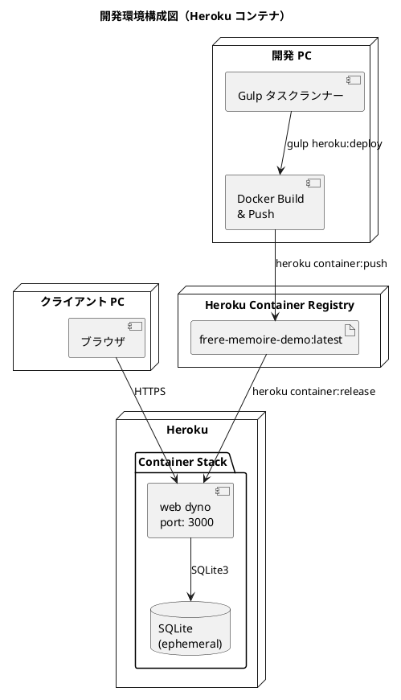
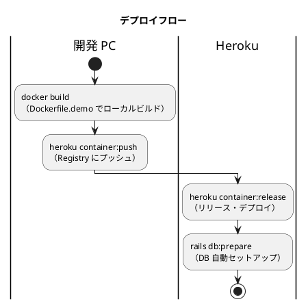

# 開発環境セットアップ手順書

## 概要

Heroku Container Registry を使用して、フレール・メモワール WEB ショップシステムをデモ用途で公開するための環境構築手順を説明します。

Docker イメージを開発 PC でビルドし、Heroku Container Registry 経由でデプロイします。デモ用途のため、データベースには SQLite を使用し、外部データベースサービスは不要です。

| サービス | コンテナイメージ | ポート | 説明 |
|---------|----------------|--------|------|
| web | frere-memoire-demo | 3000 | Rails アプリケーション（SQLite） |



### デプロイフロー



> **注意**: Heroku の ephemeral filesystem により、SQLite データはデプロイごとにリセットされます。デモ用途に限定して使用してください。

## 前提条件

- Heroku アカウント（無料 / 有料プラン）
- Heroku CLI がインストール済み
- Docker Desktop がインストール済み
- Git がインストール済み
- Node.js v22.x LTS / npm v10.x

### Heroku CLI のインストール

```bash
# macOS (Homebrew)
brew tap heroku/brew && brew install heroku

# バージョン確認
heroku --version
```

公式サイトから直接ダウンロードする場合：

- https://devcenter.heroku.com/articles/heroku-cli

### Docker のインストール

Docker Desktop をインストールします。

- **Windows**: https://docs.docker.com/desktop/install/windows-install/
- **macOS**: https://docs.docker.com/desktop/install/mac-install/

```bash
# バージョン確認
docker -v
docker compose version
```

### Node.js のインストール

コミット前の品質チェック（husky + lint-staged）とタスクランナー（Gulp）に Node.js が必要です。

- https://nodejs.org/

```bash
# バージョン確認
node -v
npm -v
```

---

## セットアップ手順

### 1. リポジトリのクローンと Node.js 依存パッケージのインストール

```bash
git clone <リポジトリ URL>
cd case-study-sdd-development
npm install
```

### 2. 環境変数の設定

`.env.example` をコピーして `.env` を作成し、`HEROKU_APP_NAME` を設定します。

```bash
cp .env.example .env
```

```dotenv
# Heroku 設定（デモ環境）
HEROKU_APP_NAME=your-app-name
```

### 3. Heroku ログイン

```bash
# Heroku CLI にログイン
heroku login

# Heroku Container Registry にログイン
heroku container:login
```

タスクランナー経由：

```bash
npx gulp heroku:login
```

### 4. Heroku アプリの作成

```bash
heroku create <アプリ名> --stack container
```

タスクランナー経由：

```bash
npx gulp heroku:create
```

### 5. 環境変数の設定

```bash
heroku config:set \
  RAILS_ENV=production \
  DATABASE_ADAPTER=sqlite3 \
  RAILS_LOG_LEVEL=info \
  LANG=ja_JP.UTF-8 \
  RAILS_SERVE_STATIC_FILES=true \
  SECRET_KEY_BASE=$(ruby -rsecurerandom -e 'puts SecureRandom.hex(64)') \
  -a <アプリ名>
```

タスクランナー経由：

```bash
npx gulp heroku:config
```

> **重要**: `SECRET_KEY_BASE` は手動で設定する必要があります。上記コマンドで安全なランダム値が生成されます。

### 6. 一括セットアップ（推奨）

上記のステップ 3〜5 を一括で実行する場合：

```bash
npx gulp heroku:setup
```

自動セットアップは以下を実行します：

1. Heroku CLI ログイン
2. Container Registry ログイン
3. Heroku アプリ作成
4. 環境変数設定

---

## デプロイ

### 初回デプロイ

```bash
# 1. Container Registry にプッシュ
npx gulp heroku:push

# 2. リリース（デプロイ）
npx gulp heroku:release

# または一括実行
npx gulp heroku:deploy
```

### 動作確認

```bash
# ブラウザで開く
npx gulp heroku:open

# ログを確認
npx gulp heroku:logs

# dyno の状態確認
npx gulp heroku:status
```

### アクセス確認

| サービス | URL | 説明 |
|---------|-----|------|
| アプリケーション | `https://sdd-case-study-take4-8de87a7c1192.herokuapp.com` | メインアプリケーション |
| ヘルスチェック | `https://sdd-case-study-take4-8de87a7c1192.herokuapp.com/up` | ヘルスチェック |

---

## 更新デプロイ

コードを変更した後のデプロイ手順：

```bash
# 一括デプロイ（プッシュ + リリース）
npx gulp heroku:deploy
```

### DB マイグレーション

```bash
npx gulp heroku:db:migrate
```

### シードデータ投入

```bash
npx gulp heroku:db:seed
```

---

## 技術スタック

### バックエンド

| カテゴリ | 技術 | バージョン |
|---------|------|-----------|
| 言語 | Ruby | 3.3.6 |
| フレームワーク | Rails | 7.2.3+ |
| Web サーバー | Puma | 5.0+ |
| データベース | SQLite3 | 2.0+ |
| 認証 | Devise | 最新 |
| テスト | RSpec | 最新 |
| 品質管理 | RuboCop | 最新 |

### フロントエンド

| カテゴリ | 技術 | バージョン |
|---------|------|-----------|
| JavaScript | Stimulus | 最新 |
| CSS | Bootstrap | 5.3 |
| ビルド | Import Maps | 最新 |

### インフラストラクチャ

| カテゴリ | 技術 |
|---------|------|
| コンテナ | Docker / Heroku Container Stack |
| PaaS | Heroku |
| CI/CD | GitHub Actions |

---

## ディレクトリ構造

```
case-study-sdd-development/
├── .env                             # 環境変数（Git 管理外）
├── .env.example                     # 環境変数テンプレート
├── gulpfile.js                      # タスクランナー
├── apps/
│   ├── Dockerfile                   # 本番用 Dockerfile（PostgreSQL）
│   ├── Dockerfile.demo              # デモ用 Dockerfile（SQLite）
│   ├── heroku.yml                   # Heroku Container Stack 設定
│   ├── Gemfile                      # Ruby 依存パッケージ
│   ├── config/
│   │   ├── database.yml             # DB 設定（SQLite / PostgreSQL 切替）
│   │   ├── puma.rb                  # Puma Web サーバー設定
│   │   └── environments/
│   │       └── production.rb        # 本番環境設定
│   └── db/
│       ├── data/                    # SQLite データファイル（デモ用）
│       └── migrate/                 # マイグレーション
├── ops/
│   └── scripts/
│       ├── heroku.js                # Heroku デプロイタスク
│       └── develop.js               # 開発タスク
└── docs/
    └── operation/
        └── dev-environment-setup.md # この手順書
```

---

## タスクランナーコマンド一覧

```bash
# セットアップ
npx gulp heroku:login             # Heroku & Container Registry ログイン
npx gulp heroku:create            # Heroku アプリ作成
npx gulp heroku:config            # 環境変数を設定
npx gulp heroku:setup             # 上記を一括実行

# ビルド・デプロイ
npx gulp heroku:build             # ローカルで Docker イメージビルド
npx gulp heroku:push              # Container Registry にプッシュ
npx gulp heroku:release           # リリース（デプロイ）
npx gulp heroku:deploy            # プッシュ + リリースを一括実行

# 管理
npx gulp heroku:logs              # ログをリアルタイム表示
npx gulp heroku:status            # dyno の状態確認
npx gulp heroku:open              # ブラウザでアプリを開く
npx gulp heroku:run               # Heroku 上で bash を起動
npx gulp heroku:restart           # dyno を再起動
npx gulp heroku:db:migrate        # マイグレーション実行
npx gulp heroku:db:seed           # シードデータ投入
npx gulp heroku:destroy           # アプリを削除

# ヘルプ
npx gulp heroku:help              # ヘルプを表示
```

---

## トラブルシューティング

### デプロイが失敗する（Build failed）

**問題**: `heroku container:push` でビルドエラーが発生する

```
Error: docker build exited with Error: 1
```

**解決策**: ローカルでビルドを確認してからプッシュする

```bash
# ローカルビルドで問題を特定
npx gulp heroku:build

# ログを確認
docker build -f Dockerfile.demo -t frere-memoire-demo . 2>&1 | tail -50
```

### アプリが起動しない

**問題**: デプロイ後にアプリがクラッシュする

**解決策**:

```bash
# ログを確認
npx gulp heroku:logs

# 一般的な原因:
# 1. SECRET_KEY_BASE が未設定
heroku config:set SECRET_KEY_BASE=$(ruby -rsecurerandom -e 'puts SecureRandom.hex(64)') -a <アプリ名>

# 2. DATABASE_ADAPTER が未設定
heroku config:set DATABASE_ADAPTER=sqlite3 -a <アプリ名>
```

### SQLite データがリセットされる

**問題**: デプロイのたびにデータが消える

**解決策**: これは Heroku の ephemeral filesystem の仕様です。デモ用途に限定し、永続化が必要な場合は PostgreSQL アドオン（Heroku Postgres）への移行を検討してください。

### SSL 関連エラー

**問題**: `ActionController::ForceSSL` 関連のリダイレクトループ

**解決策**: Heroku は SSL を ALB で終端するため、通常は問題になりません。ただし、`config.force_ssl` を確認してください。

---

## 環境の廃棄

デモ環境を完全に削除する場合：

```bash
npx gulp heroku:destroy
```

> **警告**: この操作は取り消せません。アプリとすべてのアドオンが削除されます。

---

## セキュリティチェックリスト

- [ ] `SECRET_KEY_BASE` がランダムな値で設定されている
- [ ] `.env` が `.gitignore` に追加されている
- [ ] デモデータに個人情報が含まれていない
- [ ] `RAILS_SERVE_STATIC_FILES=true` が設定されている

---

## 関連ドキュメント

- [アプリケーション開発環境セットアップ手順書](./app-development-setup.md) - ローカル開発環境
- [Heroku Container Registry & Runtime](https://devcenter.heroku.com/articles/container-registry-and-runtime)
