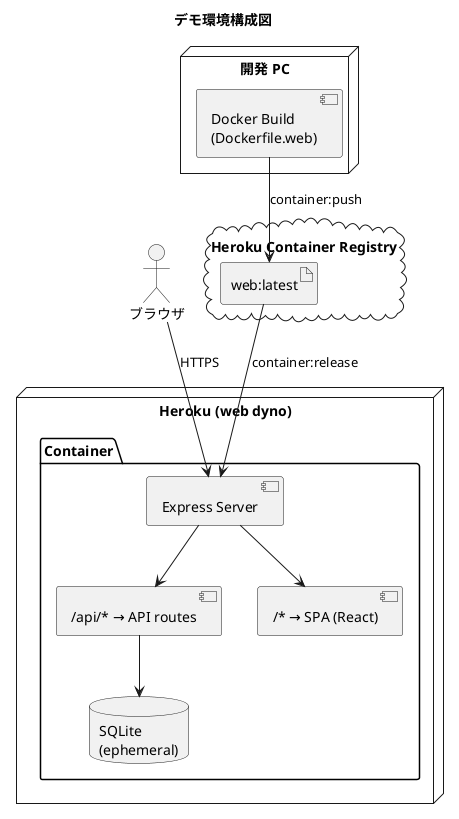
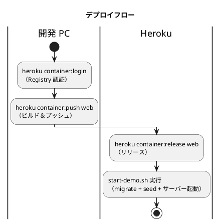

# デモ環境セットアップ手順書（Heroku Container）

## 概要

Heroku Container Registry を使用し、フロントエンド + バックエンドを単一コンテナでデプロイするデモ環境の構築手順です。

SQLite（エフェメラル）を使用し、dyno 再起動のたびにクリーンなデモデータが自動投入されます。

| 項目 | 値 |
|------|-----|
| プラットフォーム | Heroku（Container Stack） |
| Dockerfile | `Dockerfile.web` |
| DB | SQLite（エフェメラル） |
| フロントエンド | React SPA（Express 静的配信） |
| バックエンド | Express + Prisma |

### アーキテクチャ



### デプロイフロー



---

## 前提条件

- Heroku CLI がインストール済み
- Docker Desktop がインストール済み
- Heroku アカウントと Eco dyno プランが有効

---

## セットアップ手順

### 1. Heroku アプリの作成

```bash
# アプリを作成（既存の場合はスキップ）
heroku create <アプリ名>

# Container Stack に切り替え
heroku stack:set container -a <アプリ名>
```

### 2. Container Registry にログイン

```bash
heroku container:login
```

### 3. Docker イメージのビルド＆プッシュ

プロジェクトルートで実行します。

```bash
# Dockerfile.web をビルドして Heroku Registry にプッシュ
heroku container:push web --recursive -a <アプリ名>
```

> **注意**: 初回ビルドは数分かかります。2 回目以降はキャッシュが効きます。

### 4. リリース

```bash
heroku container:release web -a <アプリ名>
```

### 5. 動作確認

```bash
# ブラウザで開く
heroku open -a <アプリ名>

# ログを確認
heroku logs --tail -a <アプリ名>

# API ヘルスチェック
curl https://<アプリ名>.herokuapp.com/api/health
```

期待されるレスポンス:

```json
{"status":"UP"}
```

---

## コンテナ起動時の動作

dyno 起動時に `scripts/start-demo.sh` が以下を実行します:

1. 古い SQLite DB ファイルを削除
2. Prisma マイグレーション適用（テーブル作成）
3. シードデータ投入（仕入先・単品・商品・在庫・受注・発注）
4. Express サーバー起動（`$PORT` で Heroku が割り当てたポートを使用）

起動完了まで約 3 秒です。

---

## 更新手順

コード変更後のデプロイ:

```bash
# 1. ビルド＆プッシュ
heroku container:push web --recursive -a <アプリ名>

# 2. リリース
heroku container:release web -a <アプリ名>
```

---

## 管理コマンド

```bash
# アプリの状態確認
heroku ps -a <アプリ名>

# ログ確認（リアルタイム）
heroku logs --tail -a <アプリ名>

# dyno の再起動（DB リセット）
heroku restart -a <アプリ名>

# コンテナにシェル接続
heroku run bash -a <アプリ名>
```

---

## ファイル構成

```text
プロジェクトルート/
├── Dockerfile.web                          # Heroku 用マルチステージ Dockerfile
├── heroku.yml                              # Heroku Container 設定
├── .dockerignore                           # Docker ビルド除外設定
├── apps/
│   ├── backend/
│   │   ├── scripts/start-demo.sh           # デモ起動スクリプト
│   │   ├── prisma/
│   │   │   ├── schema.sqlite.prisma        # SQLite 用スキーマ
│   │   │   ├── migrations-sqlite/          # SQLite 用マイグレーション
│   │   │   └── seed.ts                     # シードデータ
│   │   ├── prisma.config.sqlite.ts         # SQLite 用 Prisma 設定
│   │   └── src/presentation/app.ts         # Express（API + 静的配信 + SPA）
│   └── frontend/
│       └── dist/                           # ビルド成果物（コンテナ内の /app/public）
```

---

## トラブルシューティング

| 症状 | 原因 | 対処 |
|------|------|------|
| `heroku container:push` で 401 | Registry 未認証 | `heroku container:login` を実行 |
| `This command is for Docker apps only` | Stack が heroku-24 | `heroku stack:set container` を実行 |
| dyno が起動直後にクラッシュ | 起動スクリプトエラー | `heroku logs --tail` でログ確認 |
| API は動くが画面が表示されない | フロントエンドビルド失敗 | `Dockerfile.web` の frontend-build ステージを確認 |
| DB データが消える | エフェメラルは正常動作 | 仕様です（dyno 再起動でリセット） |

---

## 関連ドキュメント

- [ADR-002: デモ環境の DB を SQLite に切り替え](../adr/002-demo-environment-sqlite.md)
- [アプリケーション開発環境セットアップ手順書](./dev_app_instruction.md)
