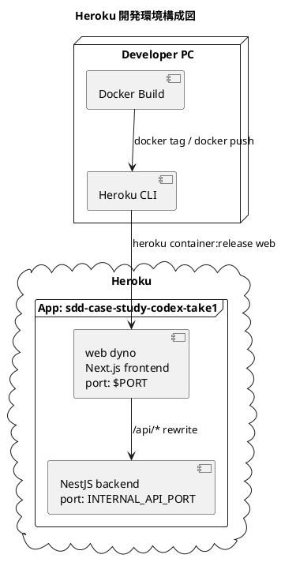

# 開発環境セットアップ手順書

## 概要

Heroku Container Stack を開発環境として使用し、`sdd-case-study-codex-take1` を単一コンテナで公開する手順を説明します。

このリポジトリは monorepo 構成ですが、Heroku の `web` dyno は 1 つの公開ポートしか扱えません。そのため、開発環境では 1 つのイメージ内で `backend` を内部ポート起動し、`frontend` を公開ポートで起動します。ブラウザからの API 呼び出しは `/api/*` を Next.js の rewrite で内部 backend へ中継します。

| サービス | Heroku プロセスタイプ | ポート | 説明 |
|---------|-------------------|--------|------|
| Frontend (`@fleur-memoire/frontend`) | `web` | `$PORT` | 公開される Next.js アプリケーション |
| Backend (`@fleur-memoire/backend`) | 同一 `web` dyno 内 | `INTERNAL_API_PORT` | 内部起動される NestJS API |



## 前提条件

- Heroku アカウントを作成済みであること
- Heroku CLI がインストール済みであること
- Docker Desktop または Docker Engine が利用可能であること
- `heroku login` が完了していること

## 構成ファイル

Heroku 用のコンテナ構成は以下を使用します。

| ファイル | 用途 |
|---------|------|
| `heroku.yml` | Heroku Container Stack の定義 |
| `Dockerfile.heroku` | Frontend / Backend 同梱の build / runtime イメージ |
| `.dockerignore` | 不要ファイルを除外し、ビルドコンテキストを軽量化 |

## セットアップ手順

### 1. Heroku アプリの作成

```bash
heroku create sdd-case-study-codex-take1 --stack container
```

すでにアプリが存在する場合は、スタックが `container` であることを確認します。

```bash
heroku stack:set container --app sdd-case-study-codex-take1
```

### 2. 環境変数の設定

最低限、frontend から backend へ同一オリジンで到達するための設定を入れます。

```bash
heroku config:set NEXT_PUBLIC_API_BASE_URL=/api \
  INTERNAL_API_PORT=3000 \
  --app sdd-case-study-codex-take1
```

必要に応じて追加する変数:

| 変数名 | 用途 | 例 |
|-------|------|----|
| `NEXT_PUBLIC_API_BASE_URL` | Frontend から参照する API ベース URL | `/api` |
| `INTERNAL_API_PORT` | 同一コンテナ内で backend が待ち受ける内部ポート | `3000` |
| `NODE_ENV` | 実行モード | `production` |

### 3. ローカルでのコンテナビルド確認

```bash
docker build --platform linux/amd64 --provenance=false --sbom=false \
  -f Dockerfile.heroku -t sdd-case-study-codex-take1 .
docker run --rm -p 3001:3001 \
  -e PORT=3001 \
  -e INTERNAL_API_PORT=3000 \
  -e NEXT_PUBLIC_API_BASE_URL=/api \
  sdd-case-study-codex-take1
```

ブラウザで `http://localhost:3001/customer` にアクセスし、画面が表示されることを確認します。`/api/*` は同一コンテナ内の backend に rewrite されます。

### 4. Heroku Container Registry へ push

```bash
heroku container:login
docker tag sdd-case-study-codex-take1 registry.heroku.com/sdd-case-study-codex-take1/web
docker push registry.heroku.com/sdd-case-study-codex-take1/web
```

### 5. Heroku へ release

```bash
heroku container:release web --app sdd-case-study-codex-take1
```

### 6. 動作確認

```bash
heroku open --app sdd-case-study-codex-take1
heroku logs --tail --app sdd-case-study-codex-take1
```

想定 URL:

- アプリ: `https://sdd-case-study-codex-take1.herokuapp.com`
- 注文画面: `https://sdd-case-study-codex-take1.herokuapp.com/customer`
- 管理画面: `https://sdd-case-study-codex-take1.herokuapp.com/admin`

## 更新手順

ソースコード更新後は、再度 push / release を実行します。

```bash
docker tag sdd-case-study-codex-take1 registry.heroku.com/sdd-case-study-codex-take1/web
docker push registry.heroku.com/sdd-case-study-codex-take1/web
heroku container:release web --app sdd-case-study-codex-take1
```

## ロールバック手順

Heroku Container Stack は slug ベースの `releases:rollback` ではなく、直前の正常イメージを再 release する運用が基本です。Git タグまたはコミット単位で以前の状態を checkout し、同じ手順で再度 `container:push` と `container:release` を実行します。

## トラブルシューティング

### `Application error` になる

- `heroku logs --tail --app sdd-case-study-codex-take1` で起動ログを確認します。
- `PORT` を固定値で使っていないか確認します。Heroku では `$PORT` を使用する必要があります。

### 画面は開くが API 呼び出しに失敗する

- `NEXT_PUBLIC_API_BASE_URL=/api` になっているか確認します。
- `INTERNAL_API_PORT` と Next.js rewrite の向き先が一致しているか確認します。
- backend の起動ログが `heroku logs --tail --app sdd-case-study-codex-take1` に出ているか確認します。

### `docker build` が遅い

- `.dockerignore` により `node_modules` や `.next` を除外していることを確認します。
- 依存更新がない場合でも、`package-lock.json` の変更があると dependency layer は再 build されます。

### `heroku container:push` で別の Dockerfile が使われる

- このリポジトリでは `Dockerfile.heroku` を使うため、`heroku container:push web` は使いません。
- いったん `docker build -f Dockerfile.heroku ...` でローカル build し、`docker tag` と `docker push registry.heroku.com/<app>/web` を使います。

### `docker push` の最後に `unsupported` で失敗する

- Docker 29 以降では provenance / SBOM の attestation が manifest に付与されることがあります。
- Heroku Registry は attestation 付き manifest list を受け付けないため、`--platform linux/amd64 --provenance=false --sbom=false` を付けて build します。

## 運用メモ

- Heroku 上では永続ストレージを使わない前提です。
- この構成では `frontend` と `backend` を 1 dyno に同居させています。スケール要件が出たら、将来は別アプリへ分離する方が運用しやすいです。

## 関連ドキュメント

- [アプリケーション開発環境セットアップ手順書](./dev_app_instruction.md)
- [運用要件](../design/operation.md)
- [インフラストラクチャ](../design/architecture_infrastructure.md)
