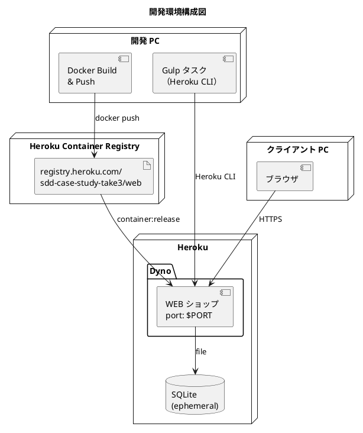
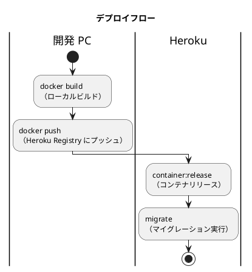

# 開発環境セットアップ手順書

## 概要

Heroku Container Registry を使用して、フレール・メモワール WEB ショップシステムをデモ環境としてデプロイするための環境構築手順を説明します。

> **Note**: デモ用途のため、データベースは SQLite を使用します。Heroku の ephemeral filesystem により、Dyno 再起動時にデータはリセットされます。

Docker イメージは開発 PC でビルドし、Heroku Container Registry 経由でデプロイします。

| サービス | 略称 | コンテナ名 | ポート | 説明 |
| :--- | :--- | :--- | :--- | :--- |
| WEB ショップ | webshop | web | 動的（Heroku 割当） | フレール・メモワール WEB ショップ |



### デプロイフロー



## 前提条件

- Heroku アカウント（クレジットカード登録済み）
- Docker Desktop がインストール済み
- Git がインストール済み
- Node.js >= 22 / npm >= 10

---

## セットアップ手順

### 1. Heroku CLI のインストール

#### Windows（Scoop）

```bash
scoop install heroku-cli
```

#### macOS（Homebrew）

```bash
brew tap heroku/brew && brew install heroku
```

インストール確認:

```bash
heroku --version
```

### 2. Heroku ログイン

```bash
# Heroku アカウントにログイン
heroku login

# Container Registry にログイン
heroku container:login
```

### 3. Heroku アプリの作成

```bash
heroku create sdd-case-study-take3 --stack container
```

> **Note**: アプリがすでに存在する場合はスキップしてください。

### 4. 環境変数の設定

```bash
heroku config:set \
  DJANGO_DEBUG=False \
  DJANGO_ALLOWED_HOSTS=.herokuapp.com \
  DJANGO_CSRF_TRUSTED_ORIGINS=https://sdd-case-study-take3.herokuapp.com \
  --app sdd-case-study-take3
```

> **Note**: `DJANGO_SECRET_KEY` は未設定の場合、起動時にランダム生成されます。固定する場合は別途設定してください。データベースは SQLite（コンテナ内ファイル）を使用するため `DATABASE_URL` の設定は不要です。

### 5. タスクランナーによる自動セットアップ（推奨）

上記の手順 3〜4 を一括で実行できます。

```bash
npx gulp heroku:setup
```

---

## デプロイ

### タスクランナーによる一括デプロイ（推奨）

```bash
# 一括デプロイ（ビルド → プッシュ → リリース）
npx gulp heroku:deploy
```

### 手動デプロイ

```bash
# 1. Heroku Container Registry にログイン
heroku container:login

# 2. Docker イメージをビルド
cd apps/webshop
docker build -t registry.heroku.com/sdd-case-study-take3/web .

# 3. Registry にプッシュ
docker push registry.heroku.com/sdd-case-study-take3/web

# 4. コンテナをリリース
heroku container:release web --app sdd-case-study-take3
```

### マイグレーションとシードデータ

コンテナ起動時に自動で `migrate --run-syncdb` と `seed` が実行されます。手動で再実行する場合:

```bash
# マイグレーション実行
npx gulp heroku:migrate

# シードデータ投入
npx gulp heroku:seed
```

---

## 動作確認

### ステータス確認

```bash
npx gulp heroku:status
```

### ブラウザで確認

```bash
npx gulp heroku:open
```

### アクセス確認

| 確認項目 | URL |
| :--- | :--- |
| WEB ショップ | `https://sdd-case-study-take3.herokuapp.com/` |
| API ドキュメント | `https://sdd-case-study-take3.herokuapp.com/api/schema/swagger-ui/` |
| Django Admin | `https://sdd-case-study-take3.herokuapp.com/admin/` |

### ログの確認

```bash
# リアルタイムログ
npx gulp heroku:logs

# または直接
heroku logs --tail --app sdd-case-study-take3
```

---

## 更新手順

サービスを更新する場合は、開発 PC でビルド・プッシュ・リリースします。

```bash
# 典型的なデプロイフロー
npx gulp heroku:deploy

# マイグレーションが必要な場合
npx gulp heroku:migrate
```

---

## 管理コマンド

```bash
# Heroku 上でコマンドを実行
heroku run python manage.py <command> --app sdd-case-study-take3

# 例: Django シェル
heroku run python manage.py shell --app sdd-case-study-take3

# 例: 管理者ユーザー作成
heroku run python manage.py createsuperuser --app sdd-case-study-take3
```

---

## デプロイスクリプト一覧

```bash
# セットアップ
npx gulp heroku:setup            # 初回セットアップ（stack + Postgres + 環境変数）
npx gulp heroku:login            # Container Registry ログイン

# デプロイ
npx gulp heroku:deploy           # 一括デプロイ（ビルド → プッシュ → リリース）
npx gulp heroku:build            # Docker イメージビルド
npx gulp heroku:push             # Registry へプッシュ
npx gulp heroku:release          # コンテナリリース

# 運用
npx gulp heroku:migrate          # マイグレーション実行
npx gulp heroku:seed             # シードデータ投入
npx gulp heroku:status           # ステータス確認
npx gulp heroku:logs             # ログ確認（リアルタイム）
npx gulp heroku:open             # ブラウザで開く

# クリーンアップ
npx gulp heroku:destroy          # アプリ削除

# ヘルプ
npx gulp heroku:help             # コマンド一覧表示
```

---

## 環境のクリーンアップ

開発環境を完全にクリーンアップする場合:

```bash
npx gulp heroku:destroy
```

> **警告**: この操作は取り消せません。Heroku Postgres のデータも削除されます。

---

## トラブルシューティング

### コンテナが起動しない

```bash
# ログを確認
heroku logs --tail --app sdd-case-study-take3
```

| 症状 | 原因 | 対処 |
| :--- | :--- | :--- |
| `H10 - App crashed` | アプリ起動エラー | ログで Django エラーを確認 |
| `R14 - Memory quota exceeded` | メモリ不足 | `--workers` 数を減らす |
| `H14 - No web dynos running` | Dyno が停止 | `heroku ps:scale web=1` |
| データがリセットされた | Dyno 再起動で SQLite がリセット | デモ用途のため想定動作（起動時に自動復元） |

### Docker ビルドが失敗する

| 原因 | 対処 |
| :--- | :--- |
| `uv.lock` が古い | `cd apps/webshop && uv lock` |
| Python バージョン不一致 | Dockerfile のベースイメージを確認 |

### マイグレーションエラー

```bash
# Heroku 上で直接マイグレーション
heroku run python manage.py migrate --app sdd-case-study-take3

# マイグレーション状態確認
heroku run python manage.py showmigrations --app sdd-case-study-take3
```

### Container Registry にプッシュできない

| 原因 | 対処 |
| :--- | :--- |
| 未ログイン | `heroku container:login` |
| アプリ名が違う | `heroku apps` でアプリ一覧を確認 |
| Docker 未起動 | Docker Desktop を起動 |

---

## ポート一覧

| サービス | ポート | 外部公開 | 備考 |
| :--- | :--- | :--- | :--- |
| WEB ショップ | 動的（Heroku 割当） | はい | HTTPS 自動対応 |
| SQLite | - | いいえ | コンテナ内ファイル（ephemeral） |

---

## 接続情報まとめ

| 用途 | 接続先 |
| :--- | :--- |
| WEB ショップ | `https://sdd-case-study-take3.herokuapp.com/` |
| API ドキュメント | `https://sdd-case-study-take3.herokuapp.com/api/schema/swagger-ui/` |
| Django Admin | `https://sdd-case-study-take3.herokuapp.com/admin/` |
| Heroku ダッシュボード | `https://dashboard.heroku.com/apps/sdd-case-study-take3` |

---

## 関連ドキュメント

- [アプリケーション開発環境セットアップ手順書](./dev_app_instruction.md)
- [技術スタック選定](../design/tech_stack.md)
- [バックエンドアーキテクチャ](../design/architecture_backend.md)
