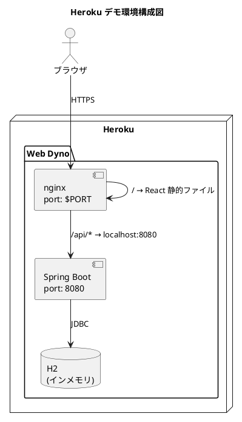
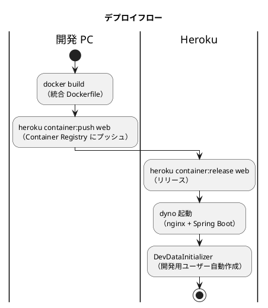

# Heroku 開発環境セットアップ手順書

## 概要

フレール・メモワール WEB ショップのデモ環境を Heroku Container Registry を使用してデプロイする手順を説明します。

開発プロファイル（H2 インメモリ DB）を使用するため、外部データベースの設定は不要です。dyno 再起動時にデータはリセットされますが、開発用ユーザー（dev@example.com）は起動時に自動作成されます。

### サービス構成

| サービス | コンテナ内ポート | 説明 |
|---------|----------------|------|
| nginx | $PORT（Heroku 割当） | リバースプロキシ + 静的ファイル配信 |
| Spring Boot | 8080 | REST API サーバー（H2 インメモリ DB） |

---

## アーキテクチャ



### デプロイフロー



---

## 前提条件

| ツール | バージョン | 確認コマンド |
|--------|-----------|-------------|
| Heroku CLI | 最新 | `heroku --version` |
| Docker Desktop | 最新 | `docker --version` |
| Git | 最新 | `git --version` |

### Heroku CLI のインストール

```bash
# macOS
brew tap heroku/brew && brew install heroku

# バージョン確認
heroku --version
```

### Heroku アカウント

- Heroku アカウントが必要です: https://signup.heroku.com/
- Container Registry を使用するため、クレジットカードの登録が必要な場合があります

---

## セットアップ手順

### 1. Heroku CLI ログイン

```bash
heroku login
heroku container:login
```

### 2. Heroku アプリの作成

```bash
heroku create fleur-memoire-demo
```

> **Note**: アプリ名は Heroku 全体でユニークである必要があります。既に使用されている場合は別の名前を指定してください。

### 3. Docker イメージのビルドとプッシュ

```bash
cd apps/webshop

# イメージをビルドして Container Registry にプッシュ
heroku container:push web -a fleur-memoire-demo
```

> **Note**: 初回ビルドは Gradle の依存関係ダウンロードと npm install で数分かかります。

### 4. リリース

```bash
heroku container:release web -a fleur-memoire-demo
```

### 5. 動作確認

```bash
# ブラウザで開く
heroku open -a fleur-memoire-demo

# ログを確認
heroku logs --tail -a fleur-memoire-demo
```

---

## アクセス確認

| 確認項目 | URL |
|---------|-----|
| アプリケーション | `https://fleur-memoire-demo-XXXXX.herokuapp.com/` |
| ヘルスチェック | `https://fleur-memoire-demo-XXXXX.herokuapp.com/api/health` |

### ログイン情報（開発用）

| 項目 | 値 |
|------|-----|
| メールアドレス | `dev@example.com` |
| パスワード | `Password1` |

> ログイン画面にはデフォルトで上記の認証情報が入力済みです。「ログイン」ボタンを押すだけでアプリに入れます。

---

## ファイル構成

```text
apps/webshop/
├── Dockerfile.heroku       # 統合 Dockerfile（BE + FE + nginx）
├── heroku.yml              # Heroku Container Registry 設定
├── nginx-heroku.conf       # Heroku 用 nginx 設定（$PORT 対応）
├── start.sh                # nginx + Spring Boot 起動スクリプト
├── backend/                # Spring Boot バックエンド
│   ├── Dockerfile          # バックエンド単体 Dockerfile（ローカル用）
│   └── src/
└── frontend/               # React フロントエンド
    ├── Dockerfile          # フロントエンド単体 Dockerfile（ローカル用）
    └── src/
```

### Dockerfile.heroku の構成

3 ステージビルドで最終イメージを軽量化:

1. **backend-builder**: Gradle で Spring Boot JAR をビルド
2. **frontend-builder**: Vite で React をビルド
3. **runtime**: Eclipse Temurin JRE + nginx で両方を起動

---

## 更新手順

アプリを更新する場合:

```bash
cd apps/webshop

# 1. イメージを再ビルドしてプッシュ
heroku container:push web -a fleur-memoire-demo

# 2. リリース
heroku container:release web -a fleur-memoire-demo
```

---

## 環境の削除

```bash
heroku apps:destroy fleur-memoire-demo --confirm fleur-memoire-demo
```

---

## トラブルシューティング

### アプリが起動しない

```bash
# ログを確認
heroku logs --tail -a fleur-memoire-demo
```

| 症状 | 原因 | 対処 |
|------|------|------|
| `R10 - Boot timeout` | 起動に 60 秒以上かかっている | Spring Boot の起動が遅い場合がある。再度 `heroku container:release` を試す |
| `H10 - App crashed` | アプリがクラッシュした | ログでエラーメッセージを確認 |
| `R14 - Memory quota exceeded` | メモリ不足 | Basic dyno（1GB）を使用するか、JVM ヒープサイズを調整 |

### JVM メモリの調整

Heroku の Eco/Basic dyno はメモリが限られています。必要に応じて環境変数で調整:

```bash
heroku config:set JAVA_OPTS="-Xmx256m -Xms128m" -a fleur-memoire-demo
```

### ポートの問題

Heroku は `$PORT` 環境変数でポートを動的に割り当てます。nginx が `$PORT` をリッスンするように設定されています。Spring Boot は内部ポート 8080 を使用し、外部には公開しません。

---

## 関連ドキュメント

- [アプリケーション開発環境セットアップ手順書](app-development-setup.md)
- [CI/CD パイプライン設計](cicd-pipeline.md)
- [リリース計画](../development/release_plan.md)
