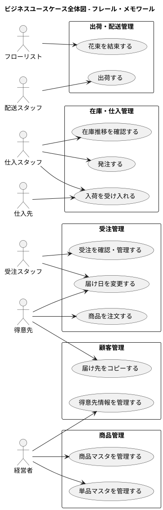

# ビジネスユースケース - フレール・メモワール WEB ショップシステム

## アクター一覧

| 種別 | アクター | 役割 | 分類 |
| :--- | :--- | :--- | :--- |
| ヒューマン | 得意先 | 花束を注文する個人顧客 | 主アクター |
| ヒューマン | 受注スタッフ | 受注管理、届け日変更対応を行う | 主アクター |
| ヒューマン | 仕入スタッフ | 在庫推移確認、発注判断、入荷管理を行う | 主アクター |
| ヒューマン | フローリスト | 花材から花束を結束する専門スタッフ | 主アクター |
| ヒューマン | 配送スタッフ | 出荷・配送手配を行う | 主アクター |
| ヒューマン | 経営者 | 商品企画、マスタ管理を行う | 主アクター |
| ヒューマン | 仕入先 | 単品（花材）を供給するパートナー | 支援アクター |

## ビジネスユースケース全体図

## ビジネスユースケース一覧

### 受注管理

| ID | ビジネスユースケース | 主アクター | レベル | 説明 |
| :--- | :--- | :--- | :--- | :--- |
| BUC-01 | 商品を注文する | 得意先 | ユーザー目的 | WEB ショップから花束を選択し、届け日・届け先・メッセージを指定して注文する |
| BUC-02 | 届け日を変更する | 得意先 / 受注スタッフ | ユーザー目的 | 注文済みの花束の届け日を変更する。在庫推移から変更可否を判断する |
| BUC-03 | 受注を確認・管理する | 受注スタッフ | ユーザー目的 | 受注一覧から注文状況を確認し、受注のステータスを管理する |

### 在庫・仕入管理

| ID | ビジネスユースケース | 主アクター | レベル | 説明 |
| :--- | :--- | :--- | :--- | :--- |
| BUC-04 | 在庫推移を確認する | 仕入スタッフ | ユーザー目的 | 品質維持日数を考慮した日別の在庫予定数を確認し、発注判断の材料にする |
| BUC-05 | 発注する | 仕入スタッフ | ユーザー目的 | 在庫推移に基づき、仕入先に単品を発注する |
| BUC-06 | 入荷を受け入れる | 仕入スタッフ | ユーザー目的 | 仕入先からの単品の入荷を受け入れ、在庫に反映する |

### 出荷・配送管理

| ID | ビジネスユースケース | 主アクター | レベル | 説明 |
| :--- | :--- | :--- | :--- | :--- |
| BUC-07 | 花束を結束する | フローリスト | ユーザー目的 | 出荷日（届け日の前日）に花材から花束を組み立てる |
| BUC-08 | 出荷する | 配送スタッフ | ユーザー目的 | 結束済みの花束を出荷し、配送手配を行う |

### 商品管理

| ID | ビジネスユースケース | 主アクター | レベル | 説明 |
| :--- | :--- | :--- | :--- | :--- |
| BUC-09 | 商品マスタを管理する | 経営者 | ユーザー目的 | 花束（商品）の登録・更新・構成管理を行う |
| BUC-10 | 単品マスタを管理する | 経営者 | ユーザー目的 | 単品（花材）の品質維持日数・購入単位・リードタイム等を管理する |

### 顧客管理

| ID | ビジネスユースケース | 主アクター | レベル | 説明 |
| :--- | :--- | :--- | :--- | :--- |
| BUC-11 | 届け先をコピーする | 得意先 | ユーザー目的 | 過去の注文から届け先情報をコピーして再利用する |
| BUC-12 | 得意先情報を管理する | 経営者 | ユーザー目的 | 得意先の基本情報と履歴を管理する |

## トレーサビリティ

### 要件定義との対応

| ビジネスユースケース | 要件定義の層 | 対応する要素 |
| :--- | :--- | :--- |
| BUC-01 商品を注文する | 層 2 外部環境 | 受注管理業務 |
| BUC-02 届け日を変更する | 層 2 外部環境 | 受注管理業務 |
| BUC-03 受注を確認・管理する | 層 2 外部環境 | 受注管理業務 |
| BUC-04 在庫推移を確認する | 層 2 外部環境 | 在庫・仕入管理業務 |
| BUC-05 発注する | 層 2 外部環境 | 在庫・仕入管理業務 |
| BUC-06 入荷を受け入れる | 層 2 外部環境 | 在庫・仕入管理業務 |
| BUC-07 花束を結束する | 層 2 外部環境 | 出荷・配送管理業務 |
| BUC-08 出荷する | 層 2 外部環境 | 出荷・配送管理業務 |
| BUC-09 商品マスタを管理する | 層 3 境界 | 商品管理 |
| BUC-10 単品マスタを管理する | 層 3 境界 | 商品管理 |
| BUC-11 届け先をコピーする | 層 2 外部環境 | 顧客管理業務 |
| BUC-12 得意先情報を管理する | 層 2 外部環境 | 顧客管理業務 |
