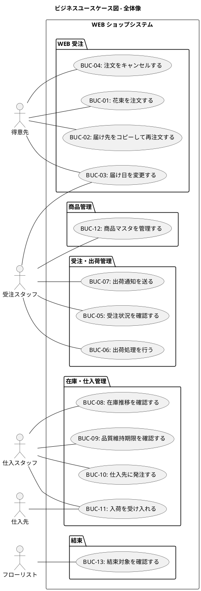

# ビジネスユースケース - フレール・メモワール WEB ショップシステム

## アクター・目的リスト

| アクター | 目的 | レベル | 優先度 | 頻度 |
| :--- | :--- | :--- | :--- | :--- |
| 得意先 | 花束を注文する | 🌊 | 必須 | 数十回/日 |
| 得意先 | 届け先をコピーして再注文する | 🌊 | 必須 | 数回/日 |
| 得意先 | 届け日を変更する | 🌊 | 高 | 数回/週 |
| 得意先 | 注文をキャンセルする | 🌊 | 高 | 数回/週 |
| 受注スタッフ | 受注状況を確認する | 🌊 | 必須 | 数十回/日 |
| 受注スタッフ | 出荷処理を行う | 🌊 | 必須 | 数十回/日 |
| 受注スタッフ | 出荷通知を送る | 🌊 | 高 | 数十回/日 |
| 受注スタッフ | 商品マスタを管理する | 🌊 | 必須 | 数回/週 |
| 仕入スタッフ | 在庫推移を確認する | 🌊 | 必須 | 数回/日 |
| 仕入スタッフ | 品質維持期限を確認する | 🌊 | 必須 | 数回/日 |
| 仕入スタッフ | 仕入先に発注する | 🌊 | 必須 | 数回/日 |
| 仕入スタッフ | 入荷を受け入れる | 🌊 | 必須 | 数回/日 |
| フローリスト | 結束対象を確認する | 🌊 | 必須 | 数十回/日 |

## ビジネスユースケース図

### 全体像

## ビジネスユースケース詳細

### BUC-01: 花束を注文する

| 項目 | 内容 |
| :--- | :--- |
| 主アクター | 得意先 |
| 目的 | 大切な記念日に花束を届けたい |
| 概要 | 得意先が WEB ショップで花束を選び、届け日・届け先・メッセージを指定して注文する。クレジットカード事前登録済みのため、注文確定で決済完了。注文確認メールが送信される |
| 事前条件 | 商品（花束）がマスタに登録されている。得意先のクレジットカードが事前登録済み |
| 成功時の結果 | 受注が登録され、在庫引当が行われ、注文確認メールが送信される |
| トリガー | 得意先が WEB ショップにアクセスする |

### BUC-02: 届け先をコピーして再注文する

| 項目 | 内容 |
| :--- | :--- |
| 主アクター | 得意先（リピーター） |
| 目的 | 過去と同じ届け先に手軽に花束を再注文したい |
| 概要 | 過去の注文から届け先情報をコピーして新しい注文に利用する。住所の再入力が不要になり、入力ミスも防げる |
| 事前条件 | 過去の注文履歴に届け先情報がある |
| 成功時の結果 | 過去の届け先がコピーされ、新しい注文が登録される |
| トリガー | 得意先が再注文を開始する |

### BUC-03: 届け日を変更する

| 項目 | 内容 |
| :--- | :--- |
| 主アクター | 得意先 |
| 支援アクター | 受注スタッフ |
| 目的 | 注文後に届け日を変更したい |
| 概要 | 届け日の 3 日前（= 出荷日の 2 日前）までであれば、在庫状況を確認の上で届け日を変更できる。変更不可の場合は代替日を提案する |
| 事前条件 | 受注が受付済みで、変更期限内である |
| 成功時の結果 | 届け日が変更され、在庫引当が再計算される |
| トリガー | 得意先が届け日変更を依頼する |

### BUC-04: 注文をキャンセルする

| 項目 | 内容 |
| :--- | :--- |
| 主アクター | 得意先 |
| 目的 | 注文をキャンセルしたい |
| 概要 | 届け日の 3 日前（= 出荷日の 2 日前）までであれば注文をキャンセルできる。在庫引当が解除される |
| 事前条件 | 受注が受付済みで、キャンセル期限内である |
| 成功時の結果 | 受注がキャンセル済みとなり、在庫引当が解除される |
| トリガー | 得意先がキャンセルを依頼する |

### BUC-05: 受注状況を確認する

| 項目 | 内容 |
| :--- | :--- |
| 主アクター | 受注スタッフ |
| 目的 | 受注の一覧と各受注のステータスを確認したい |
| 概要 | 管理画面で受注一覧を確認し、ステータス（受付済み・出荷準備中・出荷済み・キャンセル済み）で絞り込む |
| 事前条件 | なし |
| 成功時の結果 | 受注状況が把握でき、対応が必要な受注を識別できる |
| トリガー | 受注スタッフが管理画面を開く |

### BUC-06: 出荷処理を行う

| 項目 | 内容 |
| :--- | :--- |
| 主アクター | 受注スタッフ |
| 目的 | 結束済みの花束を出荷する |
| 概要 | 出荷日（= 届け日の前日）に結束済みの花束を出荷処理する。受注ステータスが「出荷済み」に更新される |
| 事前条件 | 受注が出荷準備中で、結束が完了している |
| 成功時の結果 | 出荷が記録され、受注ステータスが出荷済みになる |
| トリガー | 出荷日になる |

### BUC-07: 出荷通知を送る

| 項目 | 内容 |
| :--- | :--- |
| 主アクター | 受注スタッフ |
| 目的 | 得意先に出荷完了を通知する |
| 概要 | 出荷処理完了後、得意先に出荷通知メールを送信する |
| 事前条件 | 出荷処理が完了している |
| 成功時の結果 | 得意先に出荷通知メールが送信される |
| トリガー | 出荷処理が完了する |

### BUC-08: 在庫推移を確認する

| 項目 | 内容 |
| :--- | :--- |
| 主アクター | 仕入スタッフ |
| 目的 | 単品ごとの在庫推移を把握し、発注判断の材料を得たい |
| 概要 | 管理画面で単品ごとの日別在庫推移（在庫残・出庫予定・入荷予定・廃棄予定）を確認する。受注・入荷登録時にイベント駆動で即時更新される |
| 事前条件 | 単品マスタが登録されている |
| 成功時の結果 | 在庫推移が可視化され、発注判断の材料が得られる |
| トリガー | 仕入スタッフが管理画面を開く（通常は毎朝） |

### BUC-09: 品質維持期限を確認する

| 項目 | 内容 |
| :--- | :--- |
| 主アクター | 仕入スタッフ |
| 目的 | 品質維持期限が近い在庫を把握し、廃棄を防ぎたい |
| 概要 | 品質維持期限アラートで、期限まで残り 2 日以内の在庫ロットを確認する。入荷日を起算日として品質維持日数から期限を計算する |
| 事前条件 | 在庫ロットが存在する |
| 成功時の結果 | 廃棄リスクのある在庫が把握でき、優先的な活用判断ができる |
| トリガー | 仕入スタッフが管理画面を開く / アラート通知 |

### BUC-10: 仕入先に発注する

| 項目 | 内容 |
| :--- | :--- |
| 主アクター | 仕入スタッフ |
| 目的 | 不足する花材を仕入先に発注したい |
| 概要 | 在庫推移を確認した結果、不足する単品について仕入先への発注を登録する。発注判断は人間が行い、システムは判断材料を提供する |
| 事前条件 | 在庫推移が確認済みで、発注が必要な単品が特定されている |
| 成功時の結果 | 発注が登録され、入荷予定として在庫推移に反映される |
| トリガー | 仕入スタッフが発注を決定する |

### BUC-11: 入荷を受け入れる

| 項目 | 内容 |
| :--- | :--- |
| 主アクター | 仕入スタッフ |
| 支援アクター | 仕入先 |
| 目的 | 仕入先から届いた花材を在庫に登録したい |
| 概要 | 入荷した単品の数量を登録し、在庫に反映する。入荷日が品質維持日数の起算日となる |
| 事前条件 | 発注済みの注文がある |
| 成功時の結果 | 入荷が記録され、在庫が増加し、在庫推移が更新される |
| トリガー | 仕入先から単品が届く |

### BUC-12: 商品マスタを管理する

| 項目 | 内容 |
| :--- | :--- |
| 主アクター | 受注スタッフ |
| 目的 | 商品（花束）と単品のマスタデータを管理したい |
| 概要 | 商品（花束）の登録・更新、単品マスタの管理（品質維持日数・購入単位・リードタイム等）、花束構成（花束を構成する単品と数量）の定義を行う |
| 事前条件 | なし |
| 成功時の結果 | 商品・単品のマスタデータが登録・更新される |
| トリガー | 新商品の追加やマスタ情報の変更が必要になる |

### BUC-13: 結束対象を確認する

| 項目 | 内容 |
| :--- | :--- |
| 主アクター | フローリスト |
| 目的 | 出荷日当日に結束すべき花束と必要な花材を確認したい |
| 概要 | 出荷日（= 届け日の前日）の結束対象一覧を確認し、各花束に必要な花材と数量を把握する |
| 事前条件 | 出荷日の受注が存在する |
| 成功時の結果 | 結束すべき花束と必要な花材が把握できる |
| トリガー | 出荷日当日の朝 |
