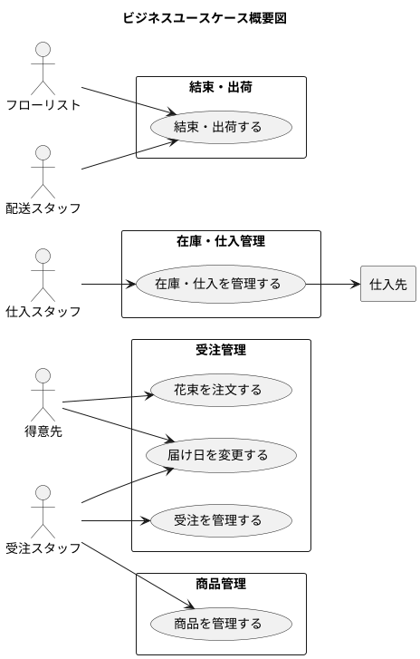

# ビジネスユースケース - フレール・メモワール WEB ショップ

## ユースケース概要図

## BUC01: 花束を注文する

| 項目 | 内容 |
| :--- | :--- |
| スコープ | フレール・メモワール WEB ショップ |
| レベル | ユーザー目的 |
| 主アクター | 得意先 |
| 概要 | 得意先が WEB ショップから花束を選び、届け日・届け先・メッセージを指定して注文する |
| 頻度 | 高（日常的） |

## BUC02: 届け日を変更する

| 項目 | 内容 |
| :--- | :--- |
| スコープ | フレール・メモワール WEB ショップ |
| レベル | ユーザー目的 |
| 主アクター | 得意先 |
| 概要 | 得意先が届け日の変更を依頼し、受注スタッフが出荷可否を判断して対応する |
| 頻度 | 中（不定期） |

## BUC03: 受注を管理する

| 項目 | 内容 |
| :--- | :--- |
| スコープ | フレール・メモワール WEB ショップ |
| レベル | ユーザー目的 |
| 主アクター | 受注スタッフ |
| 概要 | 受注スタッフが受注一覧を確認し、受注状態を管理する |
| 頻度 | 高（日常的） |

## BUC04: 在庫・仕入を管理する

| 項目 | 内容 |
| :--- | :--- |
| スコープ | フレール・メモワール WEB ショップ |
| レベル | 要約 |
| 主アクター | 仕入スタッフ |
| 概要 | 仕入スタッフが在庫推移を確認し、発注判断を行い、入荷を受け入れる |
| 頻度 | 高（日常的） |

## BUC05: 結束・出荷する

| 項目 | 内容 |
| :--- | :--- |
| スコープ | フレール・メモワール WEB ショップ |
| レベル | 要約 |
| 主アクター | フローリスト / 配送スタッフ |
| 概要 | 出荷日の受注に対し花束を結束し、出荷する |
| 頻度 | 高（日常的） |

## BUC06: 商品を管理する

| 項目 | 内容 |
| :--- | :--- |
| スコープ | フレール・メモワール WEB ショップ |
| レベル | ユーザー目的 |
| 主アクター | 受注スタッフ |
| 概要 | 商品（花束）と単品（花）のマスタ情報を管理する |
| 頻度 | 低（商品追加・変更時） |
