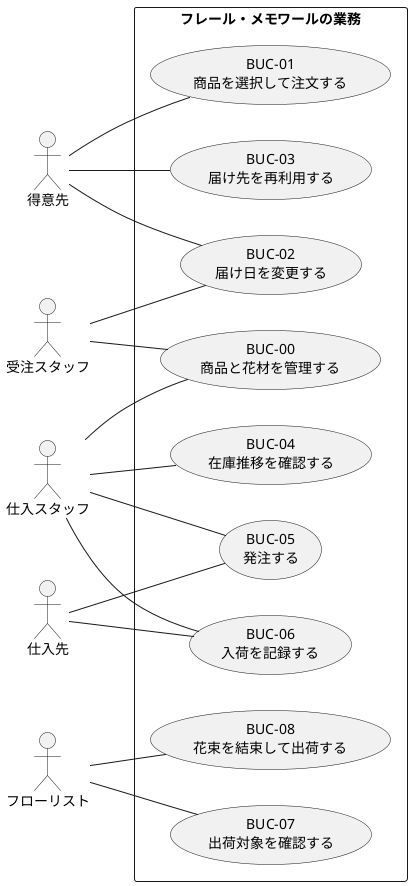

# ビジネスユースケース

本書は、要件定義書から導出したビジネスユースケースを整理したものです。業務目標、主アクター、成果物を明確にし、後続のシステムユースケースとユーザーストーリーにつなげます。

## 全体図

## ビジネスユースケース一覧

| ID | 名称 | 主アクター | 目的 | 主な成果 |
| :--- | :--- | :--- | :--- | :--- |
| BUC-00 | 商品と花材を管理する | 受注スタッフ、仕入スタッフ | 販売商品と花材の基礎データを維持する | 商品マスタと花材マスタが更新される |
| BUC-01 | 商品を選択して注文する | 得意先 | 記念日に届ける花束を注文する | 受注が登録される |
| BUC-02 | 届け日を変更する | 得意先、受注スタッフ | 既存受注の届け日を変更する | 変更結果が確定する |
| BUC-03 | 届け先を再利用する | 得意先 | 過去の届け先情報を再利用する | 入力負荷が下がる |
| BUC-04 | 在庫推移を確認する | 仕入スタッフ | 将来の不足や廃棄リスクを把握する | 発注判断材料が得られる |
| BUC-05 | 発注する | 仕入スタッフ | 必要な単品を仕入先へ依頼する | 発注が作成・送信される |
| BUC-06 | 入荷を記録する | 仕入スタッフ | 入荷予定と実績を更新する | 在庫予定が更新される |
| BUC-07 | 出荷対象を確認する | フローリスト | 出荷前日に必要な花材と対象受注を確認する | 出荷準備対象が明確になる |
| BUC-08 | 花束を結束して出荷する | フローリスト | 花束を組み立てて出荷可能状態にする | 花束が出荷準備完了になる |
| BUC-09 | 出荷を確定する | 受注スタッフ | 花束の発送実績を確定する | 出荷実績が確定する |

## BUC-00 商品と花材を管理する

**目的**: 受注スタッフと仕入スタッフが、販売商品と花材の基礎データを継続的に保守できるようにする。

**主アクター**: 受注スタッフ、仕入スタッフ

**事前条件**:

- 管理権限を持つスタッフがログインしている。

**成功結果**:

- 花束商品、花材、花束構成、仕入条件が登録または更新される。

**主な業務フロー**:

1. 受注スタッフが花束商品を登録または更新する。
2. 仕入スタッフが花材、品質維持日数、仕入条件を登録または更新する。
3. システムが基礎データを保存する。
4. 後続の受注、在庫推移、発注、出荷に反映される。

## BUC-01 商品を選択して注文する

**目的**: 得意先が届け日、届け先、メッセージを指定して花束を注文できるようにする。

**主アクター**: 得意先

**支援アクター**: 受注スタッフ

**事前条件**:

- 商品マスタが登録されている。
- 注文受付可能な届け日が設定されている。

**成功結果**:

- 受注が登録される。
- 出荷準備の対象として扱える。

**主な業務フロー**:

1. 得意先が商品を選択する。
2. 得意先が届け日、届け先、メッセージを入力する。
3. 得意先が注文内容を確認し、注文を確定する。
4. 受注スタッフが受注内容を確認する。

## BUC-02 届け日を変更する

**目的**: 得意先の要望に応じて、条件を満たす場合に届け日を変更できるようにする。

**主アクター**: 得意先

**支援アクター**: 受注スタッフ

**事前条件**:

- 対象受注が存在する。
- 受注がキャンセル済みではない。

**成功結果**:

- 変更可否が判断される。
- 変更可能な場合は新しい届け日で受注が更新される。

**主な業務フロー**:

1. 得意先が届け日変更を依頼する。
2. 受注スタッフが受注内容を確認する。
3. 受注スタッフが在庫推移と出荷条件を確認する。
4. 条件を満たす場合は届け日を変更する。
5. 条件を満たさない場合は変更不可を案内する。

## BUC-03 届け先を再利用する

**目的**: リピーターが過去の届け先情報を再利用して短時間で注文できるようにする。

**主アクター**: 得意先

**事前条件**:

- 得意先を識別できるメールアドレスと電話番号の組み合わせが入力済みである。
- 得意先に過去の届け先履歴が存在する。

**成功結果**:

- 選択した届け先情報が新しい注文入力に反映される。

## BUC-04 在庫推移を確認する

**目的**: 仕入スタッフが不足リスクと廃棄リスクを可視化して発注判断できるようにする。

**主アクター**: 仕入スタッフ

**事前条件**:

- 商品構成、単品、品質維持日数、リードタイムが登録されている。
- 受注情報と入荷予定が反映されている。

**成功結果**:

- 日別在庫予定数が確認できる。
- 発注候補と注意対象が識別される。

## BUC-05 発注する

**目的**: 仕入スタッフが必要な単品を仕入先へ発注できるようにする。

**主アクター**: 仕入スタッフ

**支援アクター**: 仕入先

**事前条件**:

- 在庫推移から発注候補が確認できている。

**成功結果**:

- 発注内容が仕入先別に確定し、送信される。

## BUC-06 入荷を記録する

**目的**: 納品された単品を入荷実績として記録し、在庫予定へ反映する。

**主アクター**: 仕入スタッフ

**支援アクター**: 仕入先

**事前条件**:

- 対象となる発注が存在する。

**成功結果**:

- 入荷実績が登録される。
- 在庫予定が更新される。

## BUC-07 出荷対象を確認する

**目的**: フローリストが出荷前日に必要な花材と作業対象を把握できるようにする。

**主アクター**: フローリスト

**事前条件**:

- 出荷対象の受注が登録されている。

**成功結果**:

- 出荷対象一覧が確認される。
- 花束構成にもとづく必要花材が把握できる。

## BUC-08 花束を結束して出荷する

**目的**: 花束を結束し、出荷可能な状態にする。

**主アクター**: フローリスト

**事前条件**:

- 出荷対象が確認済みである。
- 必要花材が揃っている、または不足が把握されている。

**成功結果**:

- 花束が結束される。
- 出荷準備完了として引き継がれる。

## BUC-09 出荷を確定する

**目的**: 出荷準備が完了した花束の発送実績を記録し、受注を出荷済みにする。

**主アクター**: 受注スタッフ

**支援アクター**: フローリスト

**事前条件**:

- 出荷準備完了の対象が存在する。

**成功結果**:

- 出荷実績が確定する。
- 受注状態が出荷済みになる。

## トレーサビリティ

| ビジネスユースケース | 対応するシステムユースケース |
| :--- | :--- |
| BUC-00 | UC-00、UC-00B |
| BUC-01 | UC-01、UC-02 |
| BUC-02 | UC-03 |
| BUC-03 | UC-04 |
| BUC-04 | UC-05 |
| BUC-05 | UC-06 |
| BUC-06 | UC-07 |
| BUC-07 | UC-08 |
| BUC-08 | UC-08B |
| BUC-09 | UC-09 |
