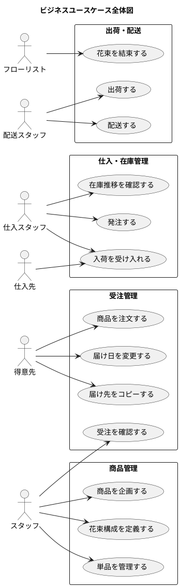

# ビジネスユースケース

## 業務領域の全体像

## 業務領域別ビジネスユースケース

### 商品管理

| BUC-ID | ユースケース名 | 主アクター | 概要 |
|--------|---------------|-----------|------|
| BUC-01 | 商品を企画する | スタッフ | 花束の組合せを商品として定義する |
| BUC-02 | 花束構成を定義する | スタッフ | 商品（花束）を構成する単品と数量を設定する |
| BUC-03 | 単品を管理する | スタッフ | 単品（花）の品質維持日数・購入単位・リードタイム・仕入先を管理する |

### 受注管理（追加）

| BUC-ID | ユースケース名 | 主アクター | 概要 |
|--------|---------------|-----------|------|
| BUC-14 | 注文をキャンセルする | 得意先 | 注文済みの花束の注文をキャンセルする |

### 受注管理

| BUC-ID | ユースケース名 | 主アクター | 概要 |
|--------|---------------|-----------|------|
| BUC-04 | 商品を注文する | 得意先 | WEB ショップから花束を選択し、届け日・届け先・メッセージを指定して注文する |
| BUC-05 | 届け日を変更する | 得意先 | 注文済みの花束の届け日を変更する |
| BUC-06 | 届け先をコピーする | 得意先 | 過去の注文の届け先情報をコピーして新しい注文に利用する |
| BUC-07 | 受注を確認する | 受注スタッフ | 受注一覧から注文状況を確認し、管理する |

### 仕入・在庫管理

| BUC-ID | ユースケース名 | 主アクター | 概要 |
|--------|---------------|-----------|------|
| BUC-08 | 在庫推移を確認する | 仕入スタッフ | 品質維持日数を考慮した日別在庫予定数を確認し、過不足を把握する |
| BUC-09 | 発注する | 仕入スタッフ | 在庫推移に基づき仕入先に単品を発注する |
| BUC-10 | 入荷を受け入れる | 仕入スタッフ | 仕入先から届いた単品を受け入れ、在庫に反映する |

### 出荷・配送

| BUC-ID | ユースケース名 | 主アクター | 概要 |
|--------|---------------|-----------|------|
| BUC-11 | 花束を結束する | フローリスト | 出荷日（届け日の前日）に花材から花束を組み立てる |
| BUC-12 | 出荷する | 配送スタッフ | 結束済みの花束を出荷処理する |
| BUC-13 | 配送する | 配送スタッフ | 届け先に花束を届ける |

## アクター一覧

| 種別 | アクター | 役割 | 関連 BUC |
|------|---------|------|----------|
| ヒューマン | 得意先 | 花束を注文する個人顧客 | BUC-04, BUC-05, BUC-06 |
| ヒューマン | スタッフ | 受注管理・商品管理・在庫管理・仕入管理・出荷管理を行うスタッフ | BUC-01〜03, BUC-07〜12 |
| ヒューマン | 仕入先 | 単品（花）を供給するパートナー | BUC-10 |

**備考**: ビジネスコンテキストでは受注スタッフ・仕入スタッフ・フローリスト・配送スタッフと役割が分かれているが、システム上はすべて「スタッフ」として統一する。権限管理は将来の拡張として検討する。
