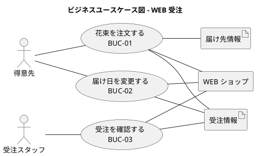
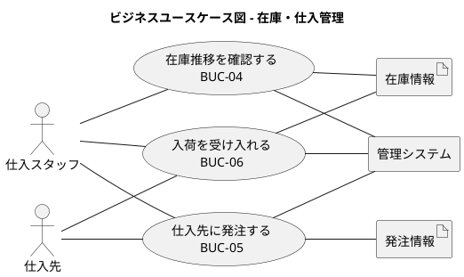
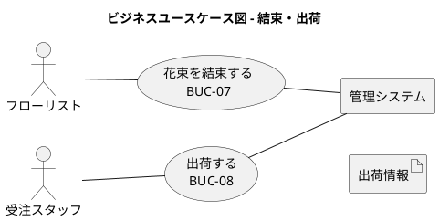

# ビジネスユースケース - フレール・メモワール WEB ショップシステム

## アクター一覧

| アクター | 種別 | 説明 |
| :--- | :--- | :--- |
| 得意先 | ヒューマン | 花束を注文する個人顧客。届け日・届け先・メッセージを指定し、クレジットカードで決済する |
| 受注スタッフ | ヒューマン | 受注確認・届け日変更対応・出荷管理を行うショップスタッフ |
| 仕入スタッフ | ヒューマン | 在庫推移確認・発注判断・入荷管理を行うショップスタッフ |
| フローリスト | ヒューマン | 花材から花束を結束するショップスタッフ |
| 仕入先 | ヒューマン | 単品（花）を供給するパートナー。単品ごとに特定の仕入先が決まっている |

## ビジネスユースケース一覧

| ID | ビジネスユースケース | 主アクター | 業務領域 |
| :--- | :--- | :--- | :--- |
| BUC-01 | 花束を注文する | 得意先 | WEB 受注 |
| BUC-02 | 届け日を変更する | 得意先 | WEB 受注 |
| BUC-03 | 受注を確認する | 受注スタッフ | WEB 受注 |
| BUC-04 | 在庫推移を確認する | 仕入スタッフ | 在庫・仕入管理 |
| BUC-05 | 仕入先に発注する | 仕入スタッフ | 在庫・仕入管理 |
| BUC-06 | 入荷を受け入れる | 仕入スタッフ | 在庫・仕入管理 |
| BUC-07 | 花束を結束する | フローリスト | 結束・出荷 |
| BUC-08 | 出荷する | 受注スタッフ | 結束・出荷 |

## ビジネスユースケース図

### WEB 受注

### 在庫・仕入管理

### 結束・出荷

## ビジネスユースケース詳細

### BUC-01: 花束を注文する

| 項目 | 内容 |
| :--- | :--- |
| 目的 | 得意先が WEB ショップから花束を注文し、指定日に指定場所へ届けてもらう |
| 主アクター | 得意先 |
| 事前条件 | WEB ショップにアクセスできる |
| 事後条件 | 受注が登録され、決済が完了している |
| 基本フロー | 商品選択 → 届け日・届け先・メッセージ入力 → 注文確定 → 決済処理 |
| 代替フロー | 過去の届け先をコピーして入力を省略できる |

### BUC-02: 届け日を変更する

| 項目 | 内容 |
| :--- | :--- |
| 目的 | 注文後に都合が変わった得意先が届け日を変更する |
| 主アクター | 得意先 |
| 事前条件 | 受注が存在し、出荷前である |
| 事後条件 | 受注の届け日が更新されている |
| 基本フロー | 変更後の届け日を入力 → 在庫確認 → 変更確定 |
| 代替フロー | 在庫不足の場合は変更不可を通知する |

### BUC-03: 受注を確認する

| 項目 | 内容 |
| :--- | :--- |
| 目的 | 受注スタッフが受注状況を把握し、出荷準備を行う |
| 主アクター | 受注スタッフ |
| 事前条件 | 受注が存在する |
| 事後条件 | 受注状況を把握している |
| 基本フロー | 受注一覧を表示 → 受注詳細を確認 |

### BUC-04: 在庫推移を確認する

| 項目 | 内容 |
| :--- | :--- |
| 目的 | 仕入スタッフが日別の在庫予定数を把握し、発注判断の材料とする |
| 主アクター | 仕入スタッフ |
| 事前条件 | 在庫情報が登録されている |
| 事後条件 | 発注が必要な単品を特定している |
| 基本フロー | 在庫推移画面を表示 → 品質維持日数を考慮した日別在庫を確認 |

### BUC-05: 仕入先に発注する

| 項目 | 内容 |
| :--- | :--- |
| 目的 | 在庫不足が見込まれる単品を仕入先に発注する |
| 主アクター | 仕入スタッフ |
| 事前条件 | 発注が必要な単品が特定されている |
| 事後条件 | 発注情報が登録され、仕入先に通知されている |
| 基本フロー | 発注数量を入力 → 発注確定 → 仕入先に通知 |

### BUC-06: 入荷を受け入れる

| 項目 | 内容 |
| :--- | :--- |
| 目的 | 仕入先から届いた単品を受け入れ、在庫に反映する |
| 主アクター | 仕入スタッフ |
| 事前条件 | 発注が存在する |
| 事後条件 | 入荷情報が登録され、在庫が更新されている |
| 基本フロー | 入荷数量を確認 → 入荷登録 → 在庫更新 |

### BUC-07: 花束を結束する

| 項目 | 内容 |
| :--- | :--- |
| 目的 | 出荷日当日に花材から花束を組み立てる |
| 主アクター | フローリスト |
| 事前条件 | 出荷対象の受注が存在し、必要な花材が在庫にある |
| 事後条件 | 花束が完成している |
| 基本フロー | 出荷対象受注の花束構成を確認 → 花材を準備 → 花束を結束 |

### BUC-08: 出荷する

| 項目 | 内容 |
| :--- | :--- |
| 目的 | 結束した花束を出荷し、届け日に届け先へ配送する |
| 主アクター | 受注スタッフ |
| 事前条件 | 花束の結束が完了している（届け日の前日） |
| 事後条件 | 出荷情報が登録され、配送手配が完了している |
| 基本フロー | 出荷対象を確認 → 出荷登録 → 配送手配 |
