# 要件定義 - フレール・メモワール WEB ショップシステム

## システム価値

### システムコンテキスト

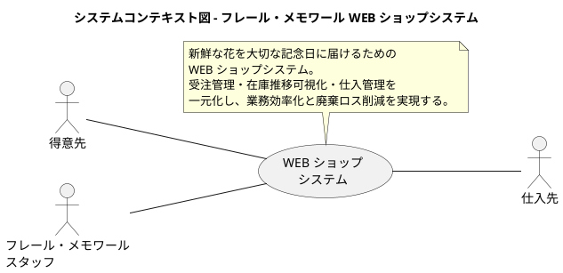

### 要求モデル

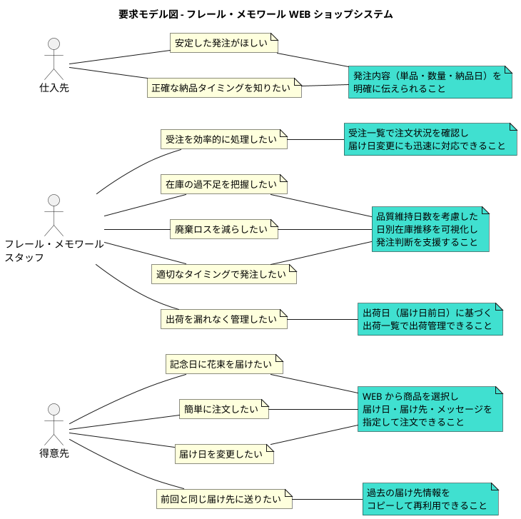

## システム外部環境

### ビジネスコンテキスト

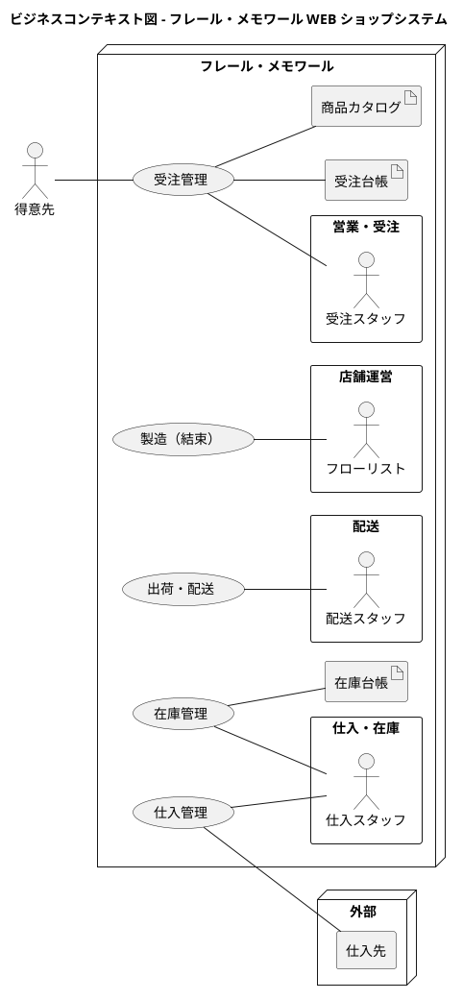

### ビジネスユースケース

#### 受注業務

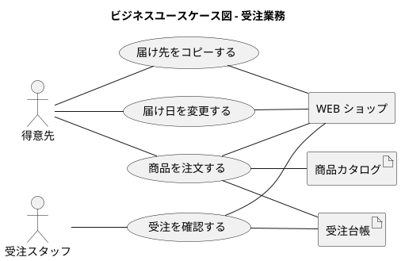

#### 仕入・在庫業務

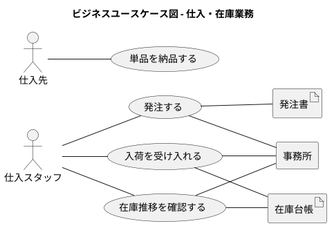

#### 出荷・配送業務

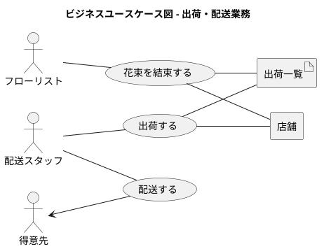

### 業務フロー

#### 商品注文の業務フロー

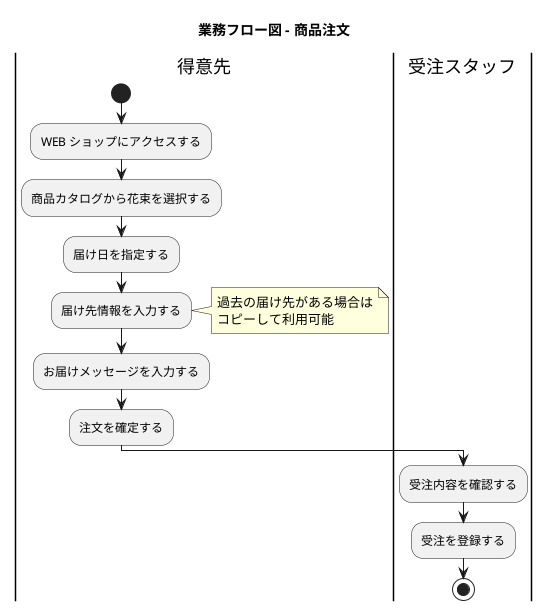

#### 届け日変更の業務フロー

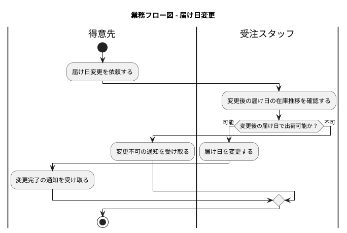

#### 仕入・入荷の業務フロー

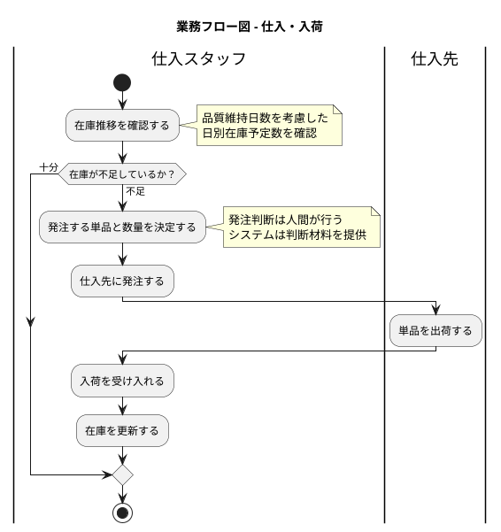

#### 出荷の業務フロー

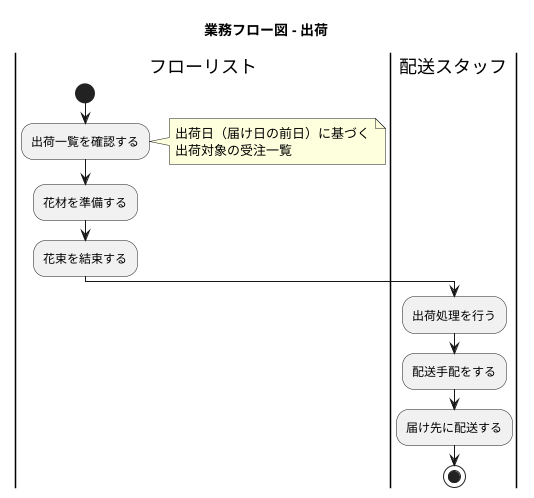

### 利用シーン

#### 受注業務の利用シーン

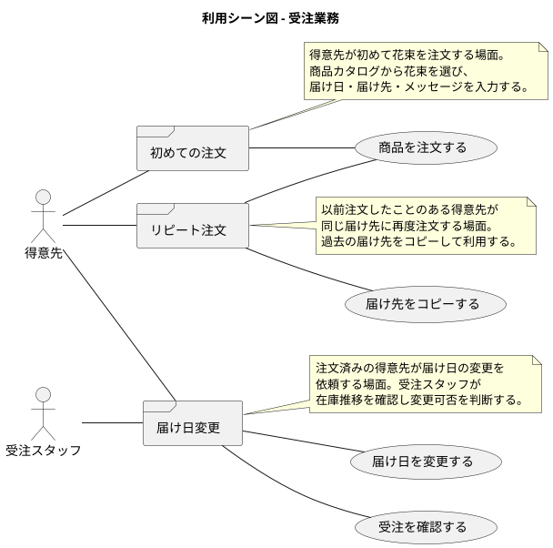

#### 仕入・在庫業務の利用シーン

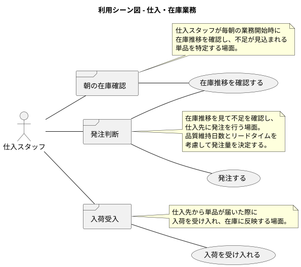

### バリエーション・条件

#### 商品種別

| 種別 | 説明 |
|------|------|
| 花束 | 事前定義された単品の組合せ。商品として販売する単位 |

#### 注文状態

| 状態 | 説明 |
|------|------|
| 受注済み | 注文が確定し、出荷待ちの状態 |
| 出荷済み | 花束が結束され出荷された状態 |
| キャンセル | 注文が取り消された状態 |

#### 在庫区分

| 区分 | 説明 |
|------|------|
| 良品在庫 | 品質維持日数内で使用可能な在庫 |
| 入荷予定 | 発注済みで未入荷の在庫 |
| 引当済み | 受注に紐づいて確保された在庫 |
| 廃棄対象 | 品質維持日数を超過し使用不可の在庫 |

#### 届け先区分

| 区分 | 説明 |
|------|------|
| 新規入力 | 初めて使用する届け先情報 |
| コピー利用 | 過去の注文から届け先情報をコピーして利用 |

#### 認証方式

| 方式 | 説明 |
|------|------|
| 会員登録 | 得意先はメールアドレスとパスワードで会員登録し、ログインして注文する |
| スタッフ認証 | スタッフは管理画面にユーザー ID とパスワードでログインする |

**備考**: ゲスト注文は初回リリースではサポートしない。届け先コピー機能（UC-06）は会員登録が前提。決済処理はクレジットカード事前登録済みの前提とし、システムスコープ外とする。

## システム境界

### ユースケース複合図

#### 受注業務

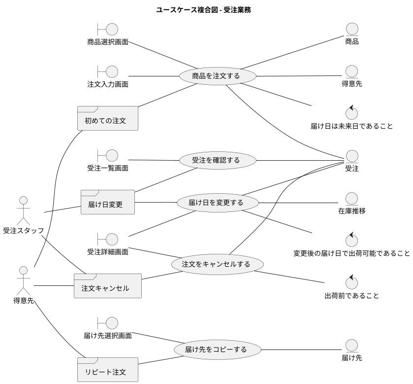

#### 仕入・在庫業務

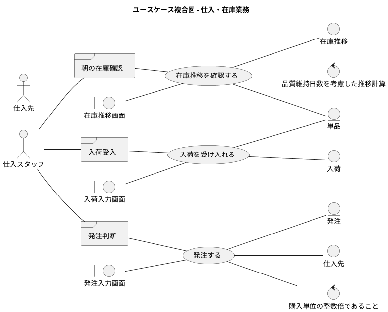

#### 出荷・配送業務

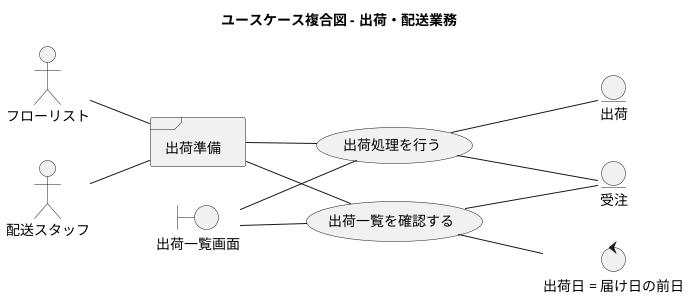

#### 商品管理業務

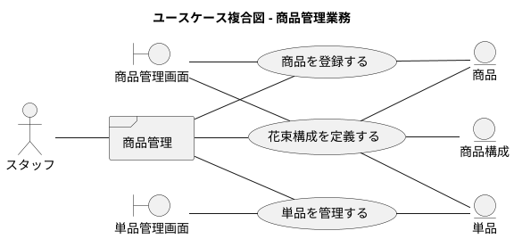

## システム

### 情報モデル

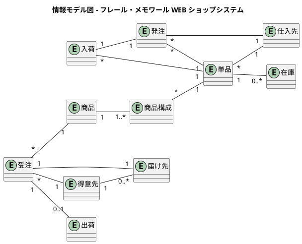

### 状態モデル

#### 受注の状態遷移

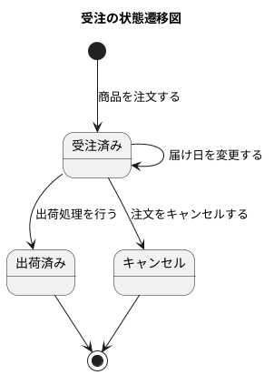

#### 発注の状態遷移

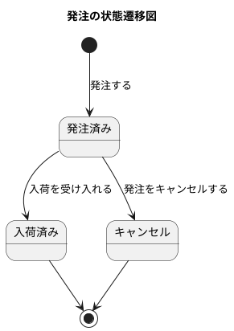

#### 在庫の状態遷移

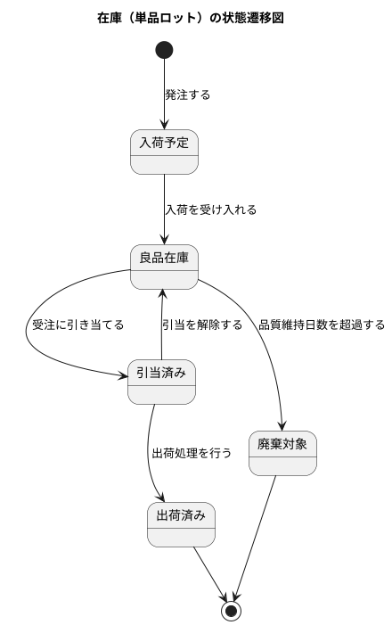

---

## トレーサビリティ

### 要求 → ユースケース対応表

| 要求 | ユースケース |
|------|-------------|
| 記念日に花束を届けたい | 商品を注文する |
| 簡単に注文したい | 商品を注文する |
| 届け日を変更したい | 届け日を変更する |
| 前回と同じ届け先に送りたい | 届け先をコピーする |
| 受注を効率的に処理したい | 受注を確認する |
| 在庫の過不足を把握したい | 在庫推移を確認する |
| 廃棄ロスを減らしたい | 在庫推移を確認する |
| 適切なタイミングで発注したい | 発注する |
| 出荷を漏れなく管理したい | 出荷一覧を確認する、出荷処理を行う |
| 安定した発注がほしい | 発注する |
| 正確な納品タイミングを知りたい | 発注する |
