# 要件定義 - フレール・メモワール WEB ショップシステム

## システム価値

### システムコンテキスト

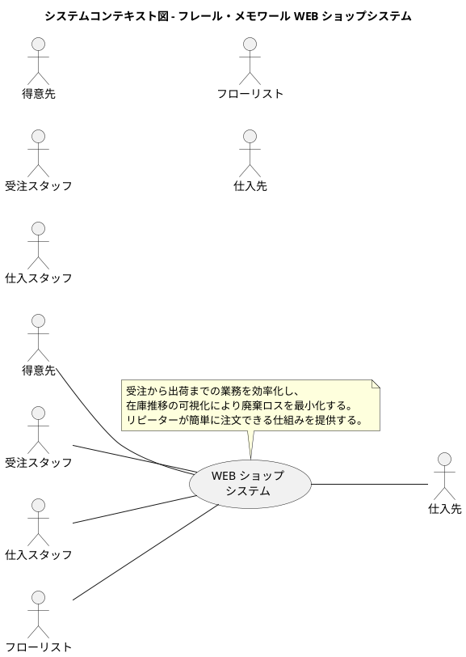

### 要求モデル

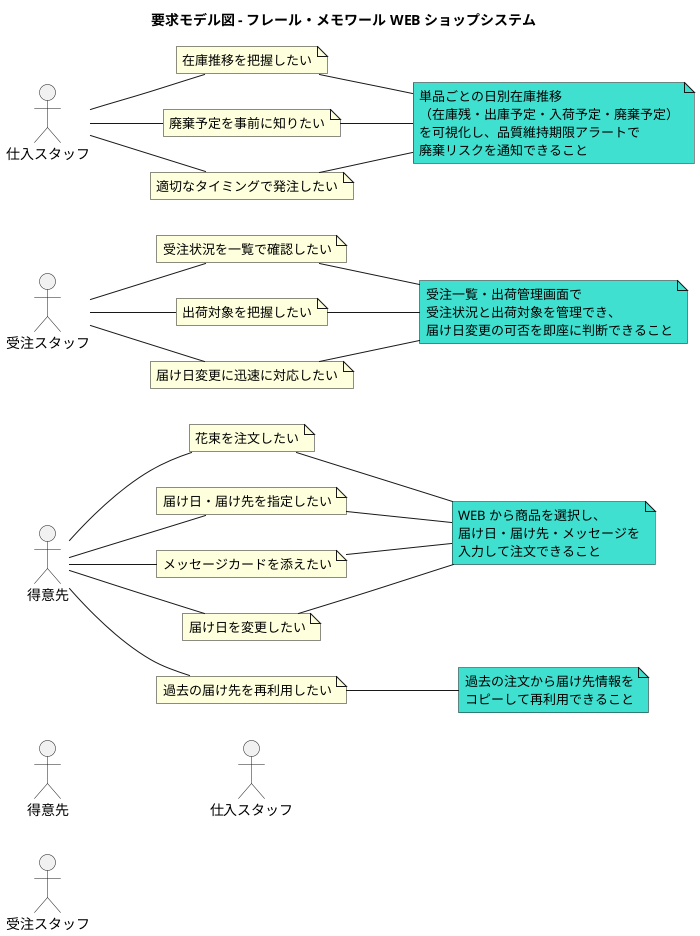

## システム外部環境

### ビジネスコンテキスト

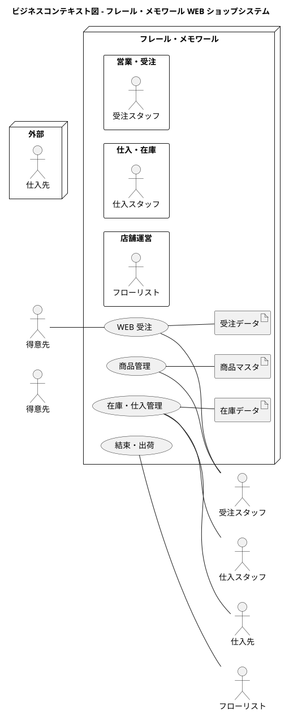

### ビジネスユースケース

#### WEB 受注

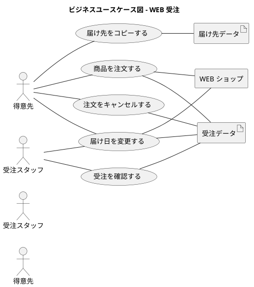

#### 在庫・仕入管理

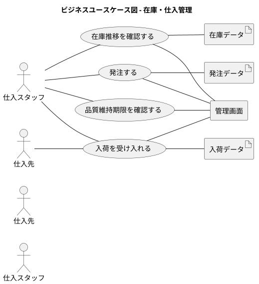

#### 結束・出荷

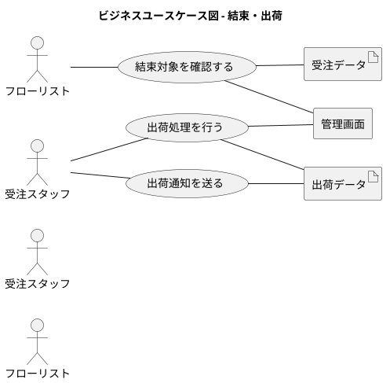

#### 商品管理

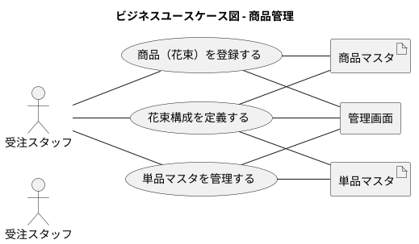

### 業務フロー

#### 商品を注文するの業務フロー

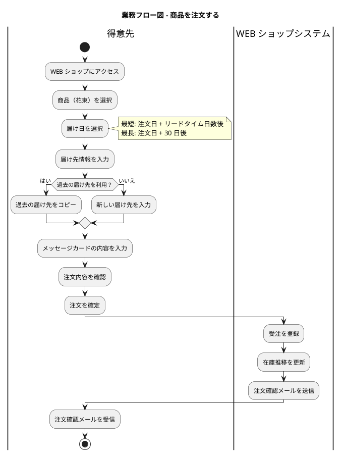

#### 在庫推移を確認し発注するの業務フロー

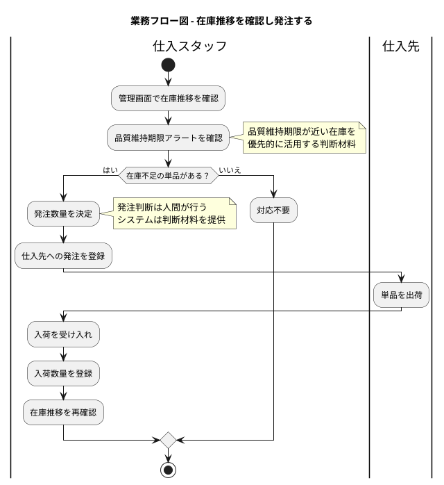

#### 結束・出荷の業務フロー

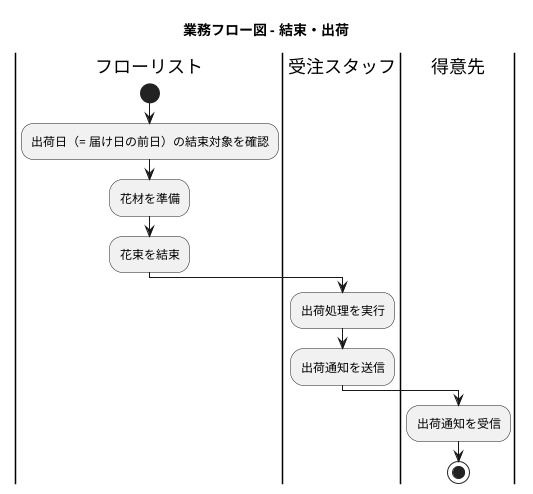

#### 届け日を変更するの業務フロー

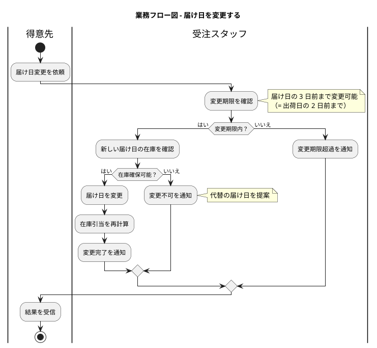

### 利用シーン

#### WEB 受注の利用シーン

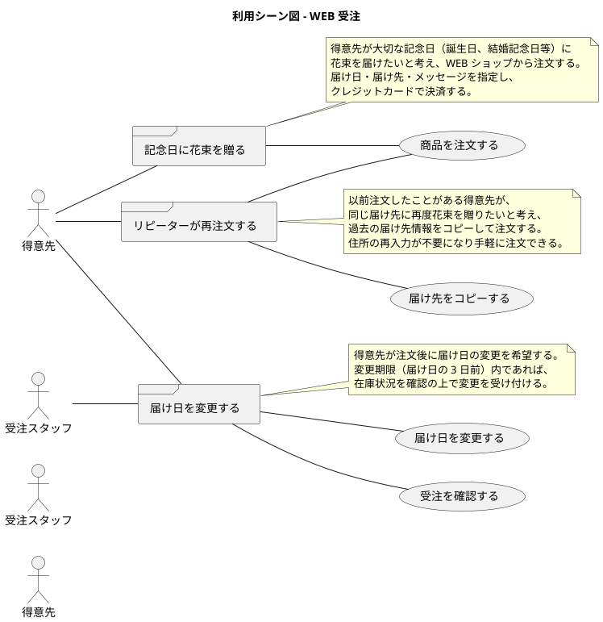

#### 在庫・仕入管理の利用シーン

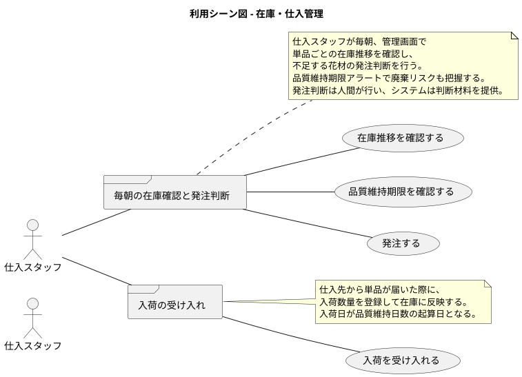

### バリエーション・条件

#### 受注ステータス

| ステータス | 説明 |
| :--- | :--- |
| 受付済み | 得意先が注文を確定した状態 |
| 出荷準備中 | 出荷日（届け日の前日）に結束作業が必要な状態 |
| 出荷済み | 出荷処理が完了した状態 |
| キャンセル済み | 得意先の要望により注文がキャンセルされた状態 |

#### 在庫ステータス

| ステータス | 説明 |
| :--- | :--- |
| 入荷予定 | 発注済みだがまだ入荷していない状態 |
| 在庫あり | 入荷済みで品質維持期限内の状態 |
| 引当済み | 受注に対して在庫が確保された状態 |
| 品質期限間近 | 品質維持期限まで残り 2 日以内の状態 |
| 廃棄対象 | 品質維持日数を超過し廃棄が必要な状態 |

#### 届け日変更可否

| 条件 | 変更可否 |
| :--- | :--- |
| 届け日の 3 日前以前 | 変更可能（在庫確保が前提） |
| 届け日の 3 日前〜当日 | 変更不可 |
| 出荷済み | 変更不可 |

## システム境界

### ユースケース複合図

#### WEB 受注

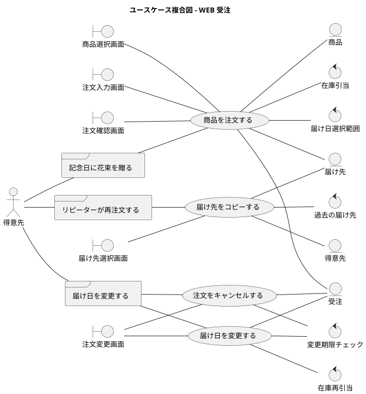

#### 在庫・仕入管理

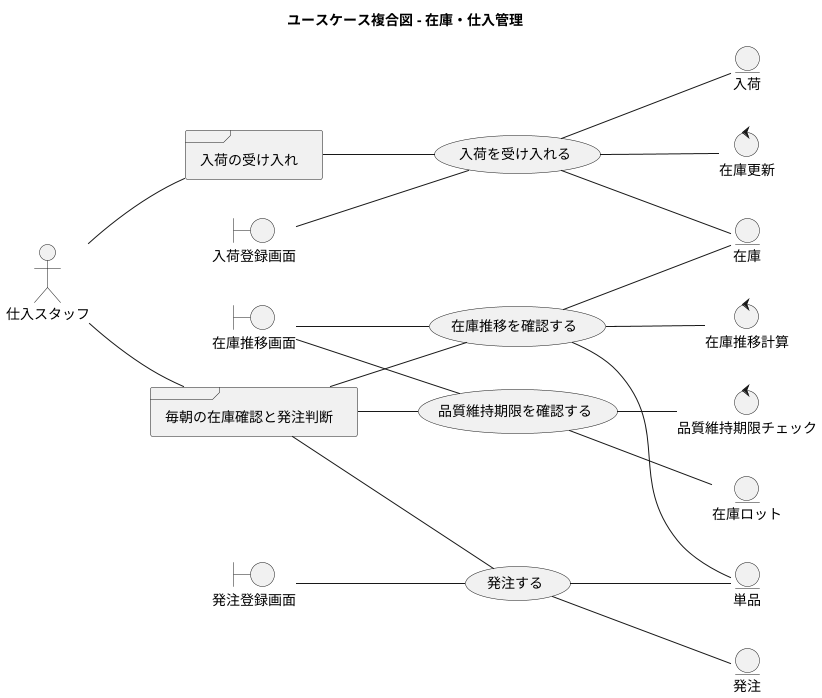

#### 結束・出荷

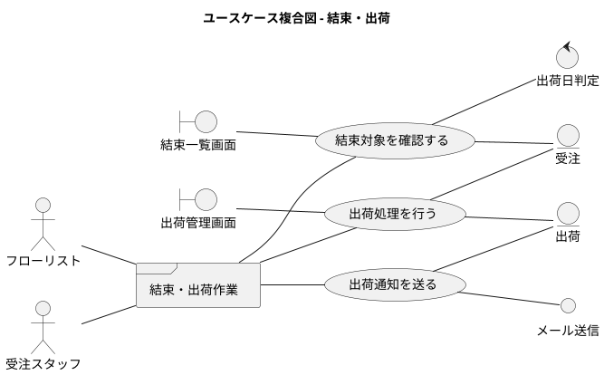

#### 商品管理

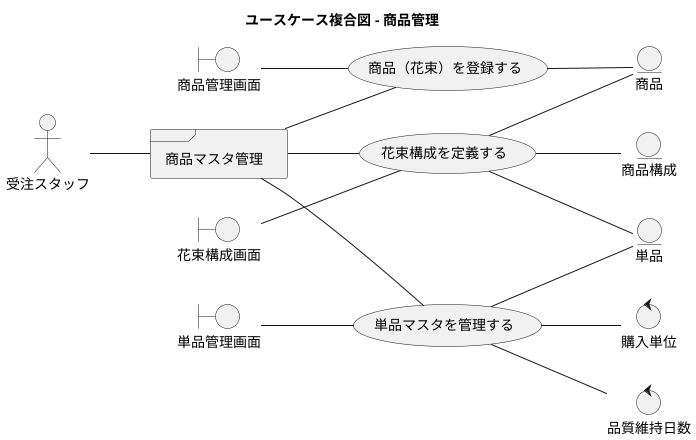

## システム

### 情報モデル

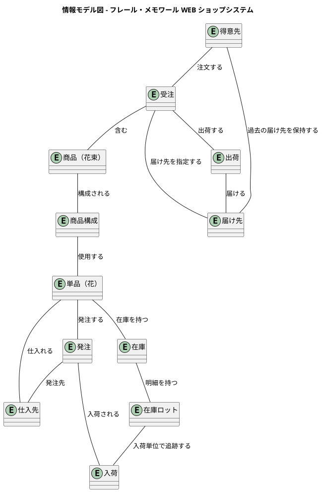

### 状態モデル

#### 受注の状態遷移

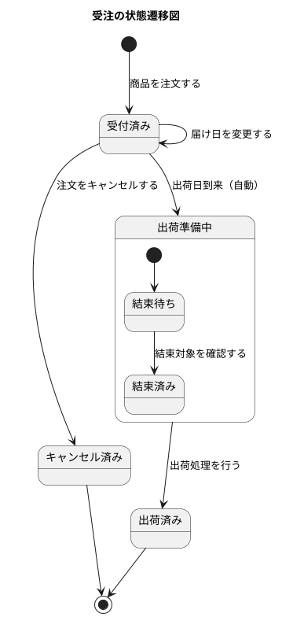

#### 在庫ロットの状態遷移

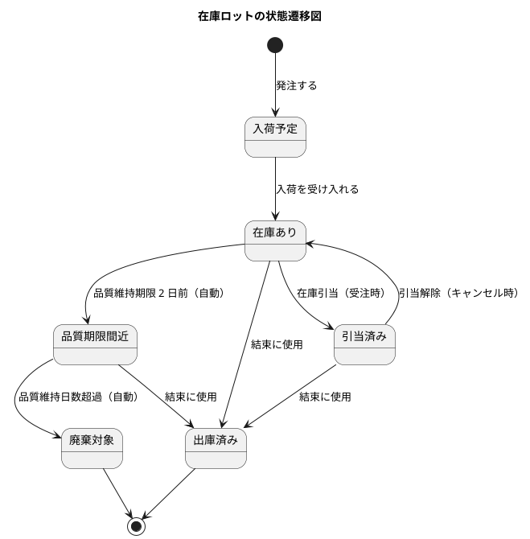

#### 発注の状態遷移

```plantuml
@startuml
title 発注の状態遷移図

[*] --> 発注済み : 発注する
発注済み --> 入荷済み : 入荷を受け入れる
発注済み --> キャンセル : 発注をキャンセルする

入荷済み --> [*]
キャンセル --> [*]
@enduml
```
