# 要件定義 - フレール・メモワール WEB ショップシステム

## システム価値

### システムコンテキスト

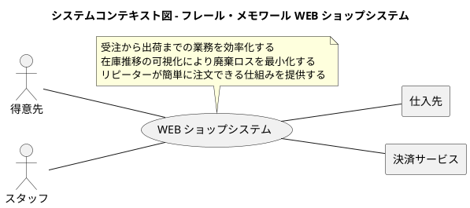

### 要求モデル

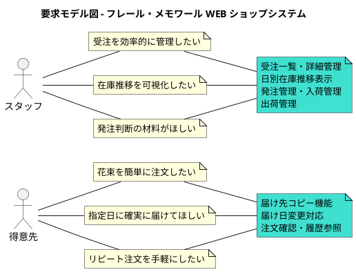

## システム外部環境

### ビジネスコンテキスト

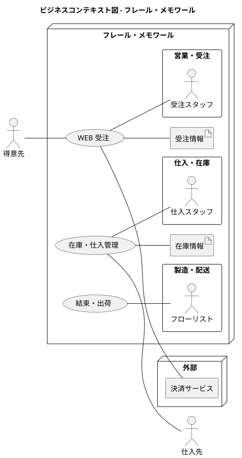

### ビジネスユースケース

#### WEB 受注

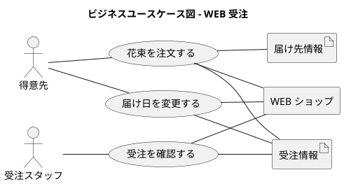

#### 在庫・仕入管理

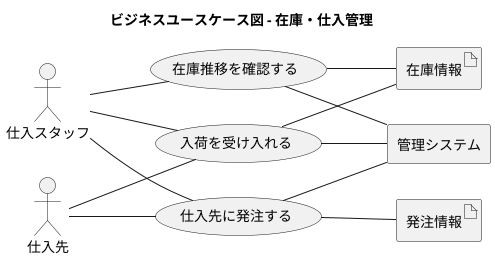

#### 結束・出荷

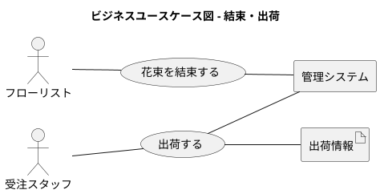

### 業務フロー

#### 花束を注文するの業務フロー

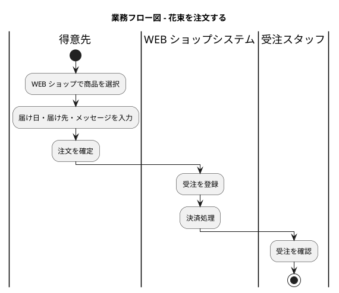

#### 在庫推移確認・発注の業務フロー

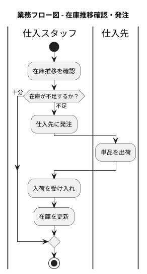

#### 結束・出荷の業務フロー

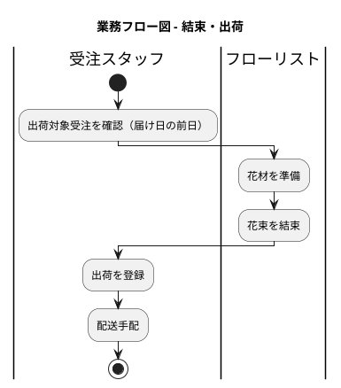

### 利用シーン

#### WEB 受注の利用シーン

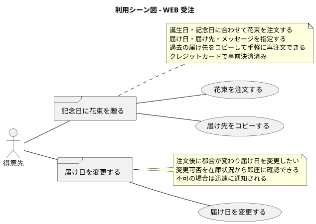

#### 在庫・仕入管理の利用シーン

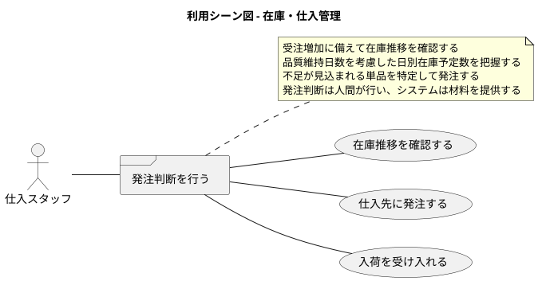

### バリエーション・条件

#### 商品（花束）の種類

| 分類名 | 説明 |
|--------|------|
| 商品コード | 花束を一意に識別するコード |
| 商品名 | 花束の名称 |
| 構成単品 | 花束を構成する単品と数量の組合せ |

#### 届け日の条件

| 分類名 | 説明 |
|--------|------|
| 出荷日 | 届け日の前日 |
| 変更可否 | 変更後の届け日に対応する出荷日の在庫が確保できるか |
| 変更締切 | 出荷日前日まで変更可能 |

#### 在庫の状態

| 分類名 | 説明 |
|--------|------|
| 在庫数 | 現在の手持ち在庫数量 |
| 品質維持日数 | 入荷日から品質を維持できる日数 |
| 廃棄対象 | 品質維持日数を超えた在庫 |

## システム境界

### ユースケース複合図

#### WEB 受注

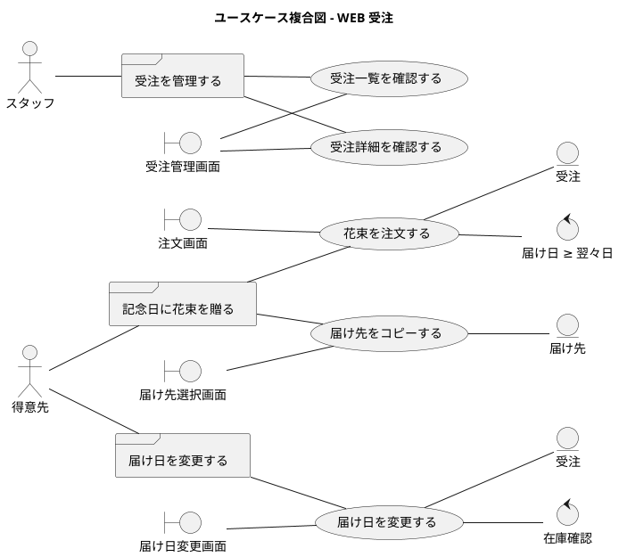

#### 在庫・仕入管理

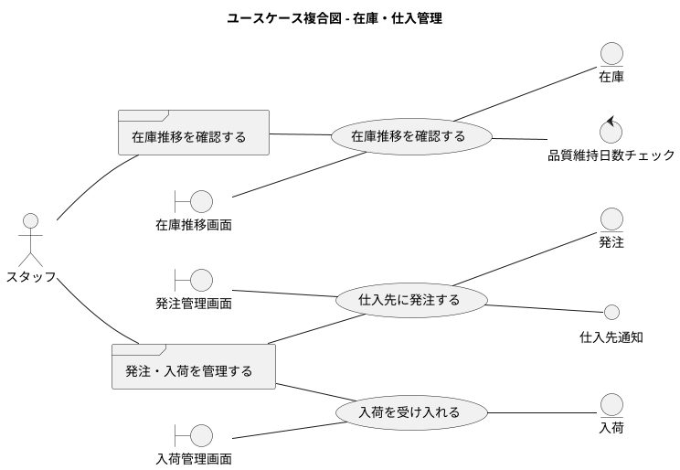

#### 結束・出荷管理

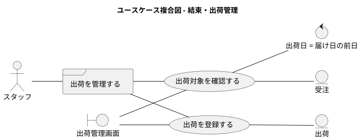

## システム

### 情報モデル

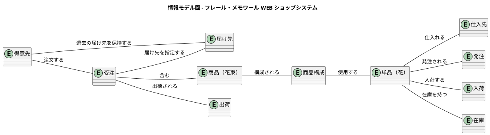

### 状態モデル

#### 受注の状態遷移

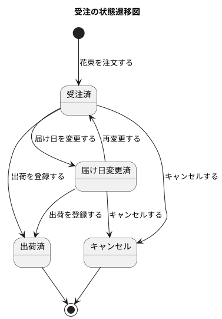

#### 在庫の状態遷移

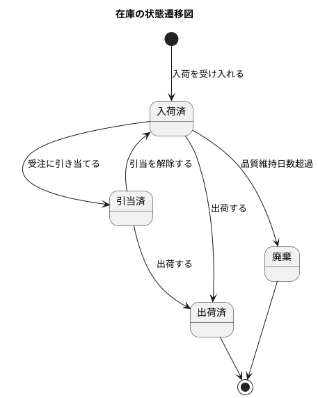

#### 発注の状態遷移

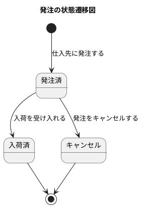
