# 要件定義 - フレール・メモワール WEB ショップシステム

## システム価値

### システムコンテキスト

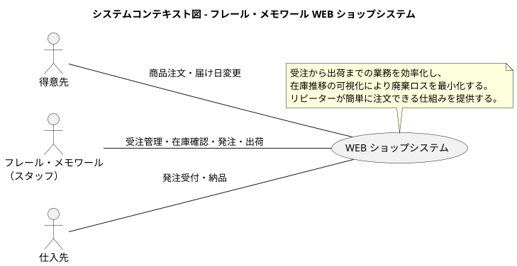

### 要求モデル

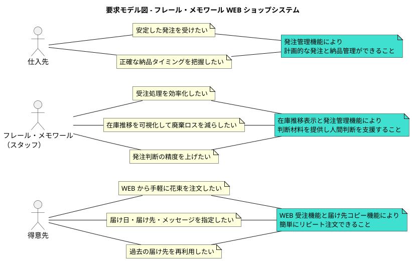

## システム外部環境

### ビジネスコンテキスト

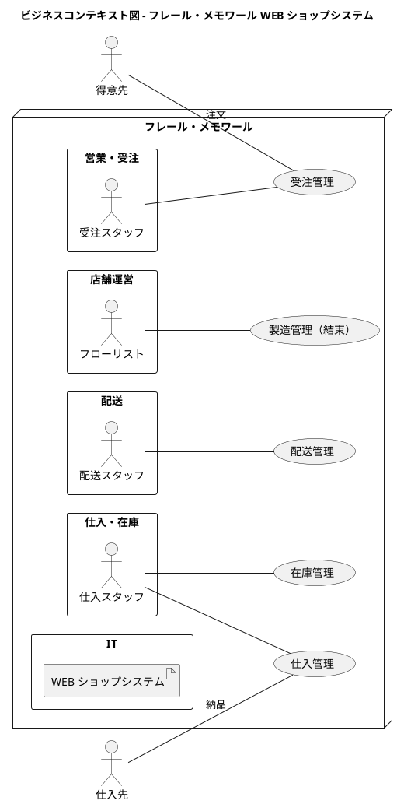

### ビジネスユースケース

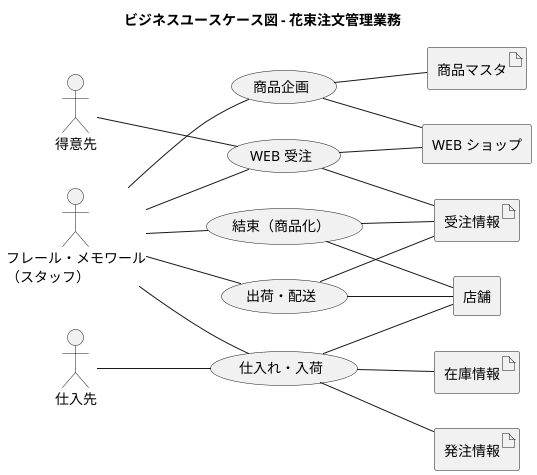

### 業務フロー

**WEB 受注の業務フロー**

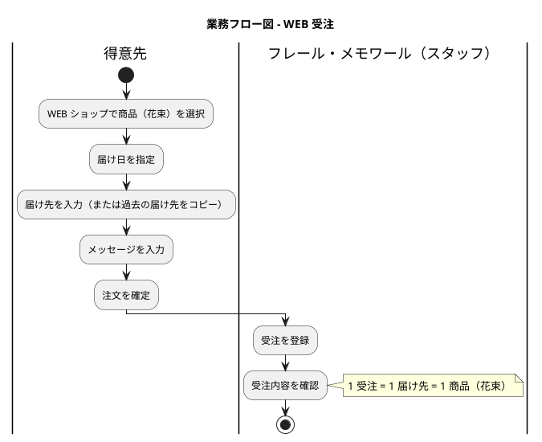

**仕入れ・入荷の業務フロー**

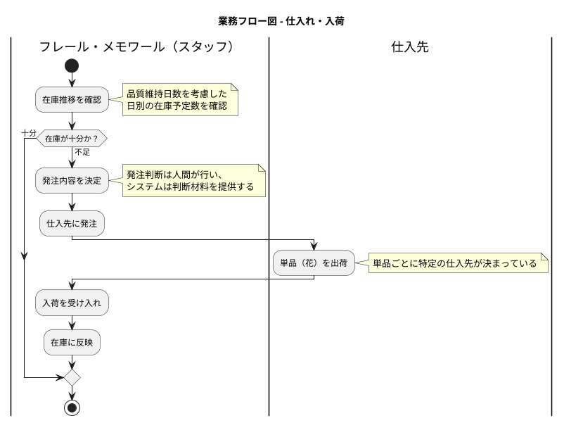

**出荷・配送の業務フロー**

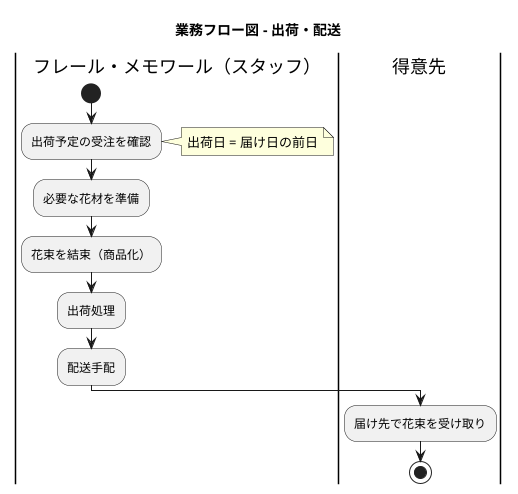

**届け日変更の業務フロー**

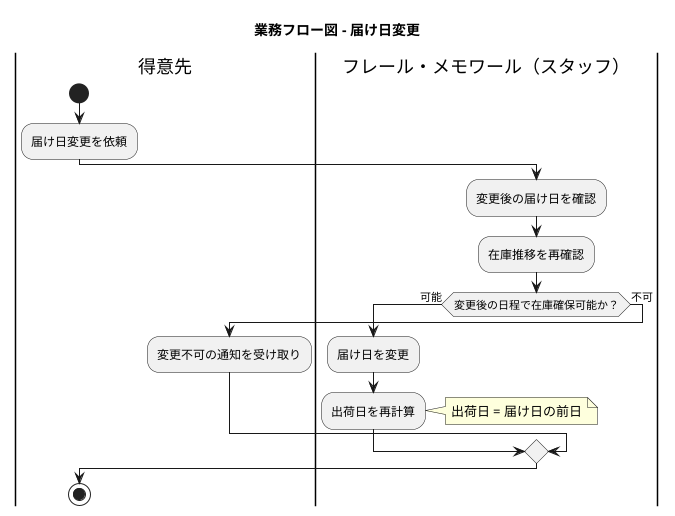

### 利用シーン

**得意先の注文シーン**

得意先が記念日に花束を贈るために WEB ショップから注文する場面。届け日・届け先・メッセージを指定し、過去の届け先をコピーして再利用できる。

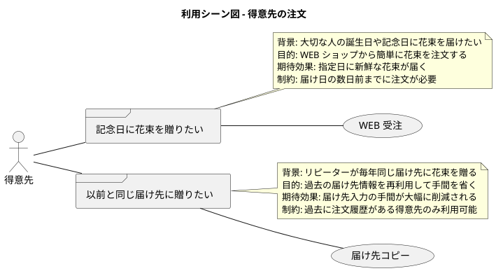

**スタッフの在庫確認・発注シーン**

スタッフが在庫推移を確認し、発注判断を行う場面。品質維持日数を考慮した日別在庫予定数を確認し、不足があれば仕入先に発注する。

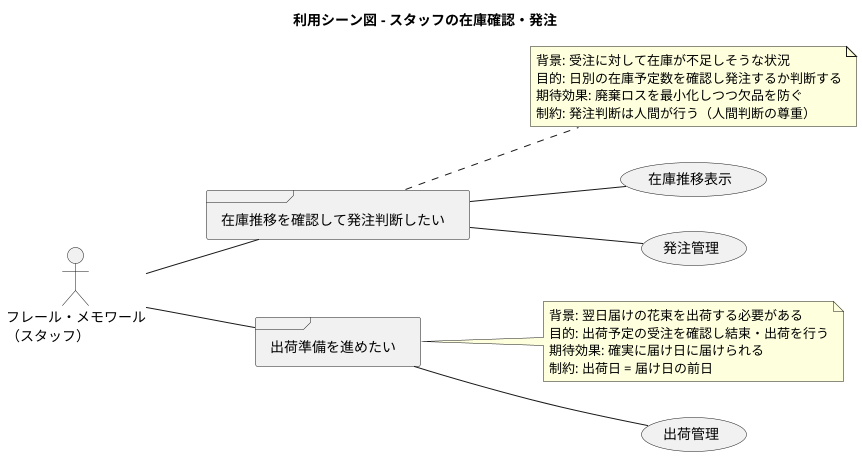

### バリエーション・条件

**商品種別**

| 商品種別 | 説明 |
|----------|------|
| 花束 | 事前に定義された単品の組合せで構成される商品 |

**受注ステータス**

| 受注ステータス | 説明 |
|----------------|------|
| 受注済み | 得意先からの注文を受け付けた状態 |
| 届け日変更済み | 届け日の変更を受け付けた状態（変更確定後に受注済みへ戻る） |
| 出荷準備中 | 出荷日に結束・出荷の準備をしている状態 |
| 出荷済み | 配送手配が完了した状態 |
| 配送完了 | 届け先に届いた状態 |
| キャンセル | 注文がキャンセルされた状態 |

**在庫ステータス**

| 在庫ステータス | 説明 |
|----------------|------|
| 入荷済み | 仕入先から入荷し在庫として保管中 |
| 使用済み | 結束に使用された状態 |
| 廃棄 | 品質維持日数を超過し廃棄された状態 |

**発注ステータス**

| 発注ステータス | 説明 |
|----------------|------|
| 発注済み | 仕入先に発注した状態 |
| 入荷済み | 仕入先から入荷が完了した状態 |

## システム境界

### ユースケース複合図

**WEB 受注**

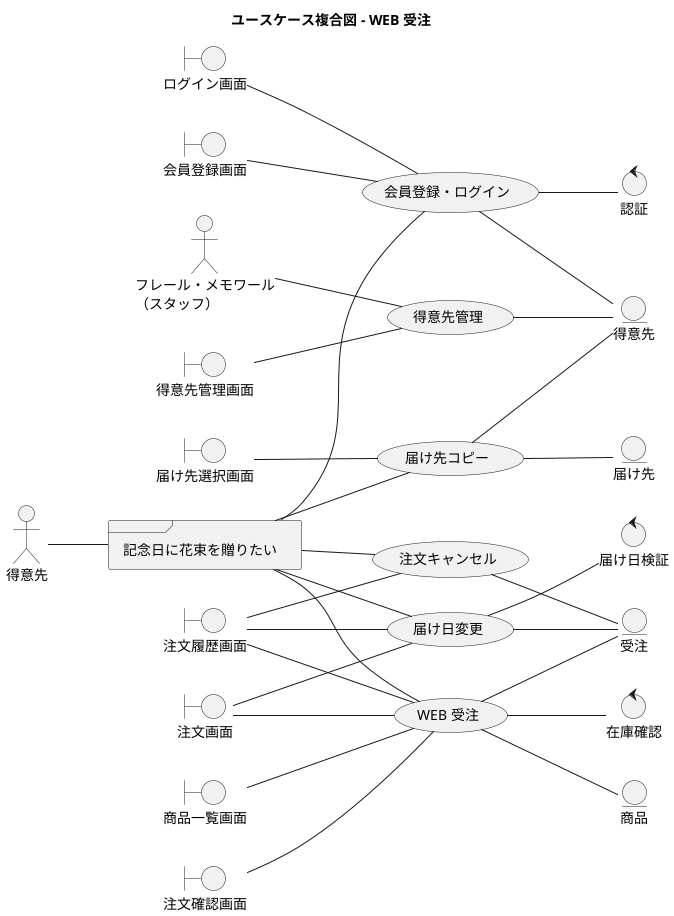

**商品企画・管理**

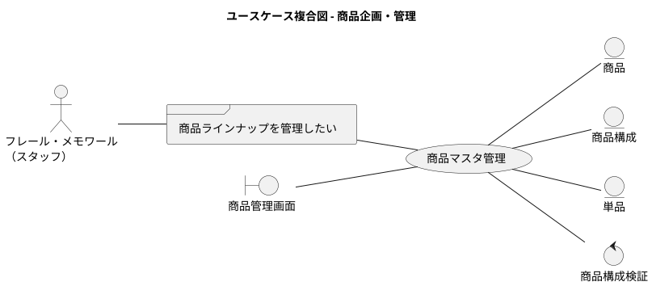

**仕入れ・入荷**

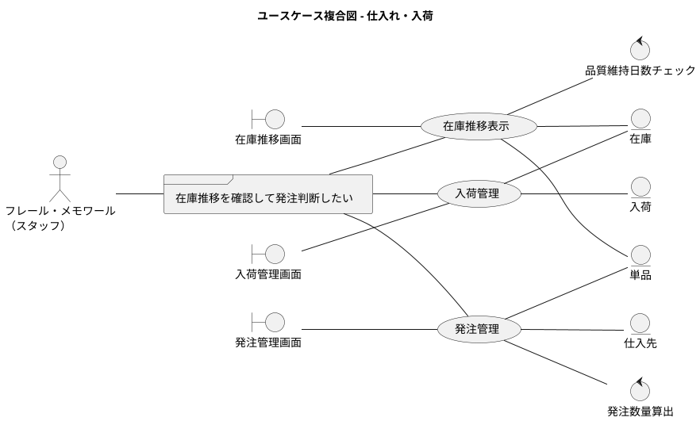

**出荷・配送**

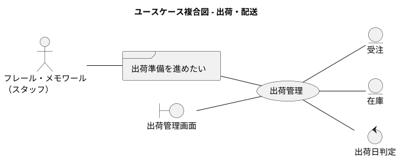

### 画面・帳票モデル

**顧客向け画面**

| 画面名 | 概要 | 関連 UC |
|--------|------|---------|
| ログイン画面 | メールアドレス・パスワードでログインする | 会員登録・ログイン |
| 会員登録画面 | 新規会員登録を行う | 会員登録・ログイン |
| 商品一覧画面 | 花束の一覧を表示し、商品を選択する | WEB 受注 |
| 注文画面 | 届け日・届け先・メッセージを入力し注文を確定する | WEB 受注、届け日変更 |
| 注文確認画面 | 注文確定後の内容を表示する | WEB 受注 |
| 注文履歴画面 | 過去の注文一覧と詳細を参照し、届け日変更・キャンセルへ遷移する | WEB 受注、届け日変更、注文キャンセル |
| 届け先選択画面 | 過去の届け先一覧から選択してコピーする | 届け先コピー |

**管理画面**

| 画面名 | 概要 | 関連 UC |
|--------|------|---------|
| 受注一覧画面 | 受注の一覧・検索・詳細確認を行う | WEB 受注 |
| 在庫推移画面 | 日別の在庫予定数を表示し発注判断を支援する | 在庫推移表示 |
| 発注管理画面 | 仕入先への発注を登録・管理する | 発注管理 |
| 入荷管理画面 | 入荷予定の管理と実績を記録する | 入荷管理 |
| 出荷管理画面 | 出荷予定の受注を確認し出荷処理を行う | 出荷管理 |
| 商品管理画面 | 商品（花束）の構成と単品のマスタを管理する | 商品マスタ管理 |
| 得意先管理画面 | 得意先情報と注文履歴を管理する | 得意先管理 |

### イベントモデル

外部システム連携はスコープ外のため、該当なし。

### ビジネスルール（詳細定義）

**BR06: 在庫推移計算ロジック**

| 項目 | 定義 |
|------|------|
| 日別有効在庫の計算式 | `日別有効在庫 = 現在庫 + 入荷予定 - 受注引当 - 廃棄予定` |
| 引当方式 | 受注確定時に届け日に対して単品単位で引当する |
| 品質維持日数の起算日 | 入荷日を Day 0 とする |
| 品質維持日数の単位 | 日単位でカウントする |
| 廃棄予定の判定 | 品質維持日数を超過した在庫を廃棄予定とする |

**BR07: 届け日有効範囲** ※要ステークホルダー確認

| 項目 | 定義 |
|------|------|
| 最短届け日 | 注文日 + 3日（暫定） |
| 最長届け日 | 注文日 + 30日（暫定） |
| 注文受付期限 | 届け日の 3日前（暫定） |

## システム

### 情報モデル

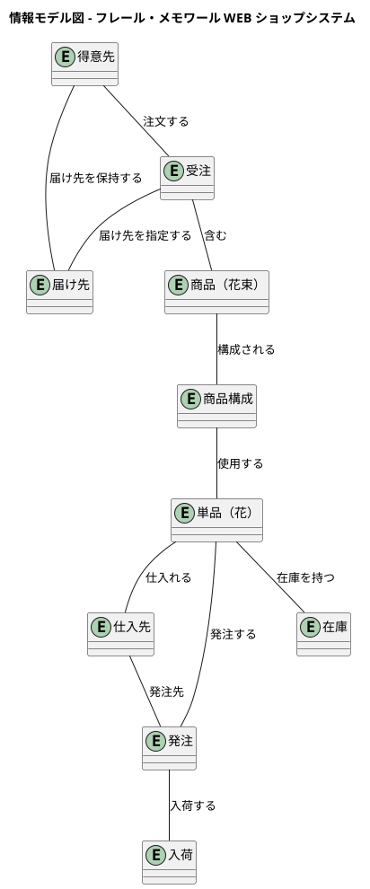

### 状態モデル

**受注の状態遷移**

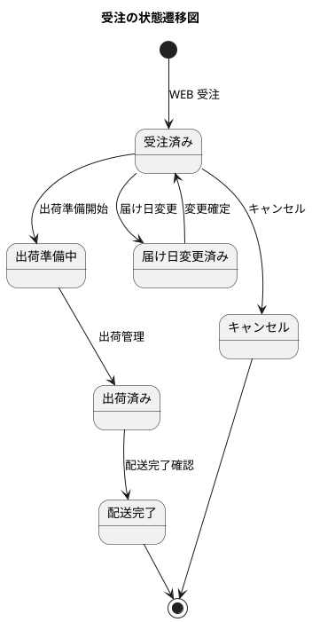

**在庫の状態遷移**

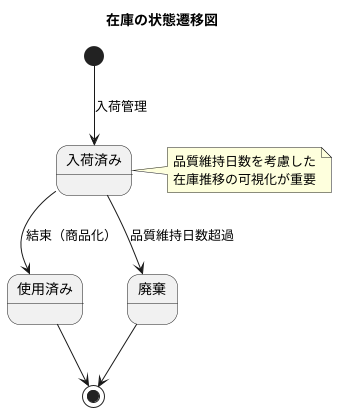

**発注の状態遷移**

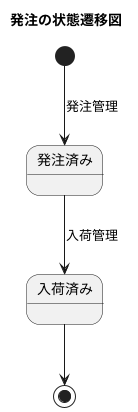
